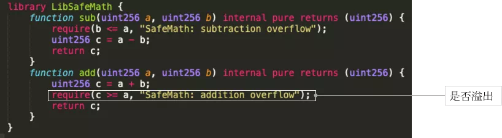
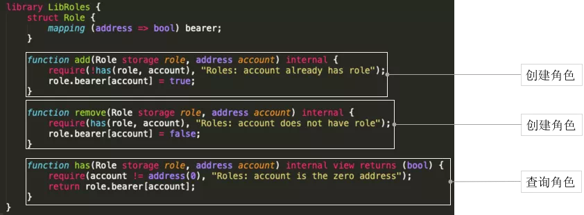

# 存证&积分场景合约设计技巧与实例代码解析

作者：毛嘉宇｜FISCO BCOS 核心开发者

## 场景1：区块链+存证的权限合约编写

电子数据存证是记录“用户身份验证-数据创建-存储-传输”全过程的方式，应用一系列安全技术全方位确保电子数据的真实性、完整性、安全性，在司法上具备完整的法律效力。

区块链技术的下列特点有助于降低成本、提升效率，并且确保存证数据的安全。

- 完善的防篡改机制：使用区块链技术保全证据，进一步加强了证据不可篡改性；
- 证据效力得到机构认可：司法机构作为链上节点，对链数据参与认可和签名，事后可从链上确认数据的真实有效性；
- 服务持续有效：数据被多方共识上链后，即使有部分共识方退出也不会造成数据的丢失或失效。

### 存证场景简要业务流程

在存证场景中可以抽象出三类典型用户：**存证方、审核方和取证方**。

- 存证方提交需要存证的申请。
- 审核方基于内容，对存证数据进行审核和签名确认。实际业务场景中，审核方可能会涉及投票和多方审核的多签过程。
- 当存证上链后，取证方可随时查询存证者地址、时间戳和审核详情等相关信息进行核验。

### 存证场景权限合约实例讲解

我们以存证场景中权限合约进行讲解。

#### 存证合约概要设计

**首先将逻辑和数据层分离**。因为Solidity智能合约语言没有独立数据层，为便于合约后续扩展、升级，需要将逻辑和数据层分离，体现在下图里就是将数据层和控制层区分开。

**其次引入权限层**。在一条联盟链上所有节点可以自由访问链上数据，智能合约提供了一种修饰器机制，可控制合约给指定授权用户访问，依据合约单一职责原理，将这一层抽象出来。

同时，我们需要控制数据层的权限，防止将写入数据层的接口权限开放给所有人，因此需要依赖并引入权限合约。

#### 权限合约实例讲解

权限合约比较简单，不需要依赖其他合约，在很多合约开发中存在需求，可供复用。

Authentication合约里首先定义了两个成员变量，合约属主owner和权限控制映射列表acl(access control list)。

- **owner**：在合约构造时owner会自动被赋值为msg.sender，也就是合约的调用者，修饰器onlyOwner可以用来判断后续调用者是不是当初合约的创建者。
- **acl**：acl的变量是一个address到bool类型的mapping，我们看下allow和deny函数，allow将传入参数的地址所映射bool值设置为true，deny设置为false，设置完后可以通过auth修饰器来判断合约访问者权限。

##### 存证数据

下图展示的是证据数据层，存证数据合约的代码。

EvidenceRepository是存证数据仓库，它继承了权限合约，权限合约里的方法和修饰器可在存证仓库的合约被使用。

- 存证数据合约定义了一个struct的结构体EvidenceData，用来存放存证数据。为了简化模型，我们只定义了三个最核心的数据字段：存证数据Hash值、提交者地址和存入时间戳，在实际业务存证场景中大家可以根据所需字段进行扩展。
- mapping的变量，就是byte32到结构体的映射关系，实际上是以存证hash做为主键映射这个结构体的数据。key是hash，值就是上面的结构体，通过hash值可以检索查询和保存存证数据。
- 定义的函数中只确定了最核心的setData和getData函数。请注意，该合约本身继承了Authentication合约，所以在setData里能够使用auth的修饰器，控制只有被授权用户才能访问，防止智能合约被部署到链上以后遭到恶意攻击或调用。getData函数根据传入的哈希把存入数据整体查询出来并返回。

可以看出，所有存证数据都被保存到数据合约里。这样可以起到统一存储、统一管理的效果。当然，这不一定是最优方案。
在业务场景中，如果合约拥有海量存证数据，则可能成为性能瓶颈，采用分拆设计方案会更加合理。

##### 请求数据

存证方开始提交存证数据并不会直接被写入到存证仓库中，而是经过审核方签名完成后才会真正提交，审核方可以为多方。

理解合约用途后，我们仔细看这个合约。

- 请求数据的合约结构和存证数据一致。第一部分是数据结构，SaveRequest是一个结构体，里面定义了一个存证请求详细的数据结构，包括最核心的存证hash、提交者、已经审核通过的票数。
- ext是一个描述说明字段，status记录了已经投票签名通过的审核方，threshold是投票阈值，voters是审核方地址列表，saveRequests定义了请求hash和请求本身的映射。类似存证数据合约，在请求数据合约中，所有请求数据也都存储在单个数据仓库合约里。
- 最后来看两个核心的函数：创建请求和投票审核。两个函数内都有auth修饰符控制权限。创建请求时，函数内部会使用require语句检查请求是否已经存在；投票时，函数内部会使用require语句检查审核者是否已经投票，请求本身是否存在，审核者是否合法。如果检查通过，审核投票票数加一，标记审核者已签名。

##### 控制器

控制器引入了两个数据仓库合约，我们只需调用controller就可以完成所有用户接口的交互；它的构造函数参数变量包含了请求合约构造所需的参数：审核者列表及投票阈值，这个构造函数会自动构造和创建合约。

controller定义了两个方法，一个是创建存证请求，另一个是审核人根据请求进行投票。
创建请求函数较为简单，会直接调用请求数据仓库合约里的创建请求函数。
处理投票函数相对复杂。在验证hash数据非空后，会调用审核接口，如果审核成功，会触发检查当前请求审核通过数是否超过阈值，一旦超过，就自动保存到存证数据合约，同时，删除该请求。

此外，这个合约里还定义了三个event事件，有以下作用：

- 记录事件定义的参数，存储到区块链交易日志中，提供廉价存储。
- 提供一种回调机制，在事件执行成功后，由节点向注册监听的SDK发送回调通知，触发回调函数被执行。
- 提供一个过滤器，支持参数检索和过滤。 

例如，createSaveRequest日志记录了hash和调用地址。如果配合SDK，我们可以实现对这个特定事件监听，并自动触发自定义回调函数。

#### 存证合约示例小结

以上就是一个完整的存证场景权限合约demo。为了便于理解，我们并没有把例子设计得面面俱到，希望大家能更好地从中理解到demo的设计思想：

- 数据与逻辑分离；
- 建议采取自底向上开发，先开发依赖最少的部分，模块化、分层化的设计与实现；
- 关注权限控制与检查，避免出现一些非授权访问；
- 定义统一和清晰的接口；
- 存证数据hash上链。

## 场景2：区块链+积分合约实例讲解

下面介绍另一个智能合约典型应用场景——积分场景。

区块链技术可以如何解决积分场景中的这些痛点呢？

- 增加品牌曝光度：多个机构组成积分联盟，积分可有效通兑，实现客户资源引流，提升营销效果。
- 保证积分安全性：所有积分的生成和流转过程保存到链上，防止商户篡改和抵赖。
- 提升用户体验：不同商户和用户之间实现积分流转、互通，更加便利。

图：典型积分业务场景示例

一种思路是基于区块链技术，多个商家组成积分联盟，实现积分通存通兑、客户资源相互引流等。我们抽象了一个管理者，管理者部署和管理合约，商家有发行积分、拉入其他商家、撤销发行者身份的权限；消费者有开户、销户、消费积分和积分转账的权限。

### 积分场景合约实例讲解

先来做积分合约的概要设计。在存证合约中，我们引入了数据和逻辑分离的思想；在积分合约中，我们将引入管理、数据和逻辑分离的思想。
为什么要增加一层管理合约呢？原有的两层结构中，控制合约会自动创建数据合约，而数据层合约中写死了属主是控制合约。
引入了管理合约后，就实现了类似控制反转的效果，控制合约和数据合约都由管理合约来创建；同时，管理合约还可以随时设置数据合约中控制合约的地址。这样，控制合约就可以随时实现平滑地业务逻辑升级；将管理合约分离出来，还有利于链上权限治理。
此外，我们还将常用的权限、角色功能抽象为合约，并抽象了权限mapping和数据计算的库。

下面我们将看下积分合约具体的代码实现。

#### 合约库——安全计算

安全计算在Solidity中非常重要。涉及到数值计算部分，可优先考虑采用成熟开源的库。分享一个小技巧，由于链上资源非常宝贵，建议大家使用库的时候可以裁剪掉冗余的代码，节省资源。
安全计算的库，会在执行后重新检查数值，避免出现溢出，规避攻击。

#### 库——角色管理

角色管理的库提供了创建角色、删除角色、查询角色的功能。这里有个基础的mapping bearer，是address到bool的映射，在mapping中维护role身份。

#### 基础权限合约

在BasicAuth的基础权限合约中，我们提供了对属主的判断。

#### 发行者合约

发行者合约依赖上面LibRole的合约。为了简化规则，易于理解，我们这样定义：发行者允许添加新的发行者，也可以撤销自己发行者身份。有了发行者角色后，我们就可以发行积分了。

#### 积分数据合约

现在进入到积分合约主体——admin-controller-data三层架构。
首先介绍积分数据合约。它会将所有用户积分，以及角色信息都存到积分数据合约里。

- balances维护了每个用户的余额；
- accounts维护已经注册的账户；
- totalAmount系统里是总共发行的积分；
- description注释或备注信息
- latestVersion实现访问权限控制；
- upgradeVersion的方法，有授权用户可调用这个方法来升级合约，这里由Admin合约来发起并调用；
- setBalance方法，设置某个账户的余额必须通过onlyLatestVersion检查，只有有权限的owner才能调用这个数据合约。

#### 管理合约

管理合约作用是创建所有的合约。constructor更新在数据合约中所持有的版本号，一旦controller需要升级，只需调用下这个方法即可。

#### 控制合约

最后介绍控制合约。由于controller代码较长，这里只展示最典型的两个函数。
balance查余额调的就是数据查余额的接口。积分的消费通过transfer实现，其中会有很多修饰器来检查账户是否已经注册，是否有效等，此外采用了智能合约事件来输出和打印日志。

#### 积分合约示例小结

小结一下积分场景demo中的一些设计思想：

- 引用三层架构：使用数据、逻辑、管理来管理合约；
- 抽象了库、封装了常用的合约来复用；
- 必须时刻关注合约安全，比如合约数值计算是否正确，权限是否合适；
- 以合约为单位，对职责进行抽象，尽可能实现合约职责单一。

## 如何写出高质量设计说明文档

### 文档编写之『术』

『术』主要就是编写文档时结构上所需要素，这里分为了三类：

- 业务背景：首先编写文档时不要预设他人能理解所有的专业术语，其次要清楚地介绍业务存在的痛点，区块链能否解决这些痛点。
- 技术方案设计：需清晰地说明基础业务需求（如参与者、场景、活动），设计思路概要，详细的合约职责、函数、参数等。
- 使用说明：实际使用场景、上手指南和使用手册等。

### 文档编写之『道』

有了术，就能确保文档内容结构的完整性，文档就有了骨架和血肉；但是，『道』才是文档的灵魂和精髓所在，这里整理了5个关注点：

- 亮点：展示出本方案的独特性（创意/设计/功能/规范/文档）；
- 痛点：说清楚问题和解决方法；
- 重点：代码、注释、文档编写要条理清晰、可读性强，围绕问题和解决方案展开，不要为了炫技而炫技；
- 难点：基于智能合约特性，权衡规范、效率和安全性；
- 要点：以解释作为基本导向，不要预设别人能够理解所有业务和技术术语。

本文主要分享了存证和积分两个典型应用场景合约设计思路和实例代码解析，为大家总结了相关的开发技巧和文档写作技巧。
在智能合约开发过程中，开发者需根据实际业务需求选择适用的技巧与方案。正所谓『兵无常势，水无常形』，没有最优的设计，只有最合适的设计。

------

### Q&A

**Q** ：智能合约中如何获取之前的数据？

**A** ：主要有两种方法：1.在智能合约中定义需要查询历史数据的函数，通过合约查询接口来查询。2.使用WeBASE-Collect-Bee数据导出组件将链上数据导出到链下数据库中，可以查询所有数据。

**Q** ：合约中的变量定义了private 属性，也可以被链上公开获取到吗？

**A** ：链上所有数据都是公开的，即便定义了private属性的变量，也可以通过技术手段获取。

**Q** ：在智能合约内可不可以调用其他外部接口？

**A** ：智能合约中可以调用其他合约接口，但是不能访问外部接口。

**Q** ：如果积分在一定时间内会减少，这种积分场景怎么实现？

**A** ：首先要定义一个积分减少的业务规则；其次要实现这种场景在技术上是可行的，例如可以设计一个积分销毁函数，调用这个函数后，可以减少指定账户积分并同时减少总积分数量。最后，具体的实现逻辑和方式取决于业务规则。另外，需要注意的是，智能合约不支持类似定时脚本机制，需要外部调用才能触发。

**Q** ：在编写智能合约时一定要按照三层结构进行编写吗？

**A** ：不一定，取决于具体的业务场景，需要从实际业务场景中分析利弊，选择合适的方案。一般场景下我们推荐分层，这样更加灵活，更利于合约升级和维护。

**Q** ：怎么通过智能合约实现同一群组内不同用户数据读写权限管控？

**A** ：数据一旦上链后，对链上所有参与者来说都是公开透明的，因此，在链上实现同一群组内不同用户数据读写权限的管控本身不可行。但我们可以通过在数据上链前对数据本身进行加密来实现类似效果。

**Q** ：存证中的哈希值是合同或者发票的哈希值吗？

**A** ：这个规则取决于具体应用需求，可以直接是文件的哈希或者是拼装了其他信息再算一个哈希值，需要看具体场景需求。

**Q** ：如果上链的数据错误，怎么处理？

**A** ：数据一旦上链后，就不能被篡改和被物理删除；但可以设计一种合约逻辑删除机制，例如，在特定的数据合约中添加一个状态字段来标记数据是否被删除。