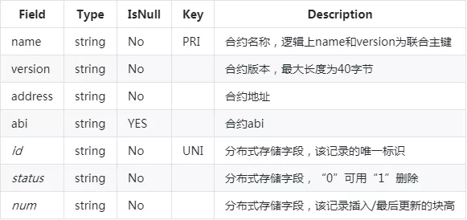
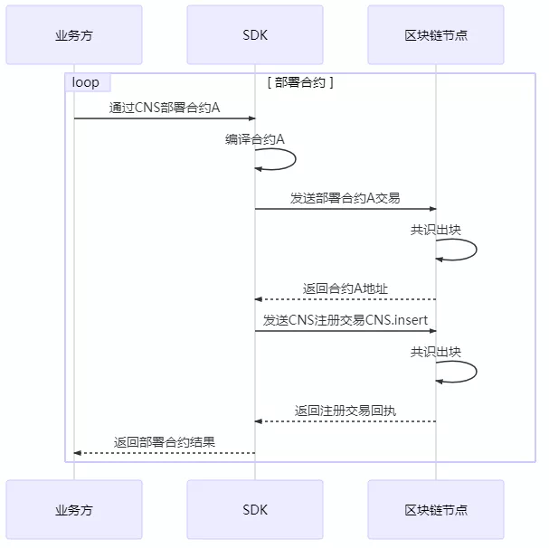
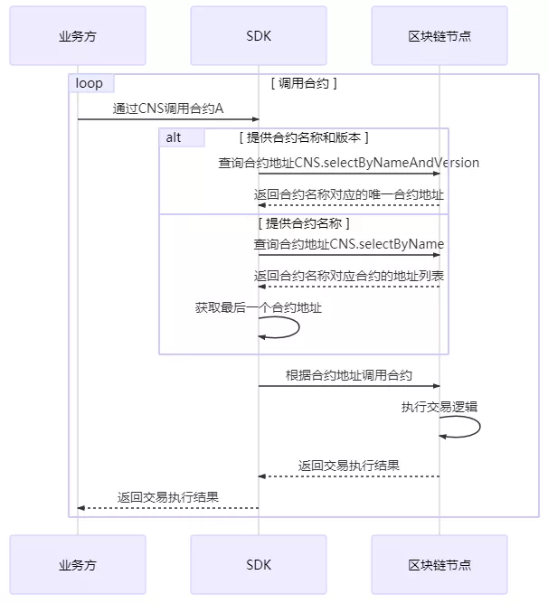
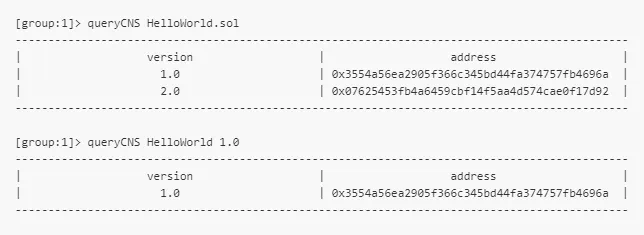

# FISCO BCOS的CNS合约命名服务

作者：陈宇｜FISCO BCOS 核心开发者

## CNS为何而生？

FISCO BCOS原有的调用智能合约流程为：

1. 编写合约；
2. 编译合约得到合约接口abi描述；
3. 部署合约得到合约地址address；
4. 封装合约的abi和地址，通过SDK实现对合约的调用。

从上述合约调用流程可知，业务方调用合约之前，必须获取合约abi以及合约地址address，这是业界调用合约的通用方法。

但通过后续的用户调研，我们收集到业务方提出的如下建议：

1. 对于较长的合约abi字符串，需提供位置进行存储，从而代替业务方的自行存储；
2. 对于20字节的合约地址魔数，其丢失后将导致合约不可访问，需减少业务方的记忆成本；
3. 合约重新部署后，相关多个业务方可快速无感知地更新合约地址；
4. 易于对合约进行版本管理。

为给业务方提供更加良好的智能合约调用体验，FISCO BCOS提出CNS合约命名服务方案。

## CNS如何实现？

CNS通过提供链上合约名称与合约地址映射关系的记录及相应的查询功能，方便业务方通过记忆简单的合约名称来实现对链上合约的调用。为方便业务方调用合约，SDK封装了CNS方式调用合约的接口，接口内部实现了合约地址的查找，业务方对此无感知。

### 信息记录

CNS记录的内容包括：合约名称、合约版本、合约地址和合约abi。其中合约abi指合约的接口说明，描述了合约字段名称、字段类型、方法名称、参数名称、参数类型、方法返回值类型。上述CNS信息以系统表的方式进行存储，账本内各节点一致，但各账本独立。CNS表定义如下：




### 接口描述

SDK与区块链节点间的接口以合约的方式提供。该CNS合约以预编译合约的方式进行逻辑实现，声明如下接口：

```
pragma solidity ^0.4.2;
contract CNS
{
    // CNS信息上链
    function insert(string name, string version, string addr, string abi) public returns(uint256);
    // 查询返回表中该合约所有不同version的记录，JSON格式
    function selectByName(string name) public constant returns(string);
    // 查询返回表中该合约该版本的唯一地址
    function selectByNameAndVersion(string name, string version) public constant returns(string);
}
```

SDK提供预编译合约对应的CnsService类，实现对CNS的支持。CnsService供业务方进行调用，可以配置及查询CNS信息，其API如下：

- `String registerCns(String name, String version, String address, String abi)`：根据合约名称、合约版本、合约地址和合约abi注册CNS信息。
- `String getAddressByContractNameAndVersion(String contractNameAndVersion)`：根据合约名称和合约版本（合约名称和合约版本用英文冒号连接）查询合约地址。若缺失合约版本，默认使用合约最新版本。
- `List<CnsInfo> queryCnsByName(String name)`：根据合约名称查询CNS信息。

- `List<CnsInfo> queryCnsByNameAndVersion(String name, String version)`：根据合约名称和合约版本查询CNS信息。

   

### 交互流程

#### 部署合约

业务方通过CNS部署合约的过程包括两个步骤，两个步骤均由SDK执行。第一个是发送部署合约的交易上链；第二个是通过发送上链交易，实现合约名称和合约地址的关联。




#### 调用合约

SDK接收到业务方基于CNS调用合约的请求时，先行查询获取该合约名称对应的合约地址，再基于合约地址进行合约的调用。




## CNS使用演示

我们以调用CnsService的控制台为例，描述CNS相关的注册、调用和查询功能。

#### deployByCNS

运行deployByCNS，采用部署合约。用CNS部署的合约，可用合约名直接调用。

##### 参数：

- 合约名称：部署的合约名称。
- 合约版本：部署的合约版本。

##### 示例：

```
# 部署HelloWorld合约1.0版
[group:1]> deployByCNS HelloWorld.sol 1.0
contract address:0x3554a56ea2905f366c345bd44fa374757fb4696a

# 部署HelloWorld合约2.0版
[group:1]> deployByCNS HelloWorld.sol 2.0
contract address:0x07625453fb4a6459cbf14f5aa4d574cae0f17d92

# 部署TableTest合约
[group:1]> deployByCNS TableTest.sol 1.0
contract address:0x0b33d383e8e93c7c8083963a4ac4a58b214684a8
```

#### queryCNS

运行queryCNS，根据合约名称和合约版本（可选参数），查询CNS表记录信息。

##### 参数：

- 合约名称：部署的合约名称。
- 合约版本：部署的合约版本（可选）。

##### 示例：



#### **callByCNS**

运行callByCNS，采用CNS调用合约，即用合约名称直接调用合约。

##### 参数：

- 合约名称与合约版本：合约名称与版本用英文冒号分隔，例如HelloWorld:1.0或HelloWorld.sol:1.0。

  当省略合约版本时，例如HelloWorld或HelloWorld.sol，则调用最新版本的合约。

- 合约接口名：调用的合约接口名。

- 参数：由合约接口参数决定。

##### 示例：

```
# 调用HelloWorld合约1.0版，通过set接口设置name字符串
[group:1]> callByCNS HelloWorld:1.0 set "Hello,CNS"
transaction hash:0x80bb37cc8de2e25f6a1cdcb6b4a01ab5b5628082f8da4c48ef1bbc1fb1d28b2d

# 调用HelloWorld合约2.0版，通过set接口设置name字符串
[group:1]> callByCNS HelloWorld:2.0 set "Hello,CNS2"
transaction hash:0x43000d14040f0c67ac080d0179b9499b6885d4a1495d3cfd1a79ffb5f2945f64

# 调用HelloWorld合约1.0版，通过get接口获取name字符串
[group:1]> callByCNS HelloWorld:1.0 get
Hello,CNS

# 调用HelloWorld合约最新版(即2.0版)，通过get接口获取name字符串
[group:1]> callByCNS HelloWorld get
Hello,CNS2
```

## 总结

FISCO BCOS通过CNS简化了业务方调用合约的方式，也方便了业务方对合约进行管理及升级操作。同时，CNS专注于实现地址映射功能。CNS所映射的地址类型除合约地址外，还可以映射账号地址。当CNS映射账号地址时，合约abi内容为空。