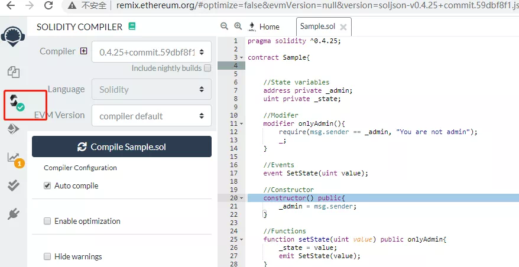
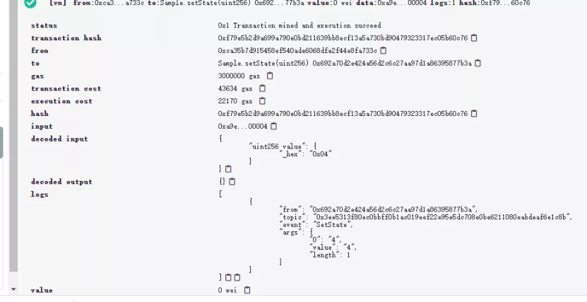
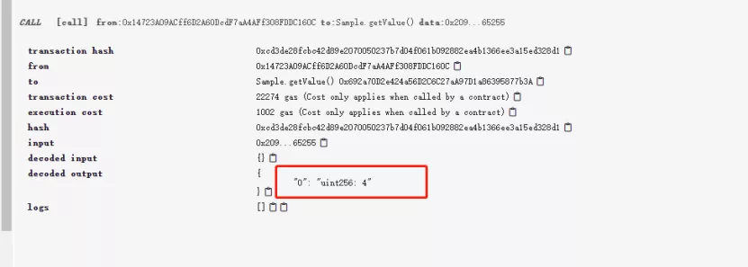

# 智能合约编写之Solidity的基础特性

作者：储雨知｜FISCO BCOS 核心开发者

如前篇介绍，目前大部分的联盟链平台，包括FISCO BCOS，都采用Solidity作为智能合约开发语言，因此熟悉并上手Solidity十分必要。作为一门面向区块链平台设计的图灵完备的编程语言，Solidity支持函数调用、修饰符、重载、事件、继承等多种特性，在区块链社区中，拥有广泛的影响力和踊跃的社区支持。但对于刚接触区块链的人而言，Solidity是一门陌生的语言。智能合约编写阶段将从Solidity基础特性、高级特性、设计模式以及编程攻略分别展开，带读者认识Solidity并掌握其运用，更好地进行智能合约开发。本篇将围绕Solidity的基础特性，带大家上手开发一个最基本的智能合约。

## 智能合约代码结构

任何编程语言都有其规范的代码结构，用于表达在一个代码文件中如何组织和编写代码，Solidity也一样。本节，我们将通过一个简单的合约示例，来了解智能合约的代码结构。

```
pragma solidity ^0.4.25;
contract Sample{
​
    //State variables
    address private _admin;
    uint private _state;
​
    //Modifier
    modifier onlyAdmin(){
        require(msg.sender == _admin, "You are not admin");      
        _;
    }
​
    //Events
    event SetState(uint value);
​
    //Constructor
    constructor() public{
        _admin = msg.sender;
    }
​
    //Functions
    function setState(uint value) public onlyAdmin{
        _state = value;
        emit SetState(value);
    }
​
    function getValue() public view returns (uint){
        return _state;
    }
​
}
```

上面这段程序包括了以下功能：

- 通过构造函数来部署合约
- 通过setValue函数设置合约状态
- 通过getValue函数查询合约状态

整个合约主要分为以下几个构成部分：

- **状态变量** - _admin, _state，这些变量会被永久保存，也可以被函数修改
- **构造函数** - 用于部署并初始化合约
- **事件** - SetState, 功能类似日志，记录了一个事件的发生
- **修饰符** - onlyAdmin, 用于给函数加一层"外衣"
- **函数** - setState, getState，用于读写状态变量

下面将逐一介绍上述构成部分。

### 状态变量

状态变量是合约的骨髓，它记录了合约的业务信息。用户可以通过函数来修改这些状态变量，这些修改也会被包含到交易中；交易经过区块链网络确认后，修改即为生效。

```
uint private _state;
```

状态变量的声明方式为：[类型] [访问修饰符-可选] [字段名]

### 构造函数

构造函数用于初始化合约，它允许用户传入一些基本的数据，写入到状态变量中。在上述例子中，设置了_admin字段，作为后面演示其他功能的前提。

```
constructor() public{
    _admin = msg.sender;
} 
```

和java不同的是，构造函数不支持重载，只能指定一个构造函数。

### 函数

函数被用来读写状态变量。对变量的修改将会被包含在交易中，经区块链网络确认后才生效。生效后，修改会被永久的保存在区块链账本中。函数签名定义了函数名、输入输出参数、访问修饰符、自定义修饰符。

```
function setState(uint value) public onlyAdmin；
```

函数还可以返回多个返回值：

```
function functionSample() public view returns(uint, uint){
    return (1,2);
}
```

在本合约中，还有一个配备了view修饰符的函数。这个view表示了该函数不会修改任何状态变量。与view类似的还有修饰符pure，其表明该函数是纯函数，连状态变量都不用读，函数的运行仅仅依赖于参数。

```
function add(uint a, uint b) public pure returns(uint){
    return a+b;
}
```

如果在view函数中尝试修改状态变量，或者在pure函数中访问状态变量，编译器均会报错。

### 事件

事件类似于日志，会被记录到区块链中，客户端可以通过web3订阅这些事件。

#### 定义事件

```
event SetState(uint value);
```

#### 构造事件

```
emit SetState(value);
```

这里有几点需要注意：

- 事件的名称可以任意指定，不一定要和函数名挂钩，但推荐两者挂钩，以便清晰地表达发生的事情.

- 构造事件时，也可不写emit，但因为事件和函数无论是名称还是参数都高度相关，这样操作很容易笔误将事件写成函数调用，因此不推荐。

```
function setState(uint value) public onlyAdmin{
    _state = value;
    //emit SetState(value);
    //这样写也可以，但不推荐，因为很容易笔误写成setState   
    SetState(value); 
}
```

- Solidity编程风格应采用一定的规范。查看[编程风格](https://learnblockchain.cn/docs/solidity/style-guide.html#id16)

### 修饰符

修饰符是合约中非常重要的一环。它挂在函数声明上，为函数提供一些额外的功能，例如检查、清理等工作。在本例中，修饰符onlyAdmin要求函数调用前，需要先检测函数的调用者是否为函数部署时设定的那个管理员(即合约的部署人)。

```
//Modifer
modifier onlyAdmin(){
    require(msg.sender == _admin, "You are not admin");      
    _;
}
​
...
//Functions
function setState(uint value) public onlyAdmin{
    ...
}
```

值得注意的是，定义在修饰符中的下划线“_”，表示函数的调用，指代的是开发者用修饰符修饰的函数。在本例中，表达的是setState函数调用的意思。

## 智能合约的运行

了解了上述的智能合约示例的结构，就可以直接上手运行，运行合约的方式有多种，大家可以任意采取其中一种：

- 方法一：可以使用[FISCO BCOS控制台](https://fisco-bcos-documentation.readthedocs.io/zh_CN/latest/docs/installation.html#id7)的方式来部署合约

- 方法二：使用FISCO BCOS开源项目WeBASE提供的在线ide WEBASE-front运行

- 方法三：通过在线ide remix来进行合约的部署与运行, [remix的地址](http://remix.ethereum.org/)

本例中使用remix作为运行示例。

### 编译

首先，在remix的文件ide中键入代码后，通过编译按钮来编译。成功后会在按钮上出现一个绿色对勾：




### 部署

编译成功后就可进行部署环节，部署成功后会出现合约实例。


### setState

合约部署后，我们来调用setState(4)。在执行成功后，会产生一条交易收据，里面包含了交易的执行信息。



在这里，用户可以看到交易执行状态(status)、交易执行人(from)、交易输入输出(decoded input, decoded output)、交易开销(execution cost)以及交易日志(logs)。在logs中，我们看到SetState事件被抛出，里面的参数也记录了事件传入的值4。如果我们换一个账户来执行，那么调用会失败，因为onlyAdmin修饰符会阻止用户调用。


### getState

调用getState后，可以直接看到所得到的值为4，正好是我们先前setState所传入的值：



## Solidity数据类型

在前文的示例中，我们用到了uint等数据类型。由于Solidity类型设计比较特殊，这里也会简单介绍一下Solidity的数据类型。

### 整型系列

Solidity提供了一组数据类型来表示整数, 包含无符号整数与有符号整数。每类整数还可根据长度细分，具体细分类型如下。

| 类型    | 长度(位) | 有符号 |
| ------- | -------- | ------ |
| uint    | 256      | 否     |
| uint8   | 8        | 否     |
| uint16  | 16       | 否     |
| ...     | ...      | 否     |
| uint256 | 256      | 否     |
| int     | 256      | 是     |
| int8    | 8        | 是     |
| int16   | 16       | 是     |
| ...     | ...      | 是     |
| int256  | 256      | 是     |

### 定长bytes系列

Solidity提供了bytes1到bytes32的类型，它们是固定长度的字节数组。用户可以读取定长bytes的内容。

```
    function bytesSample() public{
​
        bytes32 barray;
        //Initialize baarray
        //read brray[0]
        byte b = barray[0];
    }
```

并且，可以将整数类型转换为bytes。

```
    uint256 s = 1;
    bytes32 b = bytes32(s);
```

这里有一个关键细节，Solidity采取大端序编码，高地址存的是整数的小端。例如，b[0]是低地址端，它存整数的高端，所以值为0；取b[31]才是1。

```
    function bytesSample() public pure returns(byte, byte){
​
        uint256 value = 1;
        bytes32 b = bytes32(value);
        //Should be (0, 1)
        return (b[0], b[31]);
    }
```

### 变长bytes

从上文中，读者可了解定长byte数组。此外，Solidity还提供了一个变长byte数组：bytes。使用方式类似数组，后文会有介绍。

### string

Solidity提供的string，本质是一串经UTF-8编码的字节数组，它兼容于变长bytes类型。目前Solidity对string的支持不佳，也没有字符的概念。用户可以将string转成bytes。

```
    function stringSample() public view returns(bytes){
        string memory str = "abc";
        bytes memory b = bytes(str);
        //0x616263
        return b;
    }
```

要注意的是，当将string转换成bytes时，数据内容本身不会被拷贝，如上文中，str和b变量指向的都是同一个字符串abc。

### address

address表示账户地址，它由私钥间接生成，是一个20字节的数据。同样，它也可以被转换为bytes20。

```
    function addressSample() public view returns(bytes20){
​
        address me = msg.sender;
        bytes20 b = bytes20(me);
        return b;
    }
```

### mapping

mapping表示映射, 是极其重要的数据结构。它与java中的映射存在如下几点差别：

- 它无法迭代keys，因为它只保存键的哈希，而不保存键值，如果想迭代，可以用开源的可迭代哈希类库
- 如果一个key未被保存在mapping中，一样可以正常读取到对应value，只是value是空值（字节全为0）。所以它也不需要put、get等操作，用户直接去操作它即可。

```
contract Sample{
​
    mapping(uint=>string) private values;
​
    function mappingSample() public view returns(bytes20){
        //put a key value pair
        values[10] = "hello";
​
        //read value
        string value = values[10];
​
    }
​
}
```

### 数组

如果数组是状态变量，那么支持push等操作：

```
contract Sample{
​
    string[] private arr;
​
    function arraySample() public view {
        arr.push("Hello");
        uint len = arr.length;//should be 1
        string value = arr[0];//should be Hello
      }
​
}
```

数组也可以以局部变量的方式使用，但稍有不同：

```
function arraySample() public view returns(uint){
        //create an empty array of length 2
        uint[] memory p = new uint[](2);
        p[3] = 1;//THIS WILL THROW EXCEPTION 
        return p.length;
}
```

### struct

Solidity允许开发者自定义结构对象。结构体既可以作为状态变量存储，也可以在函数中作为局部变量存在。 

```
struct Person{
        uint age;
        string name;
    }
​
    Person private _person;
​
    function structExample() {
        Person memory p = Person(1, "alice");
        _person = p;
    }
```

本节中只介绍了比较常见的数据类型，更完整的列表可参考[Solidity官方网站](https://solidity.readthedocs.io/en/v0.6.3/types.html)。

#### 全局变量

示例合约代码的构造函数中，包含msg.sender。它属于全局变量。在智能合约中，全局变量或全局方法可用于获取和当前区块、交易相关的一些基本信息，如块高、块时间、合约调用者等。

比较常用的全局变量是msg变量，表示调用上下文，常见的全局变量有以下几种：

- **msg.sender**：合约的直接调用者。

  由于是直接调用者，所以当处于 用户A->合约1->合约2 调用链下，若在合约2内使用msg.sender，得到的会是合约1的地址。如果想获取用户A，可以用tx.origin.

- **tx.origin**：交易的"始作俑者"，整个调用链的起点。

- **msg.calldata**：包含完整的调用信息，包括函数标识、参数等。calldata的前4字节就是函数标识，与msg.sig相同。

- **msg.sig**：msg.calldata的前4字节，用于标识函数。
- **block.number**：表示当前所在的区块高度。

- **now**：表示当前的时间戳。也可以用block.timestamp表示。

这里只列出了部分常见全局变量，请参考[完整版本](https://solidity.readthedocs.io/en/v0.4.24/units-and-global-variables.html)。

## 结语

本文以一个简单的示例合约作为引入，介绍了运用Solidity开发智能合约的基本知识。读者可以尝试运行该合约，感受智能合约的开发。若想更深入学习智能合约示例，推荐[官方网站](https://solidity.readthedocs.io/en/v0.6.2/solidity-by-example.html)示例供读者学习，也可关注本专题后续系列文章。在官网的示例中，提供了投票、竞拍、微支付通道等多个案例，这些案例贴近实际生活，是很好的学习资料。
