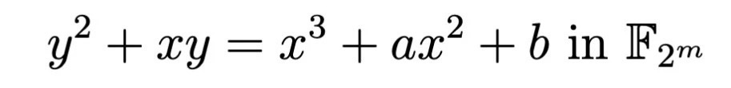
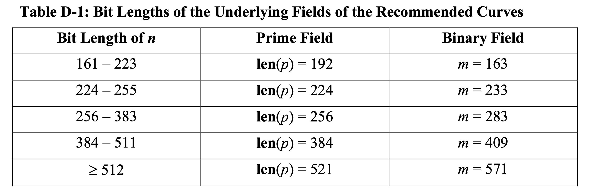

# 一场椭圆曲线的寻根问祖之旅

作者：李辉忠｜FISCO BCOS 高级架构师

本文介绍密码学中常见的椭圆曲线以及他们之间的关系，介绍不同标准体系的命名规则，尝试描述椭圆曲线之间的家族演义关系。文章试图讲清椭圆曲线相关概念和功能，不涉及复杂的数学证明和推理，欢迎感兴趣的同学阅读。笔者主要参考Wikipedia和相关组织网站的信息进行整理，不排除出现纰漏的可能，欢迎专家批评指正。

## 一个可能你没关心过的问题

在[《一个数字引发的探索——ECDSA解析》](http://mp.weixin.qq.com/s?__biz=MzA3MTI5Njg4Mw==&mid=2247485497&idx=1&sn=44ac5977abbf92bd81e9013433a59f69&chksm=9f2efa25a8597333575c8bf0642c2e312e54d23867644021c9b2e353963d405e1d945e2a067d&scene=21#wechat_redirect)中提到的椭圆曲线secp256k1，它有一些特性，可以快速计算出recoveryID。这个secp256k1为什么如此命名？不怕各位笑话，我在弄清楚它之前，经常拼写错，写成sec256pk1，seck256p1等。

## 咬文嚼字secp256k1

搞清楚secp256k1的命名含义其实很简单，搜索引擎可以快速为你定位到答案，它出自一个密码协议标准，每一个字母和数字都代表着特定含义，我们来逐一解析。

### 1、密码协议标准

第一部分是「sec」，sec是Standards for Efficient Cryptography 的简称，是SECG发布的一种密码学协议标准。SECG发布的「SEC 1」和「SEC 2」两个关于椭圆曲线的协议标准，在「SEC 2」中有详细说明secp256k1以及其他曲线的参数定义。除了「sec」，还有众多其他关于椭圆曲线的协议标准，从「SafeCurve」中可以看到有下列不同类型的标准。

「SafeCurve」此处较久没有更新，有些标准已经更新了多次，例如NIST关于数字签名的标准 FIPS 186目前在用的是第四版，第五版也在起草中了，从「NIST」官网中可见。NIST是美国的国家标准技术研究所（National Institute of Standards and Technology），因此，NIST的标准也是美国标准。

「NIST FIPS 186-4」标准中定义了若干椭圆曲线标准，例如NIST P-256、NIST P-384等，其中开头NIST也代表密码协议标准的名字。后续描述都是围绕这两个标准来解析。

### 2、有限域

第二部分是「p」，p表示该椭圆曲线是基于素数有限域Fp。有限域是离散数学中的概念，此处不做展开，简单来说，它是一个由有限数量元素组成的集合，元素之间可以进行加法和乘法计算，具备一些独特的属性。密码学中使用椭圆曲线都是基于有限域的，除了素数有限域Fp之外，还有另一种特征为2的有限域F2m（因格式问题，2m应为2的m次方，下同） ，Fp的大小（元素个数）为p，F2m的大小为2m。基于Fp的椭圆曲线为：

基于F2m的椭圆曲线为：

在「SEC 2」中还定义了sect163k1、sect163r1等曲线，其中，t表示的是该曲线基于F2m。在「NIST FIPS 186-4」中定了P-256、B-163等曲线，P-表示基于Fp，B-表示基于F2m。

### 3、有限域大小

每个椭圆曲线E都有若干关键参数，包括阶为n的基点G和系数h等，其中，n为一个大素数，n*h为椭圆曲线上点的数量。为了计算效率考虑，h通常设置为1、2或4。通俗地讲，如果椭圆曲线上的点数量越多，那么这条椭圆曲线的安全度就越高，因此n的取值是影响曲线安全的关键。椭圆曲线又都是基于有限域的，曲线上的点都是有限域中的元素，因此，有限域大小决定了曲线安全度。第三部分「256」就是有限域大小的表现形式，还有更多其他如192、224、384等，在「NIST FIPS 186-4」中有个表格展现了Fp 和F2m 两个域的各种不同大小配置。

SEC标准在这块的设置和NIST标准类似，我们会看到p系列的曲线有p192、p224、p256（secp256k1就是其中一种）、p384和p521，t/B系列有t163/B-163、t233/B-233等。

### 4、Koblitz Curve

第四部分「k」表示该曲线是Koblitz Curve，从「SEC 2」中可以看到还有此处标记为r的曲线（如secp256r1），r表示该曲线是伪随机曲线Pesudo-Random Curve。Koblitz Curve命名源自数学家「Neal Koblitz」，它是一种特殊的曲线，它的一些参数是精心挑选设置的。Koblitz Curve具有自同态的性质，可以通过优化大幅提升计算效率。相比之下，Pesudo-Random Curve的对应参数是通过随机种子计算出来的，有标准的检验算法可以检测所有参数是随机种子产生而来。对应「**2、有限域**」中的两个椭圆曲线，Koblitz Curve分别简化为

例如，secp256k1对应的曲线b=7，即曲线表示为

在「NIST FIPS 186-4」中Koblitz Curve曲线以「K-」标记开头，分别有K-163、K-233等。

### **5、末位标记**

到了第五部分「1」，这是代表在前4个条件下提供了多种推荐参数设置，在SEC标准中大部分该位都是1，即只提供一种推荐参数，sect163r2是一个例外。下面把SEC和NIST两个标准推荐的曲线分别列一下，二者有较大部分是相同的参数设置。

上述表格中，同一行中SEC和NIST都出现的，两个曲线虽然名字不同，但参数完全相同，也就是说其实一样的。橙色底纹的几个SEC曲线没有对应的NIST曲线，因此SEC标准包含的曲线比NIST多一些，本文开头提到的secp256k1就是SEC单独存在的。说到这里，不得不提一个正经八卦。据说，NIST推荐的Pesudo-Random Curve，也就是P和B系列，并没有公布随机数挑选规则，外界存在一种疑虑，可能NSA（美国国家安全局）掌握了后门，能够轻易破解这些密码协议。有兴趣的同学可以搜索「Dual_EC_DRBG后门」，更大的八卦是据说中本聪选择secp256k1作为比特币签名算法的曲线，而没有选择更常用的secp256r1，也是因为这个潜藏的风险。

## **椭圆曲线族谱**

调研发现，「STD」记录了比「SafeCurve」更为详细的标准和曲线，感觉这可以算是椭圆曲线族谱了。翻阅该网站记录的所有曲线，发现绝大部分还是基于「（2）有限域」中的曲线，推荐的参数不同而已。但是，在「other」中存在几种例外，E-222采用Edward Curve，Curve25519采用Montgomery Curve，Ed448采用Twisted Edward Curve。

Edward Curve是什么？Montgomery Curve又是怎样的？Edward与Twisted Edward Curve又有什么关系？上述问题再一次触碰到我的知识盲区，所以接下来只好以截图为主，内容源自Wikipedia，如果觉得看着有点晕，可直接跳过看结论。「Edward Curve」定义如下：

「Montgomery Curve」定义如下：

「Twisted Edward Curve」定义如下：

「Curve25519」定义如下：

「Ed25519」的定义如下：

根据Wikipedia，大概可以整理出这么几个信息：

1. Edward Curve是Twisted Edward Curve中的一种
2. Twisted Edward Curve和Montgomery Curve可以互相转换
3. Edward Curve和Montgomery Curve这两种曲线都具有特殊属性，例如能够为计算加速
4. Curve25519是一种曲线，Ed25519是一种签名算法
5. Curve25519又是精选的Montgomery Curve，具有更高的计算效率
6. Curve25519和Ed25519采用的曲线是一致的，一个是Montgomery表现形式，一个是Twisted Edward Curve表现形式
7. 25519的取名来自于该曲线的有限域参数p=2255- 19

在阅读Wikipedia的过程中发现一个名字「Weierstrass equation」，原来它才是这些曲线的鼻祖，在一个域k上的任何一个平面曲线，都可以表示成Weierstrass equation。

不难发现，前面提到过的各个公式都是Weierstrass equation的一种演化版本（Twisted Edward Curve看起来不是，但是它可以转换到Montgomery Curve，本质上也一样）到此，为椭圆曲线寻根问到祖，并且从「STD」也获知了椭圆曲线家族的族谱。

「STD」中罗列了多个其他标准，例如Brainpool曲线系列、BN曲线系列、MNT曲线系列等，这些系列的背后都代表了一种独特的曲线生成哲学，或是为了提供可验证的随机数，或是为了提供满足Paring的特性，或是为了提高抗攻击的能力等等，每一份精心选择的参数都是一群数学家们巧夺天工的设计。

## **后话**

古有拆文解字，参透汉字玄机，道破人生天机；而今咬文嚼字，摸清椭圆原理，揭开曲线家谱。始于名字，解码secp256k1，厘清标准；终于名字，问祖weierstrass，致敬大神。

通过了解椭圆曲线之间的内在关系，对其设计有了更多一点的理解。知道的更多了，不知道的也更多了，那些特殊曲线的数学原理是什么？为什么具有更高的计算效率？性能能提升多少？… 又是一个深夜，拥抱最新的收获，夹杂更多的困惑。电脑中正好在播放“把太细的神经割掉，会不会比较睡得着…”

------

#### 参考资料

- [SEC1](https://www.secg.org/sec1-v2.pdf)
- [SEC2](https://www.secg.org/sec2-v2.pdf)
- [NIST](https://nvlpubs.nist.gov/nistpubs/FIPS/NIST.FIPS.186-4.pdf)
- [STD](https://neuromancer.sk/std/)
- [SafeCurves](https://safecurves.cr.yp.to)
- [Koblitz Curves](https://link.springer.com/content/pdf/10.1007%2F3-540-46766-1_22.pdf)
- [Weierstrass Equation](https://www.lmfdb.org/knowledge/show/ec.weierstrass_coeffs)
- [Montgomery Curve wiki](https://en.wikipedia.org/wiki/Montgomery_curve)
- [Twisted Edward Curve wiki](https://en.wikipedia.org/wiki/Twisted_Edwards_curve)
- [Edward Curve wiki](https://en.wikipedia.org/wiki/Twisted_Edwards_curve)
- [ECDSA wiki](https://en.wikipedia.org/wiki/EdDSA#Ed25519)
- [Curve25519 wiki](https://en.wikipedia.org/wiki/Curve25519)
- [Curve25519 paper](http://cr.yp.to/ecdh/curve25519-20060209.pdf)
- [Ed25519 paper](http://ed25519.cr.yp.to/ed25519-20110926.pdf)

