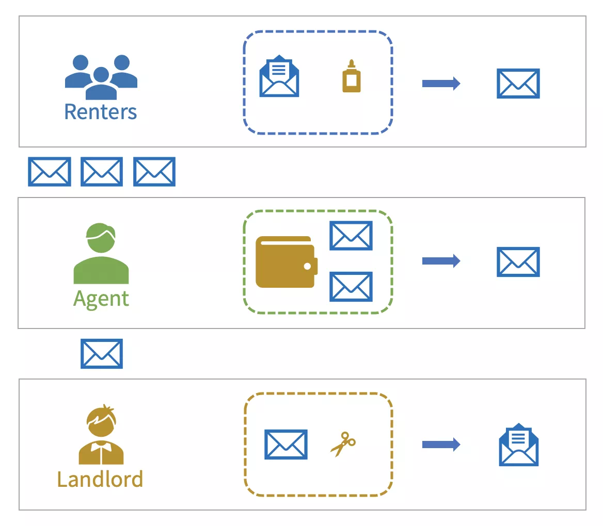
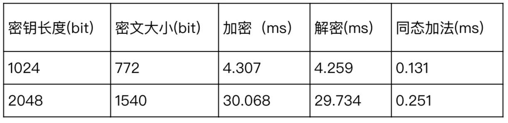

# 链上密文参与计算？同态加密尽显神通 | FISCO BCOS隐私特性

作者：贺双洪｜FISCO BCOS 核心开发者

## 前言

作为分布式系统，一方面区块链通过数据的共享、共治以及协作处理，充分发挥数据价值。而另一方面，由于资源和隐私的限制，区块链只适合保存最轻、最有必要、无隐私风险的数据，如哈希、元数据的密文等。数据可用性和隐私性之间的矛盾，在区块链中愈发明显。

常言：“鱼与熊掌不可兼得”，但是专治疑难杂症的密码学家们不答应，提出了一种密文也能参与计算的方案——**同态加密**（HE，Homomorphic Encryption）。本文将解释同态加密的定义以及在FISCO BCOS中的技术实现。

## 什么是同态加密

同态加密是上世纪七十年代就被提出的一个开放问题，旨在不暴露数据的情况下完成对数据的处理，关注的是**数据处理安全**。

想象一下这样一个场景，作为一名满怀理想的楼二代，你每天过着枯燥乏味的收租生活，希望摆脱世俗的枷锁、铜臭的苟且去追求诗与远方。你需要雇一个代理人去承担收租的粗活，但又不希望其窥探你每月躺赚的收入。于是，你请高人打造了一套装备，既能保证代理人顺利完成收租，又不会泄露收入信息。这套装备包括信封、胶水、皮夹和神奇剪刀，每一样东西都有奇特的功能：

1. 信封一旦用胶水密封，只有神奇剪刀才能拆开。
2. 不论信封里装了多少钱，信封的大小和重量都不会发生改变。
3. 把多个信封放在皮夹里后，信封会在不拆开的情况下两两合并，最后变成一个信封，里面装的钱正好是合并前所有信封金额的总和。



你把信封和胶水分发给所有租客，把皮夹交给代理人。到了约定交租的日子，租客把租金放到信封里密封后交给代理人；代理人收齐信封，放到皮夹中，最后得到一个装满所有租金的信封，再转交给你；你使用神奇剪刀拆开，拿到租金。

在这个场景中，信封的a、b两个性质其实就是公钥加密的特性，即使用公钥加密得到的密文只有掌握私钥的人能够解密，并且密文不会泄露明文的语义信息；而c则代表加法同态的特性，两个密文可以进行计算，得到的结果解密后正好是两个原始明文的和。到此，同态加密的全貌已经呼之欲出：

- 同态加密本质是一种公钥加密方案，即加密使用公钥pk，解密使用私钥sk；
- 同态加密支持密文计算，即由相同公钥加密生成的密文执行f()函数的同态操作，生成的新密文解密后恰好等于两个原始明文计算f()函数的结果；
- 同态加密公式描述如下：


同态加密可分为全同态加密（FHE，Fully Homomorphic Encryption）和半同态加密（SWHE，Somewhat Homomorphic Encryption）。FHE顾名思义就是支持任意给定的f()函数，不过由于计算开销极大，目前学术界还没有一个实用型的FHE方案；SWHE只支持一些特定的f()函数，例如加法或者乘法等，由于开销小，在工业界尤其是云计算领域已有不少的应用。

## FISCO BCOS技术选型

在联盟链中，考虑到监管需求，链上机构可能需要将应用中的一些隐私数据上链，如营收账目、产品流量等。为了不泄露机密，机构可以使用监管方的公钥对这些信息进行加密，加密后，信息统计可交由代理机构完成。在这种场景下，由于需要针对密文进行计算，同态加密便可大展身手。

FISCO BCOS通过集成同态加密，为用户提供一种支持密文处理的隐私保护工具。加解密会暴露明文数据，基于安全性考量，只适合在链下完成，链上只保留同态运算接口，加解密接口则以独立算法库的形式提供给应用层。在同态加密方案的选择上，出于对计算开销的考虑，首选轻量级加法同态方案；鉴于区块链存储资源有限，密文不能太大，可对齐标准的RSA加密算法。

综合上述两点，我们选择了兼具以上特性的加法同态方案Paillier《Public-Key Cryptosystems Based on Composite Degree Residuosity Classes》，该方案由Paillier于1999年在欧密会（EUROCRYPT）上提出。Paillier方案的实验分析如下：



其中公私钥对通过RSA密钥生成算法得到，从上表中可以看到各项开销和秘钥长度正相关。目前1024位的RSA密钥已经不再安全，推荐使用2048位及以上的密钥。

## 如何在FISCO BCOS中使用同态加密

FISCO BCOS 2.3版本以预编译合约的形式集成了Paillier方案的密文同态加法接口。要启用同态加密功能需要打开CRYPTO_EXTENSION编译选项，并重新编译源码（**2.5及以上版本默认开启，不再需要用户编译源码**）。同态加密预编译合约地址分配如下：


要完成预编译合约的调用，首先需要以Solidity合约方式声明合约接口。

```
// PaillierPrecompiled.sol
pragma solidity ^0.4.24;
contract PaillierPrecompiled{
    function paillierAdd(string cipher1, string cipher2) public constant returns(string);
}
```

然后可在业务合约中通过地址实例化预编译合约对象以完成同态加接口的调用。

```
// CallPaillier.sol
pragma solidity ^0.4.24;
import "./PaillierPrecompiled.sol";
contract CallPaillier {
    PaillierPrecompiled paillier;
    constructor() public
    {
        // 实例化PaillierPrecompiled合约
        paillier = PaillierPrecompiled(0x5003);
    }
    function add(string cipher1, string cipher2) public constant
    returns(string)
    {
        return paillier.paillierAdd(cipher1, cipher2);
    }
}
```

Paillier方案中的公私钥生成、加解密接口以独立的密码库提供给开发者。目前密码库内包含了一个Java语言的完整版Paillier方案，以及一个供预编译合约调用的C语言版同态加接口。[密码库如下](https://github.com/FISCO-BCOS/paillier-lib)。

## 未来改进的方向

开发者当下可触达的同态加密算法库只有Java版本，未来根据实际需求，我们将对齐FISCO BCOS的SDK语言种类，提供多语言版本的同态加密库。同态加密一直是密码学界难题，要实现全同态加密计算，在性能和可用性上还存在很大挑战，FISCO BCOS将持续关注该领域的技术进展。

## 结语

安全之道修远兮，FISCO BCOS将上下求索。目前，FISCO BCOS已配置包括群签名、环签名、同态加密等多种密码学工具，接下来将实现和集成面向特定场景的定制化隐私保护解决方案。欢迎大家一起使用和关注同态加密技术在隐私保护场景的应用，共同探讨交流，积极反馈、共建更为安全可靠的FISCO BCOS平台。