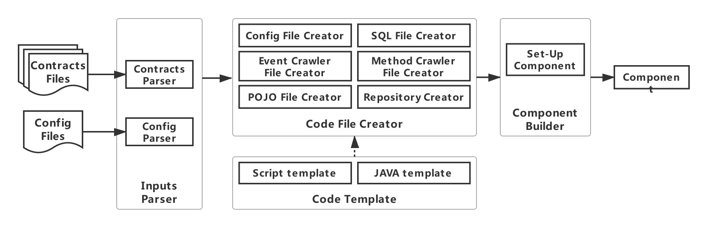
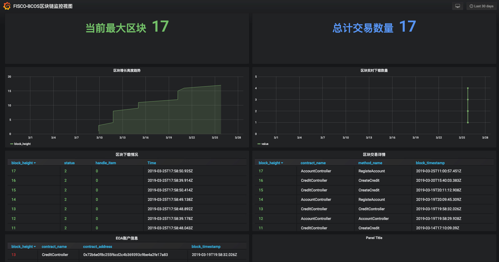
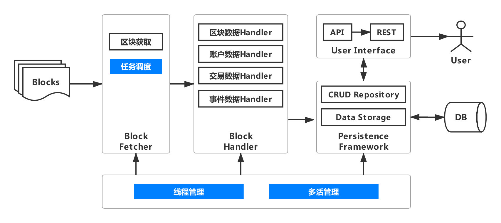

# WeBASE数据导出：助力区块链大数据场景快速落地

作者：张龙｜FISCO BCOS 核心开发者

随着区块链技术的快速发展，各类应用如雨后春笋般涌现，链上数据呈指数级增长，基于区块链的大数据场景成为兵家必争之地，数据分析也成为刚需。

然而由于链上数据的存储特点，只能通过接口方式从链上直接获取，这种方式需要针对智能合约接口编写大量的代码，成本很高；同时从链上读取数据，除过网络开销，还需要进行解码操作，甚至遍历MPT树等，读取性能差；更重要的是，不能直接在链上进行全局数据处理，从而无法满足大数据场景的需求，比如复杂查询、大数据挖掘和分析等。

针对用户的需求，我们致力于提供一种自动化、智能化的数据导出解决方案，并通过不断迭代完善，满足用户基于数据导出的各种诉求，助力区块链大数据场景快速落地。本文将从用户需求出发，逐层揭开**WeBASE数据导出**组件功能、特性和架构演进的神秘面纱。

WeBASE是在区块链应用和FISCO BCOS节点之间搭建的中间件平台，对技术和业务架构中的共性进行抽象，形成通用化且体验友好的组件，简化区块链应用开发流程。

### 用户说：链上获取数据性能差，不便于大数据处理，便有了WeBASE-Collect-Bee

对于用户而言，希望有原始数据支持大数据处理，但由于区块链特有的链式存储结构及出于安全性而设计的编解码操作及状态树等，使得从链上读取数据性能很差，于是我们设计了[WeBASE-Collect-Bee](https://github.com/WeBankFinTech/WeBASE-Collect-Bee/tree/master ) 。

WeBASE-Collect-Bee初步架构如下图所示，其目的在于降低获取区块数据的开发门槛，提升数据获取效率，支持大数据处理，用户只需要进行简单配置，就可以把区块数据导出到指定的存储介质上，比如支持复杂的关系查询、大数据挖掘的数据库或大数据平台上。


WeBASE-Collect-Bee包括三个模块：区块获取模块、区块处理模块和持久化模块。

- 区块获取模块：根据区块ID获取相应的区块；
- 区块数据处理：解析区块数据、区块交易数据；
- 账户数据处理：解析区块链账户数据。

用户只需要提供链的相关配置及数据库配置，就可以一键导出链上的数据，后续可以采用SQL的方式对数据库中的数据进行操作，同时只要确保WeBASE-Collect-Bee服务正常运行，数据库可以几乎实时同步链上的数据。

### 用户说：业务数据获取工作量大，且不便于维护和复用，便有了WeBASE-Codegen-Monkey

只有区块数据是远远不够的，用户更关心业务数据，即交易数据。交易数据通过调用智能合约方法上链，同时为了便于查看交易执行情况，交易中存在大量的log数据，即event数据，event数据对业务分析至关重要。

要想获取交易数据和event数据，必须针对区块链上的每一笔交易和event，根据智能合约进行解析，核心模块至少包括：交易/event和数据解析、数据库访问接口、POJO、SQL几个模块。

如下图所示，假设我们的业务包含2个智能合约、每个智能合约包含2个接口和2个event，每个模块都需要独立编写代码，那么至少需要编写32个代码文件或脚本，工作量相当大，维护复杂，且不能复用。


基于此，我们设计了[WeBASE-Codegen-Monkey](https://github.com/WeBankFinTech/WeBASE-Codegen-Monkey) 。WeBASE-Codegen-Monkey用于生成解析和存储交易/event数据的所有核心代码。用户无需编写任何代码，只需要提供智能合约文件，WeBASE-Codegen-Monkey会自动解析合约，生成获取交易/event数据的所有代码文件，并自动和WeBASE-Collect-Bee组装成为一个独立的服务。WeBASE-Codegen-Monkey架构如下图所示。



WeBASE-Codegen-Monkey包括合约解析模块、代码模板模块、代码生成模块、组件组装模块。

- 合约解析模块：解析智能合约文件，获取合约中的交易和event对象；
- 代码模板模块：用于生成获取交易/event数据的代码模板；
- 代码生成模块：根据获取的交易和event对象，填充代码模板，生成代码文件；
- 组件组装模块：用于将生成的代码和WeBASE-Collect-Bee组装成一个独立的服务。

由于新增了交易/event数据的获取，相应的WeBASE-Collect-Bee架构演进如下，新增交易数据处理模块和事件（event）数据处理模块。用户只需要提供智能合约文件，就可以获取几乎链上的所有数据。


从用户使用的角度来讲，只需要将链的证书文件和智能合约文件放在指定的目录下，然后进行节点和数据库配置，并设置智能合约的包名即可。

```
#### 节点的IP及通讯端口、组号。NODE_NAME可以是任意字符和数字的组合
system.nodeStr=[NODE_NAME]@[IP]:[PORT]
system.groupId=[GROUP_ID]

#### 数据库的信息，暂时只支持mysql；serverTimezone 用来设置时区
system.dbUrl=jdbc:mysql://[IP]:[PORT]/[database]?useSSL=false&serverTimezone=GMT%2b8&useUnicode=true&characterEncoding=UTF-8
system.dbUser=[user_name]
system.dbPassword=[password]

# 合约Java文件的包名
monitor.contractPackName=[编译Solidity合约时指定的包名]
```

### 用户说：有了数据，要使用还需要开发数据访问接口，不方便，便有了用户接口

对于用户而言，尽管我们已经将用户关心的所有数据导出到DB中，且每一张表的名称和交易方法/event名称对应，字段名称直观易懂，但如果用户想在自己的系统中使用数据，还需要编写大量的数据库访问接口。基于此，WeBASE-Collect-Bee中增加了**用户接口模块**，如下图所示。


用户接口模块提供两种数据访问方式，一种是API方式，支持用户系统本地调用；另一种为REST方式，可通过http方式访问，降低了业务的耦合性，支持跨平台调用。

用户接口按照数据类型分成四类接口：区块数据接口、账户数据接口、交易数据接口和事件数据接口。其中，每类接口中都支持基于块高、hash或账户的查询，同样也支持基于时间、特定字段的复杂查询。用户接口使得用户在使用数据导出组件时，可以和自身系统零成本对接。

除此之外，为了便于用户进行可视化数据验证和查看，数据导出组件集成了Swagger插件，当用户完成数据导出服务部署后，可在浏览器中输入http://your_ip:port/swagger-ui.html，查看所有用户接口，并输入查询条件，进行可视化查询，如下图所示。


### 用户说：有了数据和查询接口，但是不够直观，老板看不懂，便有了Grafana集成

为了更加实时、可视化的展示区块链数据，满足产品、运营等非技术人员的需求，基于轻量化考虑，最终我们选择了可视化数据插件Grafana。

然而Grafana展示数据需要针对每一张表数据编写Dashboard模板，学习和编写模板成本很高。不过不用担心，WeBASE-Code-Monkey会自动生成Grafana脚本。用户只需要安装Grafana并进行数据源配置，然后导入生成的Dashboard模板脚本即可，实现数据可视化可在1分钟内完成，如下图所示。




### 用户说：一个服务导出数据太慢，服务挂了怎么办，便有了多线程处理和分布式部署

对于数据导出服务，一旦链的性能很高，超过单机数据导出的TPS，那么DB中永远获取不到最新的数据，且数据会越来越旧，显然无法满足业务对数据的诉求。同时单机处理的风险在于系统稳定性很差，一旦单机服务挂掉，就无法获取最新数据，且无法使用用户接口进行交互。因此我们引入了多线程处理和分布式部署，架构演进如下图所示。



#### 线程管理

线程管理相对简单，只需要关闭多活开关，开启单节点任务模式，同时对独立线程处理的区块数进行设置即可。如下，系统默认开启4个线程，进行区块抓取和处理。

```
#### 当此参数为false时，进入单节点任务模式
system.multiLiving=false
#### 多线程下载的分片数量，当完成该分片所有的下载任务后，才会统一更新下载进度。
system.crawlBatchUnit=100
```

#### 多活管理

为了进一步提升数据导出效率，确保系统稳定性和容错性，我们集成了Elastic-Job，支持分布式部署、任务分片、弹性扩容、并行调度和定制化流程任务。数据导出组件在分布式环境下，首先通过一个SimpleJob对区块进行抓取，然后通过DataflowJob对区块进行处理。

考虑到使用Elastic-Job的成本，系统会自动生成任务分片和执行策略的所有配置，除过几个必要配置，用户不需要做任何事情就可以完成多活配置和部署。必要配置如下。

```
#### 当此参数为true时，进入多节点任务模式
system.multiLiving=true

#### zookeeper配置信息，ip和端口
regcenter.serverList=ip:port
#### zookeeper的命名空间
regcenter.namespace=namespace
```

### 用户说：导出的数据量太大，查询和存储性能跟不上，容易崩，便有了分库分表

当区块链上存在海量的数据时，导出到单个数据库或单个业务表会对运维造成巨大的压力，造成数据库性能的衰减。一般来讲，单一数据库实例的数据阈值在1TB之内，单一数据库表的数据阈值在10G以内，是比较合理的范围。

如果数据量超过此阈值，建议对数据进行分片。将同一张表内的数据拆分到多个或同个数据库的多张表中，即分库分表。数据导出引入数据管理模块，架构演进如下图所示。


数据管理模块集成Sharding-JDBC，支持分库分表和读写分离。用户只需要设置分片数，系统会自动生成分片策略配置。如果需要支持读写分离，可以在生成的WeBASE-Collect-Bee中进行配置，可参考[数据导出高级配置](https://webasedoc.readthedocs.io/zh_CN/latest/docs/WeBASE-Collect-Bee/install.html)。在用户接口层，用户可以无感使用同一套接口，感觉是在同一个库或表中操作一样。

```
#### 交易和event数据分片配置
system.contractName.[methodName or eventName].shardingNO=XXX
#### 区块和账户数据分片配置
system.sys.[sysTableName].shardingNO
```

### 用户说：链上出现临时分叉或服务异常，DB数据不一致，便有了异常处理和监控报警

数据导出服务旨在导出链上数据。在确保性能、稳定性、可扩展性的前提下，如果选择了非高度一致性的共识机制，链上会有一定概率出现临时分叉，导致数据库出现脏数据；或者由于网络/服务异常等原因，导致数据导出服务无法导出链上最新数据。

为了确保数据正确性、数据一致性，数据导出组件新增异常管理模块和监控脚本，至此，数据导出组件功能已非常强大，完整架构如下图所示。


#### 异常处理

异常处理主要为了校验导入DB数据的正确性，如果选择了非高度一致性的共识机制，链上会有一定概率出现临时分叉，可能导致DB中的数据和链上的数据不一致。

基于6个区块后链上分叉概率趋近于0的理论，每次导出数据之前，异常管理模块会针对最近6个区块进行hash校验，如果一致，则继续导出。如果不一致，则回滚大于等于异常区块高度的所有区块数据，然后重新拉取和导入。

#### 监控报警

即使有分布式部署保证数据导出服务的稳定性，但无法保证链上数据是否真正的导出。监控脚本monitor.sh用于监控链上数据是否真正的导出。主要基于两个维度：

- 一段时间内，DB中的数据开始落后于链上数据，直到达到某个阈值；
- 链上块高增加，一段时间内，DB中块高不变。

用户可以根据实际情况自行配置，如下所示。

```
#### 数据导出的进度落后于链高度的报警阈值，输出报警日志
threshold=20
#### 如当前块高增长，但完成导出的区块数量增长小于等于1，则输出报警日志
warn_number=1
```

## 用户你尽管说

### 用户说：链上历史数据没有价值，全量抓取浪费资源，只想要最近的数据。

数据导出组件支持从特定时间或特定块高拉取数据，只需要进行简单配置即可，如下。

```
#### 设置数据导出的起始高度
system.startBlockHeight=XXXX
#### 设置数据导出的起始时间
system.startDate=XXXX
```

### 用户说：我只想要部分交易/event的数据，或者只要交易/event中的部分字段数据。

在实际场景中，用户可能并不需要全量数据，只需要特定交易/event的数据，或者特定交易/event中的特定字段数据，数据导出支持个性化导出，可按如下配置。

```
#### 设置特定交易或event数据是否导出，默认全部导出
monitor.[contractName].[methodName/eventName].generated=on/off
#### 忽略特定合约特定event的特定字段不进行抓取
monitor.[contractName].[methodName/eventName].ignoreParam=XXX,XXX
```

### 用户说：链上数据增长的不快，线程一直空转浪费机器资源。

数据导出组件可以灵活配置数据抓取任务的频率，可通过如下配置项进行修改。

```
#### 所有method和event的抓取频率，默认5秒轮询一次
monitor.default.frequency=5
```

### 用户说：交易/event的个别字段采用string类型，数据库默认255，会导致入库报错。

数据导出对于智能合约中的bytes和string类型默认采用VARCHAR(255)，这种设计是为了节省数据库资源，能满足绝大部分场景，但同时也存在个别字段超过255长度，导致数据不一致。因此数据导出组件针对超长字段提供配置，可有效合理利用数据库存储空间，避免资源浪费。

```
#### 配置特定合约中特定交易/event的特定字段在数据库中的长度
length.[contractName].[methodName or eventName].[paraName]=1024
```

### 用户说：导出原始数据不是我想要的，比如某个账户的最新余额，而不是所有变更历史。

数据导出组件会导出链上的全量数据，包含所有的历史数据。针对用户的特定数据需求，数据导出组件支持本机编译，复制执行包到其他服务器上运行，在执行generate_bee.sh后，会生成完整的WeBASE-Collect-Bee服务工程，用户可基于工程源码进行二次开发，修改导入数据的策略。

### 用户说：整体服务功能很强大，但是我只想把部分功能集成到自己的系统中。

数据导出服务考虑到模块耦合性，将整个WeBASE-Collect-Bee拆分成为区块获取、数据解析，数据库操作和公共模块，用户可按照自己的需求直接使用独立的模块。

## 用户不仅仅可以说

对于任何一个方案，没有最完美的，只有最适合的。数据导出组件致力于解决区块链大数据场景问题，不仅可以适用于具体的业务诉求，对于一个区块链项目而言，还可以作为贯穿开发、测试和运营的利器，提升研发、测试和运营的效率。

对于用户的需求，我们的一贯态度是：欢迎说，但也不怕说，必要时你必须得说。面对志同道合的小伙伴，我们也早已给出答案：聊，随时恭候；来，双手欢迎。

除了积极参与区块链领域的技术开源，我们也致力于和广大用户共建开源生态，用户不仅仅可以说，还可以加入我们，这里不仅有前沿的黑科技，还有诗和远方！

------

#### 链接指引

- [区块链底层平台FISCO BCOS代码仓库](https://github.com/FISCO-BCOS/FISCO-BCOS/tree/master-2.0)

- [FISCO BCOS技术文档](https://fisco-bcos-documentation.readthedocs.io/zh_CN/latest/)

- [数据导出代码仓库]( https://github.com/WeBankFinTech/WeBASE-Codegen-Monkey)

- [数据导出技术文档](https://webasedoc.readthedocs.io/zh_CN/latest/docs/WeBASE-Codegen-Monkey/index.html)

