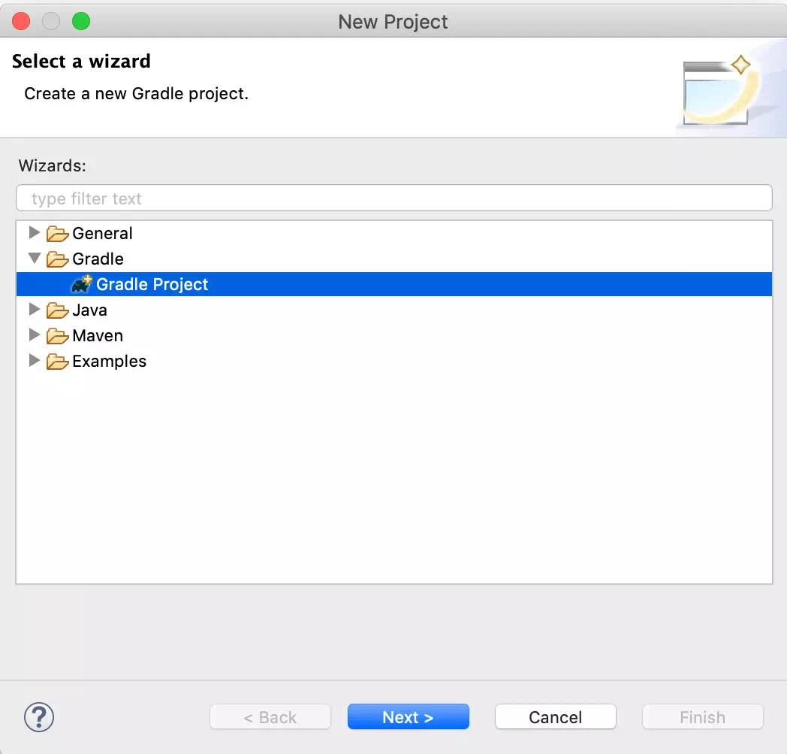
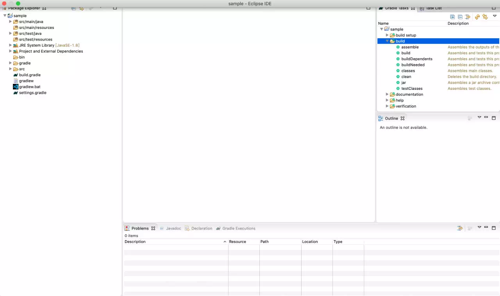
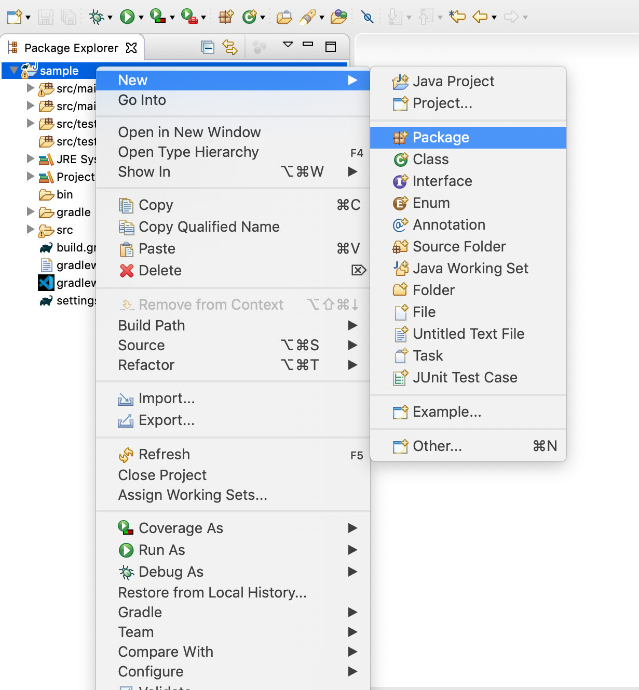
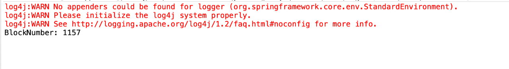

# 手把手教你在Eclipse中使用JavaSDK

作者：王章｜FISCO BCOS 核心开发者

Eclipse是当前主流的Java IDE之一，本文将进行上手实操，指导如何在Eclipse中创建FISCO BCOS的JavaSDK应用。

本文首先介绍如何在Eclipse创建新的工程，在工程中引入JavaSDK依赖，通过配置与区块链进行交互，最后通过获取区块链的块高验证创建的项目。同时，本文也会介绍实际开发中更加便捷的使用方式，将已经提供的示例项目导入Eclipse。

**注意：**

文章项目以Gradle方式进行构建，请确认以下环境正确安装：1、Java 1.8或者以上版本；2、

##### 前置条件：

参考[安装文档](https://fisco-bcos-documentation.readthedocs.io/zh_CN/latest/docs/installation.html)：完成FISCO BCOS区块链的搭建，功能测试需要与区块链节点进行交互。

## **Eclipse 创建新工程**

### 创建Gradle工程

打开Eclipse，右键选择New下Project选项，如下图所示：


在弹出的新建New Project界面，选择Gradle => Gradle Project，点击Next ：




再次点击Next，在接下来的界面输入项目名称，这里项目名为sample。


点击Finish，然后等待项目初始化。



项目初始化之后，一个新的Gradle工程已经创建完成。接下来，我们需要修改项目的build.gradle文件，引入JavaSDK的maven库以及依赖版本。

### 项目引入JavaSDK依赖

打开build.gradle文件，在repositories添加需要的maven库:

```
repositories   { 
    // 其他maven库 
    // solidity编译器maven库 
    maven { url"https://dl.bintray.com/ethereum/maven/" } 
    // JavaSDK snapshot版本 maven库 
    maven{ url "https://oss.sonatype.org/content/repositories/snapshots"} 
    // JavaSDK maven库 
    maven { url"http://maven.aliyun.com/nexus/content/groups/public/" } 
     // 通用maven库 
     mavenCentral() 
    }
```

在dependencies添加JavaSDK的依赖版本：

```
dependencies { 
       // 其他依赖

       // 日志依赖 
       compile ('org.slf4j:slf4j-log4j12:1.7.25') 
       // JavaSDK依赖, 2.1.0版本 
       compile ("org.fisco-bcos:web3sdk:2.1.0") 
   }
```

然后右键点击项目名：Gradle=> Refresh Gradle Project刷新项目。


**注意**：刷新项目可能需要从远程maven库下载项目依赖jar的包，请确保网络畅通，下载过程会需要一些时间。

### 证书与配置文件

JavaSDK服务运行需要依赖applicationContext.xml配置文件以及证书。查看[配置参考](https://fisco-bcos-documentation.readthedocs.io/zh_CN/latest/docs/sdk/java_sdk.html#fisco-bcos)。将配置文件applicationContext.xml，证书文件ca.crt sdk.crt sdk.key拷贝到项目src/main/resources目录下。


### 创建运行测试类

到此，我们已经完成了新项目的创建，引入并完成了JavaSDK的配置，现在我们来测试项目的功能。

### 创建类包package

右键点击项目名称选择New => Package然后输入包名，这里使用org.fisco.bcos.test。



### 创建测试类

右键点击类包名选择 ‘New => Class’。


输入类名，点击Finish，这里类名使用NodeVersionTest。


测试类的功能为调用getBlockNumber接口获取当前的块高：

```
package org.fisco.bcos.test;

import org.fisco.bcos.channel.client.Service;
import org.fisco.bcos.web3j.protocol.Web3j;
import org.fisco.bcos.web3j.protocol.channel.ChannelEthereumService;
import org.fisco.bcos.web3j.protocol.core.methods.response.BlockNumber;
import org.springframework.context.ApplicationContext;
import org.springframework.context.support.ClassPathXmlApplicationContext;

public class NodeVersionTest {
 public static void main(String[] args) throws Exception {
  
  ApplicationContext context = new ClassPathXmlApplicationContext("classpath:applicationContext.xml");
  Service service = context.getBean(Service.class);
  service.run();

  ChannelEthereumService channelEthereumService = new ChannelEthereumService();
  channelEthereumService.setChannelService(service);
  // Web3j对象
  Web3j web3j = Web3j.build(channelEthereumService, service.getGroupId());
  // 调用 getBlockNumber 接口获取
  BlockNumber blockNumber = web3j.getBlockNumber().send();
  System.out.println("BlockNumber: " + blockNumber.getBlockNumber());
  System.exit(-1);
 }
}
```

右键点击NodeVersionTest.java文件选择Run As => Java Application运行测试类。


运行结果：


## Eclipse导入项目

上面流程可以看出创建新项目的过程需要比较多的配置流程，为了便于用户使用，我们提供已有的示例项目asset-app，用户可以将其快速导入Eclipse，在示例基础上快速修改开发自己的应用。请参考[asset-app项目详情](https://fisco-bcos-documentation.readthedocs.io/zh_CN/latest/docs/tutorial/sdk_application.html)。

### 下载asset-app项目工程

下载[asset-app](https://github.com/FISCO-BCOS/LargeFiles/raw/master/tools/asset-app.tar.gz)，下载之后本地解压至指定路径。

[asset-app gitee下载](https://gitee.com/FISCO-BCOS/LargeFiles/raw/master/tools/asset-app.tar.gz)

### 导入工程

打开Eclipse选择: File => Import => Gradle => Existing Gradle Project。




点击Next，选择asset-app路径，点击Finish等待项目加载。


项目加载完成之后，右键点击项目名：Gradle=> Refresh Gradle Project刷新项目。


ok! asset-app项目已经被正常加载。

