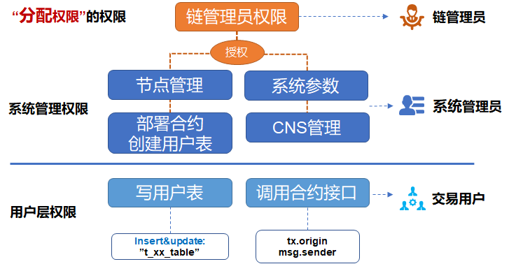

# FISCO BCOS权限控制一览

作者：张开翔｜FISCO BCOS 首席架构师

**作者语**

在多方参与的联盟链上，各方分工协作的同时也要做到**职责分明、各司其职**。链的管理者没有必要“既当裁判又当运动员”的参与业务交易，只参与交易的用户也不必很操心智能合约的开发部署。同时，"DO分离"（开发和运维分离）已经是业界成熟的做法，越权操作会带来风险，最终可能破坏信誉和造成资产损失。

清晰、易用、周全的**权限控制能力**，无论是对于信息安全，还是为了完善联盟治理，都至关重要。

本期文章讲的就是FISCO BCOS权限控制这点事，作者从FISCO BCOS的权限分类、典型的联盟链角色设计、权限控制操作基本步骤等角度进行了解析。

## FISCO BCOS的权限分类

FISCO BCOS在链刚建立起来的时候，为了方便快速地进行开发和体验，默认并没有做任何权限控制。但如果这条链是用来提供企业级服务，则从一开始就要设计权限控制的策略并落实之。 FISCO BCOS的权限分类：  




### 1. 链管理员权限

即**分配权限的权限**，如定义账户A作为链管理员，A可以为账户B、C、D分配权限；可以设置多个管理员，如果不设置管理员，任何账户都可以无差别修改各种权限。

### 2. 系统管理权限

目前包括4种：

- 节点管理权限（增删共识节点或观察节点）
- 系统参数修改权限
- 修改CNS合约命名权限
- 能否部署合约和建表的权限

其中部署合约和建表是“二合一”的控制项，在使用CRUD合约时，我们建议部署合约的时候一起把合约里用到的表建了（写在合约的构造函数里），否则接下来读写表的交易可能会遇到“缺表”错误。如果业务流程需要动态创建表，动态建表的权限也应该只分配给少数账户，否则链上可能会出现各种废表。

### 3. 用户表权限

以用户表为粒度，控制某些账户能否**改写某个用户表**，以避免用户表被他人意外修改，这个权限要依赖FISCO BCOS的CRUD合约写法。另外，**读用户表**不受权限控制；如果要进行数据的隐私控制，需要引入数据加密、零知识等技术。

### 4.合约接口权限

一个合约可以包括多个接口，由于合约里的逻辑和业务密切相关，接口粒度的权限控制由开发者实现，开发者可对msg.sender或 tx.orgin进行判断，决定是否允许本次调用继续处理。

FISCO BCOS的控制台提供了一系列控制权限的命令，可以很方便的为用户**授予（grant）、取消(revoke)、查看(list)**各种权限，可以参见控制台的文档。

## 联盟链中典型的权限管理角色设计

在联盟链里，不同的角色各司其职，分工协作，典型的角色设计可参照：

### 1. 链管理员

通常是参与链的多方共同选出一个委员会，一个或多个机构可获得管理员权限，以进行人员管理和权限分配。链管理员并不负责任节点管理，修改系统参数，部署合约等系统管理操作。

### 2. 系统管理员

指定的业务运营人员或系统运维人员，按需分配各种权限，负责日常的链上管理，包括节点增删，系统参数修改等。由链管理员根据大家约定的治理规则来分配权限，比如只允许指定的账户部署合约，则给他们设定合约部署权限，这样其他账户则不能随意部署合约了。

### 3.交易用户

用户向区块链发送业务交易请求，业务交易主要是调用合约和读写用户表，可以根据业务逻辑，结合用户表权限和合约接口权限来进行灵活的控制。

### 4. 监管方

给监管方分配哪些系统和用户表权限，可参考具体的监管规则，如监管方只读所有数据，则不用设定特殊的权限。

管理不同角色的帐户又是另一个复杂的问题，既要清晰区分，又要便于使用，还要保证帐号安全；万一帐号丢失后要支持找回，帐号泄漏后重置，以后会另文介绍。

## 权限控制操作基本步骤

### step1

首先采用控制台grantPermissionManager命令设置一个或多个链管理员角色。 **Tips**：登陆控制台时，命令行里输入的是私钥明文，而使用grantPermissionManager命令输入的是“账户地址”，要注意区分。如：

用户私钥：3bed914595c159cbce70ec5fb6aff3d6797e0c5ee5a7a9224a21cae8932d84a4

对应地址：0xf1585b8d0e08a0a00fff662e24d67ba95a438256

那么登陆控制台的命令行是：

```
./start.sh 1 3bed914595c159cbce70ec5fb6aff3d6797e0c5ee5a7a9224a21cae8932d84a4
```

分配管理员权限的命令行是：

```
grantPermissionManager 0xf1585b8d0e08a0a00fff662e24d67ba95a438256
```

当这个账户得到了链管理员权限后，退出当前控制台或切到另一个终端窗口，用这个账户的私钥登陆一次，即可作为链管理员进行后续的操作了。

**Tips**：一定要记住管理员地址和私钥的对应关系，否则一旦设置管理员权限，只有管理员可以为其他账户分配权限,其他账户的设置操作都会报告没有权限。

### step2

用链管理员账户登陆控制台，根据管理策略，依次给其他系统管理员账户分配节点管理权限，系统参数修改权限，CNS权限，部署合约和建表权限等。然后用一个有相应权限的系统管理员账户私钥登陆控制台，如有部署和建表权限的账号，以便进行下一步。

### step3

开发者编写CRUD的合约时，一旦合约在链上创建了用户表，则可以采用控制台的grantUserTableManager命令，由有权限的系统管理员指定哪些账号可以创建表和增删改该表的数据，命令行是

```
grantUserTableManager   t_order  0xf1585b8d0e08a0a00fff662e24d67ba95a438256
```

授权0xf1585b8d0e08a0a00fff662e24d67ba95a438256这个账号可以操作**t_order**表，而其他账号不行，如要读写该表，继续添加权限，对一个表有读写权限的账号可以有多个。

### step4

对solidity合约里的某个接口，可以参考这样的代码进行控制：

```
 		function testFunction() public returns(int256)
{
        require(msg.sender == tx.origin); //这一行的效果是禁止了合约调合约
         if(msg.sender != address(0x156dff526b422b17c4f576e6c0b243179eaa8407) )  //这里为示例，直接写了账户地址明文，实际上开发时可以灵活处理。
        { return -1;    }  //如果调用者和预设的有权限的调用者不同，则返回
    }
```

msg.sender是当前合约调用者的地址，可以是用户也可以是另一个合约（合约调合约时）；tx.origin则是本次交易的真正发起用户，给交易签名的用户。

## 小结及参考资料

本文介绍FISCOBCOS在基础层面上提供的一些接口和能力，权限控制的合理性和周密程度最终会取决于使用者，关于不同链的场景化治理和安全控制，可以继续深入探讨，以得出最佳实践。

#### 参考资料

- [P2P网络详细设计](https://fisco-bcos-documentation.readthedocs.io/zh_CN/latest/docs/design/p2p/p2p.html)

- [权限控制设计](https://fisco-bcos-documentation.readthedocs.io/zh_CN/latest/docs/design/security_control/permission_control.html)

- [控制台的文档](https://fisco-bcos-documentation.readthedocs.io/zh_CN/latest/docs/console/console.html)

- [权限控制实操介绍](https://fisco-bcos-documentation.readthedocs.io/zh_CN/latest/docs/manual/permission_control.html)

- [CRUD合约开发介绍](https://fisco-bcos-documentation.readthedocs.io/zh_CN/latest/docs/manual/smart_contract.html#crud)

- [CRUD合约应用示例](https://fisco-bcos-documentation.readthedocs.io/zh_CN/latest/docs/tutorial/sdk_application.html)

------

#### 群友问答

**@李翛然**：请问几个问题：

1）管理员分配表权限，这个操作是不是在每个节点都可以进行？

2）创建角色，这个操作是不是每个节点都可以操作？

如果以上两个问题答案是肯定的，请问是不是只要有了一个节点的超级权限，就可以修改整个网络的数据？

**@光路**：是肯定的，建立链之前就先协商好链管理员角色由哪一个或几个账号担任，链建立后第一时间进行角色分配，具体可以参见FISCO BCOS权限控制相关文档。

感谢参与本次话题讨论的小伙伴们！开源社区，因你们更美！


