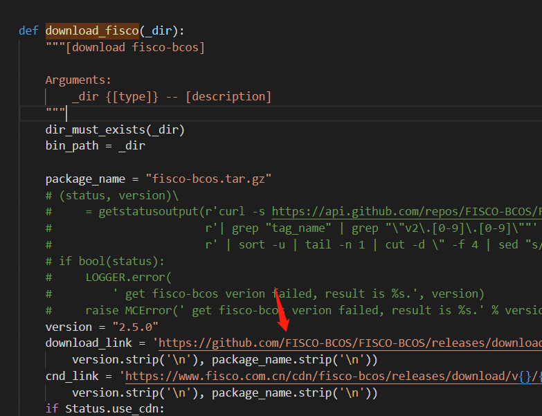
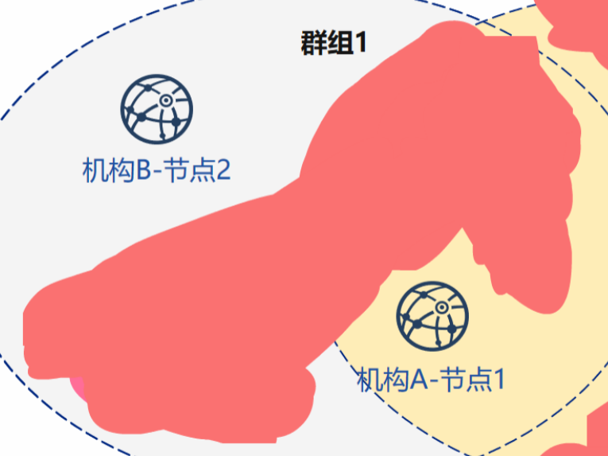
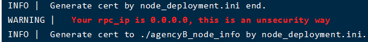

# 多机部署-单群组双机构双节点组网模式实战

作者：蒲沧龙(肖越)｜上海对外经贸大学区块链与应用研究中心成员

## 0.需求分析

有两台服务器，那么每台机子下一个机构生成一个节点，两个连一块，即：双机构双节点单群组。

## 1.下载安装运维部署工具

> *这里假设机子上什么都没有，因为使用源码编译客户端的用户不用最后一步*

下载

``` bash
cd ~/ && git clone https://github.com/FISCO-BCOS/generator.git
```

安装(此操作要求用户具有sudo权限)
``` bash
cd ~/generator && bash ./scripts/install.sh
```

检查是否安装成功，若成功，输出 usage: generator xxx

``` bash
./generator -h
```

获取节点二进制
拉取最新fisco-bcos二进制文件到meta中

```bash
./generator --download_fisco ./meta
```

检查二进制版本

若成功，输出 FISCO-BCOS Version : x.x.x-x

```bash
./meta/fisco-bcos -v
```

这里遇到的问题是，二进制文件拉取贼慢。
然后我再本机把generator克隆下来，发现是:



工具类的download_fisco函数这里卡主了。没有cdn的朋友可以vim修改下这个url为：

```bash
fisco官方cdn：
https://www.fisco.com.cn/cdn/fisco-bcos/releases/download/
or直接下载：
https://xiaoyue-blog.oss-cn-hangzhou.aliyuncs.com/fisco-bcos.tar.gz
```

这是俺的OSS，开放使用师傅们轻点敲啊。

一秒不到就下完了。然后这个就是装好了：


---

## 2.联盟链初始化

来康康拓扑图：



因为官方教程是在一个机子上配的，是节点1,2。分起来的话实际上没有1,2之分的。因为是在两台机子上，也不会存在端口冲突的情况。如果端口没有打开可能会报错，这边建议把两台机子添加白名单就行了。详情可参考：[FSICO BCOS多机部署之端口开放](https://blog.csdn.net/xiaoyue2019/article/details/107401334)

|机构|节点|rpc端口|channel端口|p2p端口|
|---|---|---|---|---|
|机构A|节点1|8545|20200|30300|
|机构B|节点2|8545|20200|30300|

### 2.1 机构初始化

初始化机构AB

```bash
cd ~/generator
cp -r ~/generator ~/generator-A
cp -r ~/generator ~/generator-B
```

### 2.2 链初始化

生成链证书ca.crt&链私钥ca.key

```bash
./generator --generate_chain_certificate ./dir_chain_ca
```

链证书和链私钥在`./dir_chain_ca`

---

## 3.构建群组

### 3.1 初始化机构A

生成机构A的证书

```bash
./generator --generate_agency_certificate ./dir_agency_ca ./dir_chain_ca agencyA
```

证书授权机构将机构证书发送给机构，机构放到meta目录下面

```bash
cp ./dir_agency_ca/agencyA/* ~/generator-A/meta/
```

### 3.2 初始化机构B

生成机构B的证书

```bash
./generator --generate_agency_certificate ./dir_agency_ca ./dir_chain_ca agencyB
```

证书授权机构将机构证书发送给机构，机构放到meta目录下面

```bash
cp ./dir_agency_ca/agencyB/* ~/generator-B/meta/
```

### 3.3 机构A修改配置文件

进入机构A修改node_deployment.ini节点配置文件、生成节点配置文件夹。

```bash
cd ~/generator-A
cat > ./conf/node_deployment.ini<<EOF
[group]
group_id=1
[node0]
; host ip for the communication among peers.
; Please use your ssh login ip.
p2p_ip=you_ip
; listen ip for the communication between sdk clients.
; This ip is the same as p2p_ip for physical host.
; But for virtual host e.g. vps servers, it is usually different from p2p_ip.
; You can check accessible addresses of your network card.
; Please seehttps://tecadmin.net/check-ip-address-ubuntu-18-04-desktop/
; for more instructions.
rpc_ip=0.0.0.0
channel_ip=0.0.0.0
p2p_listen_port=30300
channel_listen_port=20200
jsonrpc_listen_port=8545
EOF
```

### 3.4 机构B修改配置文件

进入机构B修改node_deployment.ini节点配置文件、生成节点配置文件夹。

```bash
cd ~/generator-B
cat > ./conf/node_deployment.ini<<EOF
[group]
group_id=1
[node0]
; host ip for the communication among peers.
; Please use your ssh login ip.
p2p_ip=you_ip_B
; listen ip for the communication between sdk clients.
; This ip is the same as p2p_ip for physical host.
; But for virtual host e.g. vps servers, it is usually different from p2p_ip.
; You can check accessible addresses of your network card.
; Please seehttps://tecadmin.net/check-ip-address-ubuntu-18-04-desktop/
; for more instructions.
rpc_ip=0.0.0.0
channel_ip=0.0.0.0
p2p_listen_port=30300
channel_listen_port=20200
jsonrpc_listen_port=8545
EOF
```

### 3.5 机构A生成并发送节点信息

生成机构A节点证书和P2P连接地址文件，根据上面修改的node_depoyment.ini生成

```bash
cd ~/generator-A
./generator --generate_all_certificates ./agencyA_node_info
```

机构生成节点时需要指定其他节点的P2P连接地址，这里A机构把P2P连接机构发送给了B机构

```bash
cp ./agencyA_node_info/peers.txt ~/generator-B/meta/peersA.txt
```

### 3.6 机构B生成并发送节点信息

生成机构A节点证书和P2P连接地址文件，根据上面修改的node_depoyment.ini生成

```bash
cd ~/generator-B
./generator --generate_all_certificates ./agencyB_node_info
```

因为需要生成创世区块，规定此机构必须要节点证书。B机构除了要发送P2P连接地址之外还要发送节点证书。

```bash
cp ./agencyB_node_info/cert*.crt ~/generator-A/meta/
cp ./agencyB_node_info/peers.txt ~/generator-A/meta/peersB.txt
```

### 3.7 机构A生成群组1创世区块

来生成创世区块。这里实际可以通过协商由那个机构生成，不一定是A。

```bash
cd ~/generator-A
cat > ./conf/group_genesis.ini<< EOF
[group]
group_id=1
;i am xiaoyue
;my blog-s cnmf.net.cn
;yea i love you~
[nodes]
node0=you_ip:30300
node1=you_ip_b:30300
EOF
./generator --create_group_genesis ./group
```

把group1的创世区块发送给B机构

```bash
cp ./group/group.1.genesis ~/generator-B/meta
```

## 3.8 机构A生成所属节点

生成机构A的节点

```bash
cd ~/generator-A
./generator --build_install_package ./meta/peersB.txt ./nodeA
```

启动节点

```bash
bash ./nodeA/start_all.sh
```

上面有两个需要注意的地方：
1. 在生产节点配置文件和创世区块配置文件时端口一致是没问题的，因为我不在一台机子上做测试，不会存在端口冲突的情况。但这样在复制B机构到B机子上的时候跑不起来就很尴尬。
2. rpc的ip默认是127.0.0.1，如果硬要开启的话会报警告：



如果非要开启rpc测试的话，也可以参照上面说的开启防火墙ip白名单。

---

## 4.B机构转移并生成节点

压缩：`tar cvf B.tar generator-B`
解压：`tar xvf B.tar`
然后上传下载操作

### 4.1 生成&启动节点：

```bash
./generator --build_install_package ./meta/peersA.txt ./nodeB
```

机构B启动节点：

```bash
bash ./nodeB/start_all.sh
```

---

### Z.查看共识状态

```bash
tail -f ./node*/node*/log/log*  | grep +++
```

正确回显如下：


这里还有一个问题。就是上面说的对自己自信不进行测试，导致ip输错了导致共识失败，这时候是没有回显的。把后面的正则删掉就行了。能看到日志报错，通过报错去找不能共识的原因。

---

你可以从以下方式联系到我：

**Blog:** [https://cnmf.net.cn/](https://cnmf.net.cn/)

**GitHub:** [https://github.com/xiaoyue2019](https://github.com/xiaoyue2019)

**CSDN:** [https://blog.csdn.net/xiaoyue2019](https://blog.csdn.net/xiaoyue2019)

欢迎来俺们社区吹水鸭：


*参考：<https://fisco-bcos-documentation.readthedocs.io/zh_CN/latest/docs/enterprise_tools/tutorial_detail_operation.html>*
