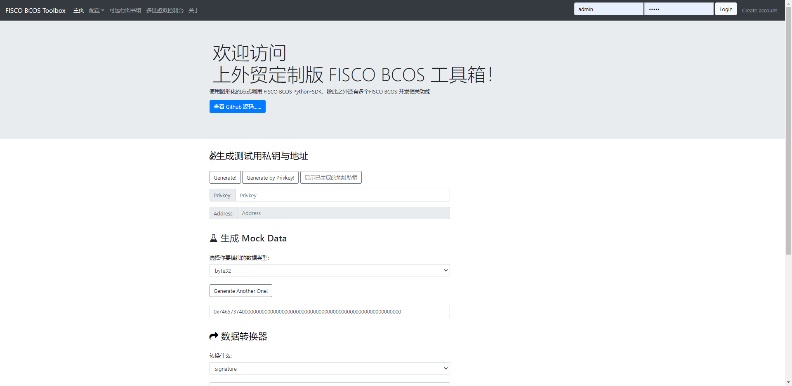
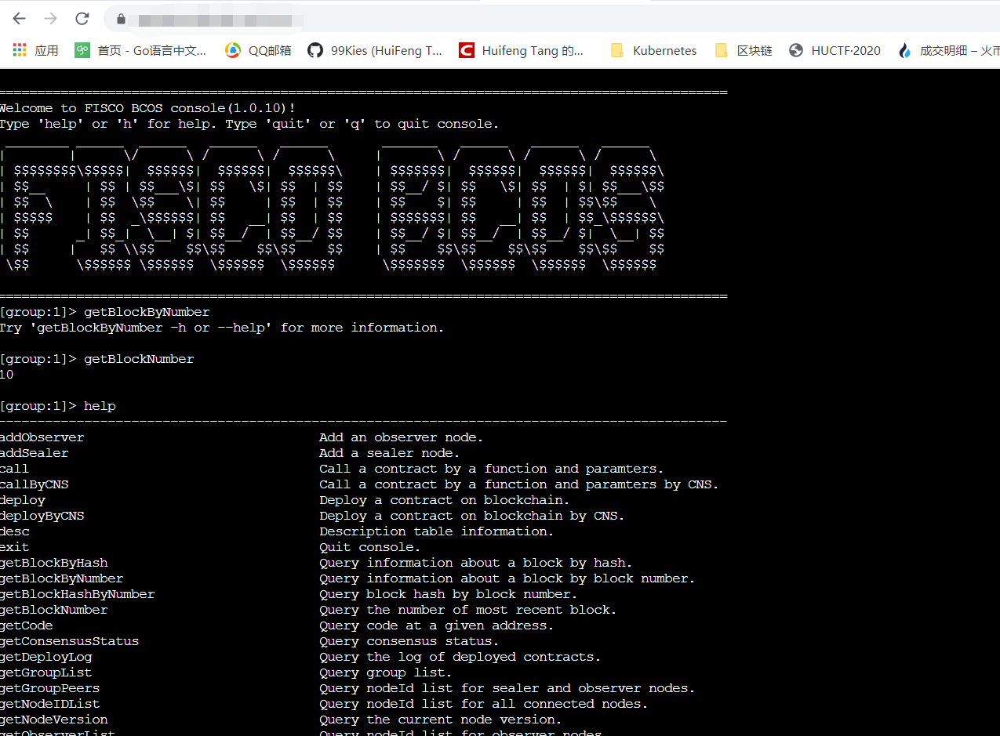

# 开发者如何善用小工具提速应用开发效率

作者：上海对外经贸大学区块链技术与应用研究中心

## 为什么做区块链开发工具箱？

我们（下文“”我们“均指上海对外经贸大学区块链技术与应用研究中心）注意到，区块链开发者在区块链学习和开发过程中，往往面临以下四个痛点：

- 开发工具繁杂：目前区块链相关的各类开发工具错综复杂，需要占用开发者较多时间熟悉、学习各类工具，影响开发效率。
- IDE功能简单：智能合约开发/区块链开发IDE尚处于早期阶段，功能相对简单，对开发者不够友好。
- 系统学习资料缺乏：当前可供开发者学习的各种资料良莠不齐，且比较零散，缺乏系统性。
- 学习成本高：现阶段智能合约开发/区块链开发IDE更多是面向有一定基础的专业人士，对初学者有一定学习成本。

因此我们有了这样的想法：能不能做一个集成性强、方便快捷的区块链开发工具箱，来解决区块链开发者在学习和开发过程遇到的这些常见问题?

## 区块链开发工具箱实现思路

相对于传统计算机领域的开发工具，区块链开发存在开发工具多、杂、许多功能需要使用特定的工具或者需要自己手动开发工具等问题。因此，我们研发的区块链开发工具箱共由4个部分组成——1个工具箱+2个子平台+1个CA系统，通过该工具箱集成多种功能，解决开发过程中经常遇到的问题，最终目标是实现使用一个主流编译器（如Remix）+一个开发工具箱即能完成整个区块链应用开发流程。

- 1个工具箱：指区块链开发工具箱，该工具箱可配合主流IDE使用，为开发者提供一些在开发过程中经常会用到的服务，如模拟地址生成、数据转换、区块链配置文件智能生成等。
- 2个子平台：分别为多用户可运行图书馆、多链虚拟控制台。多用户可运行图书馆可以为开发者提供在线学习智能合约、联盟链、共识算法等区块链文章与书籍等，同时也支持开发者自行生产内容；多链虚拟控制台则可以帮助开发者通过Web访问各主流区块链的虚拟控制台。
- 1个CA系统：基于WeIdentity 的 CA 系统，负责用户账户管理、用户行为记录与奖励等。

*WeIdentity是一套基于区块链的分布式多中心的技术解决方案，提供分布式实体身份标识及管理、可信数据交换协议等一系列的基础层与应用接口，可实现实体对象（人或物）数据的安全授权与交换，由微众银行自主研发并完全开源。

github地址：<https://github.com/WeBankFinTech/WeIdentity>

技术文档：<https://fintech.webank.com/developer/docs/weidentity/>

## 区块链开发工具箱主要功能

一起来看一下区块链开发工具箱各组成部分的主要功能。

- **开发者工具箱**

该工具箱力求覆盖整个区块链开发环节，缩短开发周期，提升开发者效率与舒适度。

以FISCO BCOS开发全环节举例：

**-启链阶段**

区块链应用开发时通常需要先启动一条测试链，此时开发者可使用工具箱＞配置文件智能生成工具，快速生成区块链网络的配置文件。

**-区块链网络情况监测**

启动测试链后，可通过工具箱＞区块链网络情况监测，一键监测区块链网络是否正常运行。

**-合约案例库**

编写智能合约前，可使用工具箱＞合约案例库，查找是否有其它合约已实现相同或者相似的功能，避免重复造轮子。

**-地址生成、模拟数据生成、数据转换、签名验证**

合约开发过程中，通过工具箱提供的各类生成、转换、验证功能进行开发调试。

**-性能测试工具**

开发完成后，通过工具箱＞性能测试工具，测试代码性能并进行调优。

目前工具箱已实现或规划实现如下功能：地址生成、模拟数据生成、数据转换、签名验证、配置文件智能生成、区块链网络情况监测、合约案例库、区块链网络管理、性能测试工具等。

- **多用户可运行图书馆**

多用户可运行图书馆以JupyterHub为开发基础，集成多种语言内核，如Python、Java等，可支持Ipynb格式图书的上传、阅读或运行书中代码。

它可以帮助用户快速上手区块链开发。例如，某用户想在该图书馆中进行学习，他可以在图书馆公共知识库中找到自己感兴趣的内容，如《联盟链技术入门指南》，并通过文字+可运行代码的方式进行学习和操作；同时也可以将自己的学习笔记提交到公共知识库，反哺社区。

对团队而言，团队可共同运维一个内部共享的图书馆，所有成员可以在该图书馆上共享书籍、文章等，激活群体学习效能，解决孤立学习效率低下、新人培训成本高等问题。

- **多链虚拟控制台**

区块链开发者在初学阶段，并不一定需要自己去建一条链，因为目前能支持快速建链的区块链底层并不多，大部分底层平台建链还是一个比较繁琐的操作。

多链虚拟控制台可以提供这样的功能：开发者可以和他人共同使用一条测试链，通过web访问虚拟控制台并进行开发，当有多个开发者需要通过控制台在同一条测试链进行开发时，只需访问在线多链虚拟控制台即可。

目前已支持通过web访问FISCO BCOS控制台。

- **CA系统**

区块链开发工具箱CA系统基于区块链技术，对用户在多用户可运行图书馆的学习行为、学分奖励、电子证书等进行记录和管理。通过该系统，用户各项学习数据一目了然，结合电子政府和学分奖励系统，可以激励用户更积极地进行学习，反哺社区。

目前已实现或规划实现如下功能：基于WeIdentity的DiD数字身份、用户学习行为记录、学分奖励系统、基于区块链的电子证书等。

这套区块链开发工具箱已完全开源，并贡献给FISCO BCOS开源社区，目前项目正在持续完善中，我们也非常期待社区各路开发朋友能一起拥抱开源，携手共建项目，更多详情欢迎通过项目github主页了解：<https://github.com/SUIBE-Blockchain/FISCO_BCOS_Toolbox/>

## 嘉宾Q&A

**Q： 在做底层技术选型时，您主要考虑哪些因素？**

**A：** 一方面，我觉得需要考虑底层技术主导公司的界限感。区块链技术和其它传统技术有一个很大不同是：区块链生态建设不仅要靠主导公司努力，更要靠各方参与，如果底层技术主导公司没有设定好界限，什么都做了，其它人只能承担用户的角色，其实是有悖区块链精神的。

另一方面，底层技术需要有足够的兼容性，因为大家不会把自己绑死在某个底层平台上，所以底层平台所采用的的技术最好不被该平台所独占，例如Solidity智能合约目前很多链都在用，选择区块链底层技术框架的时候，是否支持Solidity就是很重要的参考指标。

抛开上述所说的选型要考虑的两点，FISCO BCOS最大的优势在于战略方向正确。很多细节问题可以持续优化完善，但战略方向是否正确，是这个技术底层平台是否有发展前景的重点。

**Q：对于国内开源的发展，您怎么看？**

**A：** 在这次第四届中国区块链开发大赛的参赛过程中，我们在作品准备过程中得到了FISCO BCOS开源社区很好的支持和帮助，这其实就是开源精神的一种体现。目前国内开源发展尚处于起步阶段，给开发者们带来了机遇与红利，但还有很多有意思的开源玩法有待尝试，希望开源爱好者们能一起加油，促进国内开源生态与开源精神的发展。
