# Ansible for FISCO BCOS + Webase-deploy 高效搭建企业级生产环境联盟链
作者：无缺｜深圳市缦星链盟软件工程责任有限公司西安研发中心

## 1 背景介绍
工欲善其事必先利其器，神器在手，天下我有！

### 1.1 Ansible for FISCO BCOS
Ansible for FISCO BCOS提供了自动化生成企业级配置文件的 ansible-playbook。2 群组 3 机构 6 节点的环境，可以在 30 秒内（除下载时间）生成配置，极大简化了部署难度，避免了手工配置容易发生的错误。

[Github 访问地址](https://github.com/newtouch-cloud/ansible-for-fisco-bcos)

[Gitee 社区开发者提供访问地址](https://gitee.com/hailong99/ansible-for-fisco-bcos)

Gitee 社区开发者提供源码下载地址 https://gitee.com/hailong99/ansible-for-fisco-bcos.git

```
git clone https://gitee.com/hailong99/ansible-for-fisco-bcos.git
```

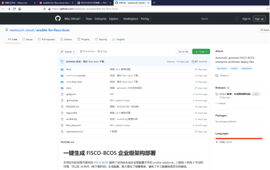

### 1.2 Webase-deploy
一键部署WeBASE可以在 同机 快速搭建WeBASE管理台环境，方便用户快速体验WeBASE管理平台。一键部署搭建：节点（FISCO-BCOS 2.0+）、管理平台（WeBASE-Web）、节点管理子系统（WeBASE-Node-Manager）、节点前置子系统（WeBASE-Front）、签名服务（WeBASE-Sign）。其中，节点的搭建是可选的，可以通过配置来选择使用已有链或者搭建新链。

[Github 访问地址](https://github.com/WeBankFinTech/WeBASE)

一键下载命令
```
wget https://github.com/WeBankFinTech/WeBASELargeFiles/releases/download/v1.4.2/webase-deploy.zip
```
Gitee 社区开发者提供源码下载地址 https://gitee.com/hailong99/WeBASE.git

```
git clone https://gitee.com/hailong99/WeBASE.git
```

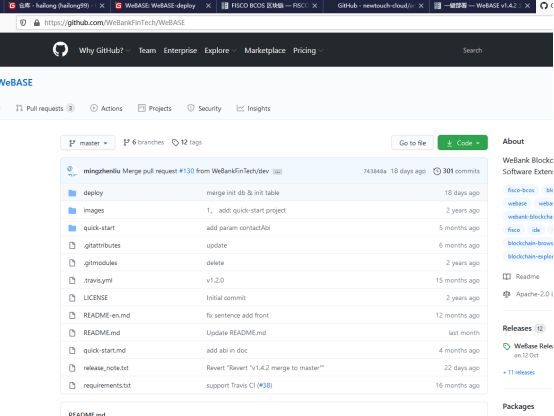


## 2 实验架构设计
### 2.1 网络拓扑设计


## 3 环境准备
### 3.1 硬件准备
服务器A：
IP  192.168.9.11

系统 Centos8.3 

服务器B：
IP  192.168.9.207

系统 Centos7.6

两台服务器在同一局域网中，网络互相访问正常。

### 3.2 软件准备
两台服务器都安装基本组件如：Openssl、Java8、Python3、Git、Vim等。

服务器A：
数据库 mysql

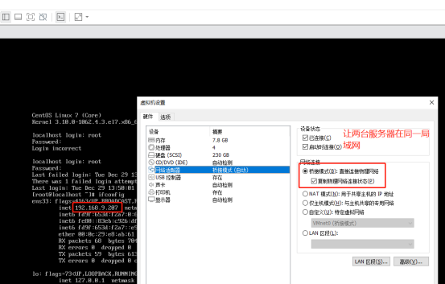


## 4 使用Ansible工具搭链
### 4.1 下载Ansible 

```
git clone https://gitee.com/hailong99/ansible-for-fisco-bcos.git
```


### 4.2 安装Ansible 
按照GitHub访问地址中的安装说明进行

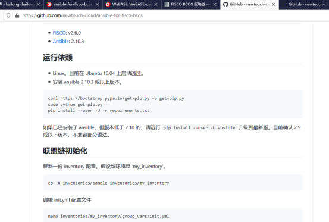

```
python3 get-pip.py
```

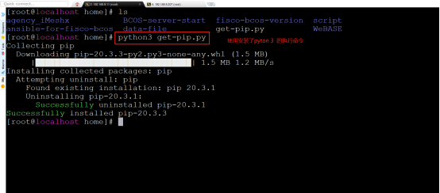

```
cd ansible-for-fisco-bcos/
pip install --user -U -r requirements.txt
```

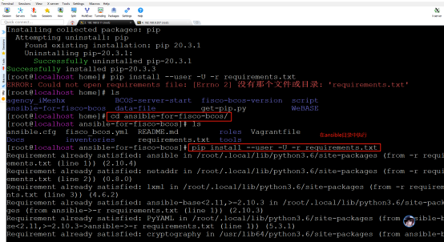

```
pip install --user -U ansible
```

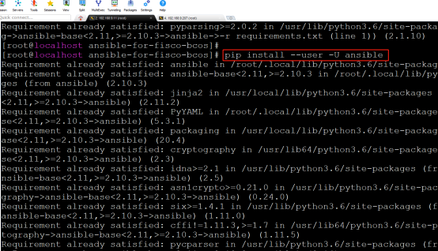

### 4.3 联盟链初始化
复制一份 inventory 配置。假设新环境是 'my_inventory'。
```
cp -R inventories/sample inventories/my_inventory
```

### 4.4 编辑 init.yml 配置文件
```
nano inventories/my_inventory/group_vars/init.yml
或
vim inventories/my_inventory/group_vars/init.yml
```
经过实地实验路径是：inventories/my_inventory/group_vars/all/init.yml


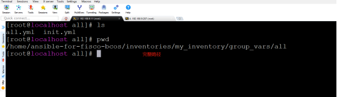


根据业务实际需求编辑链属性各项，如：二进制文件版本、是否生成控制台、是否生成SDK。文件中的注释写的很清楚，结合业务理解。


根据业务实际需求编辑链盟链属性各项，如：机构、节点、群组。文件中的注释写的很清楚，结合业务理解。


### 4.5 生成架构图


```
ansible-playbook -i inventories/my_inventory/hosts.ini fisco_bcos.yml -t archimate
```

机构与群组的关系:

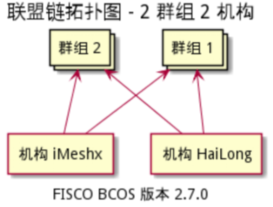

机构iMeshx 生成的配置图:

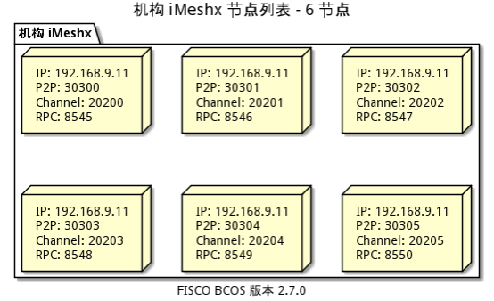

机构HaiLong 生成的配置图:

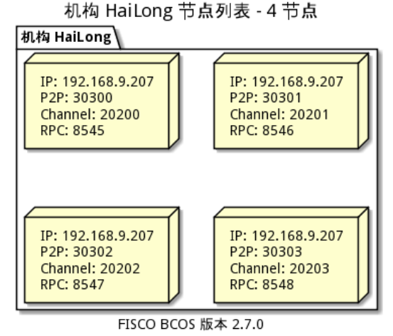

### 4.6 生成联盟链底层文件

``` 
cd /home/ansible-for-fisco-bcos/
ansible-playbook -i inventories/my_inventory/hosts.ini fisco_bcos.yml
```


生成的配置信息 

注意命令执行完成以后node_list.yml文件会显示机构和群组尚未初始化，需要再次执行命令，就会正常显示群组和机构已初始化。


按照配置信息已经生成了联盟链底层文件


### 4.7 在生产环境服务器运行联盟链底层服务

#### 4.7.1 先打包整体机构文件

```
cd /home/ansible-for-fisco-bcos/inventories/my_inventory/deploy
tar -zcf agency_HaiLong.tar.gz agency_HaiLong/
tar -zcf agency_iMeshx.tar.gz agency_iMeshx/
```

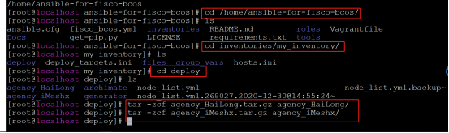


#### 4.7.2 把打包的文件上传到对应的联盟链生产服务器上
```
cp -r agency_iMeshx.tar.gz /home/
```


192.168.9.207 服务器直接用ssh 终端工具上传并且移动到规划的路径下。


#### 4.7.3 在生产服务器解压被打包的机构文件
```
tar -xf agency_iMeshx.tar.gz
```

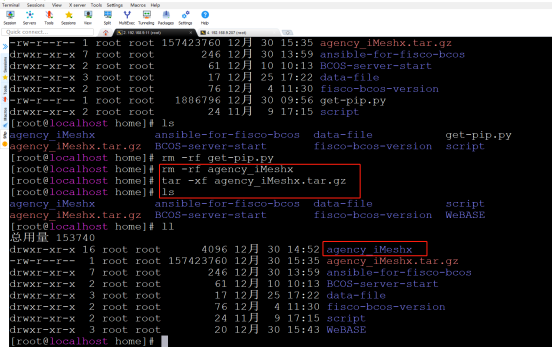


#### 4.7.4 启动节点
```
cd /home/agency_iMeshx/fisco_deploy_agency_iMeshx
./start_all.sh
```

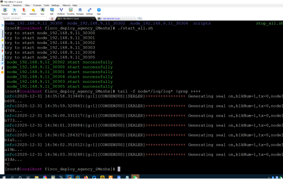

192.168.9.11 服务器上查看共识
```
cd /home/agency_iMeshx/fisco_deploy_agency_iMeshx
tail -f node*/log/log* |grep ++++
```


192.168.9.207 服务器上启动节点查看共识

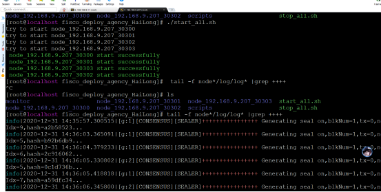

至此，我们两台服务器使用Ansible for FISCO BCOS神器已经完成链的搭建，其中工具自动完成了很多文件的生成、复制的命令，非常简洁高效 ^_^ !

## 5 使用Webase-deploy工具搭建Webase
已经有联盟链底层服务了，需要用Webase 来进行管理
### 5.1 安装webase-deploy

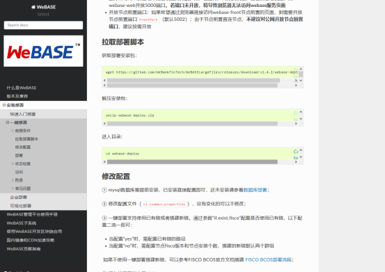

#### 5.1.1 下载webase-deploy
```
wget https://github.com/WeBankFinTech/WeBASELargeFiles/releases/download/v1.4.2/webase-deploy.zip
```


#### 5.1.2 解压webase-deploy
```
unzip webase-deploy.zip
```

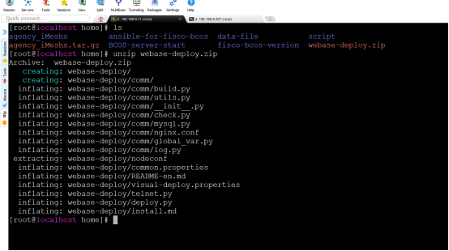

### 5.2 配置webase

#### 5.2.1 配置各子系统版本信息和数据库信息
编辑配置文件：/home/webase-deploy/common.properties
按照官方教程以及配置文件提示分别先配置子系统版本信息和数据库信息。


#### 5.2.2 配置各子系统端口号、加密方式、是否已经存在链、证书路径、链程序版本

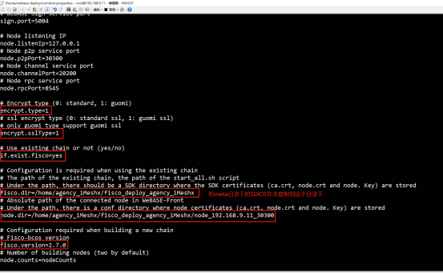

#### 5.2.3 文件调整
(1) 把/home/agency_iMeshx/script/gm拷贝到/home/agency_iMeshx/meta/sdk

(2) 把/home/agency_iMeshx/meta/sdk拷贝到节点目录/home/agency_iMeshx/fisco_deploy_agency_iMeshx下

(3) 把meta/sdk/下的3个证书拷贝到webase-front/conf下 (需要先执行安装命令下载了webase-front文件以后才能拷贝成功)

#### 5.2.4 配置Nginx
根据规划配置nginx的代理ip地址与端口号


#### 5.2.5 配置webase-front （需要先执行安装命令下载了webase-front文件以后才能配置）
SDK的ip地址默认是127.0.0.1 需要改为192.168.9.11后保存

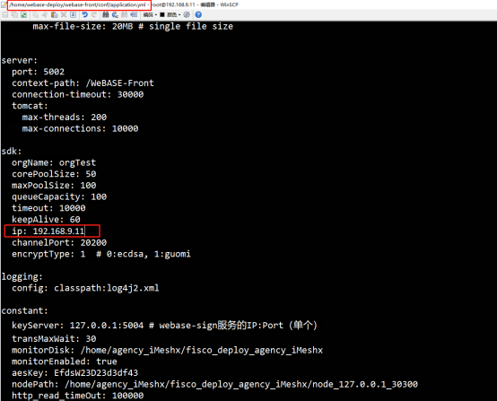

### 5.3 安装部署
#### 5.3.1 执行安装命令

```
cd /home/webase-deploy
python3 deploy.py installAll
```

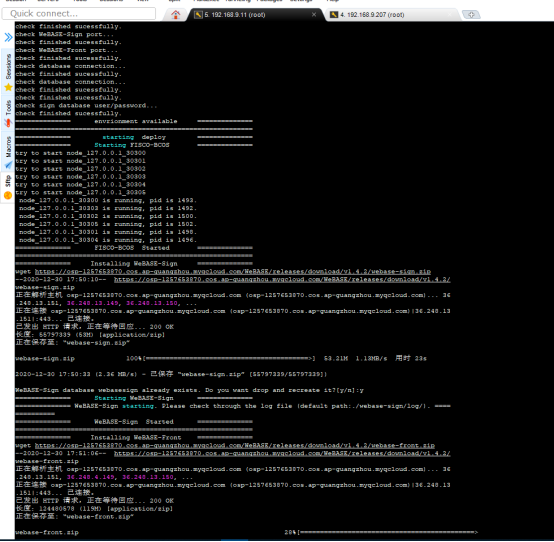

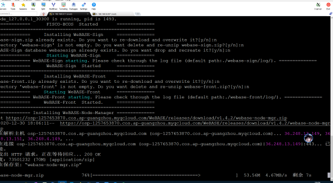

注意：webase-node-mgr的数据库初始化非常重要，初次运行一定要选择 y


发现有错误时根据提示查看log信息。

## 6 功能测试
### 6.1 访问地址：192.168.9.11:5000


初次登录需要更新管理员密码

### 6.2 查看群组信息


### 6.3 查看节点信息共识状态

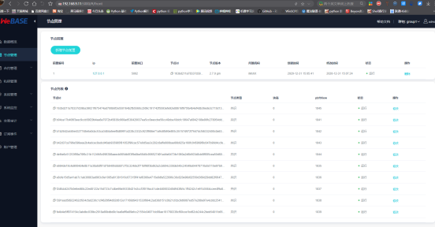

### 6.4 查看系统版本信息


### 6.5 添加测试用户
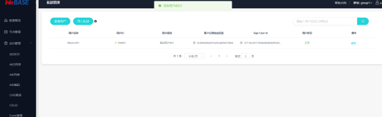

### 6.6 合约编译正常
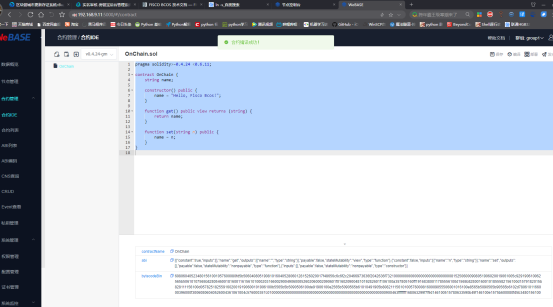

### 6.7 合约部署正常


### 6.8 交易正常


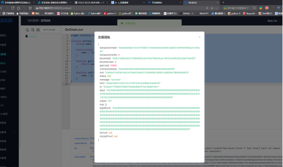

### 6.9 简体中文上链正常
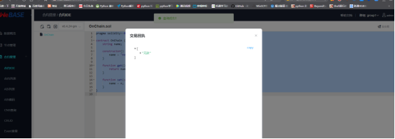


### 6.10 首页信息统计正常


### 6.11 节点监控正常


### 6.12 群组2节点信息正常
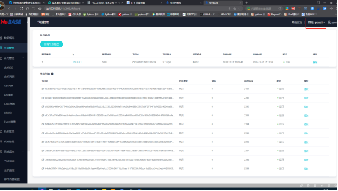

### 6.13 群组2 用户添加正常
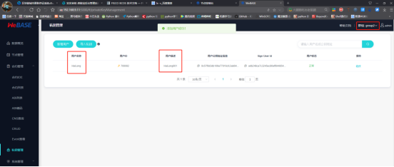

### 6.14 群组2 数据上链、查询正常


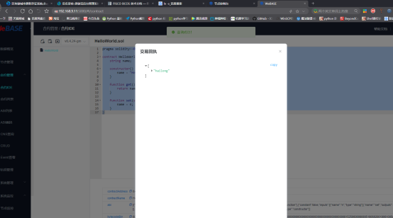

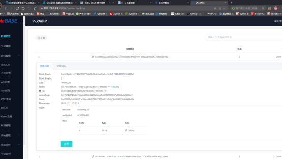

### 6.15 控制台使用正常


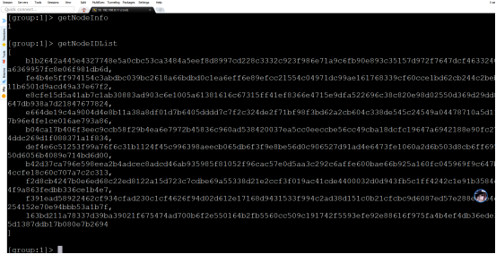


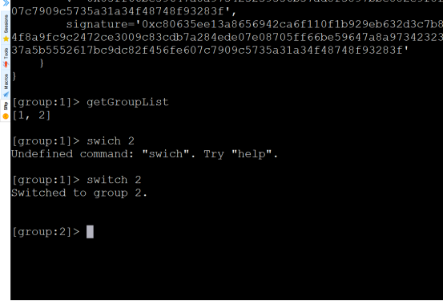

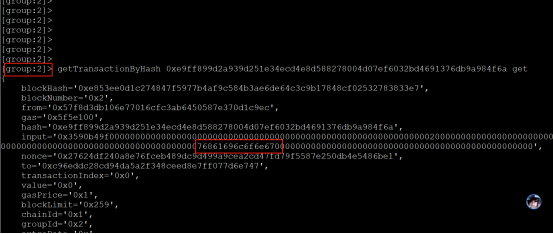

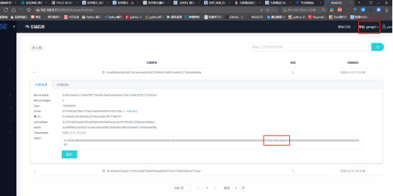

至此我们完成了使用webase-deploy 对联盟链的管理与功能测试，大功告成！^_^ 。


## 7 开发感悟

#### 天之道，损有余而补不足，是故虚胜实，不足胜有余！

#### 不积跬步，无以至千里，

#### 不积小流，无以成江海！

#### 假舆马者，非利足也，而致千里，

#### 假舟楫者，非能水也，而绝江河！

#### 君子生非异也，善假于物也！


