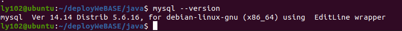
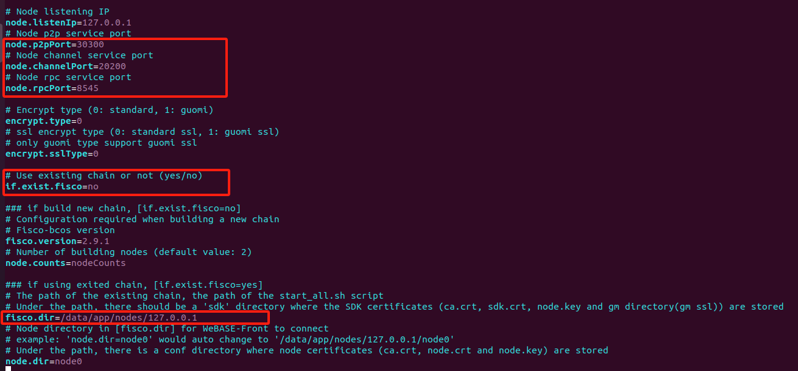

# 一键部署WeBASE管理平台

作者：王存奇｜山东商务职业学院

## 一：前言

WeBASE（WeBank Blockchain Application Software Extension） 是在区块链应用和FISCO BCOS节点之间搭建的一套通用组件。

搭建WeBASE管理平台包括节点（FISCO-BCOS 2.0+）、管理平台（WeBASE-Web）、节点管理子系统（WeBASE-Node-Manager）、节点前置子系统（WeBASE-Front）、签名服务（WeBASE-Sign）。其中，节点的搭建是可选的，可以通过配置来选择使用已有链或者搭建新链。

## 二：环境说明

### 1. 所需工具

|  工具   | 版本               |
| :-----: | ------------------ |
|  Java   | Oracle JDK 8 至 14 |
|  MySQL  | MySQL-5.6及以上    |
| Python  | Python3.6及以上    |
| PyMySQL |                    |

### 2. 当前系统


## 三：下载工具

为了便于管理我们先创建一个deployWeBASE文件夹，并cd进入，在deployWeBASE文件夹下进行操作。


### 1. 安装Oracle JDK(不能是Open JDK)

#### ①. 创建管理java的文件夹

安装Oracle Java 8至13的版本，将下载的jdk放在java目录下

我这里下载的是[jdk-13.0.2_linux-x64_bin.tar.gz](https://www.oracle.com/java/technologies/javase/jdk13-archive-downloads.html "下载Oraclejdk")。


#### ②. 解压安装包

```linux
tar -zxvf jdk-13.0.2_linux-x64_bin.tar.gz
```


#### ③. 配置java home环境

修改 ~/.bashrc 配置文件

```linux
vim ~/.bashrc
```

打开以后将下面三句输入到文件里面并保存退出

```
export JAVA_HOME=/home/ly102/deployWeBASE/java/jdk-13.0.2
export PATH=$JAVA_HOME/bin:$PATH
export CLASSPATH=.:$JAVA_HOME/lib/dt.jar:$JAVA_HOME/lib/tools.jar
```

#### ④. 刷新配置

```linux
source ~/.bash_profile
```

#### ⑤. 验证是否配置成功

```linux
java -version
```


### 2. 安装mysql5.6

```linux
sudo apt-get install software-properties-common
sudo add-apt-repository 'deb http://archive.ubuntu.com/ubuntu trusty universe'
sudo apt-get update
sudo apt install mysql-server-5.6
sudo apt install mysql-client-5.6
sudo systemctl start mysql
sudo systemctl enable mysql
```

到第四步会有问题，可以借鉴这篇文章解决

[ubantu安装mysql 5.6 依赖问题解决_nvidia-docker 依赖于 sysv-rc (&gt;= 2.88dsf-24) | file-r-CSDN博客](https://blog.csdn.net/qq_33388707/article/details/126540762)

验证

```linux
mysql --version
```



### 3. 安装python3

```linux
// 添加仓库，回车继续
sudo add-apt-repository ppa:deadsnakes/ppa
// 安装python
sudo apt-get install -y python3.6
sudo apt-get install -y python3-pip
```

验证

```linux
python3 --version
```


### 4. 安装PyMySQL

Python3.6及以上版本，需安装PyMySQL依赖包

```linux
sudo pip3 install PyMySQL
```


至此我们所需的工具环境就准备好了

## 四：搭建WeBASE管理平台

### 1. 创建管理WeBASE管理平台的文件夹

```linux
mkdir  webase
```

### 2. 进入到WeBASE目录下，获取下载安装包

```linux
 cd webase/ && wget https://osp-1257653870.cos.ap-guangzhou.myqcloud.com/WeBASE/releases/download/v1.5.5/webase-deploy.zip
```

### 3. 解压安装包并进入到解压后的目录下

```linux
unzip webase-deploy.zip && cd webase-deploy
```

### 4. 修改配置

```linux
vim common.properties
```

将这两处地方修改成自己的数据库用户和密码。


我这里采用的是默认搭建的链，如果想要使用已有链进行部署，则需要修改配置文件中的

if.exist.fisco将no改为yes

fisco.dir修改成自己的节点路径

修改node.p2pPort、node.channelPort、node.rpcPort三个端口号为节点对应的端口号



### 5. 部署并启动

```linux
python3 deploy.py installAll
```


### 6. 访问


默认的账号为admin，默认密码为Abcd1234

同时也可以访问WeBASE-Front前置平台