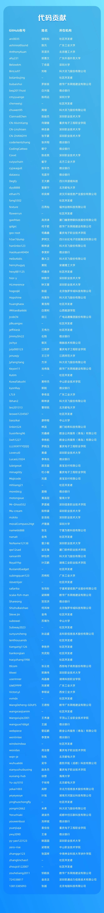
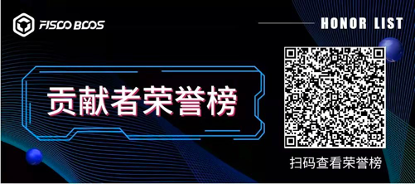

## 2. 贡献者

-----
**2023年度 | FISCO BCOS贡献者榜单**

作者：小助手

2023年，世界风云变幻，科技日新月异。FISCO BCOS秉承对区块链技术的信仰，汇聚超过5000家企业机构、10万余名个人成员共建共治共享，打造更加活跃更加繁荣的开源联盟链生态圈。

过去一年，一大批开源贡献者加入我们，从代码、工具、方案和布道多个方向支撑FISCO BCOS开源发展。百余位小伙伴为FISCO BCOS贡献代码，为社区带来了更健壮、更强大的FISCO BCOS；十余个团队为开源社区贡献工具组件和解决方案，进一步丰富开源生态组件和应用案例；六十多位伙伴成为FISCO BCOS的“自来水”，自发输出技术解读、操作实践和应用案例，以社区布道者身份推广FISCO BCOS。

我们整理了2023年FISCO BCOS贡献者荣誉榜，感谢大家的热情参与和积极贡献！

向上生长，向下扎根。来自社区的力量是支撑FISCO BCOS技术领先和生态繁荣的坚实底座。我们相信，一个更有活力、更加繁荣的区块链行业正在到来。期待更多小伙伴加入我们，共建区块链美好未来。

以下名单排名不分先后，如有错漏，敬请联系小助手【FISCOBCOS010】完善。

### 代码贡献

代码贡献是指围绕FISCO BCOS项目，以及社区生态项目代码仓库所作的贡献，贡献形式包括但不限于提交PR修改源代码、贡献新代码、共建技术文档等。

### 工具贡献
在FISCO BCOS基础之上，社区开发者不断探索，开发出多种实用的组件、工具，便捷开发流程的同时也拓展了平台功能。目前，这些工具已全部开源并贡献给社区开发者使用，极大降低了应用开发的门槛和成本。

**项目名称：WeCross-BCOS3-Stub**

贡献方：科大讯飞股份有限公司、微众银行

核心参与者：詹大卫、方洋、韩林波、郭锐

项目介绍：

WeCross-BCOS3-Stub是WeCross用于适配FISCO BCOS v3.0及以上版本的插件，成功实现了FISCO BCOS v3.0及以上版本的跨链适配。
https://github.com/WeBankBlockchain/WeCross-BCOS3-Stub

**项目名称：SmartDev-Contract 智能合约库组件**

贡献方：宁夏为教科技有限公司、广东工业大学、厦门哈希科技有限公司、深圳职业技术大学、江西师范大学、北京伽罗华域科技有限公司、京北方信息技术股份有限公司、重庆电子工程职业学院、深圳职业技术大学、深圳信息职业技术学院、湖南科技职业学院。

核心参与者：张生、陈汛、李奇龙、金伟、林滨、张宇豪、王江宇、刘武阳、何鸿坤、高野、向键雄、杜小敏、袁佳佳、彭添淞、罗嘉城、肖晶雄。

项目介绍：

为了让更多开发者参与到智能合约库组件优化，社区启动了“Task挑战赛”活动。2023年第1、2季活动分别征集了“供应链金融应收款保理融资”、“历史块高查询”、“类型转换合约”、“时间锁操作”、“多方投票”、“区块链资金透明监管与投票解决方案”、“打怪升级高达游戏”、“共享单车案例”、“给合约添加代码注释”、“公共领域的创新解决方”“电子病历案例”“囚徒困境”等合约。
https://github.com/WeBankBlockchain/SmartDev-Contract

### 方案贡献
在2023深圳国际金融科技大赛等众多区块链权威赛事中，涌现不少基于FISCO BCOS的优秀参赛方案。本着回馈社区的开源精神，参赛者将这些方案贡献出来，为社区用户提供区块链学习了有益参考。

**方案名称：AI4C——面向AIGC创作的文化数字产品运营平台**

核心参与者：于祯奇、胡鑫、孙俨、杨国铭 

目前，AIGC文化创作面临海量素材难存查、链下推理不可信、产品版权难保护、利益分配不透明等诸多难题。为解决以上问题，团队构建面向文化数字产品AIGC创作的版权运营平台。平台集成可信版权标识等6大关键功能，实现文化数字作品版权全流程服务。开展链上存储检索、链下可信扩展技术研究，设计文化数字产品运营方案。已完成平台与FISCO BCOS区块链的研发部署，并使用可信计算硬件支撑生成式模型的隐私计算与推理加速。
https://github.com/FISCO-BCOS/hackathon/pull/81/files

**方案名称：基于FISCO BCOS的联邦学习平台**

核心参与者：马昊滨、苏柄权

该平台创新性地整合了联邦学习与区块链技术，实现了高效而安全的业务流程。创新提出串行+并行的联邦学习方式，巧妙提升了训练数据的多样性，减轻数据存储的压力，最大程度地保护了隐私安全。系统采用FISCO BCOS多群组部署和Ribbon负载均衡相结合，显著提升了区块链服务的处理效率与吞吐量。利用RocketMQ实现削峰确保了系统的稳定性；同时采用模型文件与文件索引分开存储的方式实现了大数据量文件上链存证的功能。通过公私钥文件实现节点可信认证，为整个系统提供了安全的基石。
https://github.com/FISCO-BCOS/hackathon/pull/87/files

**方案名称：基于区块链的供应链碳足迹一体化系统**

核心参与者：邓淏天、梁浩天、王炜杰、轩浩均、任旭豪

传统供应链厂商通常将碳足迹数据存储在各自的本地数据库中，导致不同供应链厂商之间的数据库数据无法流通，造成了碳足迹数据难以同步的问题。本作品提出“基于区块链的供应链碳足迹一元化系统”。该系统由三个关键技术组成，包括面向区块链的细粒度访问控制技术、链上链下混合存储的体系架构以及高效的链上链下协同机制。该系统实现了各供应链厂商间数据的同步和一致，从而助力企业实现“双碳”目标。
https://github.com/FISCO-BCOS/hackathon/pull/89/files

**方案名称：基于区块链和情感寄托的二手潮玩交易平台**

核心参与者：卢隆基、高韬、伍嘉恒、袁瑶、林佳儿

本项目旨在构建更加可信、高效、安全且富有温度的二手潮玩交易平台，通过情绪寄存和原创确权提升用户体验，利用区块链技术让情感故事永远留存、原创内容受到保护，同时减少交易过程的欺诈和恶意行为，推动二手交易市场的健康发展。本项目的创新点在于让情感产生价值，保护原创作者权益，项目初期在前景广阔的二手交易市场中，聚焦于二手潮玩这个特殊的品类，用故事和商品连结买家和卖家的情感进而产生共鸣：让卖家通过情感赋值将商品卖出更高的价格；同时为最有情感需求的买家，提供情绪消费的场所。
https://github.com/FISCO-BCOS/hackathon/pull/80/files

**方案名称：问链—基于区块链的ESG评级系统**

核心参与者：郑惠文、钟南海、李志远

在可持续发展的背景下，ESG评估成为了企业可持续性的重要指标。然而，当前市场上缺乏统一、透明且高效的ESG评估平台。现有的评估工具往往面临着评分标准不一、数据不透明、易篡改、流程冗余等问题，这不仅影响了评估的公正性，也增加了企业的运营成本。因此，开发基于区块链的ESG评分系统，旨在为企业提供可靠、透明且易于操作的ESG评估解决方案，本系统在成本效率方面具有显著优势，适合各种规模的企业及评估机构、相关监管机构使用。
https://github.com/FISCO-BCOS/hackathon/pull/83/files

**方案名称：碳路—基于区块链的碳资产管理与可信交易方案**

核心参与者：张帆、宋雨、肖轶涛、王青楠、申铜博

本方案针对碳数据采集、接入认证、碳资产交易、碳数据管理流程中存在的痛点，制定项目的解决方案，通过碳排放可信自动采集、多主体低成本接入认证、碳资产高效可信交易、碳数据动态授权管理等技术优势，提供打破碳市场资产交易壁垒、支持多元碳资产交易业务、多市场交易数据融合分析、碳资产交易与管理一体化方案。本项目使用FISCO BCOS v3.0区块链架构，前端使用VUE，后端使用SpringBoot等核心开发工具实现基于区块链的碳资产管理与可信交易一体化平台。
https://github.com/FISCO-BCOS/hackathon/pull/92/files

**方案名称：WeTender—适用于修建“四好农村路”的政府与企业之间的项目招标ESG治理模型**

核心参与者：丁俞嘉、代钰堃、陈炜权、熊语嘉、盛媛

WeTender是一个基于FISCO BCOS底层开源平台搭建的适用于修建“四好农村路”的政府与企业之间的项目招标的区块链数据信息管理平台，充分发挥了区块链技术的不可篡改性、可追溯性以及对智能合约的支持，致力于解决在“四好农村路”建设过程中的信任问题。
https://github.com/FISCO-BCOS/hackathon/pull/86/files

**方案名称：基于FISCO BCOS的匿名投票系统**

核心参与者：陈鸣远、林泽君、叶力涛、鲁宇豪、张诗洁

基于FISCO BCOS区块链平台搭建匿名权重投票系统，充分发挥了区块链技术的不可篡改性、可追溯性以及对智能合约的支持，致力于解决传统投票系统由中心化机构控制、不公开透明、不支持权重投票和隐私性等问题。
https://github.com/FISCO-BCOS/hackathon/pull/91/files

**方案名称：智慧兴农——从触网到触链，“红星苹果”特色农产品持“证”一键溯源**

核心参与者：白琪利、李艺乐、高慧雯、陈国翠、常嘉璇

智慧农业特色农产品溯源系统是集物联网、云计算、数据分析、区块链技术为一体的对农业环境与运输进行感知、分析、预测、控制的物联网平台。区块链是融合了数字、密码学、互联网和计算机编程等技术，通过去中心化和可信的方式，集体维护一个可靠数据库的技术方案。首先依托部署在农业生产现场的各种传感节点实时在线采集监测生长条件等实时数据，通过websocket长连接方式采集数据传输至FISCO BCOS区块链网络云端区块链计算中心，并通过储存加密保证了运行联盟链的数据在硬盘上的安全性与可视性，形成实际农作物从种植到运输全流程追溯，通过AI分析向种植户提供科学的种植指导和赋予农作物“一物一码”，提高农作物质量的真实性，为农作物了提供精准化种植、可视化管理、智能化决策。
https://github.com/FISCO-BCOS/hackathon/pull/90/files

### 布道贡献

除了代码贡献与工具贡献，还有一类贡献者不吝于在各种渠道分享基于FISCO BCOS的开发经验与技术/产业观点，赋予了FISCO BCOS开源社区更强劲、长久的生命力和影响力，鼓励了更多人参与到生态共建中。

布道贡献包括但不限于在各类活动中分享FISCO BCOS相关技术、撰写文章或编制视频解析FISCO BCOS相关技术等。布道渠道不限，如贡献名单有遗漏，欢迎联系小助手告知我们。

### 贡献数据来源说明
本期贡献者名单主要从GitHub中 FISCO BCOS代码仓库，以及FISCO BCOS Toolbox、WeBankBlockchain等社区生态项目的代码仓库中收集，统计时间周期为2023年1月1日-2023年12月31日，如有遗漏、改进建议，可联系小助手【FISCOBCOS010】反馈。

扫码查看季度贡献者榜单

