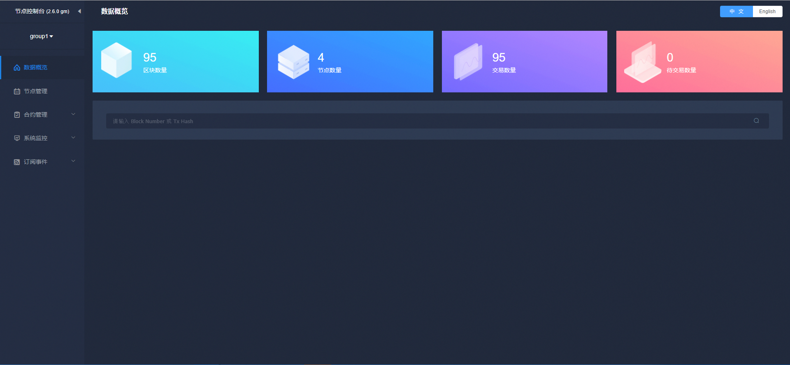

# 图形化的区块链管理工具

标签：``WBC-WeBASE`` ``中间件平台`` ``节点管理`` ``系统监控`` ``系统管理`` 

----
微众银行开源的自研区块链中间件平台——[WeBankBlockchain WeBASE(WeBank Blockchain Application Software Extension, 简称WBC-WeBASE)](https://webasedoc.readthedocs.io/zh_CN/lab/) 是区块链应用和FISCO BCOS节点之间搭建的中间件平台。WBC-WeBASE屏蔽了区块链底层的复杂度，降低区块链使用的门槛，大幅提高区块链应用的开发效率，包含节点前置、节点管理、交易链路，数据导出，Web管理平台等子系统。用户可以根据业务所需，选择子系统进行部署，可以进一步体验丰富交互的体验、可视化智能合约开发环境IDE。

WBC-WeBASE管理平台是由四个WBC-WeBASE子系统组成的一套管理FISCO-BCOS联盟链的工具集。WBC-WeBASE lab版本(lab分支)已适配FISCO BCOS 3.X版本，详细了解可以参考[《WBC-WeBASE管理平台使用手册》](https://webasedoc.readthedocs.io/zh_CN/lab/) 。

## 1. 主要功能

1. 区块链数据概览
2. 节点管理
3. 合约管理
4. 私钥管理
5. 系统管理
6. 系统监控
7. 交易审计
8. 账号管理

## 2. WBC-WeBASE管理平台搭建

搭建可参考[一键部署文档](https://webasedoc.readthedocs.io/zh_CN/lab/docs/WeBASE/install.html)。

### 2.1 [WBC-WeBASE快速入门](https://webasedoc.readthedocs.io/zh_CN/lab/docs/WeBASE-Install/developer.html)

开发者只需要搭建节点和节点前置服务，就可通过节点前置服务的合约编辑器进行合约的编辑，编译，部署，调试。搭建可参考[快速入门文档](https://webasedoc.readthedocs.io/zh_CN/lab/docs/WeBASE-Install/developer.html)。

### 2.2 [WBC-WeBASE管理台](https://webasedoc.readthedocs.io/zh_CN/lab/docs/WeBASE/install.html)

通过WBC-WeBASE一键脚本，可以搭建一个WBC-WeBASE的基础环境，可以方便用户体验核心功能如：区块浏览，节点查看，合约IDE，系统管理，节点监控，交易审计，私钥管理。搭建可参考[一键部署文档](https://webasedoc.readthedocs.io/zh_CN/lab/docs/WeBASE/install.html)。

### 2.3 [WBC-WeBASE其他](https://webasedoc.readthedocs.io/zh_CN/lab)

WBC-WeBASE其他组件可以参考[这里](https://webasedoc.readthedocs.io/zh_CN/lab)

[build_chain_code]:https://github.com/FISCO-BCOS/FISCO-BCOS/blob/master/manual/build_chain.sh
