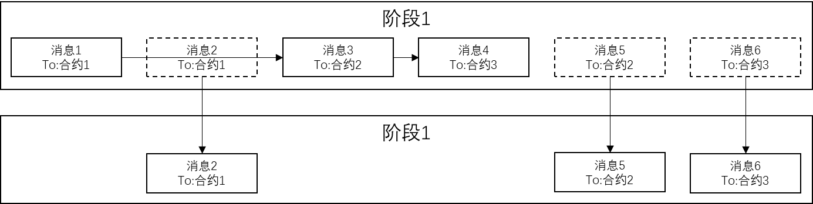
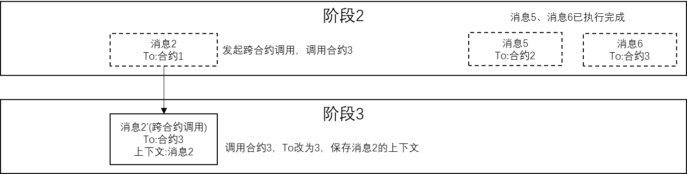
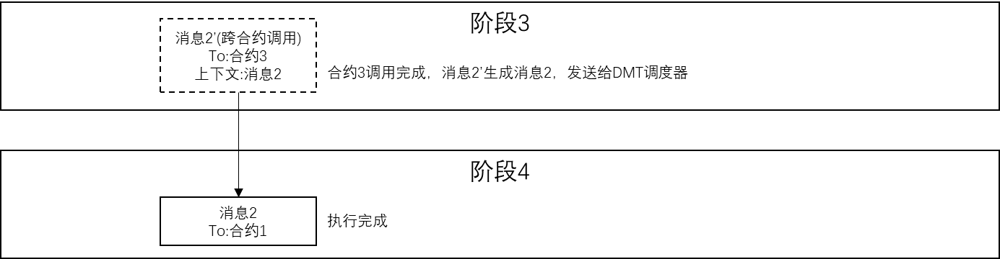

# 确定性多合约并行

标签：``执行`` ``并行调度`` ``DMC`` ``确定性并行合约``

----------

本文档用于描述**确定性多合约并行**。

## 1、背景

如今多核已经逐渐成为当今 CPU 的主流，未来 CPU 可能集成更多的核，进入众核时代。

区块链为了保证交易事务性，交易是串行进行的，而且是彻底的串行，先对交易排序，然后用单线程执行智能合约，以避免乱序执行导致的事务混乱、数据冲突等。即使在一个服务器有多核的 CPU，操作系统支持多线程多进程，以及网络中有多个节点、多台服务器的前提下，所有交易也是有条不紊地、严格地按单线程在每台计算机上单核地进行运算，这个时候多核 CPU 其他的核可能完全是空闲的。

FISCO BCOS 2.0 版本中，引入了 DAG 并行的解决方案，将交易的线性执行，转化为 DAG 图的并行执行。在 DAG 并行方案的实际应用中，区块链根据每笔交易执行时需要使用的互斥资源（互斥意味着对资源的排他性使用，比如在上述转账问题互斥资源中，指的就是各个账户的余额状态）， 我们可以组织出一张交易依赖关系图，为防止交易依赖关系在图中成环，我们可以规定交易列表中牵涉到相同的互斥资源，且排序靠后的交易，必须等待靠前的交易完成后才被执行，由此得到的输出便是一张反映交易依赖关系的有向无环图，即交易 DAG。
 
在理想情况下，所有交易都能并行，DAG 并行的提升度等同于系统的核心数量。

但是，任何先进的技术，都有其适用范围和局限，DAG在特定场景下仍存在改进点：

1. DAG 并行需要区块链使用者事先提供所有资源的互斥关系，才能通过互斥关系，从交易中分析出可行的并行路径，分析互斥关系对使用者而言是复杂的过程，一旦分析出错，将导致区块链出现不一致、无法共识的严重后果。
1. DAG 并行为了保证顺序一致性，互斥关系的选取必须遵循最保守的策略，当合约逻辑复杂、涉及大量的资源访问时，DAG 就难以分析出可行的并行路径，最后等同于串行执行。

## 2、确定性多合约并行方案（DMC）

基于并行调度的确定性多合约并行方案（简称 DMC），核心思路是保证并行交易执行过程中互斥资源访问的确定性，实现以下几个目标：
- 易用：区块链底层自动启用并行，无需使用者关注并行逻辑、预先提供冲突字段。
- 高效：区块内的交易不重复执行，没有预执行、预分析或重试的流程。
- 兼容：无论 EVM、WASM、Precompiled 或其它合约，使用任意的共识机制，都能使用此方案。

DMC 方案首先要求区块链的智能合约间没有共享数据，每个合约都有独立的存储空间，其它合约无法读取和写入。执行交易时，DMC 会将区块内所有交易调用的不同智能合约代码块拆分为多个代码段，多个不同智能合约的代码块交错执行，拆分的边界是跨合约调用与互斥资源访问。

DMC 方案中，调用同一个合约的多个交易在全局视角中总是串行的，DMC 让调用不同合约的多个交易并行执行，由于智能合约间没有共享的数据，因此不同合约间的并行执行总是可以保证最终结果的一致性。当任意智能合约发生跨合约调用或是访问已经锁定的互斥资源时，DMC 会暂停该交易的执行，并等待当前阶段中其它所有交易都执行完成、或是由于发起跨合约调用和访问已锁定的互斥资源而暂停，这个等待过程称为全局同步。每次全局同步，DMC 会按照固定规则分配交易的跨合约调用和互斥资源访问，保证同一个合约和互斥资源不会被并行访问，最终在实现并行的同时，保证执行结果的一致性。

## 3、DMC 流程简述

### DMC执行流程
用户向区块链系统输入交易列表，包括交易1到交易6。区块链系统将交易打包到区块，执行共识，区块内的交易列表为一串确定顺序的交易列表，假设输入了6个交易，从**交易1到交易6**；每个交易调用不同的合约，包括**合约1到合约3**。

**阶段1**
- 区块链系统在共识过程中，将区块输入到 DMC 调度器，DMC 调度器根据区块内的交易列表生成初始阶段1，并将区块内的所有交易转换为消息，阶段1内包含区块内所有交易对应的消息，消息包含交易的所有字段和额外信息，额外信息为上下文信息，上下文信息初始默认为空，例如有消息1-6。
- 每个阶段开始时，DMC 调度器会构造一个哈希表，顺序串行遍历当前阶段内的所有消息，提取消息的目的合约（To）字段，将目的合约字段放入哈希表：
    - 如果目的合约字段成功放入哈希表，说明该消息调用的目的合约是首次执行，DMC 调度器将该消息异步发送至任意交易执行器来执行该消息;
    - 如果目的合约字段放入哈希表时发生冲突，说明该消息调用的目的合约已经有更早的消息调用过，DMC 调度器将该消息移动至下一阶段（阶段2）;

**阶段2**
- DMC 调度器遍历阶段1的消息，发现消息2与消息1调用了同一合约，消息3与消息5调用了同一合约，消息4与消息6调用了同一合约，DMC 调度器将首次调用合约的消息（消息1、消息3、消息4）异步发送给多个交易执行器来执行，其它（消息2、消息5、消息6）移动到下一阶段。
- 消息1、消息3和消息4，由于它们分别调用不同的合约，因此多个交易执行器可以并行执行这3个消息，DMC 调度器会等待消息1、3、4执行完成。

**阶段3**
- 交易执行器在执行消息的过程中，如果消息对应的智能合约内部发生跨合约调用，交易执行器会中止当前消息的执行，保存消息执行的上下文，生成新的跨合约调用消息，新消息内包含前述保存的上下文，交易执行器将跨合约调用的新消息发送给 DMC 调度器。
- DMC 调度器将来自交易执行器的跨合约调用消息移动到下一阶段。
- 假如DMC 调度器在阶段2执行过程中，交易执行器执行消息2时，消息调用的智能合约发起了跨合约调用，跨合约调用的目的合约是3，则该交易执行器暂停执行消息2的执行，保存消息2的上下文，生成一个新的跨合约调用消息2’，交易执行器将跨合约调用的消息2’发送给 DMC 调度器。DMC 调度器将消息2’放到阶段3，后续 DMC 调度器在阶段3将该消息下发给其它交易执行器。

**阶段4**
- 交易执行器将消息执行结束后，如果消息内包含上下文，相当于跨合约调用返回，交易执行器会根据消息内上下文，还原该上下文，生成新消息，并将当前消息执行的结果作为跨合约调用返回值放到新消息的参数中，将跨合约调用返回的新消息发送给 DMC 调度器。

- DMC 调度器将来自交易执行器的跨合约调用消息移动到下一阶段。
- DMC 调度器如果发现下一阶段非空，会将当前阶段设置为下一阶段并重复初始步骤，依次类推，直到所有交易都执行完成为止。