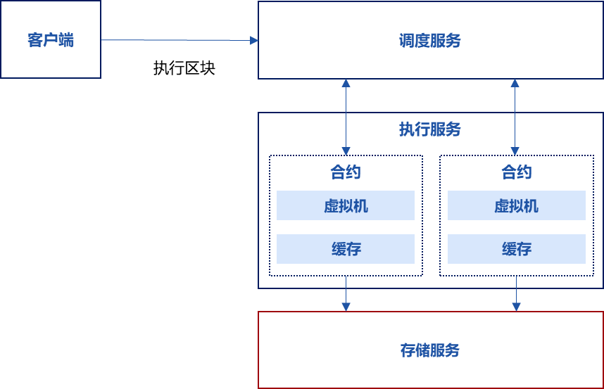

# 确定性多线程的合约并行

标签：``执行`` ``并行调度`` ``DMC`` ``确定性多线程的合约并行`` ``DMC``

----------

本文档用于描述**确定性多线程的合约并行**。

## 1、名词解释

### DMC
确定性多线程的合约并行。执行交易时，DMC 会将合约代码块**拆分为多个代码段交错执行**，在DMC的概念中被称为“**消息**”，拆分的分界是跨合约调用，多个调用不同合约的交易，其代码段在阶段内并行执行。

### 区块链系统
交易的接收者，将交易打包成区块共识，并执行。

### DMC调度器
区块链系统的子模块，区块链系统内唯一，用于执行DMC调度算法，提取交易的相关性，将交易分配到不同的阶段并行执行。

### 交易执行器
区块链系统的子模块，区块链系统内有多个，用于执行交易，多个交易执行器可以并行执行，但无法并行执行冲突的交易。

## 2. 模块总体
### 功能
1. 交易调度功能
2. 交易并行执行功能

### DMC执行流程
1. 用户向区块链系统输入交易列表，包括交易1到交易6。区块链系统将交易打包到区块，执行共识，区块内的交易列表为一串确定顺序的交易列表，假设输入了6个交易，从**交易1到交易6**；每个交易调用不同的合约，包括**合约1到合约3**。

2. **阶段1**
- 区块链系统在共识过程中，将区块输入到DMC调度器，DMC调度器根据区块内的交易列表生成初始阶段1，并将区块内的所有交易转换为消息，阶段1内包含区块内所有交易对应的消息，消息包含交易的所有字段和额外信息，额外信息为上下文信息，上下文信息初始默认为空，例如有消息1-6。
- 每个阶段开始时，DMC调度器会构造一个哈希表，顺序串行遍历当前阶段内的所有消息，提取消息的目的合约（To）字段，将目的合约字段放入哈希表：
    - 如果目的合约字段成功放入哈希表，说明该消息调用的目的合约是首次执行，DMC调度器将该消息异步发送至任意交易执行器来执行该消息;
    - 如果目的合约字段放入哈希表时发生冲突，说明该消息调用的目的合约已经有更早的消息调用过，DMC调度器将该消息移动至下一阶段（阶段2）;


3. **阶段2**
- DMC调度器遍历阶段1的消息，发现消息2与消息1调用了同一合约，消息3与消息5调用了同一合约，消息4与消息6调用了同一合约，DMC调度器将首次调用合约的消息（消息1、消息3、消息4）异步发送给多个交易执行器来执行，其它（消息2、消息5、消息6）移动到下一阶段。
- 消息1、消息3和消息4，由于它们分别调用不同的合约，因此多个交易执行器可以并行执行这3个消息，DMC调度器会等待消息1、3、4执行完成。


4. **阶段3**
- 交易执行器在执行消息的过程中，如果消息对应的智能合约内部发生跨合约调用，交易执行器会中止当前消息的执行，保存消息执行的上下文，生成新的跨合约调用消息，新消息内包含前述保存的上下文，交易执行器将跨合约调用的新消息发送给DMC调度器。
- DMC调度器将来自交易执行器的跨合约调用消息移动到下一阶段。
- 假如DMC调度器在阶段2执行过程中，交易执行器执行消息2时，消息调用的智能合约发起了跨合约调用，跨合约调用的目的合约是3，则该交易执行器暂停执行消息2的执行，保存消息2的上下文，生成一个新的跨合约调用消息2’，交易执行器将跨合约调用的消息2’发送给DMC调度器。DMC调度器将消息2’放到阶段3，后续DMC调度器在阶段3将该消息下发给其它交易执行器。


5. **阶段4**
- 交易执行器将消息执行结束后，如果消息内包含上下文，相当于跨合约调用返回，交易执行器会根据消息内上下文，还原该上下文，生成新消息，并将当前消息执行的结果作为跨合约调用返回值放到新消息的参数中，将跨合约调用返回的新消息发送给DMC调度器。


- DMC调度器将来自交易执行器的跨合约调用消息移动到下一阶段。
- DMC调度器如果发现下一阶段非空，会将当前阶段设置为下一阶段并重复初始步骤，依次类推，直到所有交易都执行完成为止。

#### 运行环境
| 系统 | 核数 | 内存 | 带宽 |
| --------- | ------ | ------ | ------ |
| X86/ARM硬件平台 的centos/ubuntu/macos系统 | 四核2.4G或以上 | > 4G Bytes | 具备网络通信功能，最低带宽>5Mbps |

| Linux | cmake | c++ |
| --------- | ------ | ------ |
| >= 3.1.0 | >= 3.17 | >= 7.0 |


### 3. 模块子系统
#### 子系统框架图


#### 3.1 调度服务
调度不同的合约分多个阶段并行执行交易。

##### 主要流程
1. 客户端通知调度服务执行区块。
2. 调度服务将区块内的交易转换为消息。
3. 步骤2验证通过后，调度服务遍历消息，执行并行调度。
调度服务把所有消息执行完成后，生成交易回执，返回给客户端。

##### 主要函数
**执行一个区块**
- 参数：
`bcos::protocol::Block::Ptr block`：待执行的区块
`bool verify`：是否需要验证执行结果
`std::function<void(bcos::Error::Ptr&&, bcos::protocol::BlockHeader::Ptr&&)> callback`：执行结果的回调
- 返回：无

```c++
void executeBlock(bcos::protocol::Block::Ptr block,
        bool verify, std::function<void(bcos::Error::Ptr&&, bcos::protocol::BlockHeader::Ptr&&)> callback)
        override;
```

**提交一个已执行的区块**
- 参数：
`bcos::protocol::BlockHeader::Ptr header`交易池中未打包的交易数目
`std::function<void(bcos::Error::Ptr&&, bcos::ledger::LedgerConfig::Ptr&&)> callback`：执行结果的回调
- 返回：无

```c++
void commitBlock(bcos::protocol::BlockHeader::Ptr header,
        std::function<void(bcos::Error::Ptr&&, bcos::ledger::LedgerConfig::Ptr&&)> callback)
        override;
```

**返回当前调度模块的状态**
- 参数：
`std::function<void(Error::Ptr&&, bcos::protocol::Session::ConstPtr&&)> callback`：执行结果的回调
- 返回：无

```c++
void status(
        std::function<void(Error::Ptr&&, bcos::protocol::Session::ConstPtr&&)> callback) override;
```

**发起一个只读的调用请求**
- 参数：
`protocol::Transaction::Ptr tx`：只读的交易
`std::function<void(Error::Ptr&&, protocol::TransactionReceipt::Ptr&&)> callback`：调用结果回调
- 返回：无

```c++
void call(protocol::Transaction::Ptr tx,
        std::function<void(Error::Ptr&&, protocol::TransactionReceipt::Ptr&&)>) override;
```

**获取特定合约的代码**
- 参数：
`std::string_view contract`：合约地址
`std::function<void(Error::Ptr, bcos::bytes)> callback`：合约内容回调
- 返回：无

```c++
void getCode(
        std::string_view contract, std::function<void(Error::Ptr, bcos::bytes)> callback) override;
```

#### 3.2 执行服务
执行服务通过启动虚拟机，执行多个交易。

##### 主要流程
1. 调度服务调用执行服务，发送交易消息;
2. 执行服务根据交易类型，创建该交易类型的区块链虚拟机，并创建一个该交易的协程，将交易放到协程中的虚拟机执行。
3. 交易执行中遇到跨合约调用，交易执行将暂停，执行服务返回一个跨合约调用消息给调度服务。
4. 跨合约调用完成后，调度服务将跨合约调用的返回消息发送给执行服务，执行服务取出之前暂停的交易，继续执行。
5. 重复前述步骤，完成所有交易的执行。

##### 主要函数
**设置区块状态，作为后续执行交易的上下文**
- 参数：
`const bcos::protocol::BlockHeader::ConstPtr& blockHeader`：待设置的区块头
`std::function<void(bcos::Error::UniquePtr)> callback`：设置结果回调
- 返回：无

```c++
void nextBlockHeader(const bcos::protocol::BlockHeader::ConstPtr& blockHeader,
        std::function<void(bcos::Error::UniquePtr)> callback) override;
```

**执行一个交易**
- 参数：
`bcos::protocol::ExecutionMessage::UniquePtr input`：输入的交易
`std::function<void(bcos::Error::UniquePtr, bcos::protocol::ExecutionMessage::UniquePtr)> callback`：执行结果回调
- 返回：无

```c++
void executeTransaction(bcos::protocol::ExecutionMessage::UniquePtr input,
        std::function<void(bcos::Error::UniquePtr, bcos::protocol::ExecutionMessage::UniquePtr)>
            callback) override;
```

**只读执行一个交易，不修改状态**
- 参数：
`bcos::protocol::ExecutionMessage::UniquePtr input`：输入的交易
`std::function<void(bcos::Error::UniquePtr, bcos::protocol::ExecutionMessage::UniquePtr)>callback`：执行结果的回调
- 返回：无

```c++
void call(bcos::protocol::ExecutionMessage::UniquePtr input,
        std::function<void(bcos::Error::UniquePtr, bcos::protocol::ExecutionMessage::UniquePtr)>
            callback) override;
```

#### 3.3 存储服务
负责智能合约状态数据的读写。包括读接口和写接口。
##### 主要函数
**获取一行数据**
- 参数：
`std::string_view table`：表名
`std::string_view _key`：主Key
`std::function<void(Error::UniquePtr, std::optional<Entry>)> _callback`：获取结果的回调
- 返回：无

```c++
void asyncGetRow(std::string_view table, std::string_view _key,
                   std::function<void(Error::UniquePtr, std::optional<Entry>)>
                       _callback) override;
```

**设置一行数据**
- 参数：
`std::string_view table`：表名
`std::string_view key`：主Key
`Entry entry`：待设置的数据
`std::function<void(Error::UniquePtr)> callback`：设置结果的回调
- 返回：无

```c++
void asyncSetRow(std::string_view table, std::string_view key, Entry entry,
              std::function<void(Error::UniquePtr)> callback) override;
```