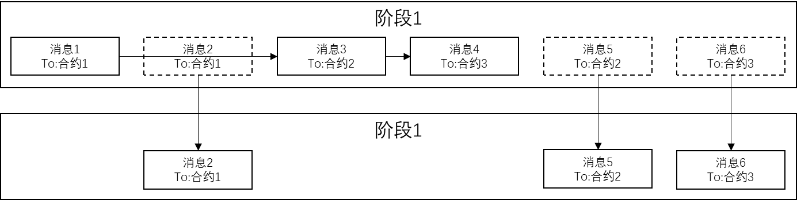
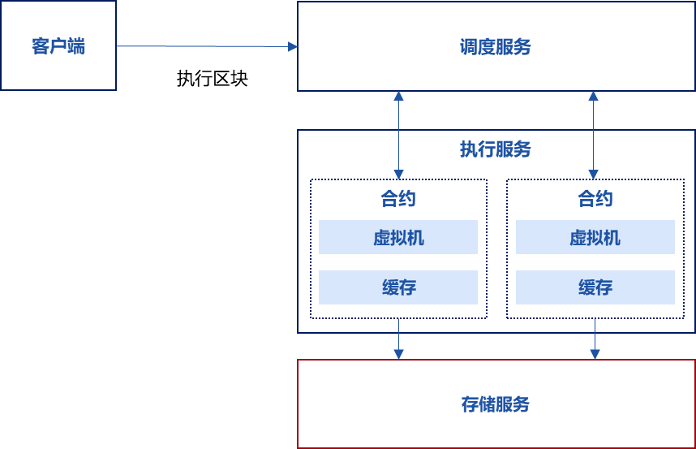

# DMT

标签：``执行`` ``并行调度`` ``DMT`` ``确定性并行交易系统``

----------

本文档用于描述确定性并行交易系统V3.0.0概要设计以及各组成模块的详细实现细节。

## 1、DAG 存在的问题
FISCO BCOS 2.0 虽然已实现了 DAG 并行，但其缺陷限制了其使用范围：
- DAG 并行需要用户**手动填写冲突字段**，这要求用户对合约的逻辑和并行的原理有深刻理解，正确填写并行参数，一旦参数填写错误，将导致区块链出现不一致，无法继续共识，使得 DAG 并行使用成本极高。
- DAG 并行为了保证顺序一致性，冲突字段的选取遵循最保守的策略，代码中可能用到的冲突变量，都会被参与 DAG 并行路径的生成，导致复杂合约的 DAG 结果不佳，最终执行几乎为**串行**。

## 2、DMT系统

### 软件定义
本方案提出了一种基于**确定性并行**的区块链并行方法，称为**DMT 并行方案**。

DMT方案首先要求区块链的智能合约间没有共享数据，每个合约都有独立的存储空间，其它合约无法读取或写入。执行交易时，DMT 会将合约代码块**拆分为多个代码段交错执行**，在DMT的概念中被称为“**消息**”，拆分的分界是跨合约调用，多个调用不同合约的交易，其代码段在阶段内并行执行，划分阶段的方法参见流程描述。

DMT方案中，调用同一个合约的多个交易在全局视角中总是串行的，DMT让调用不同合约的多个交易并行执行，前述智能合约间没有共享的数据，因此不同合约间的并行执行可以保证最终结果的一致性。但合约间存在跨合约调用的情况，当任意交易发起跨合约调用，DMT会暂停该交易执行，并等待其它所有交易都执行完成或是由于发起跨合约调用而暂停，这个等待过程称为全局同步。每次全局同步，DMT会按照固定顺序 分配交易的跨合约调用，该顺序等同于区块内交易的顺序，保证同一个合约不会被并行调用，且调用不同合约的交易并行执行，最终在保证并行的同时，确保结果的一致性。
### 核心思路
基于 DMT 调度的并行方案借鉴 `DTHREADS` 方案，核心思路是**保证并行交易执行过程中互斥资源访问的确定性**，**互斥资源**就是**合约**。

### 实现目标
- **易用**：区块链底层自动启用并行，无需使用者关注并行逻辑、预先提供冲突字段。
- **分离**：DMT 并行方案与共识、同步逻辑无关，不要求特定的共识机制。
- **高效**：区块内的交易不重复执行，没有预执行或预分析的流程。
- **兼容**：无论 EVM、WASM、Precompiled 或其它合约，都能使用此方案。

### 软件总体设计
#### 功能概述
1. 交易调度功能
2. 交易并行执行功能

#### 需求概述
**DMT执行流程**：
1. 用户向区块链系统输入交易列表，包括交易1到交易6。区块链系统将交易打包到区块，执行共识，区块内的交易列表为一串确定顺序的交易列表，假设输入了6个交易，从**交易1到交易6**；每个交易调用不同的合约，包括**合约1到合约3**。

2. **阶段1**
- 区块链系统在共识过程中，将区块输入到DMT调度器，DMT调度器根据区块内的交易列表生成初始阶段1，并将区块内的所有交易转换为消息，阶段1内包含区块内所有交易对应的消息，消息包含交易的所有字段和额外信息，额外信息为上下文信息，上下文信息初始默认为空，例如有消息1-6。
- 每个阶段开始时，DMT调度器会构造一个哈希表，顺序串行遍历当前阶段内的所有消息，提取消息的目的合约（To）字段，将目的合约字段放入哈希表：
    - 如果目的合约字段成功放入哈希表，说明该消息调用的目的合约是首次执行，DMT调度器将该消息异步发送至任意交易执行器来执行该消息;
    - 如果目的合约字段放入哈希表时发生冲突，说明该消息调用的目的合约已经有更早的消息调用过，DMT调度器将该消息移动至下一阶段（阶段2）;


3. **阶段2**
- DMT调度器遍历阶段1的消息，发现消息2与消息1调用了同一合约，消息3与消息5调用了同一合约，消息4与消息6调用了同一合约，DMT调度器将首次调用合约的消息（消息1、消息3、消息4）异步发送给多个交易执行器来执行，其它（消息2、消息5、消息6）移动到下一阶段。
- 消息1、消息3和消息4，由于它们分别调用不同的合约，因此多个交易执行器可以并行执行这3个消息，DMT调度器会等待消息1、3、4执行完成。


4. **阶段3**
- 交易执行器在执行消息的过程中，如果消息对应的智能合约内部发生跨合约调用，交易执行器会中止当前消息的执行，保存消息执行的上下文，生成新的跨合约调用消息，新消息内包含前述保存的上下文，交易执行器将跨合约调用的新消息发送给DMT调度器。
- DMT调度器将来自交易执行器的跨合约调用消息移动到下一阶段。
- 假如DMT调度器在阶段2执行过程中，交易执行器执行消息2时，消息调用的智能合约发起了跨合约调用，跨合约调用的目的合约是3，则该交易执行器暂停执行消息2的执行，保存消息2的上下文，生成一个新的跨合约调用消息2’，交易执行器将跨合约调用的消息2’发送给DMT调度器。DMT调度器将消息2’放到阶段3，后续DMT调度器在阶段3将该消息下发给其它交易执行器。


5. **阶段4**
- 交易执行器将消息执行结束后，如果消息内包含上下文，相当于跨合约调用返回，交易执行器会根据消息内上下文，还原该上下文，生成新消息，并将当前消息执行的结果作为跨合约调用返回值放到新消息的参数中，将跨合约调用返回的新消息发送给DMT调度器。


- DMT调度器将来自交易执行器的跨合约调用消息移动到下一阶段。
- DMT调度器如果发现下一阶段非空，会将当前阶段设置为下一阶段并重复初始步骤，依次类推，直到所有交易都执行完成为止。

#### 软件运行环境
| 系统 | 核数 | 内存 | 带宽 |
| --------- | ------ | ------ | ------ |
| X86/ARM硬件平台 的centos/ubuntu/macos系统 | 四核2.4G或以上 | > 4G Bytes | 具备网络通信功能，最低带宽>5Mbps |

| Linux | cmake | c++ |
| --------- | ------ | ------ |
| >= 3.1.0 | >= 3.17 | >= 7.0 |


### 软件子系统
#### 子系统框架图


#### 调度服务
##### 概述
调度服务服务调度不同的合约分多个阶段并行执行交易。

##### 主要流程
1. 客户端通知调度服务执行区块。
2. 调度服务将区块内的交易转换为消息。
3. 步骤2验证通过后，调度服务遍历消息，执行并行调度，参见软件总体设计章节。
调度服务把所有消息执行完成后，生成交易回执，返回给客户端。

##### 主要函数
**执行一个区块**
- 参数：
`bcos::protocol::Block::Ptr block`：待执行的区块
`bool verify`：是否需要验证执行结果
`std::function<void(bcos::Error::Ptr&&, bcos::protocol::BlockHeader::Ptr&&)> callback`：执行结果的回调
- 返回：无

```c++
void executeBlock(bcos::protocol::Block::Ptr block,
        bool verify, std::function<void(bcos::Error::Ptr&&, bcos::protocol::BlockHeader::Ptr&&)> callback)
        override;
```

**提交一个已执行的区块**
- 参数：
`bcos::protocol::BlockHeader::Ptr header`交易池中未打包的交易数目
`std::function<void(bcos::Error::Ptr&&, bcos::ledger::LedgerConfig::Ptr&&)> callback`：执行结果的回调
- 返回：无

```c++
void commitBlock(bcos::protocol::BlockHeader::Ptr header,
        std::function<void(bcos::Error::Ptr&&, bcos::ledger::LedgerConfig::Ptr&&)> callback)
        override;
```

**返回当前调度模块的状态**
- 参数：
`std::function<void(Error::Ptr&&, bcos::protocol::Session::ConstPtr&&)> callback`：执行结果的回调
- 返回：无

```c++
void status(
        std::function<void(Error::Ptr&&, bcos::protocol::Session::ConstPtr&&)> callback) override;
```

**发起一个只读的调用请求**
- 参数：
`protocol::Transaction::Ptr tx`：只读的交易
`std::function<void(Error::Ptr&&, protocol::TransactionReceipt::Ptr&&)> callback`：调用结果回调
- 返回：无

```c++
void call(protocol::Transaction::Ptr tx,
        std::function<void(Error::Ptr&&, protocol::TransactionReceipt::Ptr&&)>) override;
```

**获取特定合约的代码**
- 参数：
`std::string_view contract`：合约地址
`std::function<void(Error::Ptr, bcos::bytes)> callback`：合约内容回调
- 返回：无

```c++
void getCode(
        std::string_view contract, std::function<void(Error::Ptr, bcos::bytes)> callback) override;
```

#### 执行服务
##### 概述
执行服务通过启动虚拟机，执行多个交易。

##### 主要流程
1. 调度服务调用执行服务，发送交易消息;
2. 执行服务根据交易类型，创建该交易类型的区块链虚拟机，并创建一个该交易的协程，将交易放到协程中的虚拟机执行。
3. 交易执行中遇到跨合约调用，交易执行将暂停，执行服务返回一个跨合约调用消息给调度服务。
4. 跨合约调用完成后，调度服务将跨合约调用的返回消息发送给执行服务，执行服务取出之前暂停的交易，继续执行。
5. 重复前述步骤，完成所有交易的执行。

##### 主要函数
**设置区块状态，作为后续执行交易的上下文**
- 参数：
`const bcos::protocol::BlockHeader::ConstPtr& blockHeader`：待设置的区块头
`std::function<void(bcos::Error::UniquePtr)> callback`：设置结果回调
- 返回：无

```c++
void nextBlockHeader(const bcos::protocol::BlockHeader::ConstPtr& blockHeader,
        std::function<void(bcos::Error::UniquePtr)> callback) override;
```

**执行一个交易**
- 参数：
`bcos::protocol::ExecutionMessage::UniquePtr input`：输入的交易
`std::function<void(bcos::Error::UniquePtr, bcos::protocol::ExecutionMessage::UniquePtr)> callback`：执行结果回调
- 返回：无

```c++
void executeTransaction(bcos::protocol::ExecutionMessage::UniquePtr input,
        std::function<void(bcos::Error::UniquePtr, bcos::protocol::ExecutionMessage::UniquePtr)>
            callback) override;
```

**只读执行一个交易，不修改状态**
- 参数：
`bcos::protocol::ExecutionMessage::UniquePtr input`：输入的交易
`std::function<void(bcos::Error::UniquePtr, bcos::protocol::ExecutionMessage::UniquePtr)>callback`：执行结果的回调
- 返回：无

```c++
void call(bcos::protocol::ExecutionMessage::UniquePtr input,
        std::function<void(bcos::Error::UniquePtr, bcos::protocol::ExecutionMessage::UniquePtr)>
            callback) override;
```

#### 存储服务
##### 概述
本服务负责智能合约状态数据的读写。

##### 主要流程
本服务包括读接口和写接口。
##### 主要函数
**获取一行数据**
- 参数：
`std::string_view table`：表名
`std::string_view _key`：主Key
`std::function<void(Error::UniquePtr, std::optional<Entry>)> _callback`：获取结果的回调
- 返回：无

```c++
void asyncGetRow(std::string_view table, std::string_view _key,
                   std::function<void(Error::UniquePtr, std::optional<Entry>)>
                       _callback) override;
```

**设置一行数据**
- 参数：
`std::string_view table`：表名
`std::string_view key`：主Key
`Entry entry`：待设置的数据
`std::function<void(Error::UniquePtr)> callback`：设置结果的回调
- 返回：无

```c++
void asyncSetRow(std::string_view table, std::string_view key, Entry entry,
              std::function<void(Error::UniquePtr)> callback) override;
```