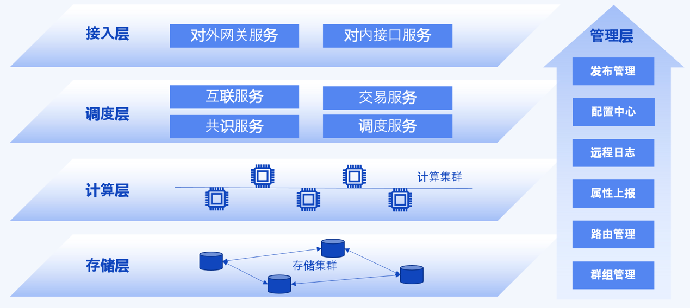
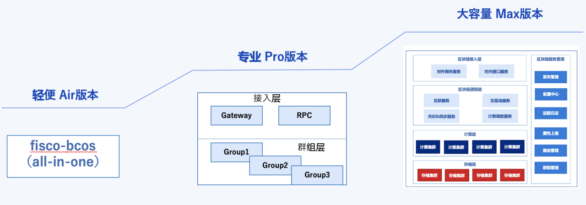

# 系统架构

标签：``设计`` ``架构``

----------

FISCO BCOS 3.0版本采用**微服务模块化**设计架构，总体上系统包含接入层、调度层、计算层、存储层和管理层五个方面。下面分别介绍每层的功能设计。

- **接入层**：接入层主要负责区块链**连接的能力**，包括提供P2P能力的“对外网关服务”和提供给SDK访问的“对内网关服务”。在联盟链的体系中，“对外网关服务”管理了机构对外连接的出入口，负责机构级别的安全认证。“对内网关服务”则提供给机构内的客户端（应用端）访问入口。两个网关服务都可以平行扩展、多活部署、负载均衡，满足高可用要求。
***

- **调度层**：调度层是区块链内核运转调度的“大脑中枢”系统，负责整个区块链系统**运行调度**，包括网络分发调度、交易池管理、共识机制、计算调度等模块。其中，网络分发模块主要是与接入层实现互联通信功能，处理消息分发逻辑；交易池管理主要负责交易的接收、签名验证、淘汰等功能；共识机制负责交易排序、区块打包以及对区块结果进行分布式共识，确保一致性；计算调度则完成交易验证（核心是智能合约的验证）的调度处理，实现并行验证，是整个系统吞吐量的关键。

***

- **计算层**：这里主要负责**交易验证**，需要将交易解码放入合约虚拟机中执行，得到交易执行结果。交易验证是整个区块链的核心，尤其是基于智能合约的区块链系统，交易验证的计算可能需要花费较大的CPU开销。因此，如何实现并行化交易验证，通过集群化模式实现交易验证计算的平行扩展是非常重要的。

***

- **存储层**：存储层负责**落盘存储**交易、区块、账本状态等数据，存储层重点关注如何支撑海量数据的存储，采用分布式存储集群的方式可实现存储容量可扩展。分布式存储业界已有许多稳定可复用的开源组件（如TiKV），这层将复用成熟组件。

***

- **管理层**：管理层是为整个区块链系统各模块实现**可视化管理**的平台，包括部署、配置、日志、网络路由等管理功能。FISCO BCOS 3.0系统架构基于开源微服务框架Tars构建，这层的能力复用成熟的Tars-Framwork管理组件。

FISCO BCOS 3.0采用微服务架构，但同时也支持**灵活拆分组合**微服务模块，从而构建不同形态的服务模式，包括“**轻便Air版本**”、“**专业Pro版**”和“**大容量Max版**”。

- **轻便Air版**：采用all-in-one的封装模式，将所有模块编译成一个二进制（进程），一个进程即为一个区块链节点，包括网络、共识、接入等所有功能模块，采用本地RocksDB存储。它适用于初学者入门、功能验证、POC产品等。

***

- **专业Pro版**：包括RPC、Gateway两个接入层的服务和多个区块链节点Node服务组成，其中一个Node服务代表一个群组，存储采用本地RocksDB，所有Node共用接入层服务，接入层的两个服务可平行扩展。它适用于容量可控（T级以内）的生产环境，能够支持多群组扩展。

***

- **大容量Max版**：由各个层的所有服务构成，每个服务都可独立扩展，存储采用分布式存储TiKV，管理采用Tars-Framwork服务。它适用于海量交易上链，需要支持大量数据落盘存储的场景。

