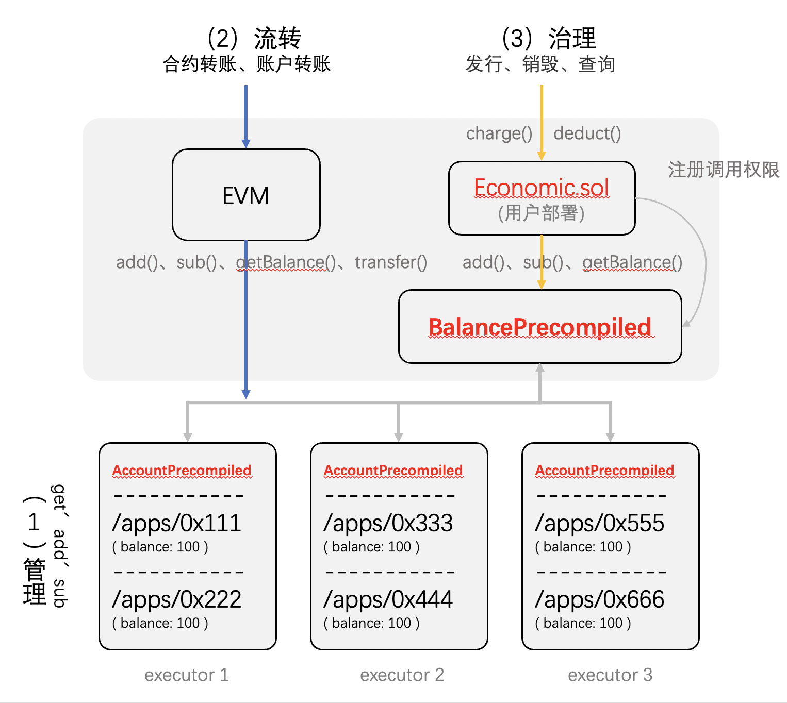

# 21. 原生资产治理

该功能是对链上原生资产的治理，功能为：

1. **资产流转**：通过开关可打开原生资产的流转功能
2. **资产发行、销毁**：通过“资产治理合约框架”可自定义原生资产的发行和销毁逻辑

上述功能需通过开关依次打开

* **feature_balance**：打开**资产流转**功能，可进行原生资产的转账
* **feature_balance_precompiled**：打开“资产治理合约框架”，可写合约定制**资产的发行、销毁**

其依赖顺序为

```
feature_balance -> feature_balance_precompiled
```

## 开关操作

用控制台进行操作（在开启权限情况下，命令略有不同，请参考[控制台文档](../operation_and_maintenance/console/console_commands.html#setsystemconfigbykey)）

**查询开关是否开启**

> 此时未开启

```
[group0]: /apps> getSystemConfigByKey feature_balance
{
    "code":3008,
    "msg":"Entry: feature_balance does not exists!"
}
```

**打开 feature_balance**

> 1 表示开启

```
[group0]: /apps> setSystemConfigByKey feature_balance 1
{
    "code":0,
    "msg":"Success"
}

[group0]: /apps> getSystemConfigByKey feature_balance
1
```

**打开feature_balance_precompiled**

```
[group0]: /apps> setSystemConfigByKey feature_balance_precompiled 1
{
    "code":0,
    "msg":"Success"
}

```

给管理员账号自身初始化一定资产（后续可定制治理合约后，将管理员账号的添加资产权限移除）

* 管理员账号：0x988e6a553f434be3d37786c97abb1fe1f8b7341d

```
[group0]: /apps> loadAccount 0x988e6a553f434be3d37786c97abb1fe1f8b7341d 
Load account 0x988e6a553f434be3d37786c97abb1fe1f8b7341d success!

[group0]: /apps> addBalance 0x988e6a553f434be3d37786c97abb1fe1f8b7341d 1000
transaction hash:0x207c3a95cc235734b8f41e464392b8c90dd8632f9d110ad889de9554e937289b
add balance 0x988e6a553f434be3d37786c97abb1fe1f8b7341d success. You can use 'getBalance' to check

[group0]: /apps> getBalance 0x988e6a553f434be3d37786c97abb1fe1f8b7341d
balance: 1000 wei

```


## 资产流转

### 功能

* 合约转账：可在合约内用transfer函数进行转账
* 账户转账：EOA账户可通过SDK（或控制台）进行转账

### 实现

转账合约举例如下

``` solidity
pragma solidity >=0.6.10 <0.8.20;

contract BalanceExample {

    // get balance of a certain address
    function getBalance(address _address) public view returns (uint) {
        return _address.balance;
    }

    // transfer balance of this contract to a certain address
    function transfer(address payable _to, uint _amount) public payable {
        _to.transfer(_amount);
    }
}
```

### 操作

**控制台操作**

部署合约

* 当前控制台账户地址：0x988e6a553f434be3d37786c97abb1fe1f8b7341d（初始有1000wei）
* 新部署的BalanceExample合约地址：0xc860ab27901b3c2b810165a6096c64d88763617f

``` solidity
[group0]: /apps> deploy BalanceExample 
transaction hash: 0xbdbe0a02fd753ea435ac4aa8bb78985a0c028de2cc70c72b2c8d1b8aeb6ff5bc
contract address: 0xc860ab27901b3c2b810165a6096c64d88763617f
currentAccount: 0x988e6a553f434be3d37786c97abb1fe1f8b7341d

[group0]: /apps> call BalanceExample latest getBalance 0x988e6a553f434be3d37786c97abb1fe1f8b7341d
latest contract address for "BalanceExample" is 0xc860ab27901b3c2b810165a6096c64d88763617f
---------------------------------------------------------------------------------------------
Return code: 0
description: transaction executed successfully
Return message: Success
---------------------------------------------------------------------------------------------
Return value size:1
Return types: (UINT)
Return values:(1000)
---------------------------------------------------------------------------------------------

[group0]: /apps> call BalanceExample latest getBalance 0xc860ab27901b3c2b810165a6096c64d88763617f
latest contract address for "BalanceExample" is 0xc860ab27901b3c2b810165a6096c64d88763617f
---------------------------------------------------------------------------------------------
Return code: 0
description: transaction executed successfully
Return message: Success
---------------------------------------------------------------------------------------------
Return value size:1
Return types: (UINT)
Return values:(0)
---------------------------------------------------------------------------------------------
```

控制台账户给合约转100wei

> 合约和账户均可以持有资产，相互间可以互转

``` solidity
[group0]: /apps> transfer 0xc860ab27901b3c2b810165a6096c64d88763617f 100
transaction hash: 0x1808bacb2527a6bfc09a2862fc52aea65a2427fab10ee40bb916d1285b447c40
---------------------------------------------------------------------------------------------
transaction status: 0
---------------------------------------------------------------------------------------------
description: transaction executed successfully
0x988e6a553f434be3d37786c97abb1fe1f8b7341d => 0xc860ab27901b3c2b810165a6096c64d88763617f, 100 wei

[group0]: /apps> call BalanceExample latest getBalance 0xc860ab27901b3c2b810165a6096c64d88763617f
latest contract address for "BalanceExample" is 0xc860ab27901b3c2b810165a6096c64d88763617f
---------------------------------------------------------------------------------------------
Return code: 0
description: transaction executed successfully
Return message: Success
---------------------------------------------------------------------------------------------
Return value size:1
Return types: (UINT)
Return values:(100)
---------------------------------------------------------------------------------------------

[group0]: /apps> call BalanceExample latest getBalance 0x988e6a553f434be3d37786c97abb1fe1f8b7341d
latest contract address for "BalanceExample" is 0xc860ab27901b3c2b810165a6096c64d88763617f
---------------------------------------------------------------------------------------------
Return code: 0
description: transaction executed successfully
Return message: Success
---------------------------------------------------------------------------------------------
Return value size:1
Return types: (UINT)
Return values:(900)
---------------------------------------------------------------------------------------------

```

合约内转账

> 合约转账给某账户

``` 
[group0]: /apps> call BalanceExample latest transfer 0x7301102bc9a0a39805e5e51300fb0ad0d90849ac 10
latest contract address for "BalanceExample" is 0xc860ab27901b3c2b810165a6096c64d88763617f
transaction hash: 0xca1eee238f573b4143467d3057097e85608c6393940ed74e17a48c03f6e8ed23
---------------------------------------------------------------------------------------------
transaction status: 0
description: transaction executed successfully
---------------------------------------------------------------------------------------------
Receipt message: Success
Return message: Success
Return value size:0
Return types: ()
Return values:()
---------------------------------------------------------------------------------------------

[group0]: /apps> call BalanceExample latest getBalance 0x7301102bc9a0a39805e5e51300fb0ad0d90849ac 
latest contract address for "BalanceExample" is 0xc860ab27901b3c2b810165a6096c64d88763617f
---------------------------------------------------------------------------------------------
Return code: 0
description: transaction executed successfully
Return message: Success
---------------------------------------------------------------------------------------------
Return value size:1
Return types: (UINT)
Return values:(10)
---------------------------------------------------------------------------------------------
```

账户间转账

> 当前控制台的账户转10wei给另一个账户

``` 
[group0]: /apps> transfer 0x7301102bc9a0a39805e5e51300fb0ad0d90849ac 10
transaction hash: 0x1cc32c8006b4922cb74227b4381aebfb0ba8f1d2f757860a4240397c8756e296
---------------------------------------------------------------------------------------------
transaction status: 0
---------------------------------------------------------------------------------------------
description: transaction executed successfully
0x988e6a553f434be3d37786c97abb1fe1f8b7341d => 0x7301102bc9a0a39805e5e51300fb0ad0d90849ac, 10 wei

[group0]: /apps> call BalanceExample latest getBalance 0x7301102bc9a0a39805e5e51300fb0ad0d90849ac 
latest contract address for "BalanceExample" is 0xc860ab27901b3c2b810165a6096c64d88763617f
---------------------------------------------------------------------------------------------
Return code: 0
description: transaction executed successfully
Return message: Success
---------------------------------------------------------------------------------------------
Return value size:1
Return types: (UINT)
Return values:(20)
---------------------------------------------------------------------------------------------

[group0]: /apps> 

```


## 资产发行、销毁

### 功能

资产治理合约框架，管理员可写合约定制**资产的发行、销毁**行为

1. 基于**资产治理合约框架**编写资产治理合约，在合约内定制**资产的发行、销毁**逻辑
2. **链管理员**部署该合约，并将合约注册成为**资产治理合约**
3. 资产治理合约可根据其逻辑，为用户发放资产，也可回收用户的资产

### 实现

在开启feature_balance_precompiled开关后，启用BalancePrecompiled预编译合约，该合约定义了一套治理接口

```solidity
contract BalancePrecompiled {
    function getBalance(address account) public view returns (uint256) {}
    function addBalance(address account, uint256 amount) public {}
    function subBalance(address account, uint256 amount) public {}
    function transfer(address from, address to, uint256 amount) public {}
    function registerCaller(address account) public {}
    function unregisterCaller(address account) public {}
    function listCaller() public view returns (address[] memory) {}
}
```

**基于该接口定制资产治理逻辑**

>  完整举例请参考[Economic.sol](https://github.com/FISCO-BCOS/java-sdk-demo/blob/main/src/main/java/org/fisco/bcos/sdk/demo/contract/sol/Economic.sol)

```solidity
contract Economic
{
		// BalancePrecompiled合约地址
		BalancePrecompiled balancePrecompiled = BalancePrecompiled("0x0000000000000000000000000000000000001011"); 
		
		// 充值接口（只有charger能调用）
    function charge(address userAccount, uint256 gasValue) onlyCharger public {
        balancePrecompiled.addBalance(userAccount, gasValue);
    }
    
    // 扣款接口（只有charger能调用）
    function deduct(address userAccount, uint256 gasValue) onlyCharger public {
        balancePrecompiled.subBalance(userAccount, gasValue);
    }
    
    // 查询接口
    function getBalance(address userAccount) public view returns(uint256){
        return balancePrecompiled.getBalance(userAccount);
    }
    
    // 新增charger（只有Owner能调用）
    function grantCharger(address chargerAccount) onlyOwner public returns(bool success){
        return chargersMap.insert(chargerAccount, true);
    }
    
    // 删除charger（只有Owner能调用）
    function revokeCharger(address chargerAccount) onlyOwner public returns(bool success){
        require(chargersMap.contains(chargerAccount), "charger has not been granted before");
        return chargersMap.remove(chargerAccount);
    }
    
    /// 略 ...
}
```

### 操作

> 用控制台进行操作

**查询并切换成链管理员**

* 链管理员0x988e6a553f434be3d37786c97abb1fe1f8b7341d

```
[group0]: /apps> getCommitteeInfo 
---------------------------------------------------------------------------------------------
Committee address   : 0xd04cfe0e4a8c9cafe504bbd68d665471d1ce5010
ProposalMgr address : 0x0fb8268e0f749097844639dff0fc938d44fa55ba
---------------------------------------------------------------------------------------------
ParticipatesRate: 0% , WinRate: 0%
---------------------------------------------------------------------------------------------
Governor Address                                        | Weight
index0 : 0x988e6a553f434be3d37786c97abb1fe1f8b7341d     | 1

[group0]: /apps> loadAccount 0x988e6a553f434be3d37786c97abb1fe1f8b7341d 
Load account 0x988e6a553f434be3d37786c97abb1fe1f8b7341d success!

```

**部署并注册合约为资产治理合约（BalanceGovernor）**

> 要注册的合约地址：0xa28ac30a792a59c3cd114a87a75193c6b8278d7e
>
> 默认链管理员也是BalanceGovernor

```
[group0]: /apps> deploy Economic 
transaction hash: 0xe3ff9d62ac002f193a568fef8a1d1b725ae66bc0a54650ae2ebb2360b5c0a375
contract address: 0xa28ac30a792a59c3cd114a87a75193c6b8278d7e
currentAccount: 0x988e6a553f434be3d37786c97abb1fe1f8b7341d

[group0]: /apps> registerBalanceGovernor 0xa28ac30a792a59c3cd114a87a75193c6b8278d7e
transaction hash:0xe9541c47530a6506e456f0ea01ecc8e5f3fc4ba02d0f238fa75f30e7ec3a3905
register balanceGovernor 0xa28ac30a792a59c3cd114a87a75193c6b8278d7e success.

[group0]: /apps> listBalanceGovernor 
listBalanceGovernor: [0x988e6a553f434be3d37786c97abb1fe1f8b7341d, 0xa28ac30a792a59c3cd114a87a75193c6b8278d7e]

```

**将某账户授权为charger**

* 要授权的charger账户：0x7301102bc9a0a39805e5e51300fb0ad0d90849ac

```
[group0]: /apps> call Economic latest grantCharger 0x7301102bc9a0a39805e5e51300fb0ad0d90849ac 
latest contract address for "Economic" is 0xa28ac30a792a59c3cd114a87a75193c6b8278d7e
transaction hash: 0x007640e82a774a6742e9f1f90fe4760341714f80d6515222e3400b9c6eec3335
---------------------------------------------------------------------------------------------
transaction status: 0
description: transaction executed successfully
---------------------------------------------------------------------------------------------
Receipt message: Success
Return message: Success
Return value size:1
Return types: (BOOL)
Return values:(false)
---------------------------------------------------------------------------------------------

[group0]: /apps> call Economic latest listChargers
latest contract address for "Economic" is 0xa28ac30a792a59c3cd114a87a75193c6b8278d7e
---------------------------------------------------------------------------------------------
Return code: 0
description: transaction executed successfully
Return message: Success
---------------------------------------------------------------------------------------------
Return value size:1
Return types: ([ADDRESS] )
Return values:([0x7301102bc9a0a39805e5e51300fb0ad0d90849ac] )
---------------------------------------------------------------------------------------------

```

**charger进行充值操作**

* 给账户充500：0x1d38f5d0c8c1ae7ed63a2d0ec905b9e9a17e70cf

```
[group0]: /apps> loadAccount 0x7301102bc9a0a39805e5e51300fb0ad0d90849ac 
Load account 0x7301102bc9a0a39805e5e51300fb0ad0d90849ac success!

[group0]: /apps> call Economic latest charge 0x1d38f5d0c8c1ae7ed63a2d0ec905b9e9a17e70cf 500
latest contract address for "Economic" is 0xa28ac30a792a59c3cd114a87a75193c6b8278d7e
transaction hash: 0x742abb6b8496f650f1164af500c378900386c22b460a63d925933ab8dc6a06ee
---------------------------------------------------------------------------------------------
transaction status: 0
description: transaction executed successfully
---------------------------------------------------------------------------------------------
Receipt message: Success
Return message: Success
Return value size:0
Return types: ()
Return values:()
---------------------------------------------------------------------------------------------

[group0]: /apps> getBalance 0x1d38f5d0c8c1ae7ed63a2d0ec905b9e9a17e70cf
balance: 500 wei
```


**管理员账号也是BalanceGovernor，可直接用控制台命令进行充值操作**

> 更多资产操作命令，参考控制台文档

``` 
[group0]: /apps> loadAccount 0x988e6a553f434be3d37786c97abb1fe1f8b7341d 
Load account 0x988e6a553f434be3d37786c97abb1fe1f8b7341d success!

[group0]: /apps> addBalance 0x1d38f5d0c8c1ae7ed63a2d0ec905b9e9a17e70cf 1000
transaction hash:0x2f0b185dce2e152c96790e75e289d1192f92ed99d93568fc8647d9f1d5e5a7c8
add balance 0x1d38f5d0c8c1ae7ed63a2d0ec905b9e9a17e70cf success. You can use 'getBalance' to check

[group0]: /apps> getBalance 0x1d38f5d0c8c1ae7ed63a2d0ec905b9e9a17e70cf 
balance: 1500 wei

```


## 实现原理

* 管理：balance存储在/apps下的每个address对应的表中，由AccountPrecompiled去操作，实现get、add、sub
* 流转：通过发交易的方式，由EVM（或直接）调用到AccountPrecompiled，实现合约和账户的资产转移
* 治理：资产治理合约在BalancePrecompiled上注册，经由BalancePrecompiled调用AccountPrecompiled实现资产转移

