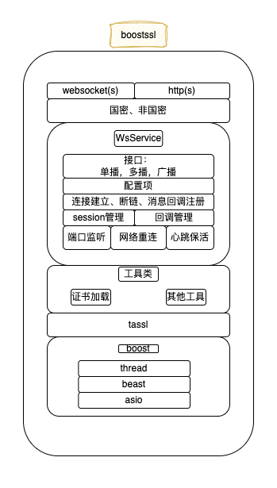

# 20. 公共网络组件BoostSSL

标签： ``网络组件``  ``boostssl``

----

`boostssl`是`fisco-bcos`提供的一个公共网络组件，内置http、websocket两种协议，支持国密、非国密的SSL连接方式，在`FISCO-BCOS 3.0`多个模块中使用。

## 1. 目标

- 支持国密、非国密SSL连接
- 支持HTTP协议
- 支持WebSocket协议
- 简单、易用的接口

## 2. 设计



## 3. 接口

待添加

## 4. 使用

**源码路径:**

<https://github.com/FISCO-BCOS/bcos-boostssl>
<https://gitee.com/FISCO-BCOS/bcos-boostssl>

**支持系统:**

- `CentOS 7.2+`
- `Ubuntu 18.04+`
- `Windows 10`
- `macOS 12`

**依赖安装:**

- `CentOS`:
  `yum install -y epel-release centos-release-scl openssl-devel openssl cmake3 gcc-c++ git flex patch bison gmp-static devtoolset-7 wget`
  
- `Ubuntu`:
  `apt install -y g++ libssl-dev openssl cmake git build-essential autoconf texinfo flex patch bison libgmp-dev zlib1g-dev automake libtool wget`
  
- `macOS`:
  `brew install wget openssl@1.1 git flex bison gmp`
  
- `Windows`:
  - [Visual Studio 2017](https://docs.microsoft.com/en-us/visualstudio/releasenotes/vs2017-relnotes)或[Visual Studio 2019](https://docs.microsoft.com/en-us/visualstudio/releases/2019/release-notes)
  - [perl](https://www.activestate.com/products/perl/)
  - [nasm](https://www.nasm.us/pub/nasm/releasebuilds/2.15.05/win64/)

**编译:**

- `Linux`编译

```shell
# source /opt/rh/devtoolset-7/enable # centos执行

cd bcos-boostssl
mkdir build && cd build
cmake ../ -DBUILD_SAMPLE=ON  # centos使用cmake3, BUILD_SAMPLE表示编译sample目录的示例程序
```

- `macOS`编译

```shell
cd bcos-boostssl
mkdir build && cd build
cmake ../ -DBUILD_SAMPLE=ON # BUILD_SAMPLE表示编译sample目录的示例程序
```

- `Windows`编译

```shell
# cmake
cmake -G "Visual Studio 15 2017" -A x64 ../ -DHUNTER_CONFIGURATION_TYPES=Release -DCMAKE_WINDOWS_EXPORT_ALL_SYMBOLS=ON

# 编译
MSBuild bcos-boostssl.sln /p:Configuration=Release /p:Platform=x64
```

## 5. 案例

`bcos-boostssl`在`FISCO-BCOS`中的使用:

- `bcos-cpp-sdk`: 使用`boostssl`作为客户端，连接节点`rpc`，参考:
  - [github](<https://github.com/FISCO-BCOS/bcos-cpp-sdk/blob/3.2.0/bcos-cpp-sdk/SdkFactory.cpp#L82>)
  - [gitee](<https://gitee.com/FISCO-BCOS/bcos-cpp-sdk/blob/3.2.0/bcos-cpp-sdk/SdkFactory.cpp#L82>)
- `FISCO-BCOS rpc`模块: 使用`boostssl`作为服务端，提供`http`、`websocket`两种协议的`RPC`服务，参考:
  - [github](<https://github.com/FISCO-BCOS/FISCO-BCOS/blob/v3.2.0/bcos-rpc/bcos-rpc/RpcFactory.cpp#L310>)
  - [gitee](<https://gitee.com/FISCO-BCOS/FISCO-BCOS/blob/v3.2.0/bcos-rpc/bcos-rpc/RpcFactory.cpp#L310>)
