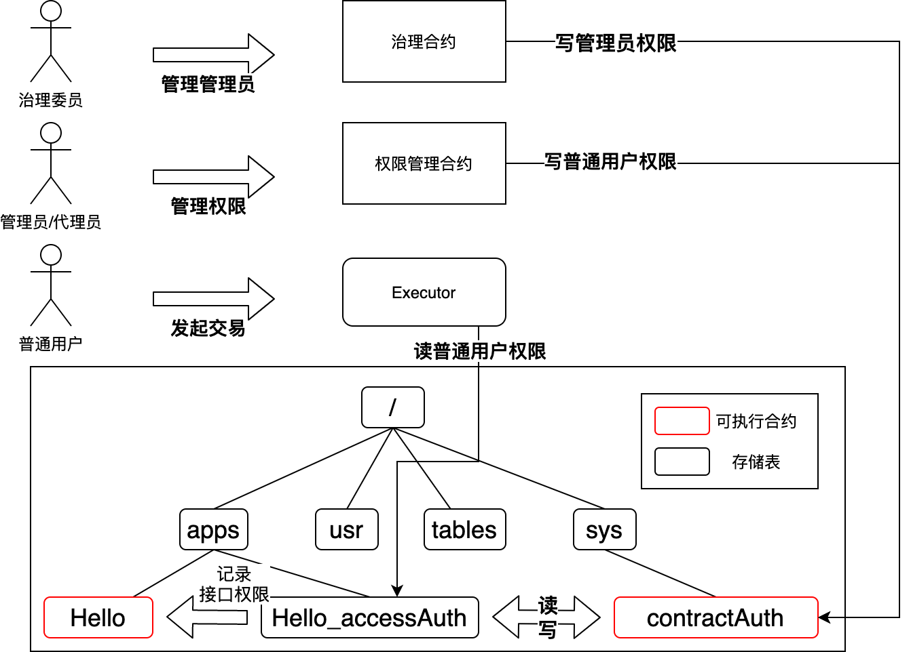

# 权限治理体系设计

标签：``合约权限`` ``部署权限`` ``权限控制`` ``权限设计``

----

FISCO BCOS 3.0+ 引入了合约粒度的权限治理体系。治理委员会可通过投票的方式管理合约的部署、合约的接口调用权限。

详细权限治理使用文档请参考链接：[权限治理使用指南](../develop/committee_usage.md)

## 整体设计

在FISCO BCOS3.0框架中，治理体系由系统合约实现，系统合约提供了相对灵活且通用的功能模块，在满足几乎所有场景的诉求的同时，确保可插拔。

### 1. 角色划分

在FISCO BCOS3.0中，链上角色按照不同的权责可划分为三类：治理角色、合约管理员角色和用户角色，三种角色依次进行管理和被管理。

**治理角色**：对链上治理规则、治理委员会进行治理，属于链的顶层管理者。包括：治理规则设置、治理委员会选举、账户冻结、解冻等。同时治理角色可对下层合约管理员角色进行管控。

**合约管理员角色**：合约管理员角色对合约接口的访问权限进行管理。对于链上参与者，合约管理员未设置合约部署权限的时候，任何用户都可以部署合约。合约部署账户在部署合约时可指定合约管理员账户，如果未指定则合约管理员默认为合约部署者。需要指出的是一旦治理委员会发现合约管理员未履行合约管理员职责，那么则可以通过治理委员会投票的方式重置合约合约管理员。

**用户角色**：用户角色为参与业务的角色，任何账户（包括治理角色和合约管理员角色）都属于用户角色。用户角色能否能参与相关业务（发交易）依赖于合约管理员是否设置相关权限。如果合约管理员未对合约接口设置权限类型（黑名单或白名单模式），则任何人都可以调用合约接口。如果设置了白名单，只有在命中白名单时才能访问，如果为黑名单模式，如果命中，则无法访问对应接口。

### 2. 治理规则管理

- 治理角色通过治理模块完成治理委员会选举，并设置治理规则，如每个治理委员会成员的投票权重，治理决策过程中的投票率和参与率。同时设置合约部署权限；

- 合约管理员角色部署业务合约，并对业务合约相关接口进行权限设置；

- 用户角色通过调用合约接口完成业务操作。

## 详细设计

### 1. 治理模块

治理模块提供治理功能，由治理委员会根据决策规则通过多方投票方式完成。治理合约数据结构如下：

```solidity
// governors 地址列表
LibAddressSet.AddressSet private _governorSet;
// 权重映射表
mapping(address => uint32) private _weightMapping;
// 参与阈值，单位为百分比
uint8 public _participatesRate;
// 提案通过阈值，单位为百分比
uint8 public _winRate;
```

#### 治理提案类型

治理委员的提案类型主要包括以下类型：

- 元治理类：添加、删除成员、修改治理成员权重、修改投票的阈值、设置部署权限、提案投票和撤回。

- 权限类：重置合约代理人。

#### 治理委员决策规划

决策规则根据治理者投票权重、投票率和参与率三个维度的数据进行决策。当治理委员会只有一个治理者时，退化为管理员模式，所有提案都会通过。如果治理委员有多名是，就会以下面的规则进行判断。当治理者发生变化，所有未完成决策的提案均按照新的治理者参数进行决策。

首先，对于参与率阈值，取值范围为1-100。当参与率阈值设置为0是，即参与率阈值规则失效。当参与率阈值调整后，所有未完成决策的提案均按照新的参与率阈值决策。参与率阈值决策可按照如下公式计算，如果不满足则代表提案的状态为`noEnoughVotes`。

**总投票权重 / 总权重 >= 参与阈值**

其次，对于权重通过率阈值，取值范围为0-100。当权重通过率阈值设置为0时，即权重通过率阈值规则失效。当权重通过率阈值调整后，所有未完成决策的提案均按照新的权重通过率阈值决策。权重通过率阈值决策可按照如下公式计算。如果成立则代表提案已经通过，如果不成立则代表提案失败。

**总同意权重票 / 总投票权重 >= 权重通过率阈值**

#### 治理运作流程

- 初始阶段

为了简化初始化操作，提升用户体验，在搭建链的时候 ，只需要在配置中配置一个账户作为治理委员会的初始成员。如果未指定，系统会自动随机生成一个私钥，作为治理委员会成员，治理者权重为1，投票率阈值及参与率阈值均为0，即初始化后治理委员会为管理员模式。

- 运营阶段

在运营阶段，治理委员会针对元治理类、权限类进行操作。所有的操作可分为提案、投票、决策通过自动执行的阶段。

### 2. 权限模块

#### 权限管理

权限包括创建权限、合约访问管理权限和表访问管理权限三种。

- 创建合约权限：部署合约的权限，由治理委员会进行管理。
- 合约访问管理权限：对合约接口的访问权限，由合约合约管理员进行管理。

所谓合约管理员模式，即在部署合约时候，指定一个账户作为该合约的管理员，对相关接口的访问权限进行管理。对于合约或者表的访问，之所以采用合约管理员这种管理员模式，而未采用治理委员会模式进行权限管理，主要原因是考虑用户体验和决策效率。同时合约管理员可以由治理委员会修改，确保了合约权限管理的安全性。

#### 权限策略

 考虑到权限管理操作的效率，权限模块提供两种权限管理策略：白名单模式和黑名单模式。

- 白名单模式：当账户处于接口白名单中时，该账户可以访问当前接口；
- 黑名单模式：当账户处于接口黑名单中时，该账户无法访问当前接口；

#### 运作流程

合约权限运作流程如下。

1. 部署策略设置：治理委员会决策设置群组的部署策略，选择是黑名单还是白名单。
2. 访问策略设置：合约管理员有权设置合约访问接口的权限ACL策略，选择黑名单或白名单模式。合约管理员直接调用权限合约的setMethodAuthType(address contractAddr, bytes4 func, uint8 acl)来设置ACL的类型。
3. 添加访问规则。合约管理员可选择添加访问的规则。则所有的规则被保存在mapping\[methodId]\[account][bool]中

### 3. 底层节点设计



在每一次部署合约时，都将会在同目录创建以合约名+“_accessAuth”的存储表，用于存储接口到用户的黑白名单数据。

底层可通过表名直接访问存储，得到权限信息。为了solidity、liquid可以访问目录合约所对应的权限表，开放/sys/contractAuth系统合约，可通过访问/sys/contractAuth的方法，访问合约对应的权限存储表，判断权限。

#### 具体实现

1. 创建合约时创建权限表：在executive执行创建时，额外创建权限表即可。
2. 提供权限表的读写操作接口：提供/sys/contractAuth系统合约，专门作为访问权限表的系统合约。solidity使用0x1005地址。
3. 系统合约ContractAuth接口

```solidity
function getAdmin(address contractAddr) public view returns (address) {}

function resetAdmin(address contractAddr, address admin)
        public returns (int256);

function setMethodAuthType(
        address contractAddr, bytes4 func, uint8 authType)
        public returns (int256);

function openMethodAuth(
        address contractAddr, bytes4 func, address account)
        public returns (int256);

function closeMethodAuth(
        address contractAddr, bytes4 func, address account) 
        public returns (int256);

function checkMethodAuth(
        address contractAddr, bytes4 func, address account)
        public view returns (bool);

function deployType() public view returns (uint256);

function setDeployAuthType(uint8 _type) public returns (int256);

function openDeployAuth(address account) public returns (int256);

function closeDeployAuth(address account) public returns (int256);

function hasDeployAuth(address account) public view returns (bool);
```
