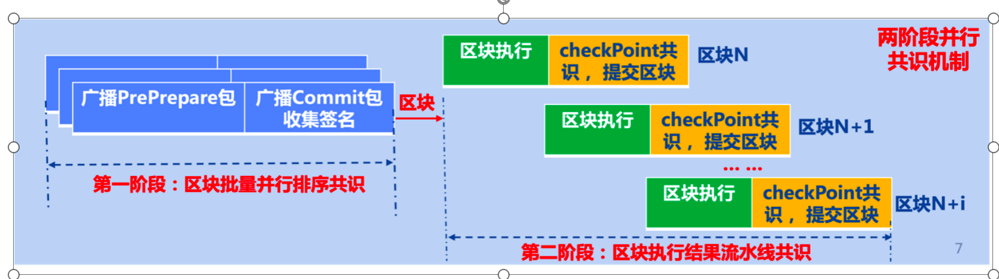

# 两阶段并行拜占庭共识

标签：``共识`` ``BFT``

----------

```eval_rst
.. note::
   FISCO BCOS 3.x共识模块的实现位于仓库 `bcos-pbft <https://github.com/FISCO-BCOS/bcos-pbft>`_
```

为了保证区块链系统的安全性和性能，当前联盟区块链系统一般采用拜占庭共识算法。但由于链式区块链系统的每个区块头必须包含父区块的哈希和当前区块执行结果一方面导致了区块共识必须串行进行(即对第N个区块的共识必须在开始共识第N+1个区块之前完成), 另一方面导致区块链共识与区块执行、提交紧密耦合（即整个区块共识流程中必须包含区块执行和区块提交的步骤），且区块打包、广播共识消息包等低CPU占用的过程中，无法并行进行区块执行，严重降低了系统资源利用效率，降低了区块链系统性能。

为了解决当前区块链系统串行共识的性能问题，FISCO BCOS 3.x提出了一种两阶段并行拜占庭共识算法，该算法将区块链系统的共识划分成区块批量并行排序共识和区块执行结果流水线共识两个阶段，且两阶段可并行进行。区块批量并行排序共识和区块执行结果流水线共识均支持对多个区块进行并行共识，从而提升了区块链吞吐量。

区块批量并行排序共识负责对交易池内接收到的交易进行排序，并行产生未执行且排序好的区块；区块执行结果流水线共识对区块执行结果进行流水线共识，并提交共识成功的区块。

区块批量并行排序共识和区块执行结果流水线共识两个阶段可并行进行；且这两个阶段均可同时对多个区块进行共识


下图展示了两阶段并行拜占庭共识算法的架构，整个系统主要包括区块批量排序并行共识与区块执行结果流水线共识两个部分：



## 1. 区块批量并行排序共识流程

本阶段采用PBFT共识算法，将交易池中的交易打包到多个区块，并行对这些区块进行共识，产生排序好、未执行的区块，设区块链当前区块高度为h，该阶段具体流程如下：

(1) Leader从交易池打包若干个区块，设为`{block(i), block(i+1), …, block(i+N)}`, 并将这些区块放置到共识预准备Pre-Prepare消息包中，产生`{PrePrepare(i), PrePrepare(i+1), …, PrePrepare(i+N)}`，每个预准备消息包均包含消息包索引、视图信息、打包好的区块以及消息包签名，即`PrePrepare(i) = {i, view, block(i), sig}`;

(2) Leader将产生的多个预准备消息包同时广播给所有其他共识节点，其他共识节点收到共识预准备消息包`PrePrepare(i) = {i, view, block(i), sig}`后，验证该消息包的有效性，主要验证包括：

- 验证本地是否已经接收过该预准备消息包

- 验证消息包索引i的有效性：i必须大于区块链当前高度h，并小于`(h + waterMarkLimit)`，`waterMarkLimit`是用来限制可同时进行共识的区块数目的参数，以保证区块链系统的稳定性；

- 验证视图`view`的有效性：view必须不小于当前节点的视图；

- 验证签名`sig`的有效性：计算索引、视图、`view`的哈希`hash(i, view, block(i))`, 并以该哈希作为明文，取出Leader的公钥验证签名`sig`的有效性；

(3) 其他节点验证预准备消息包成功后，将其加入到本地缓存中，并向所有其他节点广播`Prepare`消息包`Prepare(i) = {i, view, blockHash(i), sig}`，其中i是该消息包的索引，与预准备消息包索引一一对应，view是发送该消息包时的节点视图，`blockHash(i)`是收到的预准备消息包中包含的区块哈希，`sig`是节点对`{i, view, blockHash(i)}`的签名；

(4) 其他节点收到Prepare消息包`Prepare(i) = {i, view, blockHash(i), sig}`后，验证该消息包有效性，验证步骤包括：
- 验证Prepare消息包索引i的有效性：索引i必须大于区块链当前区块高度h，并小于`(h + waterMarkLimit)`

- 验证视图view的有效性：view必须不小于区块链节点当前视图

- 验证签名sig的有效性：计算消息包哈希`hash(i)=hash(i, view, blockHash(i))`，并以`hash(i)`为明文，使用消息包发送节点的公钥验证签名sig的有效性

(5) 若Prepare消息包验证通过，节点将该消息包放置到本地缓存中，当节点收集到三分之二的Prepare消息包后，该节点进入pre-commit阶段，向所有其他节点广播提交消息包CommitReq(i) = {i, view, blockHash(i), sig}，其中i是该消息包的索引，view是当前视图，blockHash(i)是区块i的哈希，sig是对该消息包的签名;

(6) 其他节点收到提交消息包`CommitReq(i) = {i, view, blockHash(i), sig}`后，验证该消息包的有效性，验证步骤包括：
- 验证提交消息包索引的i的有效性：索引i必须大于区块链当前区块高度h，并小于`(h + waterMarkLimit)`

- 验证视图view的有效性：`view`必须不小于区块链节点当前视图

- 验证签名sig的有效性：计算消息包哈希`hash(i)=hash(i, view, blockHash(i))`，并以`hash(i)`为明文，使用消息包发送节点的公钥验证签名sig的有效性

(7) 当提交消息包CommitReq(i)验证通过后，节点将该消息包加入到本地缓存中，当节点收集满三分之二的提交消息包后，则从预处理消息包中取出区块block(i)，将其提交到存储中。

对于步骤1产生的所有预处理消息包，重复进行步骤2到步骤7，从而完成N个区块的并行排序共识。

## 2. 区块执行结果流水线共识

并行排序共识产生N个确定性区块会放到区块队列中，记为`BlockQueue = {block(i), block(i+1),…,block(i+N)}`，第二阶段共识源源不断从区块队列中取出未执行的区块进行执行，并对区块执行结果进行流水线共识，具体步骤如下：

- 共识引擎从区块队列中取出未执行的区块，记为`block(i)`，并将其放入执行引擎中执行，执行结果的状态记为`checkPoint(i)`，其对应的哈希记为`checkPointHash(i)`

- 区块执行完毕后，节点产生检查点消息包`CheckPointReq(i) = {i, checkPointHash(i), sig}`，其中i是区块高度，`checkPointHash(i)`是区块执行结果的哈希，sig是对消息包的签名，并向所有节点广播该检查点消息包

- 其他节点收到检查点消息包`CheckPointReq(i) = {i, checkPointHash(i), sig}`后，验证签名的有效性，若签名验证通过，则该消息包放置到本地缓存中；

- 当节点收集满三分之二个与本地执行结果相同、来自不同共识节点的检查点消息包后，则认为所有共识节点就区块执行结果`checkPointHash(i)`达成了一致，则将执行结果状态`checkPoint(i)`提交到存储中，并更新区块链状态到最新。

当区块`block(i)`执行完毕后，区块`block(i+1)`即可基于区块`block(i)`的状态执行，并将区块`block(i)`执行后的区块哈希作为父区块哈希，产生新的执行结果`checkPoint(i+1)`，并基于区块执行结果继续重复以上步骤对第(i+1)个区块执行结果进行共识。

另外，在进行区块批量共识排序的同时，区块执行结果流水线共识可并行进行，优化了系统资源利用效率，提升了区块链系统共识性能。