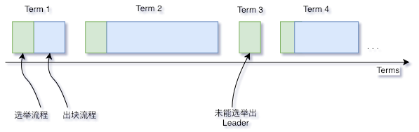
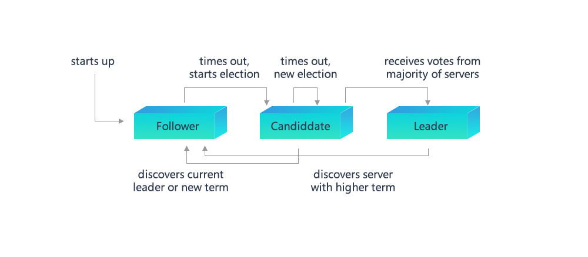

# Raft

标签：``Raft`` ``共识算法`` ``设计方案``

----
## 1 名词解释

### 1.1 Raft
Raft（Replication and Fault Tolerant）是一个允许网络分区（Partition Tolerant）的一致性协议，它保证了在一个由N个节点构成的系统中有(N+1)/2（向上取整）个节点正常工作的情况下的系统的一致性，比如在一个5个节点的系统中允许2个节点出现非拜占庭错误，如节点宕机、网络分区、消息延时。Raft相比于Paxos更容易理解，且被证明可以提供与Paxos相同的容错性以及性能，其详细介绍可见[官网](https://raft.github.io/)及[动态演示](http://thesecretlivesofdata.com/raft/)。

### 1.2 节点类型

在Raft算法中，每个网络节点只能如下三种身份之一：**Leader**、**Follower**以及**Candidate**，其中:
* **Leader**：主要负责与外界交互，由Follower节点选举而来，在每一次共识过程中有且仅有一个Leader节点，由Leader全权负责从交易池中取出交易、打包交易组成区块并将区块上链；
* **Follower**：以Leader节点为准进行同步，并在Leader节点失效时举行选举以选出新的Leader节点；
* **Candidate**：Follower节点在竞选Leader时拥有的临时身份。

### 1.3 节点ID & 节点索引
在Raft算法中，每个网络节点都会有一个固定且全局的唯一的用于表明节点身份的ID（一般是一个64字节表示数字），这称为节点ID；同时每个共识节点还会维护一份公共的共识节点列表，这个列表记录了每个共识节点的ID，而自己在这个列表中的位置被称为节点索引。

### 1.4 任期
Raft算法将时间划分为不定长度的任期Terms，Terms为连续的数字。每个Term以选举开始，如果选举成功，则由当前leader负责出块，如果选举失败，并没有选举出新的单一Leader，则会开启新的Term，重新开始选举。


## 1.5 消息
在Raft算法中，每个网络节点间通过发送消息进行通讯，当前Raft模块包括四种消息：**VoteReq**、**VoteResp**、**Heartbeat**、**HeartbeatResp**，其中：
* **VoteReq**：投票请求，由Candidate节点主动发出，用于向网络中其他节点请求投票以竞选Leader；
* **VoteResp**：投票响应，在节点收到投票请求后，用于对投票请求进行响应，响应内容为同意或拒绝该投票请求；
* **Heartbeat**：心跳，由Leader节点主动周期发出，其作用有两个：(1) 用于维护Leader节点身份，只要Leader能够一直正常发送心跳且被其他节点响应，Leader身份就不会发生变化；(2) 区块数据复制，当Leader节点成功打包一个区块后，会将区块数据编码至心跳中以将区块进行广播，其他节点在收到该心跳后会解码出区块数据并将区块放入自己的缓冲区中；
* **HeartbeatResp**：心跳响应，在节点收到心跳后，用于对心跳进行响应，特别的，当收到一个包含区块数据的心跳时，该心跳的响应中会带上该区块的哈希；

所有消息共有的字段如下表所示：

| 字段名    | 字段含义                     |
| --------- | ---------------------------- |
| idx       | 自身节点索引                 |
| term      | 前节点所处在的任期           |
| height    | 当前节点所持有的最高块的块高 |
| blockHash | 前节点所持有的最高块的哈希   |

每种消息类型特有的字段如下表所示：
<table border="1" cellspacing="0" cellpadding="0">
<thead>
  <tr>
    <td>消息类型</td>
    <td>字段名</td>
    <td>字段含义</td>
  </tr>
</thead>
<tr>
  <td rowspan="3" align="left">VoteReq</td>
  <td>candidate</td> 
  <td>Candidate自身的节点索引</td>
</tr>
<tr>
    <td>lastLeaderTerm</td>
    <td>Candidate见到过的最后一个Leader的Term，其详细作用见3.1.2节</td>
</tr>
<tr>
  <td>lastBlockNumber</td>
  <td>Candidate见到过的最新块的块高，其详细作用见3.1.2节</td>
</tr>
<tr>
  <td rowspan="2" align="left">VoteResp</td>
  <td>voteFlag</td>
  <td>对投票请求的响应标志位，用以标记对是否同意投票请求，若是拒绝还会具体标记拒绝原因，其详细作用见3.1.2节</td>
</tr>
<tr>
  <td>lastLeaderTerm</td>
  <td>收到VoteReq的节点见到过的最新块的块高，其详细作用见3.1.2节</td>
</tr>
<tr>
  <td rowspan="3" align="left">Heartbeat</td>
  <td>leader</td>
  <td>发出心跳的Leader节点的节点索引</td>
</tr>
<tr>
  <td>uncommitedBlock</td>
  <td>当Leader节点预备提交一个新块时，会先将区块数据编码进此字段以并通过心跳进行广播，其详细作用见3.2节</td>
</tr>
<tr>
  <td>uncommitedBlockNumber</td>
  <td>uncommitedBlock对应的块高，其详细作用见3.2节</td>
</tr>
<tr>
  <td rowspan="1" align="left">HeartbeatResp</td>
  <td>uncommitedBlockHash</td>
  <td>当收到Leader发送过来的uncommitedBlock数据时，节点在心跳响应中写入uncommitedBlock对应的哈希（指纹），并发送回Leader，表明节点已经收到Leader预备提交的区块数据且已写入本地缓存，其详细作用见3.2节</td>
</tr>
</table>

## 2 系统框架
系统框架如下图所示：


* Raft Sealer：负责从交易池取出交易并打包成区块，并发送至Raft Engine进行共识。区块上链后，Raft Sealer负责从交易池中删除已上链交易；
* Raft Engine：负责在共识节点进行共识，将达成共识的区块上链。

## 3 核心流程

### 3.1 节点状态转换
节点类型之间转换关系如下图所示，每种状态转换形式将在接下来的各个小节进行阐述：



#### 3.1.1 选举
Raft共识模块中使用心跳机制来触发Leader选举。当节点启动时，节点自动成为Follower且将Term置0。只要Follower从Leader或者Candidate收到有效的Heartbeat或RequestVote消息，其就会保持在Follower状态，如果Follower在一段时间内（这段时间称为 ***Election Timeout***）没收到上述消息，则它会假设系统当前的Leader已经失活，然后增加自己的Term并转换为Candidiate，开启新一轮的Leader选举流程，流程如下:
1. Follower增加当前的Term，转换为Candidate；
2. Candidate将票投给自己，并广播RequestVote到其他节点请求投票；
3. Candidate节点保持在Candidate状态，直到下面三种情况中的一种发生：(1)该节点赢得选举；(2) 在等待选举期间，Candidate收到了其他节点的Heartbeat；(3) 经过*Election Timeout*后，没有Leader被选出。Raft算法采用随机定时器的方法来避免节点选票出现平均瓜分的情况以保证大多数时候只会有一个节点超时进入Candidate状态并获得大部分节点的投票成为Leader。
    
#### 3.1.2 投票
节点在收到VoteReq消息后，会根据消息的内容选择不同的响应策略：
1. ***VoteReq的Term小于或等于自己的Term***

    * 如果节点是Leader，则拒绝该投票请求，Candidate收到此响应后会放弃选举转变为Follower，并增加投票超时；
    * 如果节点不是Leader：
        * 如果VoteReq的Term小于自己的Term，则拒绝该投票请求，如果Candidate收到超过半数的该种响应则表明其已经过时，此时Candidate会放弃选举转变为Follower，并增加投票超时；
        * 如果VoteReq的Term等于自己的Term，则拒绝该投票请求，对于该投票请求不作任何处理。对于每个节点而言，只能按照先到先得的原则投票给一个Candidate，从而保证每轮选举中至多只有一个Candidate被选为Leader。
        
2. ***VoteReq的lastLeaderTerm小于自己的lastLeaderTerm***

    每个节点中会有一个lastLeaderTerm字段表示该节点见过的最后一个Leader的Term，lastLeaderTerm仅能由Heartbeat进行更新。如果VoteReq中的lastLeaderTerm小于自己的lastLeaderTerm，表明Leader访问这个Candidate存在问题，如果此时Candidate处于网络孤岛的环境中，会不断向外提起投票请求，因此需要打断它的投票请求，所以此时节点会拒绝该投票请求。
    
3. ***VoteReq的lastBlockNumber小于自己的lastBlockNumber***

    每个节点中会有一个lastBlockNumber字段表示节点见到过的最新块的块高。在出块过程中，节点间会进行区块复制（详见3.2节），在区块复制的过程中，可能有部分节点收到了较新的区块数据而部分没有，从而导致不同节点的lastBlockNumber不一致。为了使系统能够达成一致，需要要求节点必须把票投给拥有较新数据的节点，因此在这种情况下节点会拒绝该投票请求。
    
4. ***节点是第一次投票***
	
    为了避免出现Follower因为网络抖动导致重新发起选举，规定如果节点是第一次投票，直接拒绝该投票请求，同时会将自己的firstVote字段置为该Candidate的节点索引。

5. ***1~4步骤中都没有拒绝投票请求***

   同意该投票请求。

#### 3.1.3 心跳超时
在Leader成为网络孤岛时，Leader可以发出心跳、Follower可以收到心跳但是Leader收不到心跳回应，这种情况下Leader此时已经出现网络异常，但是由于一直可以向外发送心跳包会导致Follower无法切换状态进行选取，系统陷入停滞。为了避免第二种情况发生，模块中设置了心跳超时机制，Leader每次收到心跳回应时会进行相应记录，一旦一段时间后记录没有更新则Leader放弃Leader身份并转换为Follower节点。

### 3.2 区块复制
Raft协议强依赖Leader节点的可用性来确保集群数据的一致性，因为数据只能从Leader节点向Follower节点转移。当Raft Sealer向集群Leader提交区块数据后，Leader将该数据置为未提交（uncommitted）状态，接着Leader 节点会通过在Heartbeat中附加数据的形式并发向所有Follower节点复制数据并等待接收响应，在确保网络中超过半数节点已接收到数据后，再将区块数据写入底层存储中，此时区块数据状态已经进入已提交（committed）状态。此后Leader节点再通过Sync模块向其他Follower节点广播该区块数据，区块复制及提交的流程图如下图所示：

```eval_rst
.. mermaid::

  sequenceDiagram
    participant Sealer
    participant Leader
    participant Follower

    Sealer->>Leader: 将交易打包为区块，阻塞自身
    Leader->>Follower: 将区块编码为RLP编码随心跳包发送
    Note right of Follower: 对心跳包进行解码，<br/>并将解码出来的区块<br/>写入缓存中
    Follower->>Leader: 发送ACK
    loop 收集ACK
      Leader->>Leader: 检查大多数节点是否已经收到区块拷贝
    end
    Leader->>Sealer: 解除阻塞
    Leader->>Leader: 执行区块
    Leader->>Leader: 丢弃已经上链的交易

```

其中RaftSealer验证是否当前是否能打包交易的验证条件包括：(1) 是否为Leader；(2) 是否存在尚未完成同步的peer； (3) uncommitBlock字段是否为空，只有三个条件均符合才允许打包。
