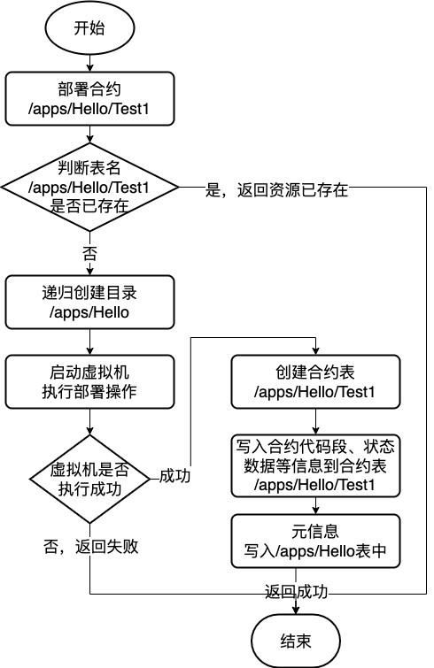

# 区块链合约文件系统

标签：``合约目录``，``区块链文件系统``，``BFS``

----------

"**Everything is a file descriptor**."

FISCO BCOS 3.x版本引入区块链合约文件系统（Blockchain File System，BFS）概念，类似于Linux的VFS，将区块链中的合约资源使用树形文件目录形式进行组织划分管理。

## 1. 使用示例

### 1.1 使用示例

- 用户可通过控制台操作智能合约类似于Linux终端的体验

  ```shell
  # 使用ls查看资源
  [group0]: /apps> ls
  hello_bfs
  # 使用mkdir命令创建目录
  [group0]: /apps> mkdir hello_dir
  Success
  # 使用cd命令返回上一级目录
  [group0]: /apps> cd ..
  
  # 使用ln命令创建合约的软链接
  [group0]: /> ln /apps/hello_bfs/v2 6849f21d1e455e9f0712b1e99fa4fcd23758e8f1
  {
      "code":0,
      "msg":"Success"
  }

  [group0]: /> cd /apps
  
  # 直接对路径中合约的软链接进行调用
  [group0]: /apps> call ./hello_bfs/v2 get
  ---------------------------------------------------------------------------------------------
  Return code: 0
  description: transaction executed successfully
  Return message: Success
  ---------------------------------------------------------------------------------------------
  Return value size:1
  Return types: (string)
  Return values:(Hello, World!)
  ---------------------------------------------------------------------------------------------
  # ls软链接可查看映射的地址
  [group0]: /> ls ./hello_bfs/v2
  v2 -> 6849f21d1e455e9f0712b1e99fa4fcd23758e8f1
  
  # 使用tree命令展示资源结构
  [group0]: /> tree /apps
  /apps
  ├─hello_bfs
  │ ├─v1
  │ └─v2
  └─hello_dir
  
  2 directory, 2 contracts.
  
  ```

- 用户可以在智能合约中调用BFS接口，操作区块链内的文件系统

  - BFS是预编译合约，用户可在智能合约中，通过引入BFS预编译合约的固定地址，直接调用BFS的接口。

  - 在Solidity智能合约中固定地址为`0x100e`，WASM执行环境中固定地址为`/sys/bfs` 。

    ```solidity
    struct BfsInfo {
        string file_name;
        string file_type;
        string[] ext;
    }
    abstract contract BfsPrecompiled {
        // @return return BfsInfo at most 500, if you want more, try list with paging interface
        function list(string memory absolutePath) public view returns (int32, BfsInfo[] memory);

        // for cns compatibility
        function link(string memory name, string memory version, address _address, string memory _abi) public returns (int32);

        function readlink(string memory absolutePath) public view returns (address);
    }
    ```

### 1.2 详细使用文档

BFS的使用体验主要集中体现在控制台，请参考控制台中BFS相关操作命令，以及使用控制台的BFS命令时的注意事项、错误出现情况请参考：[链接](../develop/console/console_commands.html#bfs)。

使用合约调用的BFS接口时的注意事项、错误出现情况请参考：[链接](../develop/precompiled/precompiled_contract_api.html#bfsprecompiled) 。

同时在部署合约和调用合约均支持BFS使用，请参考控制台中[deploy命令](../develop/console/console_commands.html#deploy)与[call命令](../develop/console/console_commands.html#call)。

## 2. 设计文档

在区块链的存储架构中，合约的数据存储在一张与合约地址对应的存储表中。在发起对某个合约的调用时，执行器从存储访问合约地址对应的存储表，获取表中的代码字段，加载到虚拟机中进行执行。这在单进程的节点中是完全可行的，配合存储的缓存也可以有很高的执行性能。但在FISCO BCOS 3.x版本的微服务模块化设计架构中就不再可行。计算集群需要知道合约地址对应的存储表挂载在哪一个存储实例中，势必会遇到寻址映射、映射同步等问题，不利于执行器的调度和分区挂载。

设计目标：

- 方便执行模块调度和分区挂载，允许存储挂载多个分布式用例；

- 相比于CNS集中式的合约寻址体验，BFS提供更易于人类阅读、理解和分区管理的**合约资源寻址体验**；

- 资源路径分区管理，不同分区不同职责；

- 提供通用接口给用户调用，用户可以在智能合约中操作BFS资源。

设计约束：

- BFS的操作接口均以预编译合约的形式实现；
- BFS维护合约文件系统的树形逻辑结构，表现为树形的多级目录层；在实际存储层中，绝对路径均为表名；
- BFS中的资源类型可以简单归类为目录资源、合约资源；
- 不允许用户随意创建数据，用户只允许在`/apps` 、`/tables` 目录下进行操作

### 2.1 BFS分区管理

为了方便运维管理，且方便不同应用的分区隔离，现将BFS做以下分区管理：

| **分区名** | **路径主要用途** | **说明**                                                                                              |
|------------|------------------|-------------------------------------------------------------------------------------------------------|
| /sys       | 系统合约目录     | 该目录存放系统合约的逻辑结构，目前不支持更改。                                                        |
| /apps      | 业务合约目录     | 用户只能在该目录下创建目录、部署合约，部署合约将会在此目录下创建路径，如 /apps/Hello/，支持多级目录。 |
| /tables    | 用户表目录       | 用户创建的表合约均放在该目录下，公有可见。                                                            |
| /usr       | 用户目录         | 用户作为合约存放在用户目录 ，用户合约将用户名、公钥、权限绑定起来，并提供功能接口**（暂未实现）**     |

分区限制：

- 用户只允许在`/apps/`、`/tables/`下进行创建目录操作；
- 使用底层的KVTable或者Table的接口创建的合约表，将在`/tables/`目录下创建用户表路径；
- 用户在部署合约时，均会在`/apps/`目录下增加目录。

### 2.2 BFS在区块链整体架构中的定位

在执行调度时，可并行的交易将会分别下发到不同的执行物理机中（在这里简称执行器）。在交易下发的过程中，执行器将会从缓存读取数据，若缓存不存在交易执行需要的数据则会从存储读取。在读取缓存时，计算集群要保证不同的执行器读取的数据是不冲突的（即不存在不同执行器读取同一份数据，如果读取同一份数据则会有数据同步问题）。BFS中所有合约资源都具有唯一性和隔离性，可以保证每个执行器读到的资源可以在存储上互相隔离。

整体架构图如下所示，在执行交易时，BFS所维护的树形文件数据结构存在于执行器中的缓存中，在实际的存储层，资源的绝对路径就是存储层中的表名。执行器在执行合约时将通过资源路径寻址到对应的合约存储表，从而通过资源绝对路径寻址到对应的存储表。可以看出，BFS在区块链中是维护<资源路径=>存储表>的映射关系。

进一步看，BFS的树形组织形式可以有效解决合约资源在调度执行和分区存储的问题，不同分区的执行器在执行时可以只加载某个目录底下的合约状态数据，不同的存储实例也可以挂载到不同的目录结构下。


### 2.3 BFS组织结构

BFS以树形结构维护资源路径到存储表的映射关系，在实际存储层中，合约资源的绝对路径为存储表的表名。

BFS逻辑结构图如下所示，上部分为智能合约树形目录结构示例图，表示为所有资源文件的逻辑组织形式；下半部分为智能合约树形目录在存储中的实际表现，表示在存储中实际存储的表内容。例如，`/apps/Hello1` 路径在逻辑结构中存在 `/` 、 `/apps/` 和`/apps/Hello1` 三层结构，在存储结构中， `/` 、 `/apps/` 和`/apps/Hello1` 都存在对应的一张存储表，存储表名均为对应的绝对路径。


### 2.4 BFS存储表的存储内容

BFS中的资源类型可以简单归类为目录资源、合约资源，其中合约资源又可分为普通合约、Table合约、预编译合约、合约软链接等。下图展示了BFS所涉及的所有存储表：


- 目录资源存储表中主要记录着目录路径下的子资源名、资源类型等数据，存储内容如下：

  | name   | type      | status | acl_type    | acl_black | acl_white | extra |
  |--------|-----------|--------|-------------|-----------|-----------|-------|
  | apps   | directory | normal | black/white | {...}     | {...}     | ...   |
  | tables | directory | normal | black/white | {...}     | {...}     | ...   |
  | sys    | directory | normal | black/white | {...}     | {...}     | ...   |
  | usr    | directory | normal | black/white | {...}     | {...}     | ...   |

- 合约资源存储表中主要记录合约在执行时所需要的状态数据，下面将对合约资源的各种类型在存储表中的不同进行分别讨论

  - 普通合约、Table合约

    - 这类合约资源存储表主要存储 `code` 字段，以及其他的状态数据

  | Key   | Value                                    |
  |-------|------------------------------------------|
  | code  | 执行时加载到执行引擎的二进制字段         |
  | abi   | 执行时加载到执行引擎进行DAG分析的ABI字段 |
  | state | ... (其他状态数据)                       |

  - 合约软链接

    - 这类合约资源主要存储软链接所对应的真实合约地址，以及真实合约对应的ABI

  | Key          | Value                 |
  |--------------|-----------------------|
  | type         | link                  |
  | name         | v1                    |
  | link_address | 0x123456 （合约地址） |
  | link_abi     | ... （合约ABI）       |

  - 预编译合约

    - 这类合约资源只做逻辑展示，没有实际存储表

### 2.5 BFS存储表的生命周期

BFS存储表生命周期主要包括创建、修改、读取，暂时不支持删除、移动等操作。从BFS资源分类来看，分为目录资源的创建和读取、普通合约的创建和读取、合约软链接的创建修改与读取三种，下面将分类讨论。

#### 2.5.1 目录资源生命周期

- 在区块链创世块初始化时，将会创建链上系统目录：`/`、`/apps` 、`/tables` 、`/usr`、`/sys` ，这些目录资源将在初始化时创建。
- 在创建BFS资源时，支持绝对路径多级目录创建，在这时将会递归创建绝对路径中不存在的目录资源，例如：在创建 /tables/test/t1时，/tables/test 路径不存在，将会创建 /tables/test 目录资源。
- 用户可以通过BFS list接口读取目录资源中的 `sub_dir`

#### 2.5.2 普通合约资源生命周期

- 在用户发起创建合约请求时、或者合约创建合约请求时，将会在 `/apps` 目录下创建对应的合约资源表，例如：创建合约 0x123456合约时，将会创建 `/apps/123456` 的存储表。
- **值得注意的是：** Solidity的地址由于其不可读的性质与BFS易读可见的原则相悖，因此Solidity部署后的合约地址只生成合约存储表，其BFS元数据不会写入 `/apps` 表内。例如：用户部署合约后地址为 0x123456，链上将会为合约创建合约存储表`/apps/123456`，但并不会将元数据写入到 `/apps` 内，即用户调用`list(/apps)`，不会显示子目录有`123456`这个资源。用户后续可以通过link操作，将solidity合约地址与BFS进行绑定。
- 在用户发起创建Table合约请求时，将会在 `/tables` 目录下创建对应的合约资源表，例如：创建Table合约 t_test合约时，将会创建 `/tables/t_test` 的存储表。
- 在执行合约时，将会读取合约资源对应的存储表中的状态数据。
- 在部署普通合约是，将会创建合约的权限数据表，详情请参考：[权限底层节点设计](./committee_design.html#id15)

#### 2.5.3 合约软链接资源生命周期

- 用户可以通过 `link` 接口创建合约软链接资源，将会在`/apps` 目录下创建对应的资源，例如：调用link时参数为 Hello v1 0x123456，合约名为Hello，v1为版本号，0x123456为真实合约地址，将会创建 `/apps/Hello/v1` 合约软链接资源。
- 同样的，用户可以通过 `link`  接口覆盖写入合约软链接资源，例如：再次调用link时参数为 Hello v1 0x666888，将会覆盖写入`/apps/Hello/v1` 合约软链接资源。
- 用户可以通过控制台的 `call` 命令直接调用合约软链接，实现对真实合约的调用。
- 用户可以通过调用 `readlink` 接口获取合约软链接的真实合约地址，在调用合约时也可以读取合约地址和ABI进一步调用。

### 2.6 BFS主要接口实现

#### 2.6.1 部署合约

在部署合约时，将会预先确定该级目录父目录均已经存在且可以写入信息，然后启动虚拟机执行部署创建合约操作；虚拟机执行成功后， 创建合约的表，并将虚拟机执行后的合约代码段、ABI、状态数据等写入合约表，最后在父目录的数据表中记录新部署的合约的元信息。整体流程如下图所示，流程图以创建“/apps/Hello/World”为例。



#### 2.6.2 创建文件夹

在创建目录时，将会先预先确定该级目录父目录均已经存在且可以写入信息，之后在父目录的数据表中记录新创建路径的目录的元信息。整体流程如下图所示，流程图以创建“/apps/Hello/World”为例。


## 3. 兼容性说明

### 3.1 BFS对CNS的兼容说明

FISCO BCOS 3.+ BFS与2.+版本的CNS服务类似，提供链上合约路径与合约地址、合约版本的映射关系的记录及相应的查询功能，方便调用者通过记忆简单的合约名来实现对链上合约的调用。BFS相比CNS更近一步，具有多层级的概念，可以更加直观地展示路径层级关系，方便用户管理。

为了适配用户在2.+版本已经使用过CNS接口的代码逻辑，BFS提供了与CNS效果一致的接口：

```solidity
struct BfsInfo {
    string file_name;
    string file_type;
    string[] ext;
}
abstract contract BfsPrecompiled {
    // @return return BfsInfo at most 500, if you want more, try list with paging interface
    function list(string memory absolutePath) public view returns (int32, BfsInfo[] memory);
    // for cns compatibility
    function link(string memory name, string memory version, address _address, string memory _abi) public returns    (int32);
    function readlink(string memory absolutePath) public view returns (address);
}
```

- `link`接口与CNS的`insert`的参数一致，新增一个合约名/合约版本号到合约地址的映射关系，并记录其ABI。
- `list`接口与CNS的`selectByName`的遍历接口效果一致，将会返回目录下所有的资源，对应的合约地址在ext[0], 合约ABI在ext[1]。同时也兼容`selectByNameAndVersion`，如果参数对应的资源时软连接资源，那么将会返回一个资源。
- `readlink`接口与CNS的`getContractAddress`接口一致，根据合约名/合约版本号取到对应的合约地址。

**使用举例：** 接下来在控制台演示如何使用BFS的接口完成合约版本的增加、升级、遍历、调用等操作。

- 创建新的合约名与版本号：
  - 用户创建合约名Hello，版本为v1的BFS软连接：
  
  ```shell
  # 创建合约软链接，合约名为Hello，合约版本为v1
  [group0]: /apps> ln Hello/v1 0x19a6434154de51c7a7406edF312F01527441B561
  {
      "code":0,
      "msg":"Success"
  }
  # 创建的软链会在/apps/目录下创建链接文件
  [group0]: /apps> ls ./Hello/v1 
  v1 -> 19a6434154de51c7a7406edf312f01527441b561   
  ```
  
  - 此时，用户已经创建合约名Hello，并指定合约版本号为v1，此时在BFS的目录结构下，新创建的软连接的路径为`/apps/Hello/v1`
- 升级合约版本
  - 用户可以指定多个合约名对应的版本，且可以覆盖之前已经存在的版本号
  
  ```shell
  # 创建合约软链接，合约名为Hello，合约版本为latest
  [group0]: /apps> ln Hello/latest 0x2b5DCbaE97f9d9178E8b051b08c9Fb4089BAE71b
  {
      "code":0,
      "msg":"Success"
  }
  # 创建的软链会在/apps/目录下创建链接文件
  [group0]: /apps> ls ./Hello/latest 
  latest -> 0x2b5DCbaE97f9d9178E8b051b08c9Fb4089BAE71b
  # 可以覆盖版本号
  [group0]: /apps> ln Hello/latest  0x0102e8b6fc8cdf9626fddc1c3ea8c1e79b3fce94
  {
      "code":0,
      "msg":"Success"
  }
  ```
  
- 遍历指定合约名的所有版本号
  - 用户可以通过list接口遍历指定合约名的所有版本号
  
  ```shell
  [group0]: /apps> ls ./Hello
  latest  v1
  ```
  
- 获取合约名/版本号对应的地址
  
  ```shell
  [group0]: /apps> ls ./Hello/latest
  latest -> 0x0102e8b6fc8cdf9626fddc1c3ea8c1e79b3fce94
  ```

- 调用软连接
  
  ```shell
  [group0]: /apps> call Hello/latest get
  ---------------------------------------------------------------------------------------------
  Return code: 0
  description: transaction executed successfully
  Return message: Success
  ---------------------------------------------------------------------------------------------
  Return value size:1
  Return types: (string)
  Return values:(Hello, World!)
  ---------------------------------------------------------------------------------------------
  ```
