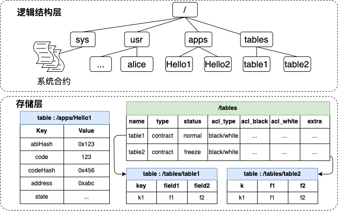
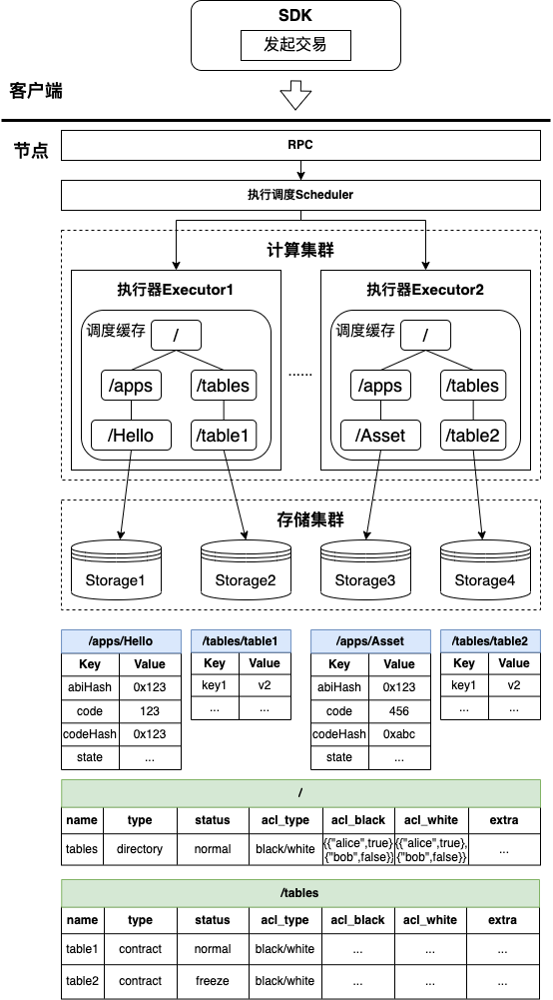

# 区块链合约文件系统

标签：``合约目录``，``区块链文件系统``，``BFS``

----------

在区块链的存储架构中，合约的数据存储在一张与合约地址对应的存储表中。在发起对某个合约的调用时，执行器从存储访问合约地址对应的存储表，获取表中的代码字段，加载到虚拟机中进行执行。这在单进程的节点中是完全可行的，配合存储的缓存也可以有很高的执行性能。但在FISCO BCOS 3.0版本的微服务模块化设计架构中就不再可行。计算集群需要知道合约地址对应的存储表挂载在哪一个存储实例中，势必会遇到寻址映射、映射同步等问题，不利于执行器的调度和挂在。

FISCO BCOS 3.0版本引入BFS（Blockchain File System）概念，类似于Linux的VFS，将区块链中的合约资源使用树形文件目录形式进行组织划分管理。BFS是一个逻辑结构，表现为多级的目录层，在实际存储层中，每一层目录的绝对路径均为表名。

## BFS设计

目标：

- 方便调度、挂载，允许存储挂载多个分布式用例，提供易于人类阅读、理解和管理的**合约资源寻址体验**；

- 资源路径分区管理，不同分区不同职责；

- 维护目录结构，提供通用接口。

定位：

- BFS是一个系统合约；
- 具有文件BFS基本功能，维护目录结构；
- 不保存状态信息，不允许用户随意创建数据。

### BFS分区管理

为了方便运维管理，且方便不同应用的分区隔离，现将BFS做以下分区管理：

| **分区名** | **路径主要用途** | **说明**                                                     |
| ---------- | ---------------- | ------------------------------------------------------------ |
| /sys       | 系统合约目录     | /sys/consensus、/sys/crypto_tools …                          |
| /apps      | 业务合约目录     | 用户只能在该目录下创建目录、部署合约，部署合约将会在此目录下创建路径，如 /apps/Hello/，支持多级目录。 |
| /tables    | 用户表目录       | 用户创建的表合约均放在该目录下，公有可见。                   |
| /usr       | 用户目录         | 用户作为合约存放在用户目录 ，用户合约将用户名、公钥、权限绑定起来，并提供功能接口（暂未实现） |

分区限制：

- 用户只允许在`/apps/`、`/tables/`下进行创建目录操作；
- 使用底层的KVTable或者Table(暂未支持)的接口创建的合约表，将在`/tables/`目录下创建用户表路径；
- 用户在部署合约时，均会在`/apps/`目录下增加目录。

### BFS逻辑结构图

BFS逻辑结构图如下所示：



上部分为智能合约树形目录结构示例图，表示为所有资源文件的逻辑组织形式。其中每一个方框均表示一个资源文件，在图中“/”、“/apps”等均为资源文件。在“/apps”目录资源下包含有“Hello1”、“Hello2”的子资源文件，均为智能合约资源。特殊的智能合约资源（实质上与普通智能合约资源一样），比如表智能合约table1、table2，以及系统智能合约，分别放在最右边的“/tables”和“/sys”目录资源下。

智能合约由树形的目录逻辑结构组织，那么每一个智能合约在分布式调度器进行调度执行时，将会以绝对路径名称进行调度，这里的绝对路径名称就是从根目录资源“/”出发，到最后的智能合约资源所使用的所有资源名按次序拼接。比如，在调用“Hello1”合约时，分布式调度器将以绝对路径“/apps/Hello1”进行调度。由此可以看出，绝对路径确定了所有智能合约在被调度时，是唯一的、可隔离的。

下半部分为智能合约树形目录在存储中的实际表现，表示在存储中实际存储的表内容。其中每一个表格均表示在存储中实际存储的表格。对应BFS所区分的资源种类，包含有目录资源和智能合约资源，其中智能合约包括普通智能合约和特殊智能合约。

BFS中包含两种主要资源：目录资源和智能合约资源。

目录资源主要存储其目录下所有的子资源文件，维系目录与子资源之间的父子关系。目录资源有以下规则：

- 所有种类的资源均可放置在同一个目录资源下；

- 某一个目录资源与该目录资源下所有的子资源是1对n的关系；

- 目录资源记录所有该目录资源下的子资源**元信息**；

- 目录资源下，不能存在同名的子资源，命名有一定规范；

智能合约资源为部署在系统中的智能合约，将以子资源文件的形式，存放在目录资源下。智能合约资源是分布式调度执行的最小单位。智能合约资源有以下规则：

- 不会有子资源放在智能合约资源下；
- 智能合约资源存放某一个智能合约的代码段和状态信息。

### BFS在整体架构中的示意图

整体架构图如下图所示，图5展示了节点在计算集群与存储集群上是如何通过BFS并行调度执行交易。在执行调度时，可并行的交易将会分别下发到不同的执行物理机中（在这里简称执行器）。在交易下发的过程中，执行器将会从缓存读取数据，若缓存不存在交易执行需要的数据则会从存储读取。在读取缓存时，计算集群要保证不同的执行器读取的数据是不冲突的（即不存在不同执行器读取同一份数据，如果读取同一份数据则会有数据同步问题），由于BFS中所有合约资源都是具有唯一性和隔离性，可以保证每个执行器读到的资源可以在存储上互相隔离。



## BFS接口

BFS在区块链节点中是以系统合约的形式存在，在Solidity环境中固定地址为`0x100e`，WASM执行环境中固定地址为`/sys/bfs` 。

目前BFS提供了两个主要接口：

```solidity
// 获取绝对路径下的所有子项目，如果路径对应的是合约，则返回合约的元信息
function list(string absolutePath) public returns (string);
// 在绝对路径下创建目录，如果创建过程中出现错误，将会返回错误码
function mkdir(string absolutePath) public returns (int256);
```

## BFS使用

BFS的使用体验主要集中在控制台中体现，请参考控制台中BFS相关操作命令：[链接](../develop/console/console_commands.html#bfs)。

同时在部署合约和调用合约均支持BFS使用，请参考控制台中[deploy命令](../develop/console/console_commands.html#deploy)与[call命令](../develop/console/console_commands.html#call)。
