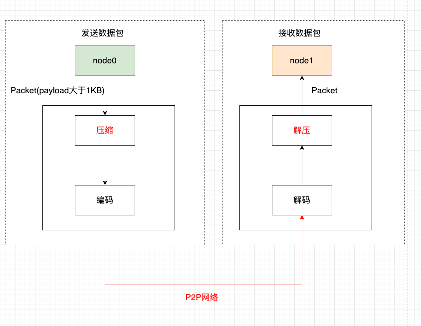
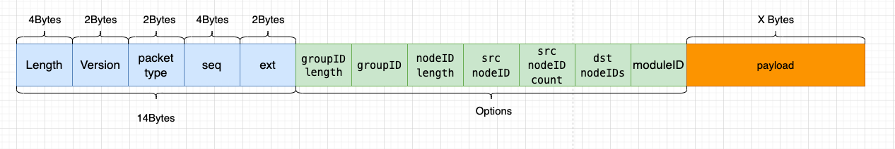
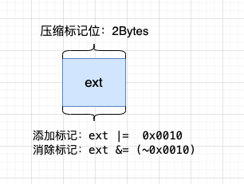

# 网络压缩

标签：``p2p网络压缩`` ``数据压缩``

----

外网环境下，区块链系统性能受限于网络带宽，为了尽量减少网络带宽对系统性能的影响，FISCO BCOS 3.0在`relase-3.1`支持p2p网络压缩功能，该功能主要在发送端进行p2p网络数据包压缩，在接收端将解包数据，并将解包后的数据传递给上层模块。该p2p网络压缩功能默认开启，无需通过配置项控制。

## 系统框架

网络压缩主要在P2P网络层实现，系统框架如下：

网络压缩主要包括两个过程：

- **发送端压缩数据包**：群组层通过P2P层发送数据时，若数据包大小超过1KB，而且接收端节点是3.1及之后的版本，则压缩数据包后，更新标记位`ext`，编码后，将其发送到目标节点；

- **接收端解压数据包**：节点收到数据包后，解码，根据标记位`ext`判断收到的数据包是否被压缩，若数据包是压缩后的数据包，则将其解压，重置ext标记位。

## 核心实现

综合考虑性能、压缩效率等，我们选取了[Zstd](https://github.com/facebook/zstd)来实现数据包压缩和解压功能。本节主要介绍网络压缩的实现。

### 数据压缩标记位

FISCO BCOS的网络数据包结构如下图：

网络数据包主要包括包头和数据两部分，包头占了14个字节，各个字段含义如下：

- Length: 数据包长度
- Version: 标记数据包版本类型，主要用于数据包版本兼容性
- packet type: 标记了数据包类型
- Seq: 数据包序列号
- ext: 用于对数据包拓展标记，如标记数据包是否是respond类型，是否被压缩

**网络压缩模块仅压缩网络数据，不压缩数据包头。**

考虑到压缩、解压小数据包无法节省数据空间，而且浪费性能，在数据压缩过程中，不压缩过小的数据包，仅压缩数据包大于`c_compressThreshold`的数据包.`c_compressThreshold`默认是1024(1KB)；Zstd的压缩级别，我们默认用了1。我们使用`ext`作为数据包压缩标志：

- 添加压缩标记：ext |=  0x0010
- 消除压缩标记：ext &= ~0x0010

### 处理流程

下面一个节点node0向其他节点node1发送p2p消息包packet为例，详细说明p2p网络压缩模块的关键处理流程。

**发送端处理流程**

- 节点node0将packet传入到P2P层;
- P2P判断packet的数据包大于`c_compressThreshold`，且接收端节点version是支持压缩的版本（3.1及之后版本），则调用压缩接口，对packet的payload数据进行压缩；
- 编码模块给packet加上包头，同时更新压缩标记位`ext`。即：若packet是压缩后的数据包，将`ext |=  0x0010`；
- P2P将编码后的数据包传送到目的节点。

**接收端处理流程：**

- 目标机器收到数据包后，解码模块分离出包头，通过判断包头ext字段，即`m_ext & 0x0010 == 0x0010`判断网络数据是否被压缩；
- 若网络数据包被压缩过，则调用解压接口，对payload数据进行解压；
- reset重置ext标记位，即`m_ext &= ~0x0010`，防止同个数据包被多次解压。

## 兼容性说明

- **数据兼容**：不涉及存储数据的变更；
- **网络兼容rc1**：向前兼容，仅有relase-3.1及以上节点具有网络压缩功能。