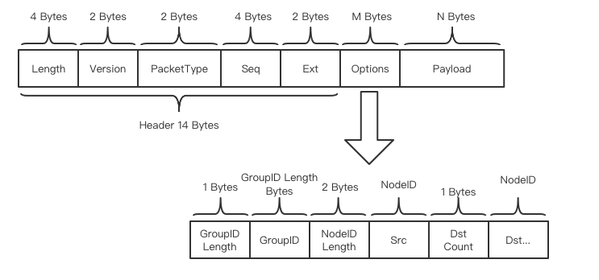

# 对等网络

标签：``对等网络`` ``P2P模块`` ``点对点网络`` ``状态同步``  ``AMOP``

----
## 设计目标

FISCO BCOS P2P模块提供高效、通用和安全的网络通信基础功能，支持区块链消息的单播、组播和广播，支持区块链节点状态同步，支持多种协议。P2P网络可动态配置，组网动态可配；此外，P2P网络保证单一节点故障应不影响节点的整网通信

## P2P主要功能
- 组网动态可配
  
P2P网络可动态配置，在系统运行过程中支持节点动态加入与退出，组网动态可配。
  
- 区块链节点标识

通过区块链节点标识唯一标识一个区块链节点，在FISCOBCOS中，nodeID时节点的唯一标识，在区块链网络上通过区块链节点标识对区块链节点进行寻址

- 管理网络连接

维持区块链网络上区块链节点间的TCP长连接，自动断开异常连接，自动发起重连

- 消息收发

在区块链网络的区块链节点间，进行消息的单播、组播或广播，每个消息都有唯一标识

- 状态同步

在区块链节点间同步状态

- 网络安全

网络模块保证单一节点故障不影响节点的整网通信，支持节点在异常场景恢复后恢复原组网功能


### 协议格式



P2P协议格式:

| name       | type         | description                          |
| :--------- | :----------- | :----------------------------------- |
| Length     | uint32_t     | 数据包长度，含包头和数据             |
| Version    | uint16_t     | 协议版本信息  |
| PacketType   | int16_t  | 消息类型   |
| Seq   | uint32_t | 消息序列号，自增，标记消息   |
| Ext | uint16_t     | 拓展字段 |
| Options        |   对象   | 选项字段         |
| Payload       |    bytes   |   负载        |

Options格式:
| name       | type         | description                          |
| :--------- | :----------- | :----------------------------------- |
| GroupID Length     | uint16_t     | 群组ID长度            |
| GroupID    | string     | 群组ID  |
| NodeID Length   | uint16_t  | 节点ID长度   |
| Src NodeID   | bytes | 消息源节点ID   |
| Dst Count | uint16_t     | 消息目的数目 |
| NodeIDs        |  数组  | 目的节点ID列表         |

## 区块链节点标识

区块链节点标识由ECC算法的公钥生成，每个区块链节点必须有唯一的ECC密钥对，区块链节点标识在区块链网络中唯一标识一个区块链节点

通常情况下，一个节点要加入区块链网络，至少要准备三个文件：

- node.key 节点密钥，ECC格式
- node.crt 节点证书，由CA颁发
- ca.crt CA证书，CA机构提供

区块链节点除了有唯一区块链节点标识，还能关注Topic，供寻址使用

区块链节点寻址：

- 区块链节点标识寻址

通过区块链节点标识，在区块链网络中定位唯一的区块链节点

- Topic寻址

通过Topic，在区块链网络中定位一组关注该Topic的节点

## 管理网络连接

区块链节点间，会自动发起和维持TCP长连接，在系统故障、网络异常时，主动发起重连

区块链节点间建立连接时，会使用CA证书进行认证

### 连接建立流程

```eval_rst
.. mermaid::

    sequenceDiagram
        participant 区块链节点A
        participant 区块链节点B

        区块链节点A->>区块链节点A: 加载密钥和证书
        区块链节点B->>区块链节点B: 加载密钥和证书
        区块链节点A->>区块链节点B: 发起连接
        区块链节点B->>区块链节点A: 连接成功
        区块链节点B->区块链节点A: 发起SSL握手
        区块链节点A->>区块链节点A: 从证书获取公钥，作为节点ID
        区块链节点B->>区块链节点B: 从证书获取公钥，作为节点ID
        区块链节点B->区块链节点A: 握手成功，建立SSL连接

```

## 消息收发

区块链节点间消息支持单播、组播和广播，每个消息都有唯一标识

- 单播，单个区块链节点向单个区块链节点发送消息，通过区块链节点标识寻址
- 组播，单个区块链节点向一组区块链节点发送消息，通过Topic寻址
- 广播，单个区块链节点向所有区块链节点发送消息

### 单播流程

```eval_rst
.. mermaid::

    sequenceDiagram
        participant 区块链节点A
        participant 区块链节点B

        区块链节点A->>区块链节点A: 根据节点ID，筛选在线节点
        区块链节点A->>区块链节点B: 发送消息
        区块链节点B->>区块链节点A: 消息回包

```

### 组播流程

```eval_rst
.. mermaid::

    sequenceDiagram
        participant 区块链节点A
        participant 区块链节点B
        participant 区块链节点C
        participant 区块链节点D

        区块链节点A->>区块链节点A: 根据Topic 1，选择节点B、C
        区块链节点A->>区块链节点B: 发送消息
        区块链节点A->>区块链节点C: 发送消息
        区块链节点B->>区块链节点B: 根据Topic 2，选择节点C、D
        区块链节点B->>区块链节点C: 发送消息
        区块链节点B->>区块链节点D: 发送消息
        区块链节点C->>区块链节点C: 根据Topic 3，选择节点D
        区块链节点C->>区块链节点D: 发送消息

```

### 广播流程

```eval_rst
.. mermaid::

    sequenceDiagram
        participant 区块链节点A
        participant 区块链节点B
        participant 区块链节点C
        participant 区块链节点D

        区块链节点A->>区块链节点A: 遍历所有节点ID
        区块链节点A->>区块链节点B: 发送消息
        区块链节点A->>区块链节点C: 发送消息
        区块链节点A->>区块链节点D: 发送消息
        区块链节点B->>区块链节点B: 遍历所有节点ID
        区块链节点B->>区块链节点C: 发送消息
        区块链节点B->>区块链节点D: 发送消息
        区块链节点C->>区块链节点C: 遍历所有节点ID
        区块链节点C->>区块链节点D: 发送消息

```

## 状态同步

每个节点会维护自身的状态，并将状态的Seq在全网定时广播，与其它节点同步

```eval_rst
.. mermaid::

    sequenceDiagram
        participant 区块链节点A
        participant 区块链节点B

        区块链节点A->区块链节点B: 广播seq
        区块链节点A->>区块链节点A: 判断节点B的seq是否变化
        区块链节点A->>区块链节点B: seq变化，发起状态查询请求
        区块链节点B->>区块链节点A: 返回节点状态
        区块链节点A->>区块链节点A: 更新节点B的状态和seq

```

## AMOP 消息转发流程

### 单播时序图

```eval_rst
.. mermaid::

    sequenceDiagram
        participant sdk [Subscriber]

        participant 节点0
        
        participant 节点1
        
        participant sdk [Publisher]
        
        sdk [Subscriber]->>节点0: 订阅 topic1、类型：0x32
        
        节点0->>节点0: 更新 topic 列表
        
        节点1->>节点0: 请求 topic 列表
        
        节点0-->>节点1: 响应 topic 列表
        
        sdk [Publisher]->>节点1: 往 topic1 单播消息、类型：0x30
        
        节点1->>节点0: 节点转发消息

        节点0->>sdk [Subscriber]: 节点转发消息

        sdk [Subscriber]-->>节点0: 回包、类型：0x31

        节点0-->>节点1: 节点转发消息

        节点1-->>sdk [Publisher]:节点转发消息

```

```eval_rst
.. note::

    - 单播是指如果有多个 Subscriber 订阅同一个 topic，节点则随机选择一个 Subscriber 推送消息
    - 消息发布者和消息订阅者需要选择同一个 topic
    - Subscriber 接收到消息之后的回包是由 sdk 自动发送，不需要用户自己处理，该回包仅仅表示 Subscriber 成功收到消息
    - 如果 Publisher 在推送消息之前，没有对应的订阅者，那么 Publisher 将会收到错误码 *100*，表示网络中没有可用节点

```

### 多播时序图

```eval_rst
.. mermaid::

    sequenceDiagram
        participant sdk [Subscriber0]
        
        participant sdk [Subscriber1]

        participant 节点0
        
        participant 节点1
        
        participant 节点2
        
        participant sdk [Publisher]
        
        sdk [Subscriber0]->>节点0: 订阅 topic1、类型：0x32
        
        节点0->>节点0: 更新 topic 列表
        
        节点1->>节点0: 请求 topic 列表
        
        节点0-->>节点1: 响应 topic 列表
        
        节点2->>节点0: 请求 topic 列表
        
        节点0-->>节点2: 响应 topic 列表
        
        sdk [Subscriber1]->>节点1: 订阅 topic1、类型：0x32
        
        节点1->>节点1: 更新 topic 列表
        
        节点0->>节点1: 请求 topic 列表
        
        节点1-->>节点0: 响应 topic 列表
        
        节点2->>节点1: 请求 topic 列表
        
        节点1-->>节点2: 响应 topic 列表
        
        sdk [Publisher]->>节点2: 往 topic1 多播消息、类型：0x35
        
        节点2->>节点0: 节点转发消息

        节点2->>节点1: 节点转发消息
        
        节点2-->>sdk [Publisher]: 回包、类型：0x31

        节点0->>sdk [Subscriber0]: 节点转发消息

        节点1->>sdk [Subscriber1]: 节点转发消息
        
```

```eval_rst
.. note::

    - 多播是指如果有多个 Subscriber 订阅同一个 topic，节点则向所有的 Subscriber 推送消息
    - 只要网络正常，即使没有 Subsciber 接收消息， Publisher 也可以收到节点消息推送成功的响应包

```