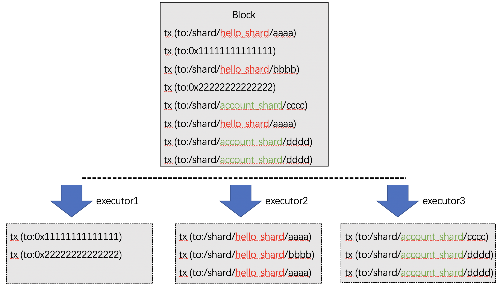

# 块内分片
标签: ``sharding``  ``分片`` ``交易执行``

-------

## 概念

当一条区块链上承载了多个应用时，可采用“**块内分片**”技术实现应用间交易执行的并行化。

FISCO BCOS支持中对链上的合约进行分组。在执行一个区块内的交易时，一个区块内的交易会根据合约的分组情况拆分成多个“**块内分片**”下文简称：分片），相同分片的交易调度到同一个执行器中执行。

## 方案

**关键点**

* 并行：一个区块内的不同分片调度至不同的执行器中并行执行。
* 局部：分片内部合约的相互调用直接在同一个执行器中完成，分片间互不干扰。
* 跨分片：跨分片调用直接在一个区块内完成，对用户透明无感，其调度基于DMC机制，避免繁重的SPV证明。
* 配置：用户可用控制台管理合约所属的分片
* 继承：分片内合约部署的合约属于相同的分片，消除繁琐的分片管理操作。

## 实现

实现方法如下：

* 并行：基于[FISCO BCOS的架构](../architecture.md)实现多executor的调度。
* 局部：一个executor内部，采用[DAG的方式并行执行](./dag.md)。
* 跨分片：跨分片的交易采用[DMC机制进行调度](./dmc.md)，在一个区块内完成的同时，保证一致性与存在性。
* 配置：基于[BFS](../contract_directory.md)实现合约的分片管理，启动控制台，用linkShard命令可绑定合约至分片，用 ls 命令查看分片信息。
* 继承：分片内合约部署的合约自动继承所属分片配置

## 举例

分片1：`/shard/hello_shard`

```
/shard/hello_shard/hello1
/shard/hello_shard/hello2
/shard/hello_shard/hello3
```

分片2：`/shard/account_shard`

```
/shard/account_shard/alice
/shard/account_shard/bob
/shard/account_shard/charies
```





## 操作举例

该操作需要使用控制台，请参考[此处](../../operation_and_maintenance/console/console_config.md)部署控制台。分片管理操作请参考此处。

**部署合约**

> 部署两个合约：Asset、HelloWorld

```
[group0]: /apps> deploy Asset 
transaction hash: 0x8dbee4602da3d3435ce73df3778ee975b650cfaf70ce6b53f14db6db478cec10
contract address: 0xcceef68c9b4811b32c75df284a1396c7c5509561
currentAccount: 0x988e6a553f434be3d37786c97abb1fe1f8b7341d

[group0]: /apps> deploy HelloWorld 
transaction hash: 0xcb860822f8d74ac447fc3d18870109a202ff788a6b1ef32970fa53497ba386d5
contract address: 0xd24180cc0fef2f3e545de4f9aafc09345cd08903
currentAccount: 0x988e6a553f434be3d37786c97abb1fe1f8b7341d
```

**创建分片**

> 创建两个分片：account_shard 和 hello_shard

```
[group0]: /apps> makeShard account_shard
make shard account_shard Ok. You can use 'ls' to check

[group0]: /apps> makeShard hello_shard
make shard hello_shard Ok. You can use 'ls' to check

[group0]: /apps> ls /shards/
account_shard   hello_shard 
```

**合约绑定分片**

> 分别将上述的两个合约绑定到不同的shard

```
[group0]: /apps> linkShard 0xcceef68c9b4811b32c75df284a1396c7c5509561 account_shard
Add 0xcceef68c9b4811b32c75df284a1396c7c5509561 to account_shard Ok. You can use 'ls' to check

[group0]: /apps> linkShard 0xd24180cc0fef2f3e545de4f9aafc09345cd08903 hello_shard
Add 0xd24180cc0fef2f3e545de4f9aafc09345cd08903 to hello_shard Ok. You can use 'ls' to check
```

**查询分片信息**

> 用getContractShard命令查看合约已经绑定至特定的shard

```
[group0]: /apps> getContractShard 0xcceef68c9b4811b32c75df284a1396c7c5509561
/shards/account_shard

[group0]: /apps> getContractShard d24180cc0fef2f3e545de4f9aafc09345cd08903
/shards/hello_shard
```

> BFS的ls命令也可以查询

```
[group0]: /apps> ls /shards/account_shard/
cceef68c9b4811b32c75df284a1396c7c5509561   

[group0]: /apps> ls /shards/hello_shard/
d24180cc0fef2f3e545de4f9aafc09345cd08903 
```

**调用shard内的合约**

> 交易会自动调度至相应的shard中执行，不同的shard在不同的执行器中执行，该操作对用户透明，体验上与调用普通合约无区别

``` 
[group0]: /apps> call HelloWorld 0xd24180cc0fef2f3e545de4f9aafc09345cd08903 set nice
transaction hash: 0x41637d8eb5907e84fd2bda6303d444bb7b3b9fe8cd85750dc547139710439b6e
---------------------------------------------------------------------------------------------
transaction status: 0
description: transaction executed successfully
---------------------------------------------------------------------------------------------
Receipt message: Success
Return message: Success
Return value size:0
Return types: ()
Return values:()
---------------------------------------------------------------------------------------------
Event logs
Event: {}
```

