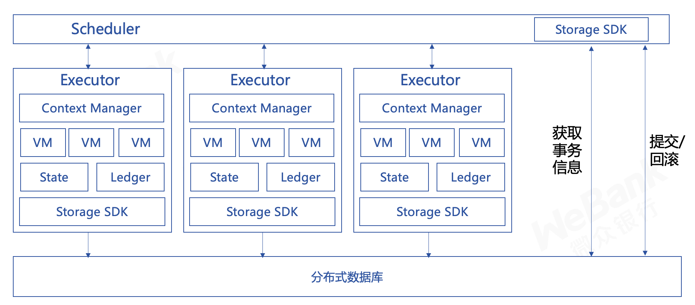
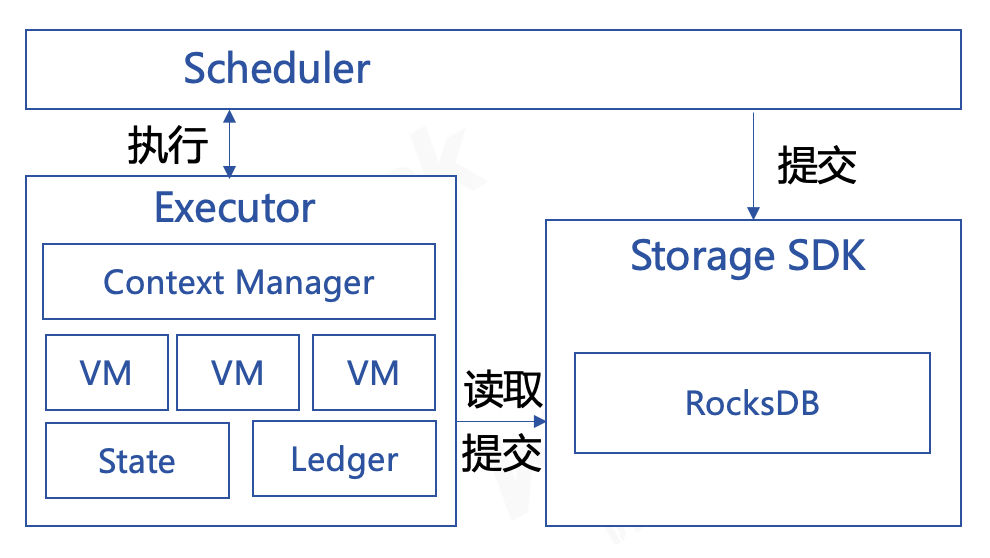

# 基于事务的存储模块

标签：``存储`` ``storage`` ``事务``

----------

## 设计

存储层需要能够满足Air、Pro和Max三个版本的不同设计目标，为此我们使用同一套接口来屏蔽不同版本存储的具体实现。对于Air和Pro版本，存储层使用RocksDB来满足其轻便和高性能的需求，对于Max版本通过接入能够支持水平扩展的分布式数据库支撑大规模数据存储的需求。整体存储服务设计如下图所示。



Air、Pro和Max版本的区别在于其使用的`Storage SDK`内部的具体实现是不同的，对于Air和Pro版本，在初始化时会创建基于RocksDB封装的实现，而对于Max版本则提供基于TiKV封装的实现，同时保留定制存储的能力，用户可以基于具体的业务需求接入其他数据库。

## Max版本数据提交

在FISCO BCOS 3.0的Max版本，其计算层由多个执行服务组成，执行区块时每个执行服务接收调度层分配的智能合约执行任务，完成后将执行结果返回调度层，执行过程中产生的数据变更存储在每个执行服务自身的内存中，调度层在完成一个区块执行后，收集并计算区块头中的状态哈希、收据哈希等数据，但会区块执行结果给同步或共识，同步和共识完成其自身验证逻辑后发起区块提交。

```eval_rst
.. mermaid::

    flowchart TD
        c(共识/同步)-->|1-请求执行区块|s(调度服务)
        s-->|2-执行交易|e1(执行服务)
        s-->|2-执行交易|e2(执行服务)
        e1-->|3-返回结果|s
        e2-->|3-返回结果|s
        s-->|4-获取状态hash|e1
        s-->|4-获取状态hash|e2
        s-->|5-产生header和收据|s
        s-->|6-返回区块执行结果|c

```

合约的数据分散在不同的执行服务中，而区块头、区块签名列表和收据等数据在调度服务中，而一个区块的提交需要是事务的，这是一个典型的分布式事务问题，为此我们引入两阶段事务来解决，[接口如下](https://github.com/FISCO-BCOS/bcos-framework/blob/main/interfaces/storage/StorageInterface.h#L104-L128)：

```cpp
class TransactionalStorageInterface : public virtual StorageInterface
{
    virtual void asyncPrepare(const TwoPCParams& params, const TraverseStorageInterface& storage,
        std::function<void(Error::Ptr, uint64_t)> callback) = 0;

    virtual void asyncCommit(
        const TwoPCParams& params, std::function<void(Error::Ptr)> callback) = 0;

    virtual void asyncRollback(
        const TwoPCParams& params, std::function<void(Error::Ptr)> callback) = 0;
};
```

在提交过程中，调度服务充当两阶段事务的协调者，每个执行服务作为参与者，一起完成区块的提交。

1. 准备阶段：
    当一个区块开始提交，调度服务调用其持有的存储（Storage）对象的`asyncPrepare`方法，将区块、收据、索引等数据提交到存储服务。在`asyncPrepare`返回结果后，调度服务基于返回的事务信息通知所有执行服务调用其持有的存储对象的`asyncPrepare`方法，将每个执行服务持有的状态变更提交到存储服务。
1. 提交阶段：
    当调度服务收集到所有执行服务调用`asyncPrepare`的成功返回后，调度服务自身调用其持有的存储对象的`asyncCommit`方法，将数据提交到后端的数据库中，并通知所有执行服务调用`asyncCommit`方法。如果有某个执行服务调用`asyncPrepare`失败或超时，则调度服务自身调用其持有的存储对象的`asyncRollback`方法，并通知所有执行服务调用`asyncRollback`方法，回滚数据。

```eval_rst
.. mermaid::

    flowchart TD
        d(调度服务)-->|1-asyncPrepare|s(存储服务)
        s-->|2-返回事务信息|d
        d-->|3-asyncPrepare|e1(执行服务)
        d-->|3-asyncPrepare|e2(执行服务)
        e1-->|4-asyncPrepare|s
        e2-->|4-asyncPrepare|s
        e1-->|5-返回结果|d
        e2-->|5-返回结果|d
        d-->|6-asyncCommit/asyncRollback|s

```

## Ari与Pro版本数据提交

Air与Pro版本的提交与Max的区别在于一方面存储服务使用RocksDB作为后端数据库，另一方面执行服务与调度服务在同一进程中，不存在分布式事务的问题，相对于Max版本其提交逻辑较为简单，如下图所示。



对于调度服务和执行服务其处理逻辑与Max版本相同，只是在提交阶段，调度服务和执行服务提交数据时，其持有的存储对象为同一个，当调用`asyncPrepare`时，存储内部实现中会并不会真的将数据提交到RocksDB，而是将数据写入内存中，当调度服务调用`asyncCommit`方法时，将数据一次性提交写入RocksDB。
