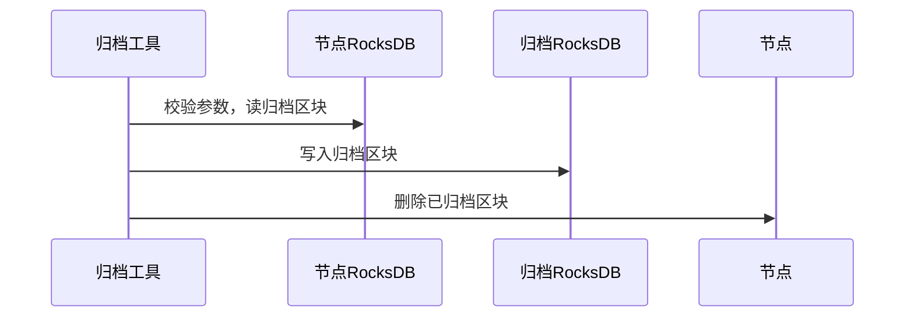

# 数据归档设计

标签：``数据归档`` ``数据裁剪``

----

## 背景介绍

区块链节点数据会随时间的推移不停增加，而其中一些历史区块和交易被访问的频率极低，甚至于不会被访问，通过数据归档可以将这些冷数据归档到更廉价的存储设备中。要求如下：

1. 能指定归档区块的范围
2. 归档操作不影响节点正常共识
3. 归档数据能够查询
4. 归档数据能够恢复

## 方案设计

归档数据可以支持归档到RocksDB和TiKV，对于归档到RocksDB的数据可以拷贝

### 归档数据范围

统计某个有100w块高的FISCO-BCOS 3.0节点中数据占比如下，可以看到交易数据占46.5G（占比42.7%），收据数据占16.5G（占比15.2%），状态数据占40.3G（占比37.1%），而除此之外最大的`s_number_2_txs`区块交易哈希列表只有4.9G（占比4.5%），所以方案决定仅归档交易和收据数据，而对于其他的数据不作处理，这样在归档近57.9%数据的情况下，还能做到基本不影响归档节点的功能。归档节点只是不能获取归档区块的交易和收据，其他功能正常。

```bash
s_tables                       size is 661.029MB
s_consensus                    size is 794B
s_config                       size is 210B
s_current_state                size is 137B
s_hash_2_number                size is 53.1716MB
s_number_2_hash                size is 53.1716MB
s_block_number_2_nonces        size is 33.4512MB
s_number_2_txs                 size is 4.94278GB
s_number_2_header              size is 671.36MB
s_hash_2_tx                    size is 46.5201GB
s_hash_2_receipt               size is 16.5311GB
/apps                          size is 40.3474GB
```

数据归档流程如下：



### 归档数据查询

提供查询工具，读取归档的数据库，支持根据交易哈希读取交易和收据。

### 归档数据重导入

提供工具，读取归档的数据库，将归档数据重新导入到节点数据库中。
