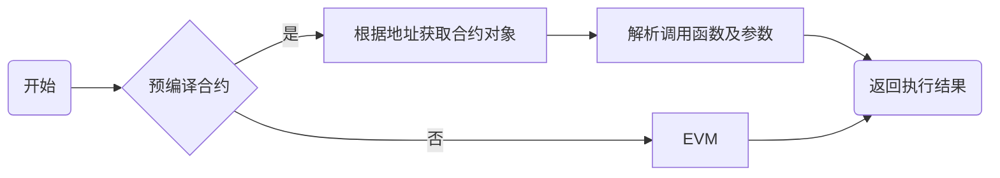

## C++ 引擎

标签：``预编译合约`` ``智能合约`` ``Precompiled``

----

预编译合约提供一种使用C++编写合约的方法，合约逻辑与数据分离，相比于solidity合约具有更好的性能，可以通过修改底层代码实现合约升级。

### 预编译合约与Solidity合约对比

| 表名     | 预编译合约                                 | Solidity合约                |
|:---------|:-------------------------------------------|:----------------------------|
| 地址     | 固定地址，代码中定义                       | 部署时确定                  |
| 合约代码 | 数据存储在表中，与合约分离，可升级合约逻辑 | 合约变量和数据存储在MPT树中 |
| 执行     | C++底层执行，性能更高，可实现并行          | EVM虚拟机，串行执行         |

### 模块架构

Precompiled的架构如下图所示：
- 区块验证器在执行交易的时候会根据被调用合约的地址来判断类型。地址1-4表示以太坊预编译合约，地址0x1000-0x10000是C++预编译合约，其他地址是EVM合约。

### 关键流程
- 执行预编译合约时首先需要根据合约地址获取到预编译合约的对象。
- 每个预编译合约对象都会实现`call`接口，预编译合约的具体逻辑在该接口中实现。
- `call`根据交易的abi编码，获取到`Function Selector`和参数，然后执行对应的逻辑。

### 接口定义

每个预编译合约都必须实现自己的`call`接口，接口接受两个参数，分别是`TransactionExecutive::Ptr`执行上下文、`PrecompiledExecResult::Ptr`执行参数，其中包括执行输入、外部账户地址、gas使用。[`Precompiled`源码](https://github.com/FISCO-BCOS/FISCO-BCOS/blob/76da8909d5/bcos-executor/src/vm/Precompiled.h)。

| 接口名                                                                                                                    | 参数说明                                                                              | 接口说明                                                          |
|:--------------------------------------------------------------------------------------------------------------------------|:--------------------------------------------------------------------------------------|:------------------------------------------------------------------|
| `PrecompiledExecResult::Ptr call(executor::TransactionExecutive::Ptr context,PrecompiledExecResult::Ptr param) override;` | `context`为区块执行上下文，`param`为执行参数，其中包括执行输入、外部账户地址、gas使用 | 具体合约接口的实现                                                |
| `uint32_t getFuncSelector(std::string const& functionName)`                                                               | `functionName`为函数名                                                                | 根据函数名计算`Function Select`                                   |
| `bytesConstRef getParamData(bytesConstRef param)`                                                                         | `param`为abi编码的参数                                                                | 获取调用函数的具体参数的abi编码                                   |
| `uint32_t getParamFunc(bytesConstRef param)`                                                                              | `param`为abi编码的参数                                                                | 获取调用的函数的`Function Select`（函数名的sha3的前四个大端字节） |
