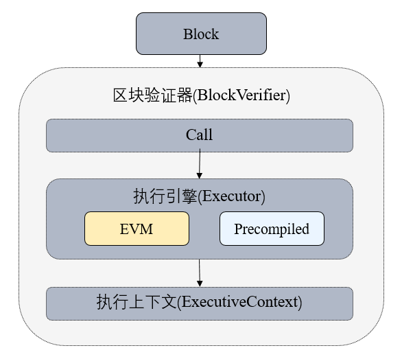
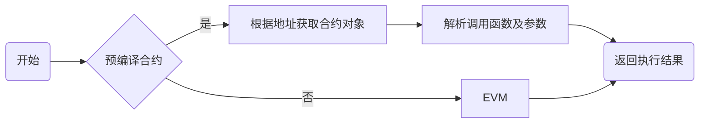

## C++ 引擎

标签：``预编译合约`` ``智能合约`` ``Precompiled``

----

预编译合约提供一种使用C++编写合约的方法，合约逻辑与数据分离，相比于solidity合约具有更好的性能，可以通过修改底层代码实现合约升级。

### 预编译合约与Solidity合约对比

| 表名     | 预编译合约                                 | Solidity合约                |
|:---------|:-------------------------------------------|:----------------------------|
| 地址     | 固定地址，代码中定义                       | 部署时确定                  |
| 合约代码 | 数据存储在表中，与合约分离，可升级合约逻辑 | 合约变量和数据存储在MPT树中 |
| 执行     | C++底层执行，性能更高，可实现并行          | EVM虚拟机，串行执行         |

### 模块架构

Precompiled的架构如下图所示：
- 区块验证器在执行交易的时候会根据被调用合约的地址来判断类型。地址1-4表示以太坊预编译合约，地址在`[0x1000, 0x20000)`范围内为C++预编译合约地址范围（其中0x10001为权限治理委员会合约等创世部署的Solidity系统合约，不属于C++预编译合约），该范围之外的地址为EVM合约。

### 系统合约与预编译合约地址表

FISCO BCOS 3.x 的系统合约（预编译合约）在Solidity合约中使用固定的20字节地址调用，在WASM/Liquid合约中使用固定的BFS路径调用。下表汇总了当前已定义的系统合约地址、对应BFS路径、合约名及用途，按地址段分为预编译合约、隐私计算相关合约、权限治理相关合约三类。

#### 预编译合约（0x1000 ~ 0x1011）

| 地址   | BFS路径             | 合约名                             | 用途简述                                                                     |
|:-------|:---------------------|:------------------------------------|:-------------------------------------------------------------------------------|
| 0x1000 | /sys/status           | 系统配置管理合约（SystemConfigPrecompiled） | 管理群组系统参数配置，如共识超时时间、区块打包时间等                          |
| 0x1001 | /sys/table_storage    | 表存储合约（TablePrecompiled）              | 提供表数据的增删改查（CRUD）接口，实现对已创建表的读写                        |
| 0x1002 | /sys/table_manager    | 表管理合约（TableManagerPrecompiled）       | 提供表的创建、打开等管理接口                                                  |
| 0x1003 | /sys/consensus        | 共识节点管理合约（ConsensusPrecompiled）    | 管理共识节点、观察节点的增删及权重设置，并实现基于VRF的rPBFT工作节点轮值（rotateWorkingSealer）逻辑 |
| 0x1005 | /sys/auth             | 权限管理合约（AuthManagerPrecompiled）      | Solidity/WASM双模式的合约权限管理入口，将方法调用权限、部署权限、合约状态等请求转发至0x10002处理 |
| 0x1009 | /sys/kv_storage       | KV存储合约（KVTablePrecompiled）            | 提供Key-Value形式的表数据存取接口                                             |
| 0x100a | /sys/crypto_tools     | 密码学工具合约（CryptoPrecompiled）         | 提供哈希、签名验证等密码学工具接口                                            |
| 0x100b | （无）                | 共识工作节点轮值管理地址（WORKING_SEALER_MGR_ADDRESS） | 与0x1003共识管理合约配合，用于rPBFT基于VRF的sealer轮值相关的系统交易识别；源码中未见该地址关联独立的预编译合约实现 |
| 0x100c | /sys/dag_test         | DAG转账测试合约（DagTransferPrecompiled）   | 用于DAG并行执行验证的转账测试合约                                             |
| 0x100e | /sys/bfs              | 文件系统合约（BFSPrecompiled）              | 提供链上类文件系统（BFS）的目录、路径管理能力                                 |
| 0x100f | /sys/cast_tools       | 类型转换工具合约（CastPrecompiled）         | 提供数值、字符串等类型转换工具接口                                            |
| 0x1010 | /sys/sharding         | 分片管理合约（ShardingPrecompiled）         | 提供分片（Sharding）场景下的分片创建、合约部署等管理接口                      |
| 0x1011 | /sys/balance          | 余额管理合约（BalancePrecompiled）          | 提供账户余额转账、查询、授权扣款等接口                                        |

#### 隐私计算相关（0x5003 ~ 0x5100）

| 地址   | BFS路径            | 合约名                                     | 用途简述                                     |
|:-------|:--------------------|:---------------------------------------------|:-----------------------------------------------|
| 0x5003 | /sys/paillier        | 同态加密合约（PaillierPrecompiled）           | 提供Paillier同态加密密文运算等隐私计算接口   |
| 0x5004 | /sys/group_sig       | 群签名合约（GroupSigPrecompiled）             | 提供群签名验证等隐私计算接口                 |
| 0x5005 | /sys/ring_sig        | 环签名合约（RingSigPrecompiled）              | 提供环签名验证等隐私计算接口                 |
| 0x5100 | /sys/discrete_zkp    | 离散对数零知识证明合约（ZkpPrecompiled）      | 提供基于离散对数的零知识证明（ZKP）验证接口  |

#### 权限治理相关（0x10000 ~ 0x10004）

| 地址    | BFS路径                | 合约名                                              | 用途简述                                                                 |
|:--------|:-------------------------|:------------------------------------------------------|:-----------------------------------------------------------------------------|
| 0x10000 | （无）                    | AUTH_INTERCEPT_ADDRESS常量                             | 仅在PrecompiledTypeDef.h中定义为地址常量，v3.17.0全源码树中未见该地址在其他位置被引用，也未关联任何预编译合约实现 |
| 0x10001 | （无）                    | 权限治理委员会合约（CommitteeManager）                 | 权限治理的唯一入口，管理治理提案与治理委员会成员，链上固定地址为0x10001      |
| 0x10002 | （无）                    | 合约权限管理合约（ContractAuthMgrPrecompiled）         | 实现合约方法调用权限（黑白名单）、部署权限、合约状态（正常/冻结/废止）管理的具体逻辑，由0x1005转发调用 |
| 0x10003 | /sys/account_manager      | 账户管理合约（AccountManagerPrecompiled）              | 治理委员可通过该合约对外部账户状态（正常/冻结/废止）进行读写管理             |
| 0x10004 | （无）                    | 账户合约（AccountPrecompiled）                         | 每个外部账户在链上对应的账户合约，用于账户余额等状态的存取                   |

### 关键流程
- 执行预编译合约时首先需要根据合约地址获取到预编译合约的对象。
- 每个预编译合约对象都会实现`call`接口，预编译合约的具体逻辑在该接口中实现。
- `call`根据交易的abi编码，获取到`Function Selector`和参数，然后执行对应的逻辑。

```mermaid
    graph LR
        Start(开始) --> branch1{预编译合约}
        branch1 --> |是|op1[根据地址获取合约对象]
        branch1 --> |否|op2[EVM]
        op1 --> op3[解析调用函数及参数]
        op3 --> End(返回执行结果)
        op2 --> End(返回执行结果)
```

### 接口定义

每个预编译合约都必须实现自己的`call`接口，接口接受两个参数，分别是`TransactionExecutive::Ptr`执行上下文、`PrecompiledExecResult::Ptr`执行参数，其中包括执行输入、外部账户地址、gas使用。[`Precompiled`源码](https://github.com/FISCO-BCOS/FISCO-BCOS/blob/76da8909d5/bcos-executor/src/vm/Precompiled.h)。

| 接口名                                                                                                                    | 参数说明                                                                              | 接口说明                                                          |
|:--------------------------------------------------------------------------------------------------------------------------|:--------------------------------------------------------------------------------------|:------------------------------------------------------------------|
| `PrecompiledExecResult::Ptr call(executor::TransactionExecutive::Ptr context,PrecompiledExecResult::Ptr param) override;` | `context`为区块执行上下文，`param`为执行参数，其中包括执行输入、外部账户地址、gas使用 | 具体合约接口的实现                                                |
| `uint32_t getFuncSelector(std::string const& functionName)`                                                               | `functionName`为函数名                                                                | 根据函数名计算`Function Select`                                   |
| `bytesConstRef getParamData(bytesConstRef param)`                                                                         | `param`为abi编码的参数                                                                | 获取调用函数的具体参数的abi编码                                   |
| `uint32_t getParamFunc(bytesConstRef param)`                                                                              | `param`为abi编码的参数                                                                | 获取调用的函数的`Function Select`（函数名的sha3的前四个大端字节） |
