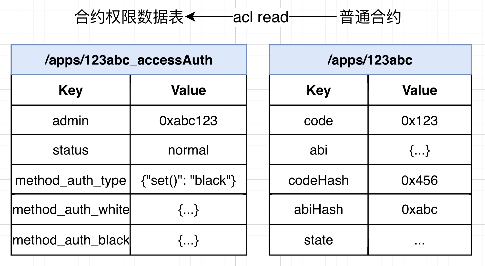

# 合约生命周期与权限管理

标签：``合约管理`` ``合约生命周期`` ``部署合约`` ``调用合约`` ``冻结合约`` ``废止合约``

----

本文档描述合约从开发、部署、调用、升级、冻结再到废止的整个生命周期，以及在整个智能合约生命周期的参与角色与管理方法。

```eval_rst
.. important::
   合约生命周期管理冻结、解冻、废止操作以及合约部署调用权限控制，均需要将开启区块链权限模式，详情请参考`【权限治理使用指南】 <https://fisco-bcos-doc.readthedocs.io/zh_CN/latest/docs/develop/committee_usage.html>`_
```

## 1. 智能合约开发

FISCO BCOS平台支持Solidity、Liquid、Precompiled三种智能合约使用形式。

- Solidity合约与以太坊相同，用Solidity语法实现，在FISCO BCOS 3.0+版本中，支持0.4.25～0.8.11版本的Solidity合约。
- Liquid由微众银行区块链团队开发并完全开源，是一种嵌入式领域特定语言（ embedded Domain Specific Language，eDSL），能够用来编写运行于区块链底层平台FISCO BCOS的智能合约。
- 预编译（Precompiled）合约使用C++开发，内置于FISCO BCOS平台，相比于Solidity合约具有更好的性能，其合约接口需要在编译时预先确定，适用于逻辑固定但需要共识的场景。

**延伸阅读**

[WeBASE合约IDE](https://webasedoc.readthedocs.io/zh_CN/latest/)

[Solidity官方文档](https://solidity.readthedocs.io/en/latest/)

[Remix在线IDE](https://remix.ethereum.org/)

[Liquid官方文档](https://liquid-doc.readthedocs.io/zh_CN/latest/)

[预编译合约使用文档](https://fisco-bcos-doc.readthedocs.io/zh_CN/latest/docs/develop/precompiled/index.html)

## 2. 智能合约部署与调用

用户完成智能合约的开发之后，将智能合约部署上链并发起调用交易。用户可通过[SDK](./sdk/index.md)将编译好的合约打包成交易发送到FISCO BCOS区块链节点上链。社区已提供高度包装的工具，用户可快速开箱使用：

- 使用控制台： [控制台](./console/index.md)，控制台包装了Java SDK，提供命令行交互功能，供给开发者使用的节点查询与管理的工具。
- 使用Java合约生成工具：[Java合约生成工具](./console/console_config.html#java)支持Solidity的自动编译并生成Java文件、支持指定wbc-liquid编译后的WASM文件以及ABI文件生成Java文件。

**延伸阅读**

[开发第一个Solidity区块链应用](../quick_start/solidity_application.md)

[开发第一个Liquid区块链应用](../quick_start/wbc_liquid_application.md)

[Gradle SpringBoot 应用示例](./sdk/java_sdk/spring_boot_starter.md)

[Maven SpringBoot 应用示例](./sdk/java_sdk/spring_boot_crud.md)

## 3. 智能合约数据存储

智能合约在部署过后，底层存储结构就将会创建一张数据表，用于存储合约对应的opcode、ABI JSON字符串和state状态数据。其中：

- opcode为只能合约在编译后生成的代码段，用于每次调用时加载到虚拟机中执行；
- ABI JSON字符串是为了方便外部SDK调用，存储的接口文件，其中记载着智能合约各个接口的参数返回格式、各个接口的并行冲突域；
- state状态数据存储的是智能合约在运行时的需要持久存储的数据，例如合约成员变量等。

创建的表名为“目录+合约地址”，我们以地址 0x1234567890123456789012345678901234567890 为例，在存储的表名就为 “/apps/1234567890123456789012345678901234567890”，其中“/apps/”为BFS固定前缀，详情请参考[BFS设计文档](../design/contract_directory.md)。

| Key   | Value          |
|-------|----------------|
| abi   | ABI JSON字符串 |
| code  | 十六进制opcode |
| state | ...            |

## 4. 智能合约升级

从本文第3节可以看出，每个智能合约部署上链都有独立地址，独立地址对应着存储中的独立的存储表。因此，智能合约升级也要将升级情况分为保留数据升级和不保留数据升级。

- 保留旧合约数据升级的情况较为复杂，具体解决方案有以下几种：
  - （推荐）用户在开发智能合约时就需要主动将合约分为 **逻辑合约** 和 **数据合约**，数据合约用于存储需要在链上存储的数据，开放数据读写接口供逻辑合约使用，逻辑合约在计算时调用数据合约的读写接口。当需要升级时，只需要升级逻辑合约，新的逻辑合约调用旧的数据合约接口，旧的逻辑合约不再使用。
  - （推荐）相当于第一种方案的扩展，需要存储的数据都使用CRUD数据接口进行存储，CRUD的数据是通过节点共识并持久存储在链上的。详情请参考[使用CRUD预编译合约开发应用](./precompiled/use_crud_precompiled.md)，[使用KV存储预编译合约开发应用](./precompiled/use_kv_precompiled.md)
  - 通过使用delegate call的代理合约主动调用逻辑合约，产生的状态数据均保存在代理合约中，逻辑合约保持接口不变的情况下可以升级。
- 不保留数据升级的情况更加简单，用户将升级的合约重新部署，将会有新的地址。应用基于新地址的合约进行操作即可，也将使用新合约的数据，旧合约记录的数据将存在链上，需要应用主动避免新业务逻辑调用旧合约数据。

## 5. 智能合约权限管理操作

```eval_rst
.. important::
   合约生命周期管理冻结、解冻、废止操作以及合约部署调用权限控制，均需要将开启区块链权限模式，详情请参考`【权限治理使用指南】 <https://fisco-bcos-doc.readthedocs.io/zh_CN/latest/docs/develop/committee_usage.html>`_
```

在开启区块链权限模式之后，每次合约部署将在存储层创建合约存储数据表之外，会额外创建一张合约权限数据表，用于记录合约管理员地址、合约状态、合约接口ACL。默认情况下，合约的管理员地址就是发起部署合约操作的账户地址（如果存在合约创建合约，合约管理员地址为交易发起账户tx.origin）。



合约管理员可以通过AuthManagerPrecompiled的接口对合约进行操作，固定地址为0x1005。

```solidity
enum Status{
    normal,
    freeze,
    abolish
}
abstract contract AuthManagerPrecompiled {
    // 合约管理员读写，resetAdmin只允许治理委员会合约调用
    function getAdmin(address path) public view virtual returns (address);
    function resetAdmin(address path, address admin) public virtual returns (int256);
    // 合约接口权限读写
    function setMethodAuthType(address path, bytes4 func, uint8 authType) public virtual returns (int256);
    function openMethodAuth(address path, bytes4 func, address account) public virtual returns (int256);
    function closeMethodAuth(address path, bytes4 func, address account) public virtual returns (int256);
    function checkMethodAuth(address path, bytes4 func, address account) public view virtual returns (bool);
    function getMethodAuth(address path, bytes4 func) public view virtual returns (uint8,string[] memory,string[] memory);
    // 合约状态读写
    function setContractStatus(address _address, Status _status) public virtual returns(int);
    function contractAvailable(address _address) public view virtual returns (bool);
    
    // 部署合约权限读写，写接口只允许治理委员会合约调用
    function deployType() public view virtual returns (uint256);
    function setDeployAuthType(uint8 _type) public virtual returns (int256);
    function openDeployAuth(address account) public virtual returns (int256);
    function closeDeployAuth(address account) public virtual returns (int256);
    function hasDeployAuth(address account) public view virtual returns (bool);
}
```

### 5.1 智能合约冻结、解冻、废止

合约管理员可以对固定地址0x1005的预编译合约发起交易，对合约的状态进行读写。

在执行合约状态的写操作时，将会确定交易发起人msg.sender是否为合约权限表记录的合约管理员，若不是则会拒绝。

```eval_rst
.. important::
   兼容性说明：合约生命周期管理废止操作只能在节点版本3.2以上进行。
```

合约管理员也可以通过控制台对合约进行冻结等操作，详情请看：[冻结合约命令](./console/console_commands.html#freezecontract)、[解冻合约命令](./console/console_commands.html#unfreezecontract)

### 5.2 智能合约部署权限控制

部署合约的权限控制将由治理委员会统一控制，治理委员会将以投票表决的形式控制部署权限。治理委员会对某个部署权限的提案通过后，将会主动调用固定地址0x1005预编译合约的部署权限写接口，这些写接口也限定只能治理委员会合约调用。

部署权限记录在BFS目录/apps下，这代表着允许在/apps目录下的写权限。

治理委员可以通过控制台进行部署合约权限控制等操作，详情请看 [设置部署权限类型提案](./console/console_commands.html#setdeployauthtypeproposal) 、[开启部署权限提案](./console/console_commands.html#opendeployauthproposal) 、[关闭部署权限提案](./console/console_commands.html#closedeployauthproposal)

在检查部署权限时将会对交易发起地址tx.origin进行校验，若没有权限则会返回错误码 -5000。即，会对用户部署合约、用户通过合约部署合约都进行校验。

### 5.3 智能合约调用权限控制

合约管理员可以对固定地址0x1005的预编译合约发起交易，对合约接口的访问ACL进行读写。

在执行合约接口的访问ACL的写操作时，将会确定交易发起人msg.sender是否为合约权限表记录的合约管理员，若不是则会拒绝。

合约管理员可以通过控制台对合约接口访问ACL的写操作等操作，详情请看：[合约管理员专用命令](./console/console_commands.html#setmethodauth)

在检查合约调用权限时将会对交易发起地址tx.origin和消息发送者msg.sender进行校验，若没有权限则会返回错误码 -5000。即，会对用户调用合约、用户通过合约调用合约、合约调用合约都进行校验。
