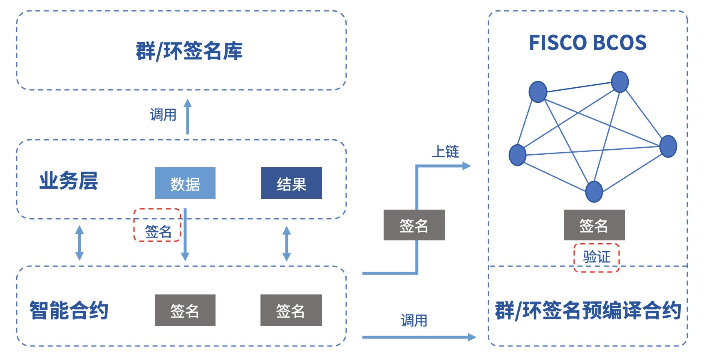

# 使用群/环签名合约接口

标签：``隐私合约`` ``隐私保护`` ``合约开发``  ``环签名``

----
隐私保护是联盟链的一大技术挑战。为了保护链上数据、保障联盟成员隐私，并且保证监管的有效性，FISCO BCOS以[预编译合约](https://fisco-bcos-doc.readthedocs.io/zh_CN/latest/docs/develop/precompiled/index.html)的形式集成了群/环签名验证功能，提供了多种隐私保护手段。

文档对群/环签名算法以及相关应用场景进行了简单介绍并对调用方式提供了参考。

## 1 算法简介

**群签名**

群签名(Group Signature)是一种能保护签名者身份的具有相对匿名性的数字签名方案，用户可以代替自己所在的群对消息进行签名，而验证者可以验证该签名是否有效，但是并不知道签名属于哪一个群成员。同时，用户无法滥用这种匿名行为，因为群管理员可以通过群主私钥打开签名，暴露签名的归属信息。群签名的特性包括：

- 匿名性：群成员用群参数产生签名，其他人仅可验证签名的有效性，并通过签名知道签名者所属群组，却无法获取签名者身份信息；
- 不可伪造性：只有群成员才能生成有效可被验证的群签名；
- 不可链接性：给定两个签名，无法判断它们是否来自同一个签名者；
- 可追踪性：在监管介入的场景中，群主可通过签名获取签名者身份。

**环签名**

环签名(Ring Signature)是一种特殊的群签名方案，但具备完全匿名性，即不存在管理员这个角色，所有成员可主动加入环，且签名无法被打开。环签名的特性包括：

- 不可伪造性：环中其他成员不能伪造真实签名者签名；
- 完全匿名性：没有群主，只有环成员，其他人仅可验证环签名的有效性，但没有人可以获取签名者身份信息。

## 2 功能组件

FISCO BCOS群/环签名模块提供的功能组件包括：

- 群/环[签名库](https://github.com/FISCO-BCOS/group-signature-lib)，提供完整的群/环签名算法c++接口

- 群/环签名预编译合约: 提供群/环签名验证接口。

FISCO BCOS为用户提供了群/环签名开发示例，包括：

- 群/环签名服务端: 提供完整的群/环签名RPC服务。[GitHub源码](https://github.com/FISCO-BCOS/group-signature-server)、[Gitee源码](https://gitee.com/FISCO-BCOS/group-signature-server)

- 群/环签名客户端: 调用RPC服务对数据进行签名，并提供签名上链以及链上验证等功能。[GitHub源码](https://github.com/FISCO-BCOS/group-signature-client)、[Gitee源码](https://gitee.com/FISCO-BCOS/group-signature-client)

示例框架如下图所示，具体操作方法请参阅[客户端指南 Github链接](https://github.com/FISCO-BCOS/group-signature-client)或[客户端指南 Gitee链接](https://gitee.com/FISCO-BCOS/group-signature-client)。


## 3 应用场景

有签名者身份隐匿需求的业务可借助本模块实现相关功能。签名者通过调用群/环签名库完成对数据的签名，将签名上链，业务合约通过调用群/环签名预编译合约完成签名的验证，并将验证结果返还回业务层。如果是群签名，那么监管方还能打开指定签名数据，获得签名者身份。具体流程如下图所示：



群/环签名由于其天然的匿名性，在需要对参与者身份进行隐匿的场景中有广泛的应用前景，例如匿名投票、匿名竞拍、匿名拍卖等等，甚至在区块链UTXO模型中可用于实现匿名转账。同时，由于群签名具备可追踪性，可以用于需要监管介入的场景，监管方作为群主或者委托群主揭露签名者身份。


## 4. 预编译合约接口

**群签名验证、环签名验证预编译合约地址如下:**

| 地址     | 功能   | 源码                      |
| ------ | ---- | ----------------------- |
| 0x5004 | 群签名  | GroupSigPrecompiled.cpp |
| 0x5005 | 环签名  | RingSigPrecompiled.cpp  |


**群/签名验证接口如下:**

- 群签名

  ```cpp
  // GroupSigPrecompiled.sol
  pragma solidity ^0.4.25;
  contract GroupSigPrecompiled{
      /**
      * 群签名验证接口
      * @tparam signature: 群签名
      * @tparam message: 群签名对应的明文消息
      * @param gpkInfo: 群组信息
      * @param paramInfo: 群组元信息
      * @return int: 错误码，0表示没有发生异常; -51700表示群签名验证失败; -50101表明调用了非法的群签名验证接口
      *         bool: 群签名验证结果，false表示验证失败, true表明验证成功
      */
  		function groupSigVerify(string signature, string message, string gpkInfo, string paramInfo) public constant returns(int, bool);
  }
  ```

- 环签名

  ```cpp
  // RingSigPrecompiled.sol
  pragma solidity ^0.4.25;
  contract RingSigPrecompiled{
        /**
        * 环签名验证接口
        * @tparam signature: 环签名
        * @tparam message: 环签名对应的明文消息
        * @param paramInfo: 环信息
        * @return int: 错误码，0表示没有发生异常; -51800表示环签名验证失败; -50101表明调用了非法的环签名验证接口
        *         bool: 环签名验证结果，false表示验证失败, true表明验证成功
        */
       function ringSigVerify(string signature, string message, string paramInfo) public constant returns(int, bool);
  }
  ```