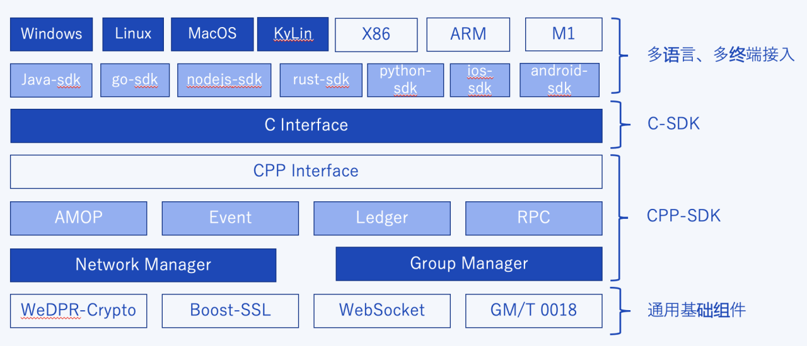

# 多语言SDK

标签： ``SDK``

----

FISCO BCOS 3.0版本的多语言SDK设计采用**分层架构**实现，从下到上依次分为通用基础组件层、CPP- SDK层、C-SDK层、多语言、多终端接入层。核心功能由底层CPP-SDK实现，上层多语言简单适配接入，这种方式可快速适配接入多语言SDK。

- **通用基础组件**：封装加密算法、通信协议、网络协议、加密机协议；
- **CPP-SDK层**：基于通用基础组件，实现区块链连接相关的网络管理、群组管理、AMOP通信、事件机制、账本与RPC接口，采用C++方式封装实现CPP-SDK；
- **C-SDK层**：基于CPP-SDK再包装一层C接口调用方式的C-SDK；
- **多语言、多终端接入层**：通过C- SDK的接口可以快速适配到Java、golang、nodejs、python、rust以及 iOS、Android等多语言SDK，并且兼容适配Windows、Linux、macOS、KyLin多中操作系统以及X86、ARM（包括M1）等不同平台。


各种语言的SDK使用说明文档如下：
```eval_rst
.. toctree::
   :maxdepth: 1

   java_sdk/index.md
   c_sdk/index.md
   cpp_sdk/index.md
   cert_config.md
```

其他语言待新增
