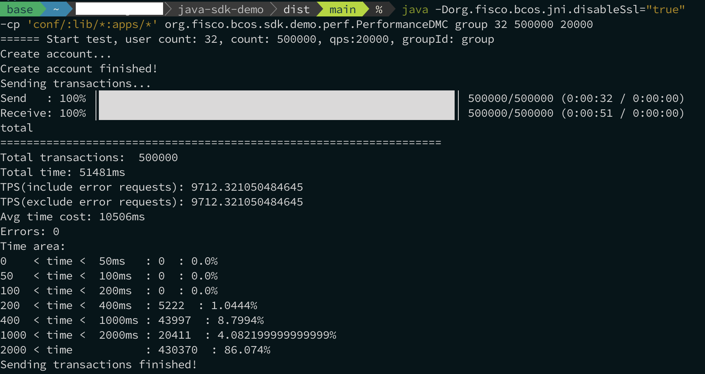

# 压力测试指南

标签：``压力测试`` ``Java SDK Demo``

----

## 通过Java SDK demo进行压力测试

Java SDK Demo是基于[Java SDK](./sdk/java_sdk/index.md)的基准测试集合，能够对FISCO BCOS节点进行压力测试。Java SDK Demo提供有合约编译功能，能够将Solidity合约文件转换成Java合约文件，此外还提供了针对转账合约、CRUD合约以及AMOP功能的压力测试示例程序。

### 第一步. 安装JDK

Java SDK Demo中的测试程序能够在部署有JDK 1.8 ~ JDK 14的环境中运行，执行测试程序前请先确保已安装所需版本的JDK。以在Ubuntu系统中安装OpenJDK 11为例：

  ```shell
# 安装open JDK 11
$ sudo apt install openjdk-11-jdk
# 验证Java版本
$ java --version
# 输出以下内容：
# openjdk 11.0.10 2021-01-19
# OpenJDK Runtime Environment (build 11.0.10+9-Ubuntu-0ubuntu1.20.04)
# OpenJDK 64-Bit Server VM (build 11.0.10+9-Ubuntu-0ubuntu1.20.04, mixed mode, sharing)
  ```

### 第二步. 编译源码

  ```shell
# 下载源码
$ git clone https://github.com/FISCO-BCOS/java-sdk-demo
$ cd java-sdk-demo
# 编译源码
$ bash gradlew build 
  ```

  ```eval_rst
  .. note::

      当网络无法访问GitHub时，请从https://gitee.com/FISCO-BCOS/java-sdk-demo处下载源码。
  ```

### 第三步. 配置Demo

使用Java SDK Demo之前，需要首先配置Java SDK，包括证书拷贝以及端口配置，详细请参考[这里](./sdk/java_sdk/quick_start.md)，SDK连接证书参考这里：[SDK连接证书配置](../cert_config.md)。下面以FISCO BCOS 3.0+ Air版为例：

  ```shell
  # 拷贝证书(假设SDK证书位于~/fisco/nodes/127.0.0.1/sdk目录，请根据实际情况更改路径)
  $ cp -r ~/fisco/nodes/127.0.0.1/sdk/* conf

  # 拷贝配置文件
  # 注:
  #   默认搭建的FISCO BCOS区块链系统RPC端口是20200，若修改了该端口，请同步修改config.toml中的[network.peers]配置选项
  $ cp conf/config-example.toml conf/config.toml
  ```

### 第四步. 执行示例压力测试程序

Java SDK Demo提供了一系列压测程序，包括串行转账合约压测、并行转账合约压测等，具体使用方法如下：

**注意：下面的压力测试程序均为EVM的节点执行环境，节点配置详情请参考：[节点配置](../tutorial/air/config.md)**

  ```shell
# 进入dist目录
$ cd dist

# 多合约-合约内并行转账合约:
# groupId: 压测的群组ID
# userCount: 创建账户的个数，建议（4～32个）
# count: 压测的交易总量
# qps: 压测QPS
java -cp 'conf/:lib/*:apps/*' org.fisco.bcos.sdk.demo.perf.PerformanceDMC [groupId] [userCount] [count] [qps]

# 多合约-跨合约并行转账
# groupId: 压测的群组ID
# userCount: 创建账户的个数，建议（4～32个）
# count: 压测的交易总量
# qps: 压测QPS
java -cp 'conf/:lib/*:apps/*' org.fisco.bcos.sdk.demo.perf.PerformanceTransferDMC [groupId] [userCount] [count] [qps]

# 压测串行转账合约:
# count: 压测的交易总量
# tps: 压测QPS
# groupId: 压测的群组ID
java -cp 'conf/:lib/*:apps/*' org.fisco.bcos.sdk.demo.perf.PerformanceOk [count] [tps] [groupId]

# 压测并行转账合约
# --------------------------
# 基于Solidity并行合约parallelok添加账户:
# groupID: 压测的群组ID
# count: 压测的交易总量
# tps: 压测QPS
# file: 保存生成账户的文件名
$ java -cp 'conf/:lib/*:apps/*' org.fisco.bcos.sdk.demo.perf.ParallelOkPerf [parallelok] [groupID] [add] [count] [tps] [file]
# 基于Precompiled并行合约precompiled添加账户
# (参数含义同上)
java -cp 'conf/:lib/*:apps/*' org.fisco.bcos.sdk.demo.perf.ParallelOkPerf [precompiled] [groupID] [add] [count] [tps] [file]
# --------------------------
# 基于Solidity并行合约parallelok发起转账交易压测
# groupID: 压测的群组ID
# count: 压测的交易总量
# tps: 压测的QPS
# file: 转账用户文件
$ java -cp 'conf/:lib/*:apps/*' org.fisco.bcos.sdk.demo.perf.ParallelOkPerf [parallelok] [groupID] [transfer] [count] [tps] [file]
# 基于Precompiled并行合约Precompiled发起转账压测
$ java -cp 'conf/:lib/*:apps/*' org.fisco.bcos.sdk.demo.perf.ParallelOkPerf [precompiled] [groupID] [transfer] [count] [tps] [file]


# KVTable合约压测
# 压测KV set
# count: 压测的交易总量
# tps: 压测QPS
# groupId: 压测群组
$ java -cp 'conf/:lib/*:apps/*' org.fisco.bcos.sdk.demo.perf.PerformanceKVTable [set] [count] [tps] [groupId]
# 压测KV get
# (参数解释同上)
$ java -cp 'conf/:lib/*:apps/*' org.fisco.bcos.sdk.demo.perf.PerformanceKVTable [get] [count] [tps] [groupId]
  ```

**以下是WASM环境的压力测试**

```shell
# 压测并行转账合约
# --------------------------
# 基于Liquid并行合约parallelok添加账户:
# groupID: 压测的群组ID
# count: 压测的交易总量
# tps: 压测QPS
# file: 保存生成账户的文件名
java -cp 'conf/:lib/*:apps/*' org.fisco.bcos.sdk.demo.perf.ParallelLiquidPerf [groupId] [add] [count] [tps] [file]

# 基于Liquid并行合约parallelok发起转账交易压测
# groupID: 压测的群组ID
# count: 压测的交易总量
# tps: 压测的QPS
# file: 转账用户文件
java -cp 'conf/:lib/*:apps/*' org.fisco.bcos.sdk.demo.perf.ParallelLiquidPerf [groupId] [transfer] [count] [tps] [file]
```

### 压力测试示例

示例测试环境：

- 硬件条件：Apple M1 Max (10 cores CPU)，32GB LPDDR5 RAM，1T SSD
- 系统版本：macOS 12.0.1
- 编译环境：clang-1300.0.29.3，cmake 3.22.1
- FISCO BCOS版本：master分支，Git Commit：c0e9dadb6e7ad1bbaf3128a27803226fb7ba6a9a，build type：Darwin/appleclang/release

#### 压力测试物料准备

搭建FISCO BCOS Air版本四节点环境，参考链接：[搭建Air版本FISCO BCOS联盟链](../quick_start/air_installation.md)

搭建完毕后，可以看到已经创建好四节点环境：

```shell
tree -L 2 ～/fisco/nodes
~/fisco/nodes
├── 127.0.0.1
│  ├── ca
│  ├── fisco-bcos
│  ├── node0
│  ├── node1
│  ├── node2
│  ├── node3
│  ├── sdk
│  ├── start_all.sh
│  └── stop_all.sh
└── ca
```

在启动四个节点之前，更改所有节点配置的日志等级为INFO，关闭节点SSL通信，节点配置可参考这里：[节点配置介绍](../tutorial/air/config.md)。这里以node0为例：

```shell
# 修改node0的config.ini配置
vim ～/fisco/nodes/127.0.0.1/node0/config.ini
```

关闭节点SSL通信：

```ini
[rpc]
    listen_ip=0.0.0.0
    listen_port=20200
    thread_count=4
    sm_ssl=false
    ; 开启这一项
    disable_ssl=true
```

将节点日志等级修改为INFO：

```ini
[log]
    enable=true
    log_path=./log
    ; 等级修改为INFO 
    level=INFO
    max_log_file_size=200
```

配置完成之后，启动四个节点：

```shell
cd ～/fisco/nodes/127.0.0.1
bash start_all.sh
try to start node0
 node0 start successfully
try to start node1
 node1 start successfully
try to start node2
 node2 start successfully
try to start node3
 node3 start successfully
```

继续准备压测程序，本例使用`java-sdk-demo`进行压力测试，使用详情请参考本文第一节：[链接](./stress_testing.html#jdk)，在此不再赘述。

配置Java SDK Demo，将交易发送到四个节点：

```shell
# 进入java-sdk-demo的配置项
vim ~/fiso/java-sdk-demo/dist/conf/config.toml
```

配置四个节点，这里的IP和端口均以实际为准：

```toml
[network]
peers=["127.0.0.1:20200", "127.0.0.1:20201", "127.0.0.1:20202", "127.0.0.1:20203"]    # The peer list to connect
```

配置好Java SDK Demo之后，将Java SDK的日志改为ERROR级别：

```shell
# 进入java-sdk-demo的日志配置项
vim ~/fiso/java-sdk-demo/dist/conf/log4j2.xml
```

修改日志级别：

```xml
<Loggers>
    <Root level="error">
      <AppenderRef ref="Demo"/>
    </Root>
</Loggers>
```

#### 开始压力测试

回到`java-sdk-demo`编译好的环境，输入以下命令开始压测：

这里的压力测试是向 group 群组部署32个Account Solidity合约，发送500000笔交易，QPS为20000。

```shell
cd ~/fiso/java-sdk-demo/dist/
# 必须要带上-Dorg.fisco.bcos.jni.disableSsl="true" 参数，使得发交易不使用SSL
java -Dorg.fisco.bcos.jni.disableSsl="true" -cp 'conf/:lib/*:apps/*' org.fisco.bcos.sdk.demo.perf.PerformanceDMC group 32 500000 20000
```

#### 测试结果

压力测试结果：



- 总共发起50万笔交易，发送到节点的时间为32秒，收集到所有交易回执的时间为51秒。
- TPS为 9712.321050484645 （交易数/秒）
