# 6. (New✨)使用Web3工具部署调用合约

标签：``Web3`` ``Remix`` ``Hardhat`` ``OpenZeppelin``

----

```eval_rst
.. important::
   FISCO BCOS在3.9.0版本开始支持使用Web3 JSON RPC，本文都基于FISCO BCOS开启Web3 JSON RPC之后使用的。详情请参考`【3.9.0版本说明】 <https://fisco-bcos-doc.readthedocs.io/zh_CN/latest/docs/introduction/change_log/3_9_0.html>`_
```

## 1. 开启Web3配置

在3.9.0的版本中的创世块中新增了web3 chain_id的字段，该字段将用于Web3工具辨认链的标识，有重要作用，**必须在启动初始化时确定**。

```toml
[web3]
    chain_id=20200
```

在配置项中新增了`web3_rpc`的配置项，默认为false，需要手动开启。

```toml
[web3_rpc]
    enable=false
    listen_ip=0.0.0.0
    listen_port=8545
    thread_count=8
    request_body_size_limit=10240000
    ; cors config for web3 rpc
    enable_cors=true
    cors_allow_credentials=true
    cors_allowed_origins=*
    cors_allowed_methods=GET, POST, OPTIONS
    cors_allowed_headers=Content-Type, Authorization, X-Requested-With
    cors_max_age=86400
```

### 1.1 旧节点升级并开启Web3配置

由于旧节点未存储关于Web3 Chain ID的信息，所以需要使用增加配置项的形式更新字段信息。按以下步骤执行即可：

1. 升级区块链二进制至最新版本v3.17.0，灰度操作可参考：[版本升级指南](https://fisco-bcos-doc.readthedocs.io/zh-cn/latest/docs/introduction/change_log/upgrade.html)

2. 更新数据版本号到最新版本v3.17.0：

   ```shell
   setSystemConfigByKey compatibility_version 3.17.0
   ```

3. 配置系统配置项`web3_chain_id`

   ```shell
   setSystemConfigByKey web3_chain_id 20200
   ```

4. 选择旧节点的配置文件，开启配置项

   ```shell
   # 更改config.ini
   vim config.ini
   
   [web3_rpc]
       enable=true
       listen_ip=0.0.0.0
       listen_port=8545
       thread_count=8
   ```

### 1.2 开启Balance功能

Balance功能在FISCO BCOS从3.7.0开始就已经支持。为了用户能顺滑地使用Web3相关的工具，需要在节点处预先开启Balance相关的功能，并给测试账户充值足够多的Balance。详情请参考以下步骤：

```shell
# 开启总体功能
setSystemConfigByKey feature_balance 1
# 开启Balance预编译功能
setSystemConfigByKey feature_balance_precompiled 1
```

## 2. 使用Remix向FISCO BCOS发送交易

**使用前提**

- **必须熟悉**Remix、MetaMask的使用，这两个工具都是开源工具，请参考以下文档：
  - [Remix documentation](https://remix-ide.readthedocs.io/en/latest/)
  - [MetaMask developer documentation](https://docs.metamask.io/)
- 为了更好地使用，请在能流畅访问外网环境下进行测试。

### 2.1 配置MetaMask

以下步骤以完全配置好MetaMask作为前提。

#### 2.1.1 手动添加网络

在MetaMask的设置中选择网络选项，点击`Add a network`

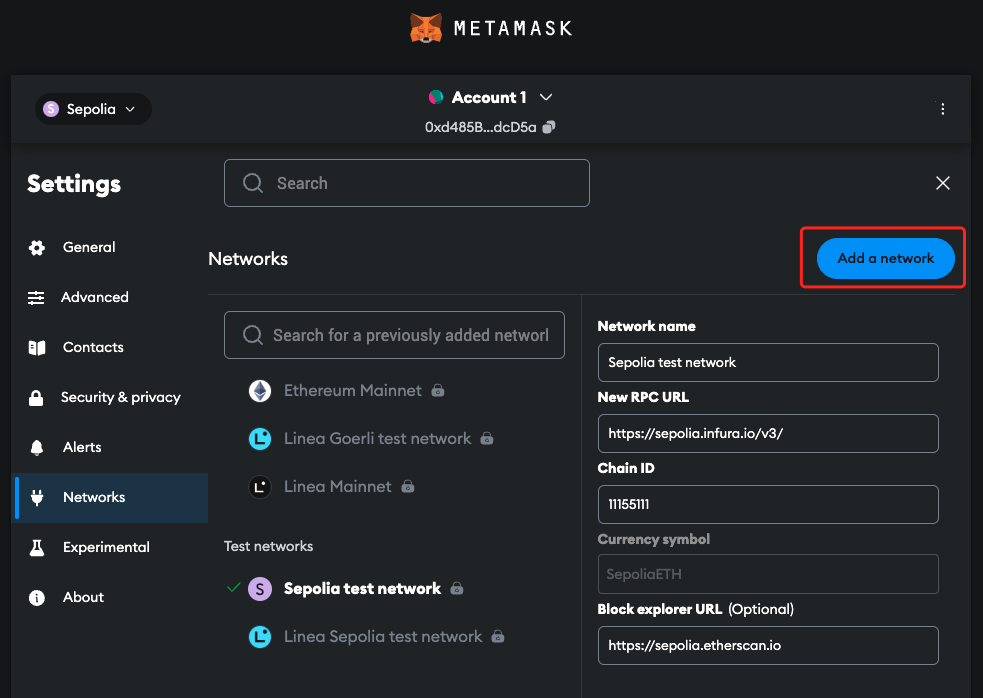

由于测试链没有在MetaMask列表中，需要手动填写链信息添加到MetaMask。

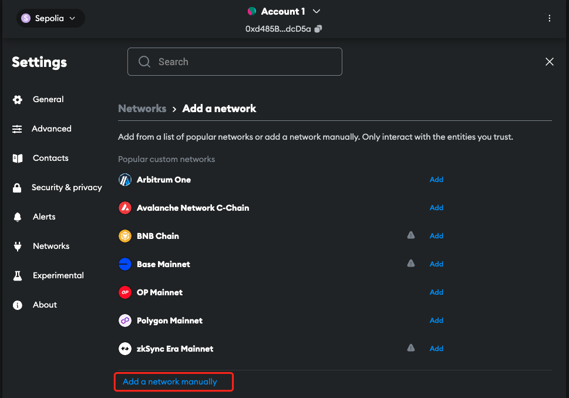

手动填写FISCO BCOS的信息内容。**特别注意：** RPC URL与Chain ID必须要和真是场景保持一致。

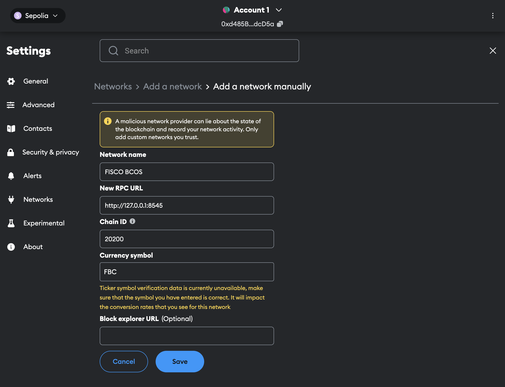

#### 2.1.2 在MetaMask查看账户余额

可以从账户列表中查看所有账户以及对应的balance余额

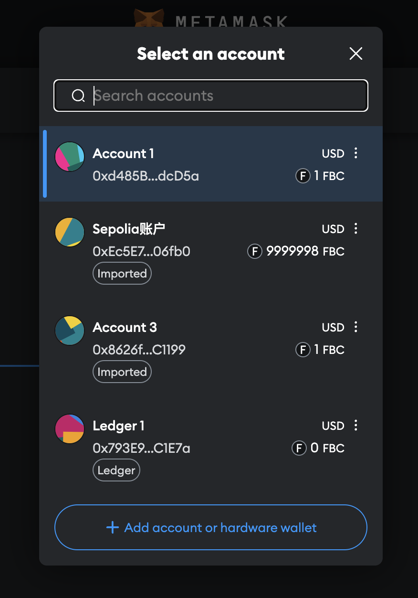

#### 2.1.3 使用MetaMask进行转账

用户可以通过MetaMask自带的转账功能进行balance转账。需要注意的是，Gas Limit需要手动填写。

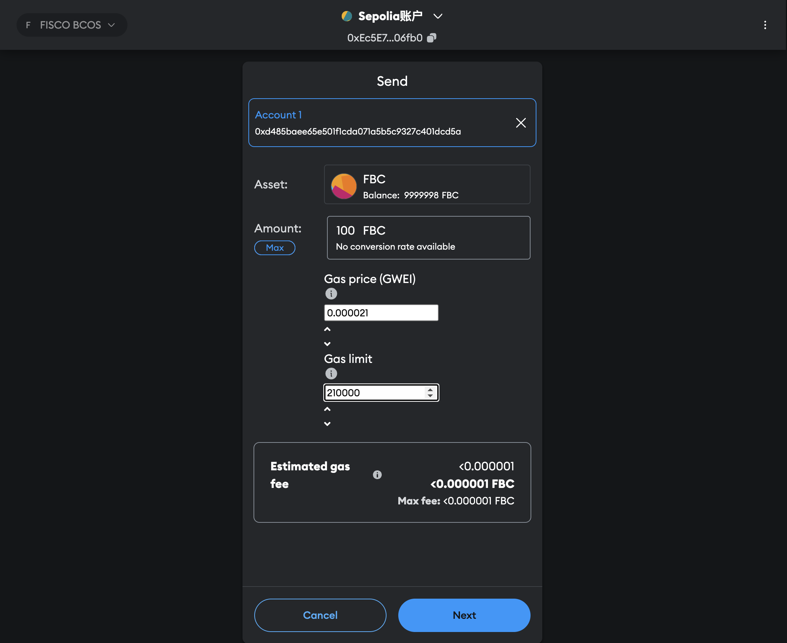

确认好交易信息之后点击确认即可发送交易。

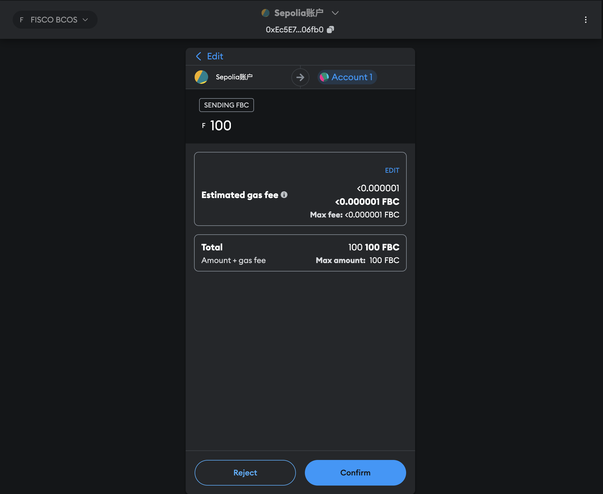

#### 2.1.4 查看交易信息

可以点击活动页查看交易的详细信息。

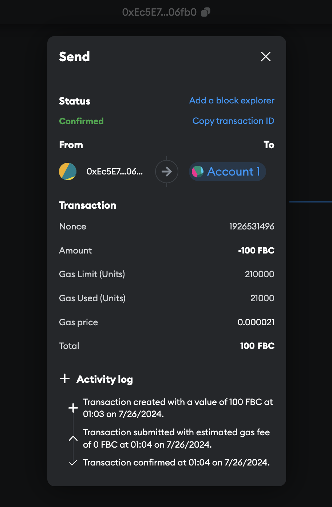

### 2.2 使用Remix接入MetaMask部署调用合约

在Remix部署和调用交易界面中配置环境信息。在环境中选择 `Injected Provider - MetaMask`即可。

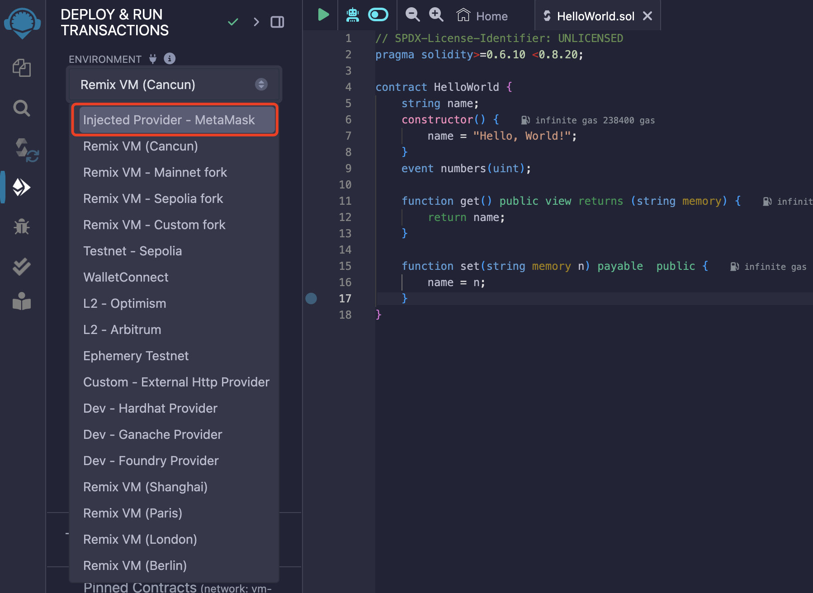

在发起部署/调用合约时，Remix将会把合约内容发送到MetaMask，页面将会跳转到MetaMask进行确认签名。

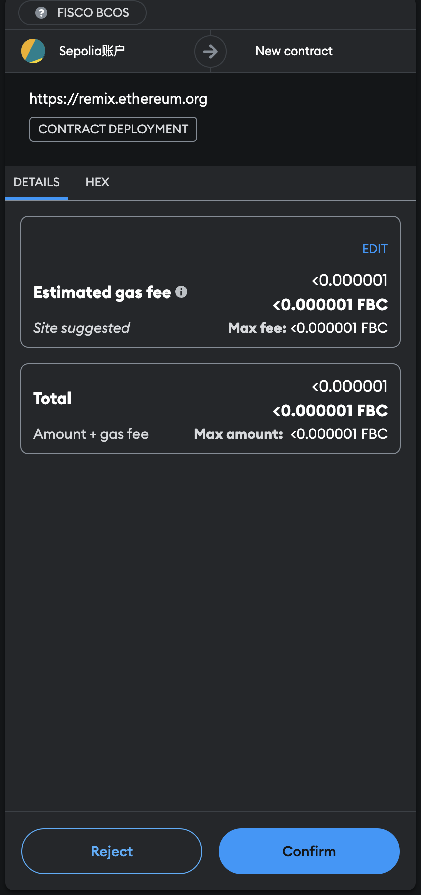

## 3. 使用Hardhat工具向FISCO BCOS发送交易

**使用前提** ：**必须熟悉** Nodejs项目构建、nodejs基础语法、HardHat的使用，请参考以下文档：

- [Hardhat's tutorial for beginners](https://hardhat.org/tutorial)
- [Hardhat setting up a project](https://hardhat.org/hardhat-runner/docs/guides/project-setup)

### 3.1 使用Hardhat demo

为了方便测试，另外建好了hardhat的demo仓库：https://github.com/kyonRay/bcos-hardhat-tutorial

项目结构如下，contracts存放solidity合约，ignition存放最终部署上链的工具，test存放所有的合约测试代码。hardhat.config.js就是hardhat的基础配置文件。

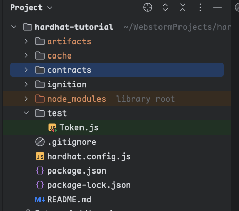

在hardhat.config.js的配置文件中配置好IP端口、chainID，并向红框内的地址发送足够的balance。

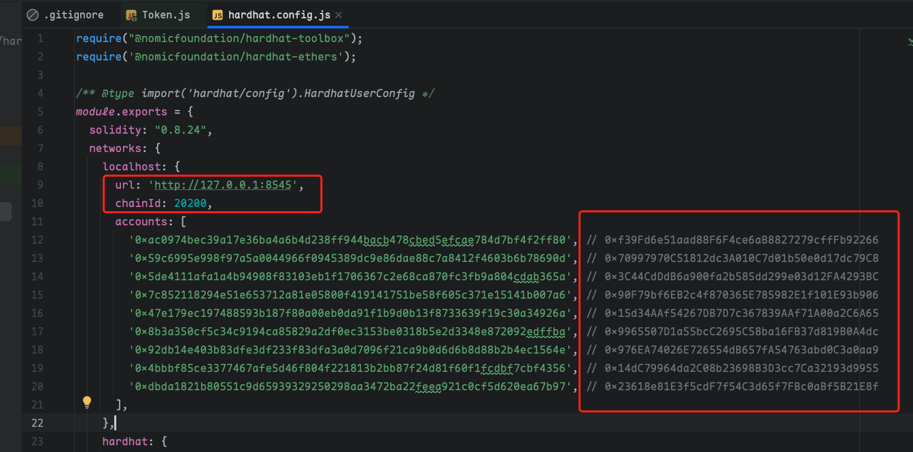

在test文件夹中实现了基础token的测试代码。

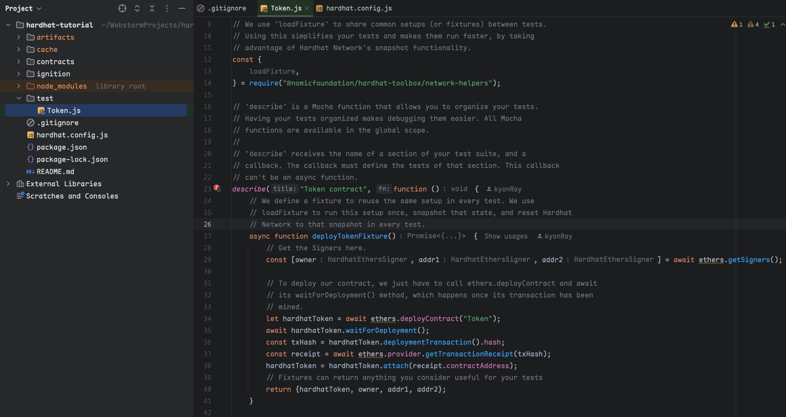

在终端执行以下命令就可以跑所有测试：

```shell
hardhat test --network localhost
```

### 3.2 使用Hardhat连接FISCO BCOS注意点

#### 部署合约后地址需要重新设置

由于FISCO BCOS与Web3在地址计算中存在区别，Hardhat在部署好合约后将在本地根据合约的nonce以及发送者地址计算得出新的合约地址，这与FISCO BCOS不兼容。因此在部署完成合约之后，还需要手动设置合约地址才行。代码示例如下：

```js
// fb-deploy-helper.js
const { ethers } = require('hardhat');

async function deployFBContract(name, args, opts = undefined) {
  let contract = await ethers.deployContract(name, args, opts);
  const txHash = contract.deploymentTransaction().hash;
  const receipt = await ethers.provider.getTransactionReceipt(txHash);
  contract = contract.attach(receipt.contractAddress);
  return contract;
}

module.exports = { deployFBContract };
```

## 4. 兼容性说明

FISCO BCOS目前已经支持使用绝大多数Web3工具连接，拓展了FISCO BCOS的生态圈。早期版本中与Web3生态存在的一些兼容性差异，已在后续版本中逐一解决：

1. 合约地址符合Web3合约地址规则 —— 已于3.12版本解决
2. 支持cancun的opcode —— 已于3.10版本解决
3. gaslimit等EIP1559字段在计算gas时已被使用 —— 已于3.12版本解决
4. EVM中时间已从毫秒对齐到秒 —— 已于3.12版本解决
5. 支持读取合约历史状态 —— 已于3.12版本解决

## 5. 支持的JSON-RPC方法

FISCO BCOS v3.17.0的Web3 JSON RPC共支持44个方法，覆盖`web3_*`、`net_*`、`eth_*`三类命名空间，具体如下。

### 5.1 web3命名空间（2个）

| 方法名 | 说明 |
| --- | --- |
| web3_clientVersion | 返回当前节点的客户端版本信息 |
| web3_sha3 | 对输入数据进行Keccak-256哈希计算 |

### 5.2 net命名空间（3个）

| 方法名 | 说明 |
| --- | --- |
| net_version | 返回当前网络ID（即web3 chain_id） |
| net_listening | 返回节点是否正在监听网络连接 |
| net_peerCount | 返回当前连接的对等节点数量 |

### 5.3 eth命名空间（39个）

| 方法名 | 说明 |
| --- | --- |
| eth_protocolVersion | 返回当前以太坊协议版本号 |
| eth_syncing | 返回节点同步状态信息 |
| eth_coinbase | 返回当前节点的coinbase地址 |
| eth_chainId | 返回当前链的Chain ID |
| eth_mining | 返回节点是否正在挖矿（FISCO BCOS恒定返回false） |
| eth_hashrate | 返回节点算力（FISCO BCOS恒定返回0） |
| eth_gasPrice | 返回当前Gas价格 |
| eth_accounts | 返回节点管理的账户地址列表 |
| eth_blockNumber | 返回当前最新区块号 |
| eth_getBalance | 查询指定账户的余额 |
| eth_getStorageAt | 查询指定合约存储槽的值 |
| eth_getTransactionCount | 查询指定账户的交易数量（nonce） |
| eth_getBlockTransactionCountByHash | 按区块哈希查询该区块内的交易数量 |
| eth_getBlockTransactionCountByNumber | 按区块号查询该区块内的交易数量 |
| eth_getUncleCountByBlockHash | 按区块哈希查询叔块数量（FISCO BCOS恒定返回0） |
| eth_getUncleCountByBlockNumber | 按区块号查询叔块数量（FISCO BCOS恒定返回0） |
| eth_getCode | 查询指定地址的合约代码 |
| eth_sign | 对指定数据进行签名 |
| eth_sendTransaction | 发送一笔交易（需节点管理账户私钥） |
| eth_signTransaction | 对交易进行签名并返回签名结果 |
| eth_sendRawTransaction | 发送已签名的原始交易 |
| eth_call | 在不上链的情况下调用合约方法 |
| eth_estimateGas | 估算交易所需的Gas |
| eth_getBlockByHash | 按区块哈希查询区块信息 |
| eth_getBlockByNumber | 按区块号查询区块信息 |
| eth_getTransactionByHash | 按交易哈希查询交易信息 |
| eth_getTransactionByBlockHashAndIndex | 按区块哈希和交易索引查询交易信息 |
| eth_getTransactionByBlockNumberAndIndex | 按区块号和交易索引查询交易信息 |
| eth_getTransactionReceipt | 查询交易回执 |
| eth_getUncleByBlockHashAndIndex | 按区块哈希和索引查询叔块信息（FISCO BCOS恒定返回空） |
| eth_getUncleByBlockNumberAndIndex | 按区块号和索引查询叔块信息（FISCO BCOS恒定返回空） |
| eth_newFilter | 创建一个日志过滤器 |
| eth_newBlockFilter | 创建一个新区块过滤器 |
| eth_newPendingTransactionFilter | 创建一个待处理交易过滤器 |
| eth_uninstallFilter | 卸载指定的过滤器 |
| eth_getFilterChanges | 查询过滤器自上次轮询以来的变更 |
| eth_getFilterLogs | 查询指定过滤器匹配的全部日志 |
| eth_getLogs | 按条件查询链上日志 |
| eth_maxPriorityFeePerGas | 返回建议的最大优先费（EIP-1559相关） |
