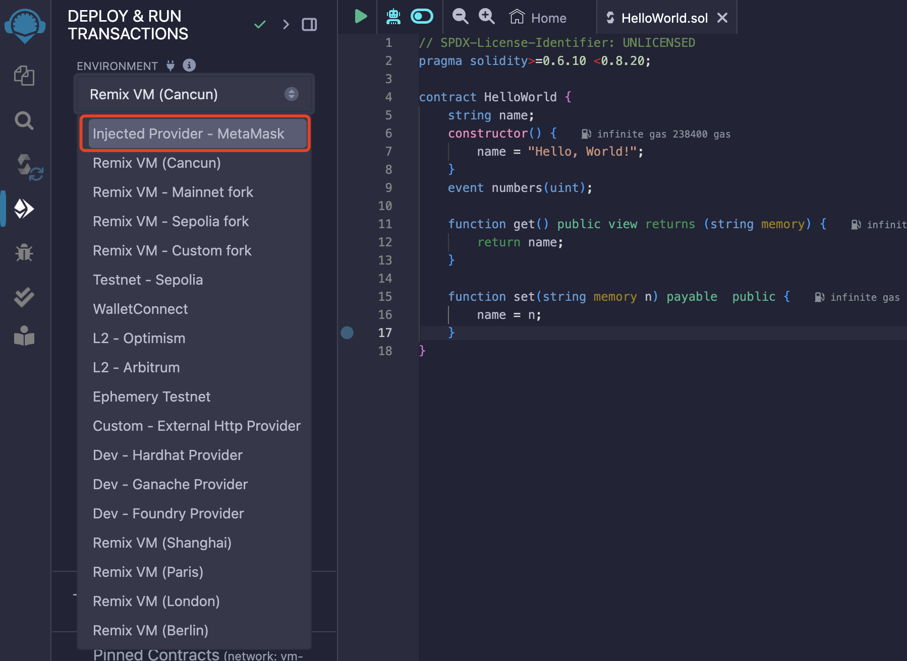
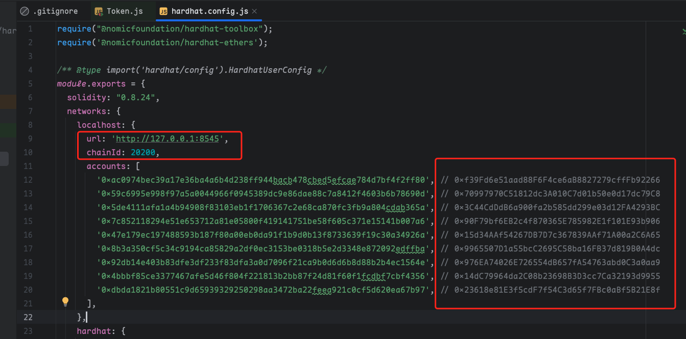

# 6. (New✨)使用Web3工具部署调用合约

标签：``Web3`` ``Remix`` ``Hardhat`` ``OpenZeppelin``

----

```eval_rst
.. important::
   FISCO BCOS在3.9.0版本开始支持使用Web3 JSON RPC，本文都基于FISCO BCOS开启Web3 JSON RPC之后使用的。详情请参考`【3.9.0版本说明】 <https://fisco-bcos-doc.readthedocs.io/zh_CN/latest/docs/introduction/change_log/3_9_0.html>`_
```

## 1. 开启Web3配置

在3.9.0的版本中的创世块中新增了web3 chain_id的字段，该字段将用于Web3工具辨认链的标识，有重要作用，**必须在启动初始化时确定**。

```toml
[web3]
    chain_id=20200
```

在配置项中新增了`web3_rpc`的配置项，默认为false，需要手动开启。

```toml
[web3_rpc]
    enable=false
    listen_ip=127.0.0.1
    listen_port=8545
    thread_count=16
```

### 1.1 旧节点升级并开启Web3配置

由于旧节点未存储关于Web3 Chain ID的信息，所以需要使用增加配置项的形式更新字段信息。按以下步骤执行即可：

1. 升级区块链二进制至3.9.0版本，灰度操作可参考：[版本升级指南](https://fisco-bcos-doc.readthedocs.io/zh-cn/latest/docs/introduction/change_log/upgrade.html)

2. 更新数据版本号到最新版本3.9.0：

   ```shell
   setSystemConfigByKey compatibility_version 3.9.0
   ```

3. 配置系统配置项`web3_chain_id`

   ```shell
   setSystemConfigByKey web3_chain_id 20200
   ```

4. 选择旧节点的配置文件，开启配置项

   ```shell
   # 更改config.ini
   vim config.ini
   
   [web3_rpc]
       enable=true
       listen_ip=0.0.0.0
       listen_port=8545
       thread_count=16
   ```

### 1.2 开启Balance功能

Balance功能在FISCO BCOS从3.7.0开始就已经支持。为了用户能顺滑地使用Web3相关的工具，需要在节点处预先开启Balance相关的功能，并给测试账户充值足够多的Balance。详情请参考以下步骤：

```shell
# 开启总体功能
setSystemConfigByKey feature_balance 1
# 开启Balance预编译功能
setSystemConfigByKey feature_balance_precompiled 1
```

## 2. 使用Remix向FISCO BCOS发送交易

**使用前提**

- **必须熟悉**Remix、MetaMask的使用，这两个工具都是开源工具，请参考以下文档：
  - [Remix documentation](https://remix-ide.readthedocs.io/en/latest/)
  - [MetaMask developer documentation](https://docs.metamask.io/)
- 为了更好地使用，请在能流畅访问外网环境下进行测试。

### 2.1 配置MetaMask

以下步骤以完全配置好MetaMask作为前提。

#### 2.1.1 手动添加网络

在MetaMask的设置中选择网络选项，点击`Add a network`


由于测试链没有在MetaMask列表中，需要手动填写链信息添加到MetaMask。


手动填写FISCO BCOS的信息内容。**特别注意：** RPC URL与Chain ID必须要和真实场景保持一致。


#### 2.1.2 在MetaMask查看账户余额

可以从账户列表中查看所有账户以及对应的balance余额


#### 2.1.3 使用MetaMask进行转账

用户可以通过MetaMask自带的转账功能进行balance转账。需要注意的是，Gas Limit需要手动填写。


确认好交易信息之后点击确认即可发送交易。


#### 2.1.4 查看交易信息

可以点击活动页查看交易的详细信息。


### 2.2 使用Remix接入MetaMask部署调用合约

在Remix部署和调用交易界面中配置环境信息。在环境中选择 `Injected Provider - MetaMask`即可。



在发起部署/调用合约时，Remix将会把合约内容发送到MetaMask，页面将会跳转到MetaMask进行确认签名。


## 3. 使用Hardhat工具向FISCO BCOS发送交易

**使用前提** ：**必须熟悉** Nodejs项目构建、nodejs基础语法、HardHat的使用，请参考以下文档：

- [Hardhat's tutorial for beginners](https://hardhat.org/tutorial)
- [Hardhat setting up a project](https://hardhat.org/hardhat-runner/docs/guides/project-setup)

### 3.1 使用Hardhat demo

为了方便测试，另外建好了hardhat的demo仓库：https://github.com/kyonRay/bcos-hardhat-tutorial

项目结构如下，contracts存放solidity合约，ignition存放最终部署上链的工具，test存放所有的合约测试代码。hardhat.config.js就是hardhat的基础配置文件。


在hardhat.config.js的配置文件中配置好IP端口、chainID，并向红框内的地址发送足够的balance。



在test文件夹中实现了基础token的测试代码。


在终端执行以下命令就可以跑所有测试：

```shell
hardhat test --network localhost
```

### 3.2 使用Hardhat连接FISCO BCOS注意点

#### 部署合约后地址需要重新设置

由于FISCO BCOS与Web3在地址计算中存在区别，Hardhat在部署好合约后将在本地根据合约的nonce以及发送者地址计算得出新的合约地址，这与FISCO BCOS不兼容。因此在部署完成合约之后，还需要手动设置合约地址才行。代码示例如下：

```js
// fb-deploy-helper.js
const { ethers } = require('hardhat');

async function deployFBContract(name, args, opts = undefined) {
  let contract = await ethers.deployContract(name, args, opts);
  const txHash = contract.deploymentTransaction().hash;
  const receipt = await ethers.provider.getTransactionReceipt(txHash);
  contract = contract.attach(receipt.contractAddress);
  return contract;
}

module.exports = { deployFBContract };
```

## 4. 遗留工作

FISCO BCOS目前已经支持使用绝大多数Web3工具连接，拓展了FISCO BCOS的生态圈。由于工程时间、优先级不高的原因，还剩一些遗留工作，后续将逐步补全。

1. 合约地址符合Web3合约地址规则 —— 3.12版本解决
2. 暂不支持cancun的opcode —— 3.10版本解决
3. gaslimit等EIP1559字段在计算gas时没用使用 —— 3.12版本解决
4. EVM中时间从毫秒对齐到秒 —— 3.12版本解决
5. 读取合约历史状态 —— 3.12版本解决
