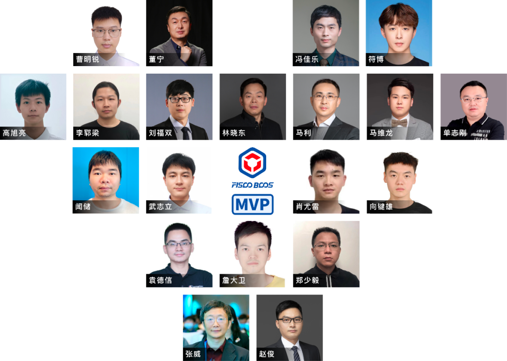

# 1. FISCO BCOS 区块链

标签：``FISCO BCOS介绍`` 

---

FISCO BCOS是由国内企业主导研发、对外开源、安全可控的企业级金融联盟链底层平台。自2015年开始布局区块链，于2016年牵头发起国内第一家金融行业的区块链联盟——金链盟，2017年FISCO BCOS完全开源，2023年FISCO BCOS区块链团队蝉联两度进入《福布斯》全球区块链50强。

作为最早开源的国产联盟链底层平台之一，FISCO BCOS一直以推动产业区块链发展为使命，积极探索数字经济和实体经济融合新路径。

社区以开源链接多方，截止2023年2月，汇聚了 **100+** 金链盟成员单位，逾 **90000+** 个人成员参与共建共治，发展成为最大最活跃的国产开源联盟链生态圈。自17年开源至今，开源五年取得了非凡成绩。

1. 在产业应用方面：底层平台可用性经广泛应用实践检验，以数助实链通产业协作。至今为止，涌现 **300+** 产业数字化标杆应用，覆盖文化版权、司法服务、政务服务、物联网、金融、智慧社区、房产建筑、社区治理、乡村振兴等领域。2022年发布《2022 FISCO BCOS产业应用白皮书》，积极推动区块链产业发展。

2. 在技术创新方面： 坚持自主创新：首创DMC算法大幅度提升性能、推出三种架构形态灵活适配业务需求。全链路国产化，采用国密算法与软硬件体系，支持国产OS，适配国产芯片和服务器，支持多语言多终端国密接入。全栈技术体系，覆盖底层+中间件+应用组件，有丰富的生态周边工具，在github上已有180+代码仓库。

3. 在开源生态方面：以开放聚众力、共建最大最活跃的国产开源联盟链生态圈。至今为止，FISCO BCOS已100+金链盟成员单位，超4000家企业及机构、逾90000+个人成员，已认证38加合约伙伴、46位FISCO BCOS MVP， 发展10个专项兴趣小组SIG，方向覆盖跨链、自动化部署、产业链改、人才培育等，已吸纳近500名开发者加入；已开展600+线上线下活动，连续召开三届年度峰会、30+国际国内重磅赛事，举办100+《超话区块链》公开课、高频次全国巡回沙龙/研讨会。

FISCO BCOS 开源社区涌现出贡献高质量技术内容的意见先锋与意见领袖，2022年，FISOC BCOS开源社区共认定20位MVP。 
这些优秀的贡献者或是将FISCO BCOS技术落地到各领域应用中，助力产业数字化，或是在多渠道布道，将开源社区精神传播到更远的地方。

