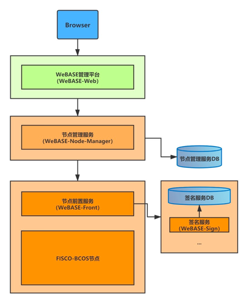

# 14. 区块链浏览器
标签：``区块链浏览器`` ``图形化``

------

区块链浏览器--WeBASE管理平台，可以将区块链中的数据进行可视化，并实时展示，方便用户以Web页面的方式，获取当前区块链中的信息。浏览器版本适配FISCO BCOS 2.0+以及3.0+，区块链浏览器主要展示了链上数据的具体信息，这些信息包括：概览信息，区块信息，交易信息等等。
本文档将主要介绍区块链浏览器--WeBASE管理平台的功能特性以及其部署升级方法。

### 1. 功能概览
WeBASE管理平台主要功能概括：
- 区块链数据概览
- 节点管理
- 合约管理
- 私钥管理
- 应用管理
- 系统管理
- 系统监控
- 交易审计 
- 订阅事件
- 账号管理
- 群组管理
- 移动端管理台
- 数据监控大屏

各个功能详细描述可参考[WeBASE管理平台使用手册](https://webasedoc.readthedocs.io/zh_CN/latest/docs/WeBASE-Console-Suit/index.html)。

### 2. 一键部署
WeBASE管理平台支持[一键部署](https://webasedoc.readthedocs.io/zh_CN/lab-dev/docs/WeBASE/install.html)，可以在同机快速搭建WeBASE管理台环境，方便用户快速体验WeBASE管理平台。

一键部署会搭建：节点（FISCO-BCOS 3.0+）、管理平台（WeBASE-Web）、节点管理子系统（WeBASE-Node-Manager）、节点前置子系统（WeBASE-Front）、签名服务（WeBASE-Sign）。
其中，节点的搭建是可选的，可以通过配置来选择使用已有链或者搭建新链。
一键部署架构如下：

详细的部署步骤可参考[WeBASE一键部署](https://webasedoc.readthedocs.io/zh_CN/lab-dev/docs/WeBASE/install.html)。