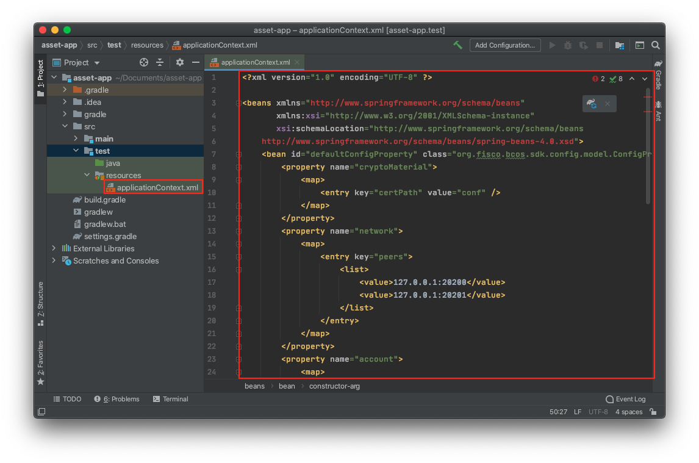
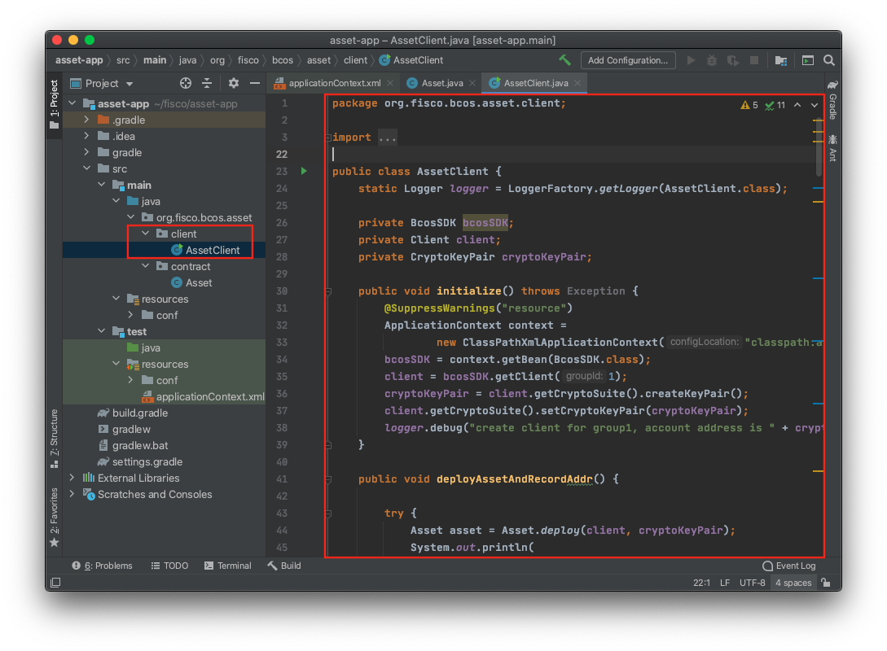

# 开发第一个wbc-liquid区块链应用

标签：``开发第一个应用`` ``wbc-liquid`` ``合约开发`` ``区块链应用`` ``WASM``

---

本章将会介绍一个基于FISCO BCOS区块链的业务应用场景开发全过程，从业务场景分析，到合约的设计实现，然后介绍合约编译以及如何部署到区块链，最后介绍一个应用模块的实现，通过我们提供的[Java SDK](../develop/sdk/java_sdk/index.md)实现对区块链上合约的调用访问。

本教程要求用户熟悉Linux操作环境，具备Java开发的基本技能，能够使用Gradle工具，熟悉webankblockchain-liquid语法（以下简称wbc-liquid），并且进行了[wbc-liquid的环境配置](https://liquid-doc.readthedocs.io/zh_CN/latest/docs/quickstart/prerequisite.html)。

如果您还未搭建区块链网络，或未下载控制台，请先走完教程[搭建第一个区块链网络](./air_installation.md)，再回到本教程。

## 1. 了解应用需求

区块链天然具有防篡改，可追溯等特性，这些特性决定其更容易受金融领域的青睐。本示例中，将会提供一个简易的资产管理的开发示例，并最终实现以下功能：

-   能够在区块链上进行资产注册
-   能够实现不同账户的转账
-   可以查询账户的资产金额

## 2. 设计与开发智能合约

在区块链上进行应用开发时，结合业务需求，首先需要设计对应的智能合约，确定合约需要储存的数据，在此基础上确定智能合约对外提供的接口，最后给出各个接口的具体实现。

### 第一步. 设计智能合约

**存储设计**

FISCO BCOS提供[kv table](.. FIXME: 链接待确定)开发模式，可以通过合约创建表，并对创建的表进行增删改查操作。针对本应用需要设计一个存储资产管理的表`t_asset`，该表字段如下：

-   account: 主键，资产账户(string类型)
-   asset_value: 资产金额(uint256类型)

其中account是主键，即操作`t_asset`表时需要传入的字段，区块链根据该主键字段查询表中匹配的记录。`t_asset`表示例如下：

| account | asset_value |
| ------- | ----------- |
| Alice   | 10000       |
| Bob     | 20000       |

**接口设计**

 按照业务的设计目标，需要实现资产注册，转账，查询功能，对应功能的接口如下：

```js
// 查询资产金额
pub fn select(&mut self, account: String) -> (bool, u128)
// 资产注册
pub fn register(&mut self, account: String, asset_value: u128) -> i256
// 资产转移
pub fn transfer(&mut self, from: String, to: String, value: u128) -> i256
```

### 第二步. 开发源码
#### 创建
根据我们第一步的存储和接口设计，创建一个Asset的智能合约项目。
在终端中执行以下命令创建 wbc-liquid 智能合约项目：

```rust
cargo liquid new contract asset
```

asset目录内的文件结构如下所示：
```
asset/
├── .gitignore
├── .liquid
│   └── abi_gen
│       ├── Cargo.toml
│       └── main.rs
├── Cargo.toml
└── src
│   └──lib.rs
```

其中各文件的功能如下：

-   `.gitignore`：隐藏文件，用于告诉版本管理软件[Git](https://git-scm.com/)哪些文件或目录不需要被添加到版本管理中。wbc-liquid 会默认将某些不重要的问题件（如编译过程中生成的临时文件）排除在版本管理之外，如果不需要使用 Git 管理对项目版本进行管理，可以忽略该文件；

-   `.liquid/`：隐藏目录，用于实现 wbc-liquid 智能合的内部功能，其中`abi_gen`子目录下包含了 ABI 生成器的实现，该目录下的编译配置及代码逻辑是固定的，如果被修改可能会造成无法正常生成 ABI；

-   `Cargo.toml`：项目配置清单，主要包括项目信息、外部库依赖、编译配置等，一般而言无需修改该文件，除非有特殊的需求（如引用额外的第三方库、调整优化等级等）；

-   `src/lib.rs`：wbc-liquid 智能合约项目根文件，合约代码存放于此文件中。智能合约项目创建完毕后，`lib.rs`文件中会自动填充部分样板代码，我们可以基于这些样板代码做进一步的开发。

我们将Asset liquid中的代码复制至`lib.rs`文件中后，便可进行后续步骤。

Asset liquid的内容如下：
```js
#![cfg_attr(not(feature = "std"), no_std)]

use liquid::storage;
use liquid_lang as liquid;
use liquid_lang::InOut;
use liquid_prelude::{
    string::{String, ToString},
    vec::Vec,
};

#[derive(InOut)]
pub struct KVField {
    key: String,
    value: String,
}
#[derive(InOut)]
pub struct Entry {
    fileds: Vec<KVField>,
}

#[liquid::interface(name = auto)]
mod kv_table {
    use super::*;

    extern "liquid" {
        fn createTable(
            &mut self,
            table_name: String,
            key: String,
            value_fields: String,
        ) -> i256;
        fn get(&self, table_name: String, key: String) -> (bool, Entry);
        fn set(&mut self, table_name: String, key: String, entry: Entry) -> i256;
    }
}

#[liquid::contract]
mod asset_test {
    use super::{kv_table::*, *};

    #[liquid(event)]
    struct RegisterEvent {
        ret_code: i256,
        #[liquid(indexed)]
        account: String,
        #[liquid(indexed)]
        asset_value: u128,
    }

    #[liquid(event)]
    struct TransferEvent {
        ret_code: i256,
        #[liquid(indexed)]
        from: String,
        #[liquid(indexed)]
        to: String,
        value: u128,
    }

    #[liquid(storage)]
    struct AssetTableTest {
        table: storage::Value<KvTable>,
    }

    #[liquid(methods)]
    impl AssetTableTest {
        pub fn new(&mut self) {
            self.table
                .initialize(KvTable::at("/sys/kv_storage".parse().unwrap()));
            self.table.createTable(
                String::from("t_asset").clone(),
                String::from("account").clone(),
                String::from("asset_value").clone(),
            );
        }

        pub fn select(&mut self, account: String) -> (bool, u128) {
            if let Some((result, entry)) =
            (*self.table).get(String::from("t_asset"), account)
            {
                return (
                    result,
                    u128::from_str_radix(&entry.fileds[0].value.clone(), 10)
                        .ok()
                        .unwrap(),
                );
            }
            return (false, Default::default());
        }

        pub fn register(&mut self, account: String, asset_value: u128) -> i256 {
            let ret_code: i256;
            let (ok, _) = self.select(account.clone());
            if ok == false {
                let kv0 = KVField {
                    key: String::from("account"),
                    value: account.clone(),
                };
                let kv1 = KVField {
                    key: String::from("asset_value"),
                    value: asset_value.to_string(),
                };
                let mut kv_fields = Vec::new();
                kv_fields.push(kv0);
                kv_fields.push(kv1);
                let entry = Entry { fileds: kv_fields };
                let result = (*self.table)
                    .set(String::from("t_asset"), account.clone(), entry)
                    .unwrap();

                if result == 1.into() {
                    ret_code = 0.into();
                } else {
                    ret_code = (-2).into();
                }
            } else {
                ret_code = (-1).into();
            }
            let ret = ret_code.clone();
            self.env().emit(RegisterEvent {
                ret_code,
                account,
                asset_value,
            });
            return ret;
        }

        pub fn transfer(&mut self, from: String, to: String, value: u128) -> i256 {
            let mut ret_code: i256 = 0.into();
            let (ok, from_value) = self.select(from.clone());
            if ok == true.into() {
                ret_code = (-1).into();
                self.env().emit(TransferEvent {
                    ret_code,
                    from,
                    to,
                    value,
                });
                return (-1).into();
            }

            let (ret, to_value) = self.select(to.clone());
            if ret != true {
                ret_code = (-2).into();
                self.env().emit(TransferEvent {
                    ret_code,
                    from,
                    to,
                    value,
                });
                return (-2).into();
            }

            if from_value < value.clone() {
                ret_code = (-3).into();
                self.env().emit(TransferEvent {
                    ret_code,
                    from,
                    to,
                    value,
                });
                return (-3).into();
            }

            if to_value.clone() + value.clone() < to_value.clone() {
                ret_code = (-3).into();
                self.env().emit(TransferEvent {
                    ret_code,
                    from,
                    to,
                    value,
                });
                return (-4).into();
            }

            let from_u = self.update(from.clone(), from_value - value.clone());
            if from_u != 1.into() {
                ret_code = (-5).into();
                self.env().emit(TransferEvent {
                    ret_code,
                    from,
                    to,
                    value,
                });
                return (-5).into();
            }

            let r = self.update(to.clone(), to_value.clone() + value.clone());
            self.env().emit(TransferEvent {
                ret_code,
                from,
                to,
                value,
            });
            return r;
        }

        pub fn update(&mut self, account: String, value: u128) -> i256 {
            let kv0 = KVField {
                key: String::from("asset_value"),
                value: value.to_string(),
            };
            let mut kv_fields = Vec::new();
            kv_fields.push(kv0);

            let entry = Entry { fileds: kv_fields };

            let r = (*self.table)
                .set(String::from("t_asset"), account, entry)
                .unwrap();
            return r;
        }
    }
}
```
#### 构建
在 asset 项目根目录下执行以下命令即可开始进行构建：
```bash
cargo liquid build -g
```
该命令会引导 Rust 语言编译器以`wasm32-unknown-unknown`为目标对智能合约代码进行编译，最终生成 Wasm 格式字节码及 ABI。`-g` 构建出能够在国密版FISCO BCOS区块链底层平台上运行的智能合约。命令执行完成后，会显示如下形式的内容：

```
Done in 4 minutes, your project is ready now:
Binary: /Users/leevaygr/Desktop/webank/liquid/asset/target/asset.wasm
   ABI: /Users/leevaygr/Desktop/webank/liquid/asset/target/asset.abi
```
其中，“Binary:”后为生成的字节码文件的绝对路径，“ABI:”后为生成的 ABI 文件的绝对路径。为尽量简化 FISCO BCOS 各语言 SDK 的适配工作，wbc-liquid 采用了与 Solidity ABI 规范兼容的 ABI 格式.

进入到 target 目录中，将 asset.wasm 重命名为 asset_sm.wasm。因为我们待会还要生成非国密的Binary、ABI文件，但是 `cargo liquid build` 会覆盖同名文件。
```bash
mv asset.wasm asset_sm.wasm
```

接着生成非国密的 Binary、ABI 文件：
```bash
cargo liquid build
```
注意：不带 `-g`。
执行命令后，生成信息和上述雷同，进入 `target` ，看到生成新的 Binary、ABI，以及刚刚的 `asset_sm.wasm`

## 3. 编译智能合约

``.sol``的智能合约需要编译成ABI和BIN文件才能部署至区块链网络上。有了这两个文件即可凭借Java SDK进行合约部署和调用。但这种调用方式相对繁琐，需要用户根据合约ABI来传参和解析结果。为此，控制台提供的编译工具不仅可以编译出ABI和BIN文件，还可以自动生成一个与编译的智能合约同名的合约Java类。这个Java类是根据ABI生成的，帮助用户解析好了参数，提供同名的方法。当应用需要部署和调用合约时，可以调用该合约类的对应方法，传入指定参数即可。使用这个合约Java类来开发应用，可以极大简化用户的代码。我们利用console控制台的脚本 `contract2java.sh` 生成 java 文件。

```bash
# 创建工作目录~/fisco
mkdir -p ~/fisco
# 下载控制台
cd ~/fisco && curl -#LO https://github.com/FISCO-BCOS/console/releases/download/v3.0.0-rc1/download_console.sh && bash download_console.sh

# 切换到fisco/console/目录
cd ~/fisco/console/

# 若没有 download_console.sh，在github下载console项目
git clone https://github.com/FISCO-BCOS/console.git
# 进入console, 创建执行文件
cd console && ./gradlew build
cd dist

# 编译合约(后面指定BINARY、abi 文件路径，可以根据实际项目路径指定路径)如下：
bash contract2java.sh -a ~/Desktop/webank/liquid/asset/target/asset.abi -b ~/Desktop/webank/liquid/asset/target/asset.wasm -sb ~/Desktop/webank/liquid/asset/target/asset_sm.wasm

# 脚本用法：
$ bash contract2java.sh liquid -h
Missing required options: b, a, sb
usage: contract2java.sh <solidity|liquid> [OPTIONS...]
 -a,--abi <arg>       [Required] The ABI file path of wbc-liquid contract.
 -b,--bin <arg>       [Required] The binary file path of wbc-liquid contract.
 -h,--help
 -o,--output <arg>    [Optional] The file path of the generated java code,
                      default is contracts/sdk/java/
 -p,--package <arg>   [Optional] The package name of the generated java
                      code, default is com
 -sb,--sm-bin <arg>   [Required] The SM binary file path of wbc-liquid
                      contract.
```

运行成功之后，将会在`console/dist/contracts/sdk/java/com`目录生成Asset.java文件。

`Asset.java`的主要接口：

```java
package org.fisco.bcos.asset.contract;

public class Asset extends Contract {
    // Asset.sol合约 transfer接口生成
    public TransactionReceipt transfer(String from_account, String to_account, BigInteger amount);
    // Asset.sol合约 register接口生成
    public TransactionReceipt register(String account, BigInteger asset_value);
    // Asset.sol合约 select接口生成
    public Tuple2<BigInteger, BigInteger> select(String account) throws ContractException;

    // 加载Asset合约地址，生成Asset对象
    public static Asset load(String contractAddress, Client client, CryptoKeyPair credential);

    // 部署Asset.sol合约，生成Asset对象
    public static Asset deploy(Client client, CryptoKeyPair credential) throws ContractException;
}
```

其中load与deploy函数用于构造Asset对象，其他接口分别用来调用对应的合约的接口。

## 4. 创建区块链应用项目

### 第一步. 安装环境
首先，我们需要安装JDK以及集成开发环境

- Java：JDK 14 （JDK1.8 至JDK 14都支持）

  首先，在官网上下载JDK14并安装

  然后，修改环境变量

  ```bash
  # 确认您当前的java版本
  $ java -version
  # 确认您的java路径
  $ ls Library/Java/JavaVirtualMachines
  # 返回
  # jdk-14.0.2.jdk
  
  # 如果使用的是bash
  $ vim .bash_profile 
  # 在文件中加入JAVA_HOME的路径
  # export JAVA_HOME = Library/Java/JavaVirtualMachines/jdk-14.0.2.jdk/Contents/Home 
  $ source .bash_profile
  
  # 如果使用的是zash
  $ vim .zashrc
  # 在文件中加入JAVA_HOME的路径
  # export JAVA_HOME = Library/Java/JavaVirtualMachines/jdk-14.0.2.jdk/Contents/Home 
  $ source .zashrc
  
  # 确认您的java版本
  $ java -version
  # 返回
  # java version "14.0.2" 2020-07-14
  # Java(TM) SE Runtime Environment (build 14.0.2+12-46)
  # Java HotSpot(TM) 64-Bit Server VM (build 14.0.2+12-46, mixed mode, sharing)
  ```

- IDE：IntelliJ IDE. 

  进入[IntelliJ IDE官网](https://www.jetbrains.com/idea/download/)，下载并安装社区版IntelliJ IDE。

### 第二步. 创建一个Java工程

在IntelliJ IDE中创建一个gradle项目，勾选Gradle和Java，并输入工程名``asset-app``。

注意：该项目的源码可以用以下方法获得并参考。（此步骤为非必须步骤）
```bash
$ cd ~/fisco
# FIXME: asset-app项目待确定，目前在（https://github.com/kyonRay/asset-app-liquid.git），待放入FISCO-BCOS
$ curl -#LO https://github.com/FISCO-BCOS/LargeFiles/raw/master/tools/asset-app.tar.gz
# 解压得到Java工程项目asset-app
$ tar -zxf asset-app.tar.gz
```

```eval_rst
.. note::
# FIXME: asset-app项目待确定，目前在（https://github.com/kyonRay/asset-app-liquid.git），待放入FISCO-BCOS
    - 如果因为网络问题导致长时间无法下载，请尝试将`199.232.28.133 raw.githubusercontent.com`追加到`/etc/hosts`中，或者请尝试 `curl -#LO https://osp-1257653870.cos.ap-guangzhou.myqcloud.com/FISCO-BCOS/FISCO-BCOS/tools/asset-app.tar.gz`
```

### 第三步. 引入FISCO BCOS Java SDK
在build.gradle文件中的``dependencies``下加入对FISCO BCOS Java SDK的引用。
```
repositories {
    mavenCentral()
    maven {
        allowInsecureProtocol = true
        url "http://maven.aliyun.com/nexus/content/groups/public/"
    }
    maven {
        allowInsecureProtocol = true
        url "https://oss.sonatype.org/content/repositories/snapshots" 
    }
}
```
引入Java SDK jar包

```java
testCompile group: 'junit', name: 'junit', version: '4.12'
compile ('org.fisco-bcos.java-sdk:fisco-bcos-java-sdk:3.0.0-rc1')
```

### 第四步. 配置SDK证书
修改``build.gradle``文件，引入Spring框架。

```
def spring_version = "4.3.27.RELEASE"
List spring = [
        "org.springframework:spring-core:$spring_version",
        "org.springframework:spring-beans:$spring_version",
        "org.springframework:spring-context:$spring_version",
        "org.springframework:spring-tx:$spring_version",
]

dependencies {
    compile logger
    runtime logger
    compile ("org.fisco-bcos.java-sdk:fisco-bcos-java-sdk:3.1.0-SNAPSHOT")
    compile spring
}
```

在``asset-app/test/resources``目录下创建配置文件``applicationContext.xml``，写入配置内容。


applicationContext.xml的内容如下：

```xml
<?xml version="1.0" encoding="UTF-8" ?>

<beans xmlns="http://www.springframework.org/schema/beans"
	   xmlns:xsi="http://www.w3.org/2001/XMLSchema-instance"
	   xsi:schemaLocation="http://www.springframework.org/schema/beans
    http://www.springframework.org/schema/beans/spring-beans-4.0.xsd">
	<bean id="defaultConfigProperty" class="org.fisco.bcos.sdk.config.model.ConfigProperty">
		<property name="cryptoMaterial">
			<map>
				<entry key="certPath" value="conf" />
				<entry key="useSMCrypto" value="false"/>
				<!-- SSL certificate configuration -->
				<!-- entry key="caCert" value="conf/ca.crt" /-->
				<!-- entry key="sslCert" value="conf/sdk.crt" /-->
				<!-- entry key="sslKey" value="conf/sdk.key" /-->
				<!-- GM SSL certificate configuration -->
				<!-- entry key="caCert" value="conf/gm/gmca.crt" /-->
				<!-- entry key="sslCert" value="conf/gm/gmsdk.crt" /-->
				<!-- entry key="sslKey" value="conf/gm/gmsdk.key" /-->
				<!--entry key="enSslCert" value="conf/gm/gmensdk.crt" /-->
				<!--entry key="enSslKey" value="conf/gm/gmensdk.key" /-->
			</map>
		</property>
		<property name="network">
			<map>
				<entry key="peers">
					<list>
						<value>127.0.0.1:20200</value>
						<value>127.0.0.1:20201</value>
					</list>
				</entry>
				<entry key="defaultGroup" value="group" />
			</map>
		</property>
		<!--
		<property name="amop">
			<list>
				<bean id="amopTopic1" class="org.fisco.bcos.sdk.config.model.AmopTopic">
					<property name="topicName" value="PrivateTopic1" />
					<property name="password" value="" />
					<property name="privateKey" value="" />
					<property name="publicKeys">
						<list>
							<value>conf/amop/consumer_public_key_1.pem</value>
						</list>
					</property>
				</bean>
			</list>
		</property>
		-->
		<property name="account">
			<map>
				<entry key="keyStoreDir" value="account" />
				<entry key="accountAddress" value="" />
				<entry key="accountFileFormat" value="pem" />
				<entry key="password" value="" />
				<entry key="accountFilePath" value="" />
			</map>
		</property>
		<property name="threadPool">
			<map>
				<entry key="channelProcessorThreadSize" value="16" />
				<entry key="receiptProcessorThreadSize" value="16" />
				<entry key="maxBlockingQueueSize" value="102400" />
			</map>
		</property>
	</bean>

	<bean id="defaultConfigOption" class="org.fisco.bcos.sdk.config.ConfigOption">
		<constructor-arg name="configProperty">
			<ref bean="defaultConfigProperty"/>
		</constructor-arg>
	</bean>

	<bean id="bcosSDK" class="org.fisco.bcos.sdk.BcosSDK">
		<constructor-arg name="configOption">
			<ref bean="defaultConfigOption"/>
		</constructor-arg>
	</bean>
</beans>
```
**注意：** FIXME: applicationContext.xml下配置字段改动待确定
`applicationContext.xml`配置不用修改。若区块链节点配置有改动，需要同样修改配置`applicationContext.xml`的`network`属性下的`peers`配置选项，配置所连接节点的`IP:channel_listen_port`。 FIXME: channel_listen_port是否需要修改

在以上配置文件中，我们指定了证书存放的位``certPath``的值为``conf``。接下来我们需要把SDK用于连接节点的证书放到指定的``conf``目录下。

```bash
# 假设我们将asset-app放在~/fisco目录下 进入~/fisco目录
$ cd ~/fisco
# 创建放置证书的文件夹
$ mkdir -p asset-app/src/test/resources/conf
# 拷贝节点证书到项目的资源目录
$ cp -r nodes/127.0.0.1/sdk/* asset-app/src/test/resources/conf
# 若在IDE直接运行，拷贝证书到resources路径
$ mkdir -p asset-app/src/main/resources/conf
$ cp -r nodes/127.0.0.1/sdk/* asset-app/src/main/resources/conf
```

## 5. 业务逻辑开发
我们已经介绍了如何在自己的项目中引入以及配置Java SDK，本节介绍如何通过Java程序调用合约，同样以示例的资产管理说明。

### 第一步.将3编译好的Java合约引入项目中

```bash
cd ~/fisco  
# 将编译好的合约Java类引入项目中。
cp console/contracts/sdk/java/org/fisco/bcos/asset/contract/Asset.java asset-app/src/main/java/org/fisco/bcos/asset/contract/Asset.java
```

### 第二步.开发业务逻辑

在路径`/src/main/java/org/fisco/bcos/asset/client`目录下，创建`AssetClient.java`类，通过调用`Asset.java`实现对合约的部署与调用



`AssetClient.java` 代码如下：
```java
package org.fisco.bcos.asset.liquid.client;

import java.io.FileNotFoundException;
import java.io.FileOutputStream;
import java.io.IOException;
import java.math.BigInteger;
import java.util.List;
import java.util.Properties;
import java.util.Random;

import org.fisco.bcos.asset.liquid.contract.Asset;
import org.fisco.bcos.sdk.BcosSDK;
import org.fisco.bcos.sdk.client.Client;
import org.fisco.bcos.sdk.codec.datatypes.generated.tuples.generated.Tuple2;
import org.fisco.bcos.sdk.crypto.keypair.CryptoKeyPair;
import org.fisco.bcos.sdk.model.TransactionReceipt;
import org.slf4j.Logger;
import org.slf4j.LoggerFactory;
import org.springframework.context.ApplicationContext;
import org.springframework.context.support.ClassPathXmlApplicationContext;
import org.springframework.core.io.ClassPathResource;
import org.springframework.core.io.Resource;

public class AssetClient {

  static Logger logger = LoggerFactory.getLogger(AssetClient.class);

  private BcosSDK bcosSDK;
  private Client client;
  private CryptoKeyPair cryptoKeyPair;

  public void initialize() throws Exception {
    @SuppressWarnings("resource")
    ApplicationContext context =
        new ClassPathXmlApplicationContext("classpath:applicationContext.xml");
    bcosSDK = context.getBean(BcosSDK.class);
    client = bcosSDK.getClient();
    cryptoKeyPair = client.getCryptoSuite().getCryptoKeyPair();
    client.getCryptoSuite().setCryptoKeyPair(cryptoKeyPair);
    logger.debug("create client for group1, account address is " + cryptoKeyPair.getAddress());
  }

  public void deployAssetAndRecordAddr() {

    try {
      String assetPath = "/asset" + new Random().nextInt(1000);
      Asset asset = Asset.deploy(client, cryptoKeyPair, assetPath);
      System.out.println(
          " deploy Asset success, contract address is " + asset.getContractAddress());

      recordAssetAddr(asset.getContractAddress());
    } catch (Exception e) {
      // TODO Auto-generated catch block
      // e.printStackTrace();
      System.out.println(" deploy Asset contract failed, error message is  " + e.getMessage());
    }
  }

  public void recordAssetAddr(String address) throws FileNotFoundException, IOException {
    Properties prop = new Properties();
    prop.setProperty("address", address);
    final Resource contractResource = new ClassPathResource("contract.properties");
    FileOutputStream fileOutputStream = new FileOutputStream(contractResource.getFile());
    prop.store(fileOutputStream, "contract address");
  }

  public String loadAssetAddr() throws Exception {
    // load Asset contact address from contract.properties
    Properties prop = new Properties();
    final Resource contractResource = new ClassPathResource("contract.properties");
    prop.load(contractResource.getInputStream());

    String contractAddress = prop.getProperty("address");
    if (contractAddress == null || contractAddress.trim().equals("")) {
      throw new Exception(" load Asset contract address failed, please deploy it first. ");
    }
    if (!contractAddress.startsWith("/")) {
      contractAddress = "/" + contractAddress;
    }
    logger.info(" load Asset address from contract.properties, address is {}", contractAddress);
    return contractAddress;
  }

  public void queryAssetAmount(String assetAccount) {
    try {
      String contractAddress = loadAssetAddr();
      Asset asset = Asset.load(contractAddress, client, cryptoKeyPair);
      Tuple2<Boolean, BigInteger> result = asset.getSelectOutput(asset.select(assetAccount));
      if (result.getValue1()) {
        System.out.printf(" asset account %s, value %s \n", assetAccount, result.getValue2());
      } else {
        System.out.printf(" %s asset account is not exist \n", assetAccount);
      }
    } catch (Exception e) {
      // TODO Auto-generated catch block
      // e.printStackTrace();
      logger.error(" queryAssetAmount exception, error message is {}", e.getMessage());

      System.out.printf(" query asset account failed, error message is %s\n", e.getMessage());
    }
  }

  public void registerAssetAccount(String assetAccount, BigInteger amount) {
    try {
      String contractAddress = loadAssetAddr();

      Asset asset = Asset.load(contractAddress, client, cryptoKeyPair);
      TransactionReceipt receipt = asset.register(assetAccount, amount);
      List<Asset.RegisterEventEventResponse> response = asset.getRegisterEventEvents(receipt);
      if (!response.isEmpty()) {
        if (response.get(0).ret_code.compareTo(BigInteger.valueOf(0)) == 0) {
          System.out.println(
                  " register asset account success => asset: " + assetAccount + ", value:  " + amount);
        } else {
          System.out.println(
                  " register asset account failed, ret code is " + response.get(0).ret_code.toString());
        }
      } else {
        System.out.println(" event log not found, maybe transaction not exec. ");
      }
    } catch (Exception e) {
      // TODO Auto-generated catch block
      // e.printStackTrace();

      logger.error(" registerAssetAccount exception, error message is {}", e.getMessage());
      System.out.println(" register asset account failed, error message is " + e.getMessage());
    }
  }

  public void transferAsset(String fromAssetAccount, String toAssetAccount, BigInteger amount) {
    try {
      String contractAddress = loadAssetAddr();
      Asset asset = Asset.load(contractAddress, client, cryptoKeyPair);
      TransactionReceipt receipt = asset.transfer(fromAssetAccount, toAssetAccount, amount);
      List<Asset.TransferEventEventResponse> response = asset.getTransferEventEvents(receipt);
      if (!response.isEmpty()) {
        if (response.get(0).ret_code.compareTo(BigInteger.valueOf(0)) == 0) {
          System.out.println(" transfer success => from_asset: " + fromAssetAccount + ", to_asset: " + toAssetAccount + ", amount: " + amount);
        } else {
          System.out.println(
                  " transfer asset account failed, ret code is " + response.get(0).ret_code.toString());
        }
      } else {
        System.out.println(" event log not found, maybe transaction not exec. ");
      }
    } catch (Exception e) {

      logger.error(" registerAssetAccount exception, error message is {}", e.getMessage());
      System.out.println(" register asset account failed, error message is " + e.getMessage());
    }
  }

  public static void Usage() {
    System.out.println(" Usage:");
    System.out.println(
        "\t java -cp conf/:lib/*:apps/* org.fisco.bcos.asset.liquid.client.AssetClient deploy");
    System.out.println(
        "\t java -cp conf/:lib/*:apps/* org.fisco.bcos.asset.liquid.client.AssetClient query account");
    System.out.println(
        "\t java -cp conf/:lib/*:apps/* org.fisco.bcos.asset.liquid.client.AssetClient register account value");
    System.out.println(
        "\t java -cp conf/:lib/*:apps/* org.fisco.bcos.asset.liquid.client.AssetClient transfer from_account to_account amount");
    System.exit(0);
  }

  public static void main(String[] args) throws Exception {
    if (args.length < 1) {
      Usage();
    }

    AssetClient client = new AssetClient();
    client.initialize();
    try {

      switch (args[0]) {
        case "deploy":
          client.deployAssetAndRecordAddr();
          break;
        case "query":
          if (args.length < 2) {
            Usage();
          }
          client.queryAssetAmount(args[1]);
          break;
        case "register":
          if (args.length < 3) {
            Usage();
          }
          client.registerAssetAccount(args[1], new BigInteger(args[2]));
          break;
        case "transfer":
          if (args.length < 4) {
            Usage();
          }
          client.transferAsset(args[1], args[2], new BigInteger(args[3]));
          break;
        default: {
          Usage();
        }
      }
    }
    catch (Exception e){
      System.out.println("Error: " + e);
    }
    System.exit(0);
  }
}
```

让我们通过AssetClient这个例子，来了解FISCO BCOS Java SDK的调用：
-   初始化

初始化代码的主要功能为构造Client与CryptoKeyPair对象，这两个对象在创建对应的合约类对象(调用合约类的deploy或者load函数)时需要使用。

```java
// 函数initialize中进行初始化 
// 初始化BcosSDK
@SuppressWarnings("resource")
ApplicationContext context =
    new ClassPathXmlApplicationContext("classpath:applicationContext.xml");
bcosSDK = context.getBean(BcosSDK.class);
client = bcosSDK.getClient();
cryptoKeyPair = client.getCryptoSuite().getCryptoKeyPair();
client.getCryptoSuite().setCryptoKeyPair(cryptoKeyPair);
logger.debug("create client for group, account address is " + cryptoKeyPair.getAddress());
```

-   构造合约类对象

可以使用deploy或者load函数初始化合约对象，两者使用场景不同，前者适用于初次部署合约，后者在合约已经部署并且已知合约地址时使用。

```java
// 部署合约
Asset asset = Asset.deploy(client, cryptoKeyPair, assetPath);
// 加载合约地址
Asset asset = Asset.load(contractAddress, client, cryptoKeyPair);
```

-   接口调用

使用合约对象调用对应的接口，处理返回结果。

```java
// select接口调用
 Tuple2<BigInteger, BigInteger> result = asset.select(assetAccount);
// register接口调用
TransactionReceipt receipt = asset.register(assetAccount, amount);
// transfer接口
TransactionReceipt receipt = asset.transfer(fromAssetAccount, toAssetAccount, amount);
```

在``asset-app/tool``目录下添加一个调用AssetClient的脚本``asset_run.sh``。
```bash
#!/bin/bash 

function usage() 
{
    echo " Usage : "
    echo "   bash asset_run.sh deploy"
    echo "   bash asset_run.sh query    asset_account "
    echo "   bash asset_run.sh register asset_account asset_amount "
    echo "   bash asset_run.sh transfer from_asset_account to_asset_account amount "
    echo " "
    echo " "
    echo "examples : "
    echo "   bash asset_run.sh deploy "
    echo "   bash asset_run.sh register  Asset0  10000000 "
    echo "   bash asset_run.sh register  Asset1  10000000 "
    echo "   bash asset_run.sh transfer  Asset0  Asset1 11111 "
    echo "   bash asset_run.sh query Asset0"
    echo "   bash asset_run.sh query Asset1"
    exit 0
}

    case $1 in
    deploy)
            [ $# -lt 1 ] && { usage; }
            ;;
    register)
            [ $# -lt 3 ] && { usage; }
            ;;
    transfer)
            [ $# -lt 4 ] && { usage; }
            ;;
    query)
            [ $# -lt 2 ] && { usage; }
            ;;
    *)
        usage
            ;;
    esac

    java -Djdk.tls.namedGroups="secp256k1" -cp 'apps/*:conf/:lib/*' org.fisco.bcos.asset.liquid.client.AssetClient $@
```

接着，配置好log。在``asset-app/test/resources``目录下创建``log4j.properties``

```properties
### set log levels ###
log4j.rootLogger=DEBUG, file

### output the log information to the file ###
log4j.appender.file=org.apache.log4j.DailyRollingFileAppender
log4j.appender.file.DatePattern='_'yyyyMMddHH'.log'
log4j.appender.file.File=./log/sdk.log
log4j.appender.file.Append=true
log4j.appender.file.filter.traceFilter=org.apache.log4j.varia.LevelRangeFilter
log4j.appender.file.layout=org.apache.log4j.PatternLayout
log4j.appender.file.layout.ConversionPattern=[%p] [%-d{yyyy-MM-dd HH:mm:ss}] %C{1}.%M(%L) | %m%n

###output the log information to the console ###
log4j.appender.stdout=org.apache.log4j.ConsoleAppender
log4j.appender.stdout.Target=System.out
log4j.appender.stdout.layout=org.apache.log4j.PatternLayout
log4j.appender.stdout.layout.ConversionPattern=[%p] [%-d{yyyy-MM-dd HH:mm:ss}] %C{1}.%M(%L) | %m%n
```

接着，通过配置gradle中的Jar命令，指定复制和编译任务。并引入日志库，在``asset-app/test/resources``目录下，创建一个空的``contract.properties``文件，用于应用在运行时存放合约地址。

```groovy
dependencies {
    testCompile group: 'junit', name: 'junit', version: '4.12'
    compile ("org.fisco-bcos.java-sdk:fisco-bcos-java-sdk:3.0.0-rc1")
    compile spring
    compile ('org.slf4j:slf4j-log4j12:1.7.25')
    runtime ('org.slf4j:slf4j-log4j12:1.7.25')
}
jar {
    destinationDir file('dist/apps')
    archiveName project.name + '.jar'
    exclude '**/*.xml'
    exclude '**/*.properties'
    exclude '**/*.crt'
    exclude '**/*.key'

    doLast {
        copy {
            from configurations.runtime
            into 'dist/lib'
        }
        copy {
            from file('src/test/resources/')
            into 'dist/conf'
        }
        copy {
            from file('tool/')
            into 'dist/'
        }
        copy {
            from file('src/test/resources/contract')
            into 'dist/contract'
        }
    }
}
```

至此，我们已经完成了这个应用的开发。最后，我们得到的asset-app的目录结构如下：

```bash
|-- build.gradle // gradle配置文件
|-- gradle
|   |-- wrapper
|       |-- gradle-wrapper.jar // 用于下载Gradle的相关代码实现
|       |-- gradle-wrapper.properties // wrapper所使用的配置信息，比如gradle的版本等信息
|-- gradlew // Linux或者Unix下用于执行wrapper命令的Shell脚本
|-- gradlew.bat // Windows下用于执行wrapper命令的批处理脚本
|-- src
|   |-- main
|   |   |-- java
|   |   |     |-- org
|   |   |          |-- fisco
|   |   |                |-- bcos
|   |   |                      |-- asset
|   |   |                            |-- client // 放置客户端调用类
|   |   |                                   |-- AssetClient.java
|   |   |                            |-- contract // 放置Java合约类
|   |   |                                   |-- Asset.java
|   |   |-- resources
|   |        |-- conf
|   |               |-- ca.crt
|   |               |-- node.crt
|   |               |-- node.key
|   |               |-- sdk.crt
|   |               |-- sdk.key
|   |               |-- sdk.publickey
|   |        |-- applicationContext.xml // 项目配置文件
|   |        |-- contract.properties // 存储部署合约地址的文件
|   |        |-- log4j.properties // 日志配置文件
|   |        |-- contract //存放 wbc-liquid 合约文件
|   |               |-- asset-test
|   |                   |-- src
|   |                       |-- lib.rs wbc-liquid文件
|   |-- test
|       |-- resources // 存放代码资源文件
|           |-- conf
|                  |-- ca.crt
|                  |-- node.crt
|                  |-- node.key
|                  |-- sdk.crt
|                  |-- sdk.key
|                  |-- sdk.publickey
|           |-- applicationContext.xml // 项目配置文件
|           |-- contract.properties // 存储部署合约地址的文件
|           |-- log4j.properties // 日志配置文件
|           |-- contract //存放 wbc-liquid 合约文件
|                   |-- asset-test
|                       |-- lib.rs wbc-liquid文件
|
|-- tool
    |-- asset_run.sh // 项目运行脚本
```

## 6. 运行应用

至此我们已经介绍使用区块链开发资产管理应用的所有流程并实现了功能，接下来可以运行项目，测试功能是否正常。

-   编译

```bash
# 切换到项目目录
$ cd ~/fisco/asset-app
# 编译项目
$ ./gradlew build
```

编译成功之后，将在项目根目录下生成`dist`目录。dist目录下有一个`asset_run.sh`脚本，简化项目运行。现在开始一一验证本文开始定下的需求。

-   部署`Asset.liquid`合约

```bash
# 进入dist目录
$ cd dist
$ bash asset_run.sh deploy
Deploy Asset successfully, contract address is 0xd09ad04220e40bb8666e885730c8c460091a4775
```

-   注册资产

```bash
$ bash asset_run.sh register Alice 100000
Register account successfully => account: Alice, value: 100000
$ bash asset_run.sh register Bob 100000
Register account successfully => account: Bob, value: 100000
```

-   查询资产

```bash
$ bash asset_run.sh query Alice
account Alice, value 100000
$ bash asset_run.sh query Bob
account Bob, value 100000
```

-   资产转移

```bash
$ bash asset_run.sh transfer Alice Bob  50000
Transfer successfully => from_account: Alice, to_account: Bob, amount: 50000
$ bash asset_run.sh query Alice
account Alice, value 50000
$ bash asset_run.sh query Bob
account Bob, value 150000
```

**总结：** 至此，我们通过wbc-liquid合约开发，合约编译，SDK配置与业务开发构建了一个基于FISCO BCOS联盟区块链的wbc-liquid应用。
