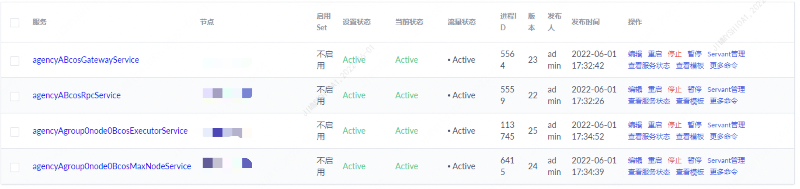

# 部署工具BcosBuilder

标签：``Max版区块链网络`` ``部署工具``

------------

```eval_rst
.. important::
    部署工具BcosBuilder目标是让用户最快的部署和使用FISCO BCOS Pro/max版本区块链，其功能包括：部署/启动/关闭/更新/扩容RPC服务、Gateway服务以及区块链节点服务。
```

FISCO BCOS提供了`BcosBuilder`工具帮助用户快速部署、启停、更新和扩容FISCO BCOS Max版本区块链联盟链，该工具可直接从FISCO BCOS的release tags中下载。

`BcosBuilder`在`max/conf`目录下提供了一些配置模板，用于帮助用户快速完成Max版本区块链的部署、扩容。本章从tars服务配置项、区块链部署配置项、区块链扩容配置项三个角度详细介绍`BcosBuilder`的配置项。

## 1 tars服务配置项

- `[tars].tars_url`: 访问tars网页控制台的url，默认为`http://127.0.0.1:3000`。
- `[tars].tars_token`: 访问tars服务的token，可通过tars网页控制台的【admin】->【用户中心】->【token管理】进行token申请和查询。
- `[tars].tars_pkg_dir`: 放置Max版本二进制包的路径，默认路径为binary/，若配置了该配置项，默认会从指定的目录下获取FISCO BCOS Pro版本二进制进行服务部署、扩容等操作。

下面是tars服务配置项的示例：

```shell
[tars]
tars_url = "http://127.0.0.1:3000"
tars_token = ""
tars_pkg_dir = "binary/"
```

## 2 区块链服务部署配置

区块链服务部署相关的配置项主要包括链配置项、RPC/Gateway服务配置项以及区块链节点服务配置项，其配置模板位于`BcosBuilder/max`的`conf/config-deploy-example.toml`路径下。

### 2.1 链配置项

链配置项位于配置`[chain]`中，主要包括：

- `[chain].chain_id`: 区块链服务所属的链的ID，默认为`chain0`，**不能包括除字母和数字之外的所有特殊字符**;
- `[chain].rpc_sm_ssl`: RPC服务与SDK客户端之间采用的SSL连接类型，若设置为`false`，表明采用RSA加密连接；若设置为`true`，表明采用国密SSL连接，默认为`false`;
- `[chain].gateway_sm_ssl`: Gateway服务之间的SSL连接类型，设置为`false`表明采用RSA加密连接；设置为`true`表明采用国密SSL连接，默认为`false`;
- `[chain].rpc_ca_cert_path`: RPC服务的CA证书路径，若该路径下有完整的CA证书、CA私钥，`BcosBuilder`部署工具基于该路径下的CA证书生成RPC服务SSL连接证书；否则`BcosBuilder`部署工具会生成CA证书，并基于生成的CA证书为RPC服务颁发SSL连接证书;
- `[chain].gateway_ca_cert_path`:  Gateway服务的CA证书路径，若该路径下有完整的CA证书、CA私钥，`BcosBuilder`部署工具基于该路径下的CA证书生成Gateway服务SSL连接证书；否则`BcosBuilder`部署工具会生成CA证书，并基于生成的CA证书为Gateway服务颁发SSL连接证书;

链ID为`chain0`, RPC与SDK之间、Gateway服务之间均采用RSA加密连接的配置项如下：

```shell
[chain]
chain_id="chain0"
# the rpc-service enable sm-ssl or not, default disable sm-ssl
rpc_sm_ssl=false
# the gateway-service enable sm-ssl or not, default disable sm-ssm
gateway_sm_ssl=false
# the existed rpc service ca path, will generate new ca if not configurated
#rpc_ca_cert_path=""
# the existed gateway service ca path, will generate new ca if not configurated
#gateway_ca_cert_path=""
```

### 2.2 机构服务配置项

机构服务配置项位于`[[agency]]`中，主要配置机构落盘加密信息以及用于提供主备服务的etcd集群信息，具体如下：

- `[[agency]].name`: 机构名;
- `[[agency]].failover_cluster_url`: 用于提供自动化主备服务的etcd集群访问地址，可以复用`tikv`的pd集群，**须确保机构内的RPC/Gateway/区块链节点均可访问该etcd集群**;
- `[[agency]].enable_storage_security`: 机构内的RPC/Gateway服务是否开启落盘加密;
- `[[agency]].key_center_url`: 若开启落盘加密服务，通过本配置项配置`Key Manager`的url;
- `[[agency]].cipher_data_key`: 若开启落盘加密服务，通过本配置项配置加密密钥.

### 2.3 RPC服务配置项

```eval_rst
.. note::
   - 当部署一个RPC服务到多台机器时，请确保这些机器都安装了tarsnode服务，tarsnode部署请参考 `这里 <https://doc.tarsyun.com/#/markdown/TarsCloud/TarsDocs/installation/node.md>`_
```

RPC服务的配置项位于`[[agency]].[agency.rpc]`中，一个机构可部署一个RPC服务，一条链可包含多个机构，主要配置项包括：

- `[[agency]].[agency.rpc].deploy_ip`: RPC服务的部署IP，若配置多个，则会在多台机器上部署RPC服务，达到平行扩展的目标。
- `[[agency]].[agency.rpc].listen_ip`: RPC服务的监听IP，默认为`0.0.0.0`。
- `[[agency]].[agency.rpc].listen_port`: RPC服务的监听端口，默认为`20200`。
- `[[agency]].[agency.rpc].thread_count`: RPC服务进程内的工作线程数目，默认为`4`。


为机构`agencyA`部署RPC服务的配置如下：

```ini
[[agency]]
name = "agencyA"
failover_cluster_url = "172.25.0.3:2379"
# enable data disk encryption for rpc/gateway or not, default is false
enable_storage_security = false
# url of the key center, in format of ip:port, please refer to https://github.com/FISCO-BCOS/key-manager for details
# key_center_url =
# cipher_data_key =

    [agency.rpc]
    # 服务部署IP，支持多个，单须确保每个IP对应的机器上均安装了tarsnode服务
    deploy_ip=["172.25.0.3"]
    # RPC服务监听IP
    listen_ip="0.0.0.0"
    # RPC服务监听端口
    listen_port=20200
    # 工作线程数目
    thread_count=4
```

### 2.4 Gateway服务配置项

RPC服务的配置项位于`[[agency]].[agency.gateway]`中，一个机构可部署一个Gateway服务，一条链可部署多个Gateway服务，主要配置项包括：

- `[[agency]].[agency.gateway].deploy_ip`: Gateway服务的部署IP，若配置多个，则会在多台机器上部署Gateway服务，达到平行扩展的目标。
- `[[agency]].[agency.gateway].listen_ip`: Gateway服务的监听IP，默认为`0.0.0.0`。
- `[[agency]].[agency.gateway].listen_port`: Gateway服务的监听端口，默认为`30300`。
- `[[agency]].[agency.gateway].peers`: 所有Gateway服务的连接信息。

为机构`agencyA`部署Gateway服务的配置示例如下：

```ini
[[agency]]
name = "agencyA"
failover_cluster_url = "172.25.0.3:2379"
# enable data disk encryption for rpc/gateway or not, default is false
enable_storage_security = false
# url of the key center, in format of ip:port, please refer to https://github.com/FISCO-BCOS/key-manager for details
# key_center_url =
# cipher_data_key =

    [agency.gateway]
    deploy_ip=["172.25.0.3"]
    listen_ip="0.0.0.0"
    listen_port=30300
    peers=["172.25.0.3:30300", "172.25.0.3:30301"]
```

### 2.5 区块链节点服务配置项：群组配置

```eval_rst
.. note::
    区块链群组配置不可修改。
```

FISCO BCOS Pro版本区块链中每个区块链节点服务均属于一个群组，因此部署区块链节点前，首先需配置群组信息，群组配置项位于`[[group]]`中，具体如下：

- `[[group]].group_id`: 区块链节点所属的群组ID，默认为`group`。
- `[[group]].sm_crypto`: 节点账本是否采用国密类型签名、验签、哈希、加密算法，默认为`false`。


群组配置中还包括了创世块相关的配置：
- `[[group]].leader_period`: 每个leader可以连续打包的区块数目，默认为5;
- `[[group]].block_tx_count_limit`: 每个区块中可包含的最大交易数目，默认为1000;
- `[[group]].consensus_type`: 共识算法类型，目前仅支持`pbft`共识算法;
- `[[group]].gas_limit`: 每笔交易运行时消耗的gas上限，默认为300000000;
- `[[group]].vm_type`: 区块链节点运行的虚拟机类型，目前支持`evm`和`wasm`两种类型，且一个群组仅可运行一种类型的虚拟机，不可以部分节点运行EVM虚拟机、部分节点运行WASM虚拟机;
- `[[group]].auth_check`: 是否开启权限治理模式，权限使用文档请参考链接：[权限治理使用指南](../../develop/committee_usage.md);
- `[[group]].init_auth_address`: 开启权限治理时，指定的初始化治理委员账号地址，权限使用文档请参考链接：[权限治理使用指南](../../develop/committee_usage.md);
- `[[group]].compatibility_version`: 数据兼容版本号，默认为`3.0.0`，可通过控制台`setSystemConfigByKey`命令运行时升级数据兼容版本。

```ini
[[group]]
group_id="group0"
# the genesis configuration path of the group, will generate new genesis configuration if not configurated
# genesis_config_path = ""
# VM type, now only support evm/wasm
vm_type="evm"
# use sm-crypto or not
sm_crypto=false
# enable auth-check or not
auth_check=false
init_auth_address=""

# the genesis config
# the number of blocks generated by each leader
leader_period = 1
# the max number of transactions of a block
block_tx_count_limit = 1000
# consensus algorithm now support PBFT(consensus_type=pbft)
consensus_type = "pbft"
# transaction gas limit
gas_limit = "3000000000"
# compatible version, can be dynamically upgraded through setSystemConfig
# the default is 3.0.0
compatibility_version="3.0.0"
```

### 2.6 区块链节点服务配置项：部署配置

区块链节点服务部署配置项位于`[[agency]].[[agency.group]].[[agency.group.node]]`中，具体如下：
- `[[agency]].[[agency.group]].[[agency.group.node]].node_name`: 节点服务名，在服务部署的场景下可不配置，**若配置了该选项，须确保不同节点服务的服务名不重复**;
- `[[agency]].[[agency.group]].[[agency.group.node]].deploy_ip`: Max节点的BcosMaxNodeService节点服务部署ip
- `[[agency]].[[agency.group]].[[agency.group.node]].executor_deploy_ip`: Max节点的BcosExecutoerService服务部署ip
- `[[agency]].[[agency.group]].[[agency.group.node]].pd_addrs`: TiKV集群的pd访问地址, **每个Max节点须连接一个独立的TiKV集群，不同Max节点不可共用TiKV集群**;
- `[[agency]].[[agency.group]].[[agency.group.node]].key_page_size`: KeyPage的粒度，默认10KB;
- `[[agency]].[[agency.group]].[[agency.group.node]].enable_storage_security`: 是否开启落盘加密，默认为`false`;
- `[[agency]].[[agency.group]].[[agency.group.node]].key_center_url`: 若开启了落盘加密，这里可配置key-manager的url
- `[[agency]].[[agency.group]].[[agency.group.node]].cipher_data_key`: 若开启了落盘加密，这里配置数据加密密钥
- `[[agency]].[[agency.group]].[[agency.group.node]].monitor_listen_port`: 监控服务的监听端口，默认为`3902`
- `[[agency]].[[agency.group]].[[agency.group.node]].monitor_log_path`: 需要监控的区块链节点日志所在路径

区块链节点服务配置示例如下：
```ini
[[agency]]
name = "agencyA"
   [[agency.group]]
        group_id = "group0"
        [[agency.group.node]]
        node_name = "node0"
        # the tikv storage pd-addresses
        pd_addrs="172.25.0.3:2379"
        key_page_size=10240
        deploy_ip = ["172.25.0.3"]
        executor_deploy_ip=["172.25.0.3"]
        monitor_listen_port = "3901"
        # the tikv storage pd-addresses
        # monitor log path example:"/home/fisco/tars/framework/app_log/"
        monitor_log_path = ""
```

## 3 区块链服务扩容配置

`BcosBuilder/max`提供了区块链节点服务扩容、RPC/Gateway服务扩容功能，区块链节点服务扩容的配置模板在`conf/config-node-expand-example.toml`路径下，RPC/Gateway服务扩容配置模板在`conf/config-service-expand-example.toml`路径下。

### 3.1 RPC服务扩容配置

FISCO BCOS Pro版本区块链中，一个RPC服务可包含多个RPC服务节点，`BcosBuilder`提供了RPC服务扩容功能，可在已有RPC服务基础上扩容RPC服务节点，其配置选项主要位于`[chain]`和`[[agency]].[agency.rpc]`配置下，主要包括：

- `[chain].chain_id`: 扩容的RPC服务所属的链ID;
- `[chain].rpc_sm_ssl`: 扩容的RPC服务与SDK客户端之间是否采用国密SSL连接;
- `[chain].rpc_ca_cert_path`: 指定扩容的RPC服务的CA证书和CA私钥所在路径;
- `[[agency]].[agency.rpc].deploy_ip`: 扩容的RPC服务的部署IP;
- `[[agency]].[agency.rpc].listen_ip`: 指定扩容的RPC服务的监听IP;
- `[[agency]].[agency.rpc].listen_port`: 指定扩容的RPC服务的监听端口;
- `[[agency]].[agency.rpc].thread_count`: 扩容的RPC服务的工作线程数目;

扩容机构`agencyA`RPC服务`agencyABcosRpcService`到`172.25.0.5`的配置示例如下：

```ini
[chain]
chain_id="chain0"
rpc_sm_ssl=false
gateway_sm_ssl=false
# the ca path of the expanded rpc service
# must ensure that the path configuration is correct, otherwise the ssl verification will fail
rpc_ca_cert_path="generated/rpc/chain0/ca"
# the ca path of the expanded gateway service
# must ensure that the path configuration is correct, otherwise the ssl verification will fail
gateway_ca_cert_path="generated/gateway/chain0/ca"

[[agency]]
name = "agencyA"
failover_cluster_url = "172.25.0.3:2379"
# enable data disk encryption for rpc/gateway or not, default is false
enable_storage_security = false
# url of the key center, in format of ip:port, please refer to https://github.com/FISCO-BCOS/key-manager for details
# key_center_url =
# cipher_data_key =

    [agency.rpc]
    deploy_ip=["172.25.0.5"]
    listen_ip="0.0.0.0"
    listen_port=10200
    thread_count=4
```

### 3.2 Gateway服务扩容配置

类似于RPC服务，Gateway服务的扩容配置选项主要位于`[chain]`和`[[agency]].[agency.gateway]`配置下，主要包括：
- `[chain].chain_id`: 扩容的Gateway服务所属的链ID;
- `[chain].gateway_sm_ssl`: 扩容的Gateway服务与SDK客户端之间是否采用国密SSL连接;
- `[chain].gateway_ca_cert_path`: 指定扩容的Gateway服务的CA证书和CA私钥所在路径;
- `[[agency]].[agency.gateway].deploy_ip`: 扩容的Gateway服务的部署IP;
- `[[agency]].[agency.gateway].listen_ip`: Gateway服务节点的监听IP，默认为`0.0.0.0`;
- `[[agency]].[agency.gateway].listen_port`: Gateway服务的监听端口，默认为`30300`;
- `[[agency]].[agency.gateway].peers`: Gateway服务的连接信息，须配置所有Gateway服务节点的连接IP和连接端口信息。

扩容机构`agencyA`Gateway服务`agencyABcosGatewayService`到`172.25.0.5`的配置示例如下：

```ini
[chain]
chain_id="chain0"
rpc_sm_ssl=false
gateway_sm_ssl=false
# the ca path of the expanded rpc service
# must ensure that the path configuration is correct, otherwise the ssl verification will fail
rpc_ca_cert_path="generated/rpc/chain0/ca"
# the ca path of the expanded gateway service
# must ensure that the path configuration is correct, otherwise the ssl verification will fail
gateway_ca_cert_path="generated/gateway/chain0/ca"

[[agency]]
name = "agencyA"
# enable data disk encryption for rpc/gateway or not, default is false
enable_storage_security = false
# url of the key center, in format of ip:port, please refer to https://github.com/FISCO-BCOS/key-manager for details
# key_center_url =
# cipher_data_key =

    [agency.gateway]
    deploy_ip=["172.25.0.5"]
    listen_ip="0.0.0.0"
    listen_port=40300
    peers=["172.25.0.3:30300", "172.25.0.3:30301", "172.25.0.5:40300"]
```

### 3.3 区块链节点扩容配置

`BcosBuilder/max`提供了区块链节点扩容功能，可为指定群组扩容新的区块链节点服务，区块链节点扩容配置模板位于`conf/config-node-expand-example.toml`路径下，主要包括**链配置**和**扩容部署配置**，具体如下：

- `[chain].chain_id`: 扩容的区块链节点所属的链ID;
- `[[group]].group_id`: 扩容节点所属群组ID;
- `[[group]].genesis_config_path`: 扩容节点的创世块配置路径;
- `[[group]].sm_crypto`: 扩容节点是否为国密节点，默认为`false`;
- `[[agency]].[[agency.group]].group_id`: 扩容节点所在群组ID;
- `[[agency]].[[agency.group.node]].node_name`: 扩容的区块链节点服务名，**不能和已有的区块链节点服务名冲突**;
- `[[agency]].[[agency.group.node]].deploy_ip`: 扩容的区块链节点服务部署IP;
- `[[agency]].[[agency.group.node]].pd_addrs`: 扩容节点对应的TiKV集群的pd访问地址, **每个Max节点须连接一个独立的TiKV集群，不同Max节点不可共用TiKV集群**;
- `[[agency]].[[agency.group.node]].executor_deploy_ip`: Max节点的BcosExecutoerService服务部署ip;
- `[[agency]].[[agency.group.node]].enable_storage_security`: 扩容节点是否开启落盘加密;
- `[[agency]].[[agency.group.node]].key_center_url`: key-manager的url，在开启落盘加密场景中需配置;
- `[[agency]].[[agency.group.node]].cipher_data_key`: 数据落盘加密密钥，在开启落盘加密场景中需配置。

为机构`agencyA`的`group0`群组扩容节点名为`node2`的区块链节点服务到`172.25.0.5`的配置示例如下：
```ini
[[agency]]
name = "agencyA"
    [[agency.group]]
        group_id = "group0"

        [[agency.group.node]]
        # expand the existed-max-node
        node_name = "node1"
        # the tikv storage pd-addresses
        pd_addrs="172.25.0.3:2379"
        key_page_size=10240
        deploy_ip = ["172.25.0.5"]
        executor_deploy_ip=["172.25.0.3"]
        # enable data disk encryption for bcos node or not, default is false
        enable_storage_security = false
        # url of the key center, in format of ip:port, please refer to https://github.com/FISCO-BCOS/key-manager for details
        # key_center_url =
        # cipher_data_key =
```

### 3.4 区块链执行器扩容配置

传统的区块链节点部署在一台机器上，其交易的执行速率受制于一台机器的性能。Max版本的FISCO BCOS支持将区块链节点内的交易执行器（executor）部署在多台机器上，实现**区块内交易的多机并行执行**，极大的拓展了单个区块链节点的交易处理性能。同时，多个交易执行器也提升了系统的稳定性，只需一个执行器在线即可工作。

`BcosBuilder/max`提供了区块链节点扩容功能，可为指定群组扩容新的区块链节点服务，区块链节点扩容配置模板位于`conf/config-node-expand-example.toml`路径下，主要包括**链配置**和**扩容部署配置**。交易执行器的相关配置项如下，我们可以为每个节点配置多个执行器：

* `[[agency]].[[agency.group.node]].executor_deploy_ip`

搭建max版本时即搭建了executor的多机架构，此时通过tars管理台可看到有executor进程在跑，且与node进程不是同一个



#### 扩容操作

能够扩展更多的executor

``` bash
# 在Max节点已经搭建完成后，编辑config-node-expand-example.toml，新增更多的executor
cd tools/BcosBuilder/max/
vim config-node-expand-example.toml
```

修改文件中的`executor_deploy_ip`，新增更多需要部署executor的机器ip

> 一台机器（一个IP）只能部署一个executor

``` toml
# 如原先为
executor_deploy_ip=["172.25.0.3"]
# 可新增更多
executor_deploy_ip=["172.25.0.3","172.25.0.4","172.25.0.5"]  # 每个ip下都会部署一个该node的executor
```

调用脚本进行扩容

``` bash
python3 build_chain.py chain -c config-node-expand-example.toml -o expand -t executor
```

成功后，可在tars的管理台页面看到更多executor处在Active状态


#### 管理操作

在扩容后，可通过tars管理台对executor进行停止或重启的操作。executor停止或重启后，无需重启相应的区块链节点进程，节点会自动与所有在线的executor重建交易执行上下文。交易执行器的多机部署，提升了交易执行性能的同时，也提高了系统的稳定性。


### TiKV扩容

max节点在生产环境建议使用TIKV的集群版，TiKV集群版作为节点的后端可以轻松简单的实现扩容缩容。具体的扩容缩容操作指令[请参考官方文档](https://docs.pingcap.com/zh/tidb/dev/scale-tidb-using-tiup)。
