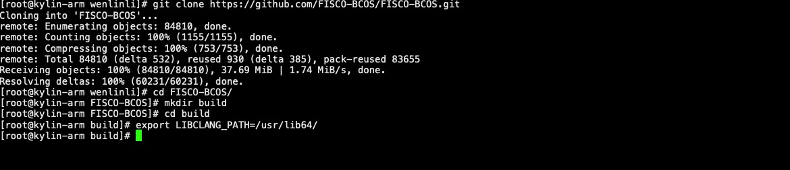
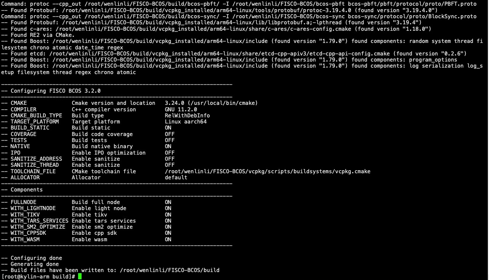
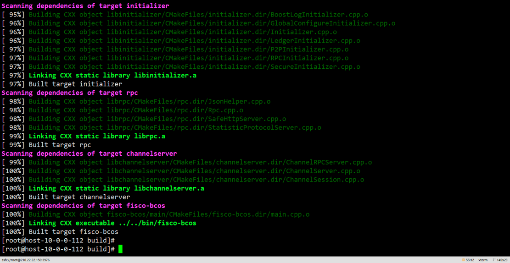

# 6. 国产化支持
标签： ``国产支持`` 

----
FISCO BCOS全面适配国产服务器，支持鲲鹏、银河麒麟V10等国产化平台。下面介绍在银河麒麟系统V10ARM平台 FISCO BCOS源码编译并部署运行链的步骤：

### 安装基础软件与源码编译
#### 1. 更新软件
```shell
yum update
```
#### 2. 安装基础依赖
```shell
sudo yum update
sudo yum install -y wget curl tar 
sudo yum install -y build-essential clang flex bison patch glibc-static glibc-devel libzstd-devel libmpc cpp 

# 查看gcc版本，若gcc版本低于10，安装版本高于10的gcc
gcc -v

# 查看cmake版本，是否大于等于3.14，若不满足，安装符合要求的cmake版本
cmake --version
```
#### 3.拉取代码
```shell
# 创建源码编译目录
mkdir -p ~/fisco && cd ~/fisco

# 克隆代码
git clone https://github.com/FISCO-BCOS/FISCO-BCOS.git

# 若因为网络问题导致长时间无法执行上面的命令，请尝试下面的命令：
git clone https://gitee.com/FISCO-BCOS/FISCO-BCOS.git

# 切换到源码目录
cd FISCO-BCOS

# 进入源码编译目录
cd ~/fisco/FISCO-BCOS
mkdir -p build && cd build

# 导入clang编译文件
export LIBCLANG_PATH=/usr/lib64/
```


#### 4. 源码编译
```shell
# 配置vcpkg代理
export X_VCPKG_ASSET_SOURCES=x-azurl,http://106.15.181.5/

# 编译
cmake3 -DBUILD_STATIC=ON .. || cat *.log

# 若编译依赖过程中遇到了vcpkg失败的问题，请根据报错提示查看错误日志
# 若为网络原因可按照上文提示配置vcpkg代理

# 高性能机器可添加-j4使用4核加速编译
make -j4
```



详细编译可参考[节点源码编译](./compile_binary.md)
### 部署控制台与部署合约交易

#### 1. 下载一键建链脚本
```shell
curl -#LO https://github.com/FISCO-BCOS/FISCO-BCOS/releases/download/v3.2.0/build_chain.sh && chmod u+x build_chain.sh
```

#### 2. 利用编译生成的二进制部署链
```shell
bash build_chain.sh -l 127.0.0.1:4 -p 30300,20200 -e ../FISCO-BCOS/build/fisco-bcos-air/fisco-bcos
[INFO] Generate ca cert successfully!
Processing IP:127.0.0.1 Total:4
[INFO] Generate ./nodes/127.0.0.1/sdk cert successful!
[INFO] Generate ./nodes/127.0.0.1/node0/conf cert successful!
[INFO] Generate ./nodes/127.0.0.1/node1/conf cert successful!
[INFO] Generate ./nodes/127.0.0.1/node2/conf cert successful!
[INFO] Generate ./nodes/127.0.0.1/node3/conf cert successful!
[INFO] Generate uuid success: e273464c-827d-47ce-921f-8c16d72234b0
[INFO] Generate uuid success: b3a54d03-dadb-4cfb-9ae9-86d8ce507110
[INFO] Generate uuid success: 1bf757a5-6649-4d35-9514-d7de95ea7306
[INFO] Generate uuid success: 3c90d210-a202-4d46-a04b-89fcc8c47dd9
==============================================================
[INFO] fisco-bcos Path     : bin/fisco-bcos
[INFO] Auth Mode           : false
[INFO] Start Port          : 30300 20200
[INFO] Server IP           : 127.0.0.1:4
[INFO] SM Model            : false
[INFO] output dir          : ./nodes
[INFO] All completed. Files in ./nodes

#启动节点
bash nodes/127.0.0.1/start_all.sh
try to start node0
try to start node1
try to start node2
try to start node3
 node3 start successfully pid=36430
 node2 start successfully pid=36427
 node1 start successfully pid=36433
 node0 start successfully pid=36428
```

查看节点状态
```shell
ps aux |grep -v grep |grep fisco-bcos

fisco        35249   7.1  0.2  5170924  57584 s003  S     2:25下午   0:31.63 /home/fisco/nodes/127.0.0.1/node1/../fisco-bcos -c config.ini -g config.genesis
fisco        35218   6.8  0.2  5301996  57708 s003  S     2:25下午   0:31.78 /home/fisco/nodes/127.0.0.1/node0/../fisco-bcos -c config.ini -g config.genesis
fisco        35277   6.7  0.2  5301996  57660 s003  S     2:25下午   0:31.85 /home/fisco/nodes/127.0.0.1/node2/../fisco-bcos -c config.ini -g config.genesis
fisco        35307   6.6  0.2  5301996  57568 s003  S     2:25下午   0:31.93 /home/fisco/nodes//127.0.0.1/node3/../fisco-bcos -c config.ini -g config.genesis
```
#### 3. 部署控制台
详细可参考[配置和使用控制台](../quick_start/air_installation.md)
```shell
cd ~/fisco && curl -LO https://github.com/FISCO-BCOS/console/releases/download/v3.2.0/download_console.sh && bash download_console.sh
```

```eval_rst
.. note::
   - 如果因为网络问题导致长时间无法下载，请尝试 cd ~/fisco && curl -#LO https://gitee.com/FISCO-BCOS/console/raw/master/tools/download_console.sh
```

```shell
cp -n console/conf/config-example.toml console/conf/config.toml

#配置控制台证书
cp -r nodes/127.0.0.1/sdk/* console/conf

#启动控制台
bash start.sh
=============================================================================================
Welcome to FISCO BCOS console(3.2.0)!
Type 'help' or 'h' for help. Type 'quit' or 'q' to quit console.
 ________ ______  ______   ______   ______       _______   ______   ______   ______
|        |      \/      \ /      \ /      \     |       \ /      \ /      \ /      \
| $$$$$$$$\$$$$$|  $$$$$$|  $$$$$$|  $$$$$$\    | $$$$$$$|  $$$$$$|  $$$$$$|  $$$$$$\
| $$__     | $$ | $$___\$| $$   \$| $$  | $$    | $$__/ $| $$   \$| $$  | $| $$___\$$
| $$  \    | $$  \$$    \| $$     | $$  | $$    | $$    $| $$     | $$  | $$\$$    \
| $$$$$    | $$  _\$$$$$$| $$   __| $$  | $$    | $$$$$$$| $$   __| $$  | $$_\$$$$$$\
| $$      _| $$_|  \__| $| $$__/  | $$__/ $$    | $$__/ $| $$__/  | $$__/ $|  \__| $$
| $$     |   $$ \\$$    $$\$$    $$\$$    $$    | $$    $$\$$    $$\$$    $$\$$    $$
 \$$      \$$$$$$ \$$$$$$  \$$$$$$  \$$$$$$      \$$$$$$$  \$$$$$$  \$$$$$$  \$$$$$$

=============================================================================================
```

#### 4. 部署交易
```shell
# 获取节点列表信息
[group0]: /> getGroupPeers
peer0: 48fde62f1d2dc59a65bed2e3bb9bd199de26de6b9894e2201199726d6e9e98d090bb1d7e22c931b412728a832ffacdd2727b34fc808f5a755af6bc623c44aba6
peer1: 8e510d66644a8a6caa7e031f097f604501bc42a3851b817f65a18eede0c539f2d011349d470da74cb84a3cf88dbd64a4cc18369fa09b17dac4eec9f65975ecc2
peer2: 9d7ff3f0d3abd54054a99d17a6af27c839f8f7702a4335bdb502323c87a0d7978534a2479cfedb614e1548a869efe038fc49da442b5770aa52c0cc793ca13602
peer3: f0ffa45cee35dcc1bcf1e1ef7b7c3d96590c25ba75198a28ef5ceb89dc6bec310619cb6850231018c8d5a5d698eaf1e5669118e17ea79379211bd332896aa56a

#部署合约
[group0]: /> deploy HelloWorld
transaction hash: 0x796b573aece250bba891b9251b8fb464d22f41cb36e7cae407b2bd0a870f5b72
contract address: 0x6849F21D1E455e9f0712b1e99Fa4FCD23758E8F1
currentAccount: 0x7b047472a4516e9697446576f8c7fcc064f967fa
```
