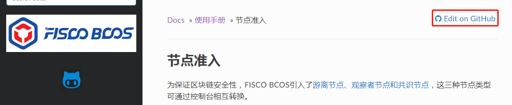
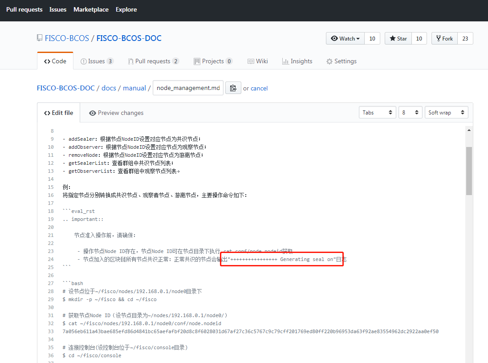

**非常感谢能有心为FISCO BCOS文档提出修改意见！接下来将给出使用网站提文档pr的操作指引。**

## 适用场景

- 修改已有文档内容
- 对已有pr进行修改

## 前期准备

- 创建GitHub账号并登录该账号

## 操作流程

### 场景1：修改已有文档内容

以修改[使用手册/节点准入](https://fisco-bcos-documentation.readthedocs.io/zh_CN/latest/docs/manual/node_management.html)文档为例，对提pr步骤进行说明。修改内容如下：


1.在浏览器打开[使用手册/节点准入](https://fisco-bcos-documentation.readthedocs.io/zh_CN/latest/docs/manual/node_management.html)文档页面，点击下图红框处的`Edit on GitHub`链接；



2.跳转至Github页面，你会看到下图红框处的铅笔状图标，点击该图标；


3.跳转至可编辑页面，作如下修改，下图为修改后的内容；



4.点击`Preview changes`，预览修改内容（红色为删除，绿色为增加）；


5.如需继续修改文档，点击`Edit file`返回到可编辑页面后，再进行修改（步骤3）；

6.如确认修改完成，下拉至页面结束处，填写pr的标题及修改描述，点击`Propose file change`按钮；


7.跳转至`Comparing changes`页面，检查pr的目标分支是否正确（这次pr的目标分支为`release-2`）；如内容正确，点击`Create pull request`按钮；


8.跳转至`Open a pull request`页面，点击`Create pull request`按钮;


9.跳转至以下页面表示pr创建成功。如需修改pr信息，可点击红框处的`Edit`进行修改；


10.pr合入后，你会收到电子邮件通知。

### 场景2：对已有pr进行修改

1.打开原有pr页面；

2.点击`Files changed`进行页面跳转，再点击铅笔状图标；


3.进行修改；

4.下拉至页面结束处，如选择将本次修改内容提交到原有pr（默认第一项），可直接点击`Commit changes`按钮，修改完成；


5.如选择将本次修改内容新建pr，点击第二项后将跳转页面，参照场景1的步骤6继续操作。

## 文档模板

指引类文档
```
# 文档标题（注意，文档标题要与同类文档保持句式一直）
关键词：``文档指引``

## 1. 第一部分
第一步：
```