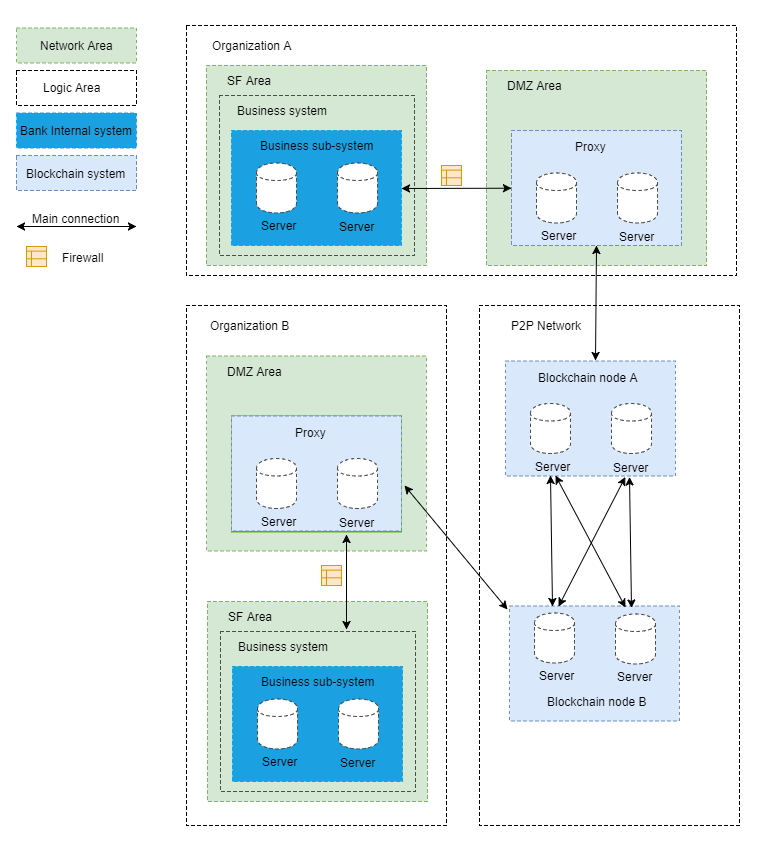

# Advance Messages Onchain Protocol
**Author: fisco-dev**  
## Introduction
AMOP (Advance Messages Onchain Protocol) aims to provide a safe and efficient message channel. In consortium chain, all nodes, no matter consensus node or observation node, can use AMOP as the message channel with the following advantages:
- Real-time: AMOP messages do not rely on transactions and consensus. Messages are transmitted nearly real-time with only a few milliseconds delay between nodes.  
- Reliable: When the message is transmitted by AMOP, it will leverage any feasible routes in the blockchain network.The message is guaranteed to be reachable as long as at least one route is available between sender and receiver node.
- Efficient: AMOP protocol is concise and clean. It takes very minimized CPU and network bandwidth.
- Secure: Supports SSL encryption on the network and the encryption algorithm is configurable.
- Easy to use: AMOP is embedded in the SDK.

## Network Architecture
  
Take the classic IDC (Internet Data Center) bank architecture as an example:  
- SF (Server Farm) area: Applications within the organization's intranet can leverage the SDK to send AMOP messages to the proxy. If there is no DMZ, applications will link to blockchain nodes directly.
- DMZ (Demilitarized Zone) area: Physical or logical isolated network. This area is optional but recommended for better security.
- Blockchain P2P network: The logical area which contains blockchain nodes from different organizations. This is usually deployed within the DMZ zone but can also be placed in the SF area.
- Proxy Server: Responsible for forwarding messages from internal applications to the blockchain P2P network. It is recommended to place the proxy inside DMZ.

## Configuration
Below is a sample code for sending AMOP messages (Spring Bean):
```xml

<?xml version="1.0" encoding="UTF-8" ?>
<beans xmlns="http://www.springframework.org/schema/beans"
    xmlns:xsi="http://www.w3.org/2001/XMLSchema-instance" xmlns:p="http://www.springframework.org/schema/p"
    xmlns:tx="http://www.springframework.org/schema/tx" xmlns:aop="http://www.springframework.org/schema/aop"
    xmlns:context="http://www.springframework.org/schema/context"
    xsi:schemaLocation="http://www.springframework.org/schema/beans   
    http://www.springframework.org/schema/beans/spring-beans-2.5.xsd  
    http://www.springframework.org/schema/tx   
    http://www.springframework.org/schema/tx/spring-tx-2.5.xsd  
            http://www.springframework.org/schema/aop   
    http://www.springframework.org/schema/aop/spring-aop-2.5.xsd">

<!-- Thread pool configuration, config as needs -->
<bean id="pool" class="org.springframework.scheduling.concurrent.ThreadPoolTaskExecutor">
    <property name="corePoolSize" value="50" />
    <property name="maxPoolSize" value="100" />
    <property name="queueCapacity" value="500" />
    <property name="keepAliveSeconds" value="60" />
    <property name="rejectedExecutionHandler">
        <bean class="java.util.concurrent.ThreadPoolExecutor.AbortPolicy" />
    </property>
</bean>

<!-- Blockchain nodes configuration -->
<bean id="channelService" class="cn.webank.channel.client.Service">
    <property name="orgID" value="WB" /> <!-- Configure the organization's name -->
        <property name="allChannelConnections">
            <map>
                <entry key="WB"> <!-- Setup SDK to link to the blockchain proxy in DMZ. If no DMZ, link to blockchain node directly.-->
                    <bean class="cn.webank.channel.handler.ChannelConnections">
                        <property name="connectionsStr">
                            <list>
                                <value>NodeA@127.0.0.1:30333</value><!-- Format: Node name @ IP address: Port Node name can be any -->
                            </list>
                        </property>
                    </bean>
                </entry>
            </map>
        </property>
    </bean>
</bean>
```

If DMZ is used, the below is require to configured for the proxy server:
```xml

<?xml version="1.0" encoding="UTF-8" ?>
<beans xmlns="http://www.springframework.org/schema/beans"
    xmlns:xsi="http://www.w3.org/2001/XMLSchema-instance" xmlns:p="http://www.springframework.org/schema/p"
    xmlns:tx="http://www.springframework.org/schema/tx" xmlns:aop="http://www.springframework.org/schema/aop"
    xmlns:context="http://www.springframework.org/schema/context"
    xsi:schemaLocation="http://www.springframework.org/schema/beans   
    http://www.springframework.org/schema/beans/spring-beans-2.5.xsd  
            http://www.springframework.org/schema/tx   
    http://www.springframework.org/schema/tx/spring-tx-2.5.xsd  
            http://www.springframework.org/schema/aop   
    http://www.springframework.org/schema/aop/spring-aop-2.5.xsd">

    <!-- Blockchain nodes configuration -->
    <bean id="proxyServer" class="cn.webank.channel.proxy.Server">
        <property name="remoteConnections">
            <bean class="cn.webank.channel.handler.ChannelConnections">
                <property name="connectionsStr">
                    <list>
                        <value>NodeA@127.0.0.1:5051</value><!-- Format: Node name @ IP address: Port Node name can be any -->
                    </list>
                </property>
            </bean>
        </property>

        <property name="localConnections">
            <bean class="cn.webank.channel.handler.ChannelConnections">
            </bean>
        </property>
        <!-- Proxy listening port config for SDK connection -->
        <property name="bindPort" value="30333"/>
    </bean>
</beans>
```

## How to use SDK
The sending and receiving is based on publish-subscribe pattern. The server creates the topic and subscribes to it. Clients connect to the topic to send message to the server.

Multiple topics are supported in a blockchain. There is no limitation for the number of servers and clients. If multiple servers are subscribing to the same topic, only the first available server will receive the message.

Server-side example:

```java

package cn.webank.channel.test;

import java.util.ArrayList;
import java.util.List;

import org.slf4j.Logger;
import org.slf4j.LoggerFactory;
import org.springframework.context.ApplicationContext;
import org.springframework.context.support.ClassPathXmlApplicationContext;

import cn.webank.channel.client.Service;

public class Channel2Server {
    static Logger logger = LoggerFactory.getLogger(Channel2Server.class);

    public static void main(String[] args) throws Exception {
        if(args.length < 1) {
            System.out.println("Parameters: Receive topic");
            return;
        }

        String topic = args[0];

        ApplicationContext context = new ClassPathXmlApplicationContext("classpath:applicationContext.xml");
        Service service = context.getBean(Service.class);

        //config topic, support multiple topic
        List<String> topics = new ArrayList<String>();
        topics.add(topic);
        service.setTopics(topics);

        //handle PushCallback class, see Callback code
        PushCallback cb = new PushCallback();
        service.setPushCallback(cb);

        //run server
        service.run();
    }
}
```
Server-side PushCallback example:

```java

package cn.webank.channel.test;

import java.time.LocalDateTime;
import java.time.format.DateTimeFormatter;

import org.slf4j.Logger;
import org.slf4j.LoggerFactory;

import cn.webank.channel.client.ChannelPushCallback;
import cn.webank.channel.dto.ChannelPush;
import cn.webank.channel.dto.ChannelResponse;

class PushCallback extends ChannelPushCallback {
    static Logger logger = LoggerFactory.getLogger(PushCallback2.class);

    //onPush function, Called when the AMOP message is received
    @Override
    public void onPush(ChannelPush push) {
        DateTimeFormatter df = DateTimeFormatter.ofPattern("yyyy-MM-dd HH:mm:ss");
        logger.debug("Received PUSH message:" + push.getContent());

        System.out.println(df.format(LocalDateTime.now()) + "server:Received PUSH message:" + push.getContent());

        //Response
        ChannelResponse response = new ChannelResponse();
        response.setContent("receive request seq:" + String.valueOf(push.getMessageID()));
        response.setErrorCode(0);

        push.sendResponse(response);
    }
}
```

Client-side example:

```java

package cn.webank.channel.test;

import java.time.LocalDateTime;
import java.time.format.DateTimeFormatter;
import java.util.Date;
import java.util.Random;

import org.slf4j.Logger;
import org.slf4j.LoggerFactory;
import org.springframework.context.ApplicationContext;
import org.springframework.context.support.ClassPathXmlApplicationContext;

import cn.webank.channel.client.Service;
import cn.webank.channel.dto.ChannelRequest;
import cn.webank.channel.dto.ChannelResponse;

public class Channel2Client {
    static Logger logger = LoggerFactory.getLogger(Channel2Client.class);

    public static void main(String[] args) throws Exception {
        if(args.length < 1) {
            System.out.println("Parameters: target topic");
            return;
        }

        String topic = args[0];

        DateTimeFormatter df = DateTimeFormatter.ofPattern("yyyy-MM-dd HH:mm:ss");

        ApplicationContext context = new ClassPathXmlApplicationContext("classpath:applicationContext.xml");

        Service service = context.getBean(Service.class);
        service.run();

        Thread.sleep(2000); //It takes a little time to set up the connection, and if the message is sent immediately, it will fail

        ChannelRequest request = new ChannelRequest();
        request.setToTopic(topic); //Set message's topic
        request.setMessageID(service.newSeq()); //Message sequence number that uniquely identifies a message, use newSeq() random generate
        request.setTimeout(5000); //Timeout of message

        request.setContent("request seq:" + request.getMessageID()); //Message content

        ChannelResponse response = service.sendChannelMessage2(request); //Send message

        System.out.println(df.format(LocalDateTime.now()) + "Received response seq:" + String.valueOf(response.getMessageID()) + ", Error code:" + response.getErrorCode() + ", message content:" + response.getContent());
    }
}
```

## Running the test app locally
After creating the above configurations, you can start the AMOP server and client with the below command lines:

Start AMOP server:

```
java -cp 'conf/:apps/*:lib/*' cn.webank.channel.test.Channel2Server [topic name]
```  

Start AMOP client

```
java -cp 'conf/:apps/*:lib/*' cn.webank.channel.test.Channel2Client [topic name] [message content] [number of messages]
```

## Error Code

- 99: Message failed to deliver as there is no available route to the destination server. Check the node status with the sequence number(seq) generated while sending message as well as verify the route status.
- 102: Connection Timeout. The server may be overloaded or not reachable.
