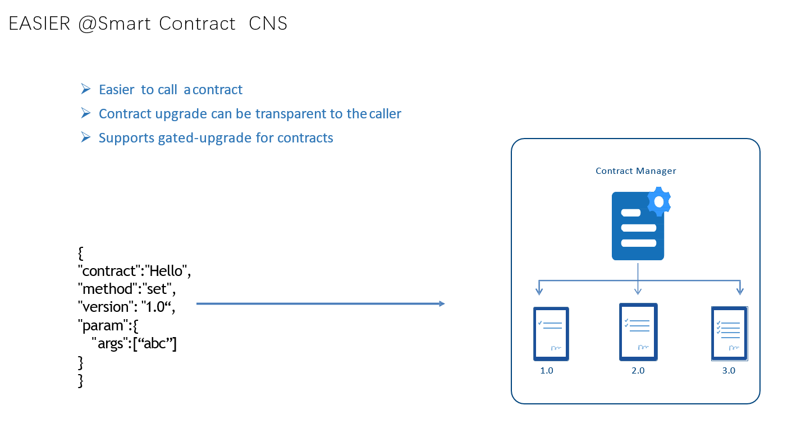
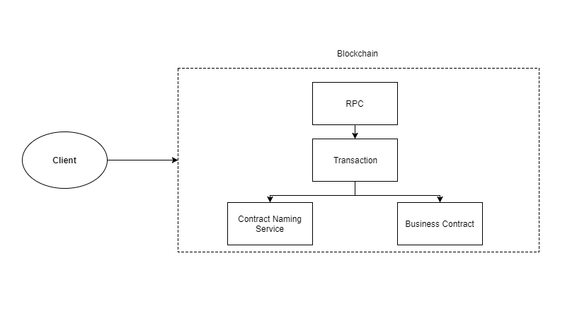

# Contract Name Service

## Overview

### 1.Steps to call a smart contract

Implement a smart contract includes steps: coding, compiling and deploying.
Take HelloWorld.sol as an example:

``` solidity
// HelloWorld.sol path: FISCO-BCOS/tool/HelloWorld.sol
pragma solidity ^0.4.2;
contract HelloWorld{
    string name;
    function HelloWorld(){
       name="Hi,Welcome!";
    }
    function get()constant returns(string){
        return name;
    }
    function set(string n){
        name=n;
    }
}
```

After compiling the contract, a description of the contract interface - ABI - is provided as follows:

```json
[
  {
    "constant": false,
    "inputs": [
      {
        "name": "n",
        "type": "string"
      }
    ],
    "name": "set",
    "outputs": [
    ],
    "payable": false,
    "stateMutability": "nonpayable",
    "type": "function"
  },
  {
    "constant": true,
    "inputs": [
    ],
    "name": "get",
    "outputs": [
      {
        "name": "",
        "type": "string"
      }
    ],
    "payable": false,
    "stateMutability": "view",
    "type": "function"
  },
  {
    "inputs": [
    ],
    "payable": false,
    "stateMutability": "nonpayable",
    "type": "constructor"
  }
]
```
Deploy the contract to the blockchain to generate an address, Such as: 0x269ab4bc23b07efeb3c3fd52eecfc4cbe6a50859.
Finally, use the ABI and address to call the smart contract. The key input parameters are ABI and address even there are different SDK tools.

### 2. Brief to CNS

ABI and contract address are mandatory when we trigger the smart contract. Below are some disadvantages of using the ABI and contract address directly.

1.	The ABI is a lengthy JSON string which is not user-friendly.
2.	Contract address is a magic number which is difficult to remember and can easily type wrong.
3.	The contract will be unreachable if the address had been forgotten.
4.	The contract address is changed after deployment.
5.	It is difficult to manage versioning and contract gated-upgrade.

With the CNS in place, we see the following advantages as a caller:
1.	No longer need to maintain the ABI and contract address.
2.	Only needs to know the contract name, version, function name and parameters
3.	Contract upgrade is transparent to the caller
4.	Supports gated-upgrade for contracts




## How it works

### 1. Overall framework



The client calls the contract service by RPC, first it will visit contract naming service to get underlying business contract details (ABI and address), then construct a call to business smart contract by using it's ABI and address, and finally return the results to the client.

### 2. Key components

#### a. Contract Manager

Contract manager contains mapping between the name and contract information. CNS Manager (cns_manager.js) is a tool that allows us to add, update, list and reset the mappings. Any changes made with the tool will be synchronized to the systems automatically.

- Mapping in the contract manager:
  > Key: contract name, contract version number
  > Value: ABI, address.
- Sample implementation code: systemcontractv2/ContractAbiMgr.sol  
- Abstract Contract: tool/ContractBase.sol
- Provide multi-version management by inheriting from ContractBase.sol, and initializing ContractAbiMgr with version number.
> ContractAbiMgr is managed by system contract, system contract should be deployed before applying CNS.

---------------------


#### b. CNS Manager Tool

Provide add, update, list and reset naming mapping information by calling contract manager.

- Tool: tool/cns_manager.js  

```
babel-node cns_manager.js
 cns_manager.js Usage:
         babel-node cns_manager.js get    contractName [contractVersion]
         babel-node cns_manager.js add    contractName
         babel-node cns_manager.js update contractName
         babel-node cns_manager.js list [simple]
         babel-node cns_manager.js historylist contractName [contractVersion] [simple]
         babel-node cns_manager.js reset contractName [contractVersion] index

```

List of utility methods:

- Command    : add  
- Parameter  : contractName  
- Function   : add contract name to contract management  
- Note       : Duplicate contract name raise warning. This can be resolve in following two ways: 1. change the contract version and specify the version number during calling by CNS. or 2. overwrite mapping in contract manager by calling 'update' command.

```javascript
//first time add Test, success
babel-node cns_manager.js add Test
cns add operation => cns_name = Test
         cns_name =>Test
         contract =>Test
         version  =>
         address  =>0x233c777fccb9897ad5537d810068f9c6a4344e4a
         abi      =>[{"constant":false,"inputs":[{"name":"num","type":"uint256"}],"name":"trans","outputs":[],"payable":false,"stateMutability":"nonpayable","type":"function"},{"constant":true,"inputs":[],"name":"get","outputs":[{"name":"","type":"uint256"}],"payable":false,"stateMutability":"view","type":"function"},{"constant":false,"inputs":[],"name":"Ok","outputs":[],"payable":false,"stateMutability":"nonpayable","type":"function"}]

//second time add, failed
babel-node cns_manager.js add Test
cns_manager.js  ........................Begin........................
 [WARNING] cns add operation failed , ====> contract => Test version =>  already exist. you can update it or change its version.
```
- Command   : get  
- Parameter : 1. contractName  2. contractVersion [optional]  
- Description    : Get contract information by name and version

```javascript
babel-node cns_manager.js get HelloWorld
cns_manager.js  ........................Begin........................
 ====> contract => HelloWorld ,version =>
         contract    = HelloWorld
         version     =
         address     = 0x269ab4bc23b07efeb3c3fd52eecfc4cbe6a50859
         timestamp   = 1516866720115 => 2018/1/25 15:52:0:115
         abi         = [{"constant":false,"inputs":[{"name":"n","type":"string"}],"name":"set","outputs":[],"payable":false,"stateMutability":"nonpayable","type":"function"},{"constant":true,"inputs":[],"name":"get","outputs":[{"name":"","type":"string"}],"payable":false,"stateMutability":"view","type":"function"},{"inputs":[],"payable":false,"stateMutability":"nonpayable","type":"constructor"}]
```
- Command   : update
- Parameter : contractName
- Description    : Update stored contract information  
- Note      : 1, Failure in case the corresponding contract does not exist. To resolve, add the missing contract first; 2, The overwritten information can be queried by 'historylist' command and reset by 'reset' command.

```javascript
babel-node cns_manager.js update Test
cns_manager.js  ........................Begin........................
 ====> Are you sure you want to update the cns of the contract ?(Y/N)
Y
cns update operation => cns_name = Test
         cns_name =>Test
         contract =>Test
         version  =>
         address  =>0x233c777fccb9897ad5537d810068f9c6a4344e4a
         abi      =>[{"constant":false,"inputs":[{"name":"num","type":"uint256"}],"name":"trans","outputs":[],"payable":false,"stateMutability":"nonpayable","type":"function"},{"constant":true,"inputs":[],"name":"get","outputs":[{"name":"","type":"uint256"}],"payable":false,"stateMutability":"view","type":"function"},{"constant":false,"inputs":[],"name":"Ok","outputs":[],"payable":false,"stateMutability":"nonpayable","type":"function"}]
Send transaction successfully: 0x1d3caff1fba49f5ad8af3d195999454d01c64d236d9ac3ba91350dd543b10c13
```
- Command   : list
- Parameter : simple[optional]
- Description    : List all the existing mappings in the contract manager. Display the contract name and version in case option 'simple' provided, else display all the details.

```javascript
babel-node cns_manager.js list simple
cns_manager.js  ........................Begin........................
 cns total count => 11
        1. contract = ContractAbiMgr ,version =
        2. contract = SystemProxy ,version =
        3. contract = TransactionFilterChain ,version =
        4. contract = AuthorityFilter ,version =
        5. contract = Group ,version =
        6. contract = CAAction ,version =
        7. contract = ConfigAction ,version =
        8. contract = NodeAction ,version =
        9. contract = HelloWorld ,version =
        10. contract = Ok ,version =
        11. contract = Test ,version =
```

- Command   : historylist
- Parameter : 1. contract name | 2, contract version [optional]
- Description    : Display all update history for provided contract
```javascript
babel-node cns_manager.js historylist HelloWorld
cns_manager.js  ........................Begin........................
 cns history total count => 3
 ====> cns history list index = 0 <====
         contract    = HelloWorld
         version     =
         address     = 0x1d2047204130de907799adaea85c511c7ce85b6d
         timestamp   = 1516865606159 => 2018/1/25 15:33:26:159
         abi         = [{"constant":false,"inputs":[{"name":"n","type":"string"}],"name":"set","outputs":[],"payable":false,"stateMutability":"nonpayable","type":"function"},{"constant":true,"inputs":[],"name":"get","outputs":[{"name":"","type":"string"}],"payable":false,"stateMutability":"view","type":"function"},{"inputs":[],"payable":false,"stateMutability":"nonpayable","type":"constructor"}]
 ====> cns history list index = 1 <====
         contract    = HelloWorld
         version     =
         address     = 0x9c3fb4dd0a3fc5e1ea86ed3d3271b173a7084f24
         timestamp   = 1516866516542 => 2018/1/25 15:48:36:542
         abi         = [{"constant":false,"inputs":[{"name":"n","type":"string"}],"name":"set","outputs":[],"payable":false,"stateMutability":"nonpayable","type":"function"},{"constant":true,"inputs":[],"name":"get","outputs":[{"name":"","type":"string"}],"payable":false,"stateMutability":"view","type":"function"},{"inputs":[],"payable":false,"stateMutability":"nonpayable","type":"constructor"}]
 ====> cns history list index = 2 <====
         contract    = HelloWorld
         version     =
         address     = 0x1d2047204130de907799adaea85c511c7ce85b6d
         timestamp   = 1516866595160 => 2018/1/25 15:49:55:160
         abi         = [{"constant":false,"inputs":[{"name":"n","type":"string"}],"name":"set","outputs":[],"payable":false,"stateMutability":"nonpayable","type":"function"},{"constant":true,"inputs":[],"name":"get","outputs":[{"name":"","type":"string"}],"payable":false,"stateMutability":"view","type":"function"},{"inputs":[],"payable":false,"stateMutability":"nonpayable","type":"constructor"}]

```
- Command   : reset
- Parameter : 1. contract name  2. contract version [optional] 3. index  
- Description    : Resets the information in contract manager from its history at the specified index.

#### c. RPC interface

The base class of the RPC interface is modified to support CNS
> RPC interface is modified such that it is backward compatible to Ethereum call
> RPC format details: https://github.com/ethereum/wiki/wiki/JSON-RPC  

- eth_call  
```json  
request:
{
  "jsonrpc": "2.0",
  "method": "eth_call",
  "params": [
    {
      "data": {
        "contract": "",
        "version": "",
        "func": "",
        "params": [

        ]
      }
    },
    "latest"
  ],
  "id": 1
}

response:
{
  "id": 1,
  "jsonrpc": "2.0",
  "result": {
    "result": [],         //return result, json format
    "ret_code": 0,
    "ret_msg": "success!"
  }
}

```

- eth_sendRawTransaction
  The RPC request and response format are the same except the 'data' field which is encoded as RLP HEX string.
```json
"data": {
        "contract": "",
        "version": "",
        "func": "",
        "params": [

        ]
      }
```
#### d. JavaScript RPC call
Path: web3lib/web3sync.js  
Interface:
```
callByNameService  
sendRawTransactionByNameService
```

## Examples

```solidity
// Test contract
// Path tool/HelloWorld.sol
pragma solidity ^0.4.4;
contract HelloWorld{
    string name;
    function HelloWorld(){
       name="Hi,Welcome!";
    }
    function get()constant public returns(string){
        return name;
    }
    function set(string n) public{
        name=n;
    }
}
```

- Deployment:  
  babel-node deploy.js HelloWorld  
>   When contract gets deployed successfully, the cns_manager add function is called by default, and the file name would be same as the contract name. In case of failure, action as below:  
1. Call 'cns_manager add' again if a specific name is needed.
2. No action needed for a test contract.
3. Call 'cns_manager update' for bug fix or upgrade.
4. Modify the contract's version if previous contract is still in use (refer to multi-version deployment).

```javascript
    //examples of success
    babel-node deploy.js Test0
    deploy.js  ........................Start........................
    Soc File :Test0
    Test0Compiled successfully！
    Test0Contract address 0xfc7055a9dc68ff79a58ce4f504d8c780505b2267
    Test0Deployed successful ！
    cns add operation => cns_name = Test0
             cns_name =>Test0
             contract =>Test0
             version  =>
             address  =>0xfc7055a9dc68ff79a58ce4f504d8c780505b2267
             abi      =>[{"constant":false,"inputs":[{"name":"n","type":"string"}],"name":"set","outputs":[],"payable":false,"stateMutability":"nonpayable","type":"function"},{"constant":true,"inputs":[],"name":"get","outputs":[{"name":"","type":"string"}],"payable":false,"stateMutability":"view","type":"function"},{"constant":false,"inputs":[],"name":"HelloWorld","outputs":[],"payable":false,"stateMutability":"nonpayable","type":"function"}]
    Send transaction successfully: 0x84d1e6b16c58e3571f79e80588472ab8d12779234e75ceed4ac592ad1d653086

    //Example of failure, the contract already has corresponding information
    babel-node deploy.js HelloWorld
    deploy.js  ........................Start........................
    Soc File :HelloWorld
    HelloWorld Compiled successfully！
    HelloWorld Contract address 0xc3869f3d9a5fc728de82cc9c807e85b77259aa3a
    HelloWorld Deployed successful ！
     [WARNING] cns add operation failed , ====> contract => HelloWorld version =>  is already exist. you can update it or change its version.

```
Multi-version Deployment
In case multi-version Deployment using 'cns_manager add' fails due to duplicate version, modify the contract version by providing unique version number in the constructor of ContractBase.sol.

```solidity
pragma solidity ^0.4.4;
contract HelloWorld is ContractBase("v-1.0"){
    string name;
    function HelloWorld(){
       name="Hi,Welcome!";
    }
    function get()constant public returns(string){
        return name;
    }
    function set(string n) public{
        name=n;
    }
}
```
re-deploy
```shell  
babel-node deploy.js HelloWorld
deploy.js  ........................Start........................
Soc File :HelloWorld
HelloWorldCompiled successfully！
HelloWorldContract address 0x027d156c260110023e5bd918cc243ac12be45b17
HelloWorldDeployed successful ！
cns add operation => cns_name = HelloWorld/v-1.0
         cns_name =>HelloWorld/v-1.0
         contract =>HelloWorld
         version  =>v-1.0
         address  =>0x027d156c260110023e5bd918cc243ac12be45b17
         abi      =>[{"constant":true,"inputs":[],"name":"getVersion","outputs":[{"name":"","type":"string"}],"payable":false,"stateMutability":"view","type":"function"},{"constant":false,"inputs":[{"name":"n","type":"string"}],"name":"set","outputs":[],"payable":false,"stateMutability":"nonpayable","type":"function"},{"constant":true,"inputs":[],"name":"get","outputs":[{"name":"","type":"string"}],"payable":false,"stateMutability":"view","type":"function"},{"constant":false,"inputs":[{"name":"version_para","type":"string"}],"name":"setVersion","outputs":[],"payable":false,"stateMutability":"nonpayable","type":"function"},{"inputs":[],"payable":false,"stateMutability":"nonpayable","type":"constructor"}]
Send transaction successfully: 0x9a409003f5a17220809dd8e1324a36a425acaf194efd3ef1f772bbf7b49ee67c
```
The latest contract version is v-1.0

- RPC calls
```shell

1. get - HelloWorld contract default version
curl -X POST --data  '{"jsonrpc":"2.0","method":"eth_call","params":[{"data":{"contract":"HelloWorld","version":"","func":"get","params":[]}},"latest"],"id":1}'  "http://127.0.0.1:8746"  

{"id":1,"jsonrpc":"2.0","result":"[\"call defaut version\"]\n"}

2. get - HelloWorld contract version v-1.0
 curl -X POST --data  '{"jsonrpc":"2.0","method":"eth_call","params":[{"data":{"contract":"HelloWorld","version":"v-1.0","func":"get","params":[]}},"latest"],"id":1}'  "http://127.0.0.1:8746"  

{"id":1,"jsonrpc":"2.0","result":"[\"call v-1.0 version\"]\n"}
```

- Upgrade contract
  Contract can be upgraded using 'update' command.
  If cns_manager has HelloWorld added already with old address, in order to be able to redeploy and upgrade HelloWorld, it requires to use ‘update’ command to avoid failure while adding.

```shell
babel-node cns_manager.js update HelloWorld
cns_manager.js  ........................Begin........................
 ====> Are you sure update the cns of the contract ?(Y/N)
Y
cns update operation => cns_name = HelloWorld
         cns_name =>HelloWorld
         contract =>HelloWorld
         version  =>
         address  =>0x93d62e961a6801d3f614a5add207cdf45b0ff654
         abi      =>[{"constant":false,"inputs":[{"name":"n","type":"string"}],"name":"set","outputs":[],"payable":false,"stateMutability":"nonpayable","type":"function"},{"constant":true,"inputs":[],"name":"get","outputs":[{"name":"","type":"string"}],"payable":false,"stateMutability":"view","type":"function"},{"inputs":[],"payable":false,"stateMutability":"nonpayable","type":"constructor"}]
Send transaction successfully: 0xc8ee384185a1aaa3817474d6db6394ff6871a7bc56a15e564e7b1f57c8bfda1a

Call get interface again:
curl -X POST --data  '{"jsonrpc":"2.0","method":"eth_call","params":[{"data":{"contract":"HelloWorld","version":"","func":"get","params":[]}},"latest"],"id":1}'  "http://127.0.0.1:8746"  
{"id":1,"jsonrpc":"2.0","result":"[\"Hi,Welcome!\"]\n"}

Return 'Hi,Welcome!'.
That means the current contract is the newly deployed contract.

```
- Reset contract  
  Use 'reset' to recover the original contract after the update.
  First, list history of updated contract.
```javascript
babel-node cns_manager.js historylist HelloWorld
cns_manager.js  ........................Begin........................
 cns history total count => 4
 ====> cns history list index = 0 <====
         contract    = HelloWorld
         version     =
         address     = 0x1d2047204130de907799adaea85c511c7ce85b6d
         timestamp   = 1516865606159 => 2018/1/25 15:33:26:159
         abi         = [{"constant":false,"inputs":[{"name":"n","type":"string"}],"name":"set","outputs":[],"payable":false,"stateMutability":"nonpayable","type":"function"},{"constant":true,"inputs":[],"name":"get","outputs":[{"name":"","type":"string"}],"payable":false,"stateMutability":"view","type":"function"},{"inputs":[],"payable":false,"stateMutability":"nonpayable","type":"constructor"}]
 ====> cns history list index = 1 <====
         contract    = HelloWorld
         version     =
         address     = 0x9c3fb4dd0a3fc5e1ea86ed3d3271b173a7084f24
         timestamp   = 1516866516542 => 2018/1/25 15:48:36:542
         abi         = [{"constant":false,"inputs":[{"name":"n","type":"string"}],"name":"set","outputs":[],"payable":false,"stateMutability":"nonpayable","type":"function"},{"constant":true,"inputs":[],"name":"get","outputs":[{"name":"","type":"string"}],"payable":false,"stateMutability":"view","type":"function"},{"inputs":[],"payable":false,"stateMutability":"nonpayable","type":"constructor"}]
 ====> cns history list index = 2 <====
         contract    = HelloWorld
         version     =
         address     = 0x1d2047204130de907799adaea85c511c7ce85b6d
         timestamp   = 1516866595160 => 2018/1/25 15:49:55:160
         abi         = [{"constant":false,"inputs":[{"name":"n","type":"string"}],"name":"set","outputs":[],"payable":false,"stateMutability":"nonpayable","type":"function"},{"constant":true,"inputs":[],"name":"get","outputs":[{"name":"","type":"string"}],"payable":false,"stateMutability":"view","type":"function"},{"inputs":[],"payable":false,"stateMutability":"nonpayable","type":"constructor"}]
 ====> cns history list index = 3 <====
         contract    = HelloWorld
         version     =
         address     = 0x269ab4bc23b07efeb3c3fd52eecfc4cbe6a50859
         timestamp   = 1516866720115 => 2018/1/25 15:52:0:115
         abi         = [{"constant":false,"inputs":[{"name":"n","type":"string"}],"name":"set","outputs":[],"payable":false,"stateMutability":"nonpayable","type":"function"},{"constant":true,"inputs":[],"name":"get","outputs":[{"name":"","type":"string"}],"payable":false,"stateMutability":"view","type":"function"},{"inputs":[],"payable":false,"stateMutability":"nonpayable","type":"constructor"}]

Then find out which history item need to be retrieved.
babel-node cns_manager.js reset HelloWorld 3
cns_manager.js  ........................Begin........................
 ====> Are you sure update the cns of the contract ?(Y/N)
Y
cns update operation => cns_name = HelloWorld
         cns_name =>HelloWorld
         contract =>HelloWorld
         version  =>
         address  =>0x269ab4bc23b07efeb3c3fd52eecfc4cbe6a50859
         abi      =>[{"constant":false,"inputs":[{"name":"n","type":"string"}],"name":"set","outputs":[],"payable":false,"stateMutability":"nonpayable","type":"function"},{"constant":true,"inputs":[],"name":"get","outputs":[{"name":"","type":"string"}],"payable":false,"stateMutability":"view","type":"function"},{"inputs":[],"payable":false,"stateMutability":"nonpayable","type":"constructor"}]
Send transaction successfully: 0x4809a6105916a483ca70c4efe8e306bc01ca5d937515320d09e94a83f4a91b76

Then execute 'get' command with contract name as HelloWorld one more time:
curl -X POST --data  '{"jsonrpc":"2.0","method":"eth_call","params":[{"data":{"contract":"HelloWorld","version":"","func":"get","params":[]}},"latest"],"id":1}'  "http://127.0.0.1:8746"  
{"id":1,"jsonrpc":"2.0","result":"[\"call defaut version\"]\n"}

'call defaut version' in repsonse shows it is the latest contract.
```

- Call by JavaScript   

```javascript
//Call HelloWorld get
var result = web3sync.callByNameService("HelloWorld","get","",[]);  

//Call HelloWorld v-1.0 get
var result = web3sync.callByNameService("HelloWorld","get","v-1.0",[]);  

//Call HelloWorld set sendRawTransaction
var result = web3sync.sendRawTransactionByNameService(config.account,config.privKey,"HelloWorld","set","",["test message!"]);  

//Call HelloWorld v-1.0 set sendRawTransaction
var result = web3sync.sendRawTransactionByNameService(config.account,config.privKey,"HelloWorld","set","v-1.0",["test message!"]);
```

## Appendix One: Function overload   
Solidity supports function overload. The value format of input 'func' parameter is different than original when calling overloaded function:

```solidity
//file : OverloadTest.sol
pragma solidity ^0.4.4;
contract OverloadTest {
    string public msg;
    uint256 public u;

    function OverloadTest() {
        msg = "OverloadTest Test";
        u = 0x01;
    }

    function set(string _msg) public {
        msg = _msg;
    }
    function set(uint256 _u) public {
        u = _u;
    }

    function get() public constant returns(string){
        return msg;
    }

    function get(uint256 i) public constant returns(uint256){
        return u;
    }
}
```
In OverloadTest.sol:  
set function is a overloaded function, one function is set(string), the other is set(uint256).  
get function is also an overloaded function, one function is get(), the other is get(uint256).

Deployment Procedure:

```shell
babel-node deploy.js OverloadTest
RPC=http://0.0.0.0:8546
Ouputpath=./output/
deploy.js  ........................Start........................
OverloadTest Compiled successfully！
Send transaction successfully: 0xff8a5708b3f7b335570a50639f2073e5e0b8b2002faa909dc75727059de94f4e
OverloadTest Contract address 0x919868496524eedc26dbb81915fa1547a20f8998
OverloadTest Deployed successful！
cns add operation => cns_name = OverloadTest
         cns_name =>OverloadTest
         contract =>OverloadTest
         version  =>
         address  =>0x919868496524eedc26dbb81915fa1547a20f8998
         abi      =>[{"constant":false,"inputs":[{"name":"_msg","type":"string"}],"name":"set","outputs":[],"payable":false,"type":"function"},{"constant":false,"inputs":[{"name":"_u","type":"uint256"}],"name":"set","outputs":[],"payable":false,"type":"function"},{"constant":true,"inputs":[],"name":"msg","outputs":[{"name":"","type":"string"}],"payable":false,"type":"function"},{"constant":true,"inputs":[],"name":"get","outputs":[{"name":"","type":"string"}],"payable":false,"type":"function"},{"constant":true,"inputs":[{"name":"i","type":"uint256"}],"name":"get","outputs":[{"name":"","type":"uint256"}],"payable":false,"type":"function"},{"constant":true,"inputs":[],"name":"u","outputs":[{"name":"","type":"uint256"}],"payable":false,"type":"function"},{"inputs":[],"payable":false,"type":"constructor"}]
===>> namecall params = {"contract":"ContractAbiMgr","func":"addAbi","version":"","params":["OverloadTest","OverloadTest","","[{\"constant\":false,\"inputs\":[{\"name\":\"_msg\",\"type\":\"string\"}],\"name\":\"set\",\"outputs\":[],\"payable\":false,\"type\":\"function\"},{\"constant\":false,\"inputs\":[{\"name\":\"_u\",\"type\":\"uint256\"}],\"name\":\"set\",\"outputs\":[],\"payable\":false,\"type\":\"function\"},{\"constant\":true,\"inputs\":[],\"name\":\"msg\",\"outputs\":[{\"name\":\"\",\"type\":\"string\"}],\"payable\":false,\"type\":\"function\"},{\"constant\":true,\"inputs\":[],\"name\":\"get\",\"outputs\":[{\"name\":\"\",\"type\":\"string\"}],\"payable\":false,\"type\":\"function\"},{\"constant\":true,\"inputs\":[{\"name\":\"i\",\"type\":\"uint256\"}],\"name\":\"get\",\"outputs\":[{\"name\":\"\",\"type\":\"uint256\"}],\"payable\":false,\"type\":\"function\"},{\"constant\":true,\"inputs\":[],\"name\":\"u\",\"outputs\":[{\"name\":\"\",\"type\":\"uint256\"}],\"payable\":false,\"type\":\"function\"},{\"inputs\":[],\"payable\":false,\"type\":\"constructor\"}]","0x919868496524eedc26dbb81915fa1547a20f8998"]}
Send transaction successfully: 0x56e2267cd46fddc11abc4f38d605adc1f76d3061b96cf4026b09ace3502d2979
```

> **The overload function needs to specify the full function signature other than just the name**:

When call get()， "func" is "get()";
When call get(uint256 i), "func" is "get(uint256)";  
When call set(string _msg), "func" is "set(string)";  
When call set(uint256 _u), "func" is "set(uint256)";  

Example:  

```shell
Call get():
curl -X POST --data  '{"jsonrpc":"2.0","method":"eth_call","params":[{"data":{"contract":"OverloadTest","version":"","func":"get","params":[]}},"latest"],"id":1}'  "http://127.0.0.1:8546"  
{"id":1,"jsonrpc":"2.0","result":"[\"OverloadTest Test\"]\n"}

Call get(uint256 i):
curl -X POST --data  '{"jsonrpc":"2.0","method":"eth_call","params":[{"data":{"contract":"OverloadTest","version":"","func":"get(uint256)","params":[1]}},"latest"],"id":1}'  "http://127.0.0.1:8546"  
{"id":1,"jsonrpc":"2.0","result":"[\"1\"]\n"}

Call set(string _msg) by Javascript:
var result = web3sync.sendRawTransactionByNameService(config.account,config.privKey,"OverloadTest","set(string)","",["test message!"]);

jsCall set(uint256 _i)):
var result = web3sync.sendRawTransactionByNameService(config.account,config.privKey,"OverloadTest","set(uint256)","",["0x111"]);
```

## Appendix two: RPC called by Java  

Take HelloWorld.sol contract as an example:

1. Deploy HelloWorld.sol and use the cns_manager.js to register HelloWorld to contract manager.
2. Download [web3sdk](https://github.com/FISCO-BCOS/web3sdk), the version needs >= V1.1.0.
3. The HelloWorld Java wrapper ([reference tutorial](https://github.com/FISCO-BCOS/web3sdk#五合约编译及java-wrap代码生成) ) generated by web3sdk, code package - org.bcos.cns - as below:
```java
package org.bcos.cns;

import java.math.BigInteger;
import java.util.Arrays;
import java.util.Collections;
import java.util.concurrent.Future;
import org.bcos.channel.client.TransactionSucCallback;
import org.bcos.web3j.abi.TypeReference;
import org.bcos.web3j.abi.datatypes.Function;
import org.bcos.web3j.abi.datatypes.Type;
import org.bcos.web3j.abi.datatypes.Utf8String;
import org.bcos.web3j.crypto.Credentials;
import org.bcos.web3j.protocol.Web3j;
import org.bcos.web3j.protocol.core.methods.response.TransactionReceipt;
import org.bcos.web3j.tx.Contract;
import org.bcos.web3j.tx.TransactionManager;

/**
 * Auto generated code.<br>
 * <strong>Do not modify!</strong><br>
 * Please use the <a href="https://docs.web3j.io/command_line.html">web3j command line tools</a>, or {@link org.bcos.web3j.codegen.SolidityFunctionWrapperGenerator} to update.
 *
 * <p>Generated with web3j version none.
 */
public final class HelloWorld extends Contract {
    private static final String BINARY = "6060604052341561000c57fe5b5b604060405190810160405280600b81526020017f48692c57656c636f6d652100000000000000000000000000000000000000000081525060009080519060200190610059929190610060565b505b610105565b828054600181600116156101000203166002900490600052602060002090601f016020900481019282601f106100a157805160ff19168380011785556100cf565b828001600101855582156100cf579182015b828111156100ce5782518255916020019190600101906100b3565b5b5090506100dc91906100e0565b5090565b61010291905b808211156100fe5760008160009055506001016100e6565b5090565b90565b6102e2806101146000396000f30060606040526000357c0100000000000000000000000000000000000000000000000000000000900463ffffffff1680634ed3885e146100465780636d4ce63c146100a0575bfe5b341561004e57fe5b61009e600480803590602001908201803590602001908080601f01602080910402602001604051908101604052809392919081815260200183838082843782019150505050505091905050610139565b005b34156100a857fe5b6100b0610154565b60405180806020018281038252838181518152602001915080519060200190808383600083146100ff575b8051825260208311156100ff576020820191506020810190506020830392506100db565b505050905090810190601f16801561012b5780820380516001836020036101000a031916815260200191505b509250505060405180910390f35b806000908051906020019061014f9291906101fd565b505b50565b61015c61027d565b60008054600181600116156101000203166002900480601f0160208091040260200160405190810160405280929190818152602001828054600181600116156101000203166002900480156101f25780601f106101c7576101008083540402835291602001916101f2565b820191906000526020600020905b8154815290600101906020018083116101d557829003601f168201915b505050505090505b90565b828054600181600116156101000203166002900490600052602060002090601f016020900481019282601f1061023e57805160ff191683800117855561026c565b8280016001018555821561026c579182015b8281111561026b578251825591602001919060010190610250565b5b5090506102799190610291565b5090565b602060405190810160405280600081525090565b6102b391905b808211156102af576000816000905550600101610297565b5090565b905600a165627a7a723058205f78cf9b4365c5a429ff9e4ebc4abf1f9e9d44f0a41c19c85c9d394438f3fe7b0029";

    public static final String ABI = "[{\"constant\":false,\"inputs\":[{\"name\":\"n\",\"type\":\"string\"}],\"name\":\"set\",\"outputs\":[],\"payable\":false,\"type\":\"function\"},{\"constant\":true,\"inputs\":[],\"name\":\"get\",\"outputs\":[{\"name\":\"\",\"type\":\"string\"}],\"payable\":false,\"type\":\"function\"},{\"inputs\":[],\"payable\":false,\"type\":\"constructor\"}]";

    private HelloWorld(String contractAddress, Web3j web3j, Credentials credentials, BigInteger gasPrice, BigInteger gasLimit, Boolean isInitByName) {
        super(BINARY, contractAddress, web3j, credentials, gasPrice, gasLimit, isInitByName);
    }

    private HelloWorld(String contractAddress, Web3j web3j, TransactionManager transactionManager, BigInteger gasPrice, BigInteger gasLimit, Boolean isInitByName) {
        super(BINARY, contractAddress, web3j, transactionManager, gasPrice, gasLimit, isInitByName);
    }

    private HelloWorld(String contractAddress, Web3j web3j, Credentials credentials, BigInteger gasPrice, BigInteger gasLimit) {
        super(BINARY, contractAddress, web3j, credentials, gasPrice, gasLimit, false);
    }

    private HelloWorld(String contractAddress, Web3j web3j, TransactionManager transactionManager, BigInteger gasPrice, BigInteger gasLimit) {
        super(BINARY, contractAddress, web3j, transactionManager, gasPrice, gasLimit, false);
    }

    public Future<TransactionReceipt> set(Utf8String n) {
        Function function = new Function("set", Arrays.<Type>asList(n), Collections.<TypeReference<?>>emptyList());
        return executeTransactionAsync(function);
    }

    public void set(Utf8String n, TransactionSucCallback callback) {
        Function function = new Function("set", Arrays.<Type>asList(n), Collections.<TypeReference<?>>emptyList());
        executeTransactionAsync(function, callback);
    }

    public Future<Utf8String> get() {
        Function function = new Function("get",
                Arrays.<Type>asList(),
                Arrays.<TypeReference<?>>asList(new TypeReference<Utf8String>() {}));
        return executeCallSingleValueReturnAsync(function);
    }

    public static Future<HelloWorld> deploy(Web3j web3j, Credentials credentials, BigInteger gasPrice, BigInteger gasLimit, BigInteger initialWeiValue) {
        return deployAsync(HelloWorld.class, web3j, credentials, gasPrice, gasLimit, BINARY, "", initialWeiValue);
    }

    public static Future<HelloWorld> deploy(Web3j web3j, TransactionManager transactionManager, BigInteger gasPrice, BigInteger gasLimit, BigInteger initialWeiValue) {
        return deployAsync(HelloWorld.class, web3j, transactionManager, gasPrice, gasLimit, BINARY, "", initialWeiValue);
    }

    public static HelloWorld load(String contractAddress, Web3j web3j, Credentials credentials, BigInteger gasPrice, BigInteger gasLimit) {
        return new HelloWorld(contractAddress, web3j, credentials, gasPrice, gasLimit, false);
    }

    public static HelloWorld load(String contractAddress, Web3j web3j, TransactionManager transactionManager, BigInteger gasPrice, BigInteger gasLimit) {
        return new HelloWorld(contractAddress, web3j, transactionManager, gasPrice, gasLimit, false);
    }

    public static HelloWorld loadByName(String contractName, Web3j web3j, Credentials credentials, BigInteger gasPrice, BigInteger gasLimit) {
        return new HelloWorld(contractName, web3j, credentials, gasPrice, gasLimit, true);
    }

    public static HelloWorld loadByName(String contractName, Web3j web3j, TransactionManager transactionManager, BigInteger gasPrice, BigInteger gasLimit) {
        return new HelloWorld(contractName, web3j, transactionManager, gasPrice, gasLimit, true);
    }
}
```

Two additional loadByName methods are generated for CNS call.

4. Call the method by contract name

```
package org.bcos.main;

import java.math.BigInteger;
import java.util.concurrent.Future;

import org.bcos.channel.client.Service;
import org.bcos.cns.HelloWorld;
import org.bcos.web3j.abi.datatypes.Utf8String;
import org.bcos.web3j.crypto.Credentials;
import org.bcos.web3j.crypto.ECKeyPair;
import org.bcos.web3j.crypto.Keys;
import org.bcos.web3j.protocol.Web3j;
import org.bcos.web3j.protocol.channel.ChannelEthereumService;
import org.bcos.web3j.protocol.core.methods.response.TransactionReceipt;
import org.springframework.context.ApplicationContext;
import org.springframework.context.support.ClassPathXmlApplicationContext;

public class Main {
	public static void main(String[] args) throws Exception {

		ApplicationContext context = new ClassPathXmlApplicationContext("classpath:applicationContext.xml");
		//init service
		Service service = context.getBean(Service.class);
        ChannelEthereumService channelEthereumService = new ChannelEthereumService();
        channelEthereumService.setTimeout(10000);
        channelEthereumService.setChannelService(service);

        //init web3
        Web3j web3j = Web3j.build(channelEthereumService);
        service.run();

        //init private key
        ECKeyPair keyPair = Keys.createEcKeyPair();
        Credentials credentials = Credentials.create(keyPair);

    	BigInteger gasPrice = new BigInteger("99999999");
    	BigInteger gasLimit = new BigInteger("99999999");

    	//Use CNS call the contract when the contract is created by loadByName.
    	HelloWorld instance = HelloWorld.loadByName("HelloWorld", web3j, credentials, gasPrice , gasLimit);

    	//Call HelloWorld set
    	Future<TransactionReceipt> receiptResult = instance.set(new Utf8String("HelloWorld Test."));
    	receiptResult.get();

    	//Call HelloWorld get
		Future<Utf8String> result = instance.get();
		System.out.println("HelloWorld get result = " + result.get().toString());


		return;
	}
}

```
**CNS can be used to call contract function if the contract instance created by loadByName.**

```java
 HelloWorld instance = HelloWorld.loadByName("HelloWorld", web3j, credentials, gasPrice , gasLimit);  
```
The 'get' and 'set' functions are called by CNS as the contract instance is created by loadByName.

* P.S.:  
The Java wrapper method - loadByName - is generated by XX.sol as follows:

```java
 public static XX loadByName(String contractName, Web3j web3j, Credentials credentials, BigInteger gasPrice, BigInteger gasLimit) {
        return new XX(contractName, web3j, credentials, gasPrice, gasLimit, true);
    }

public static XX loadByName(String contractName, Web3j web3j, TransactionManager transactionManager, BigInteger gasPrice, BigInteger gasLimit) {
        return new XX(contractName, web3j, transactionManager, gasPrice, gasLimit, true);
    }
```
The value format of contractName input parameter is: contractName@version, version is optional.

5. Summary
- Use JavaScript tool to deploy contracts.
- Use cns_manager.js tool to register a contract to contract manager.  
- Use websdk tool to generate Java wrapper.
- Add the Java wrapper to project and create the contract by loadByName.
- Call the contract function.
