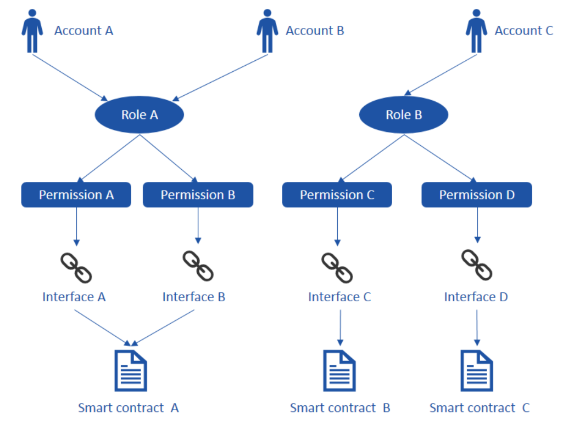
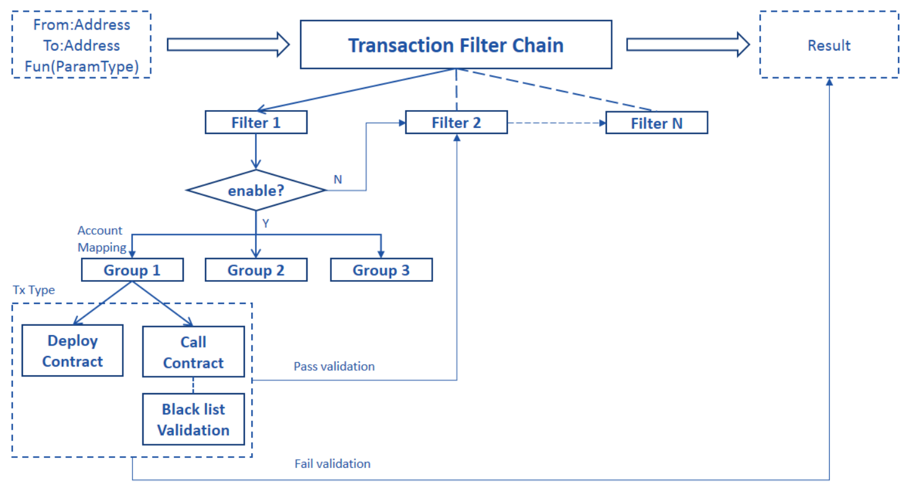

# FISCO BCOS Permission Model

**Author: fisco-dev** 
## Introduction to Permission Model - ARPI 

Unlike public chain which anyone can access, transact and search, the consortium chain has the specific entry requirements, such as access control, various transactions support, privacy & security,high stablity etc. There are two key aspects in the consortium chain: "permission" and "control"

The permission model ARPI(Account—Role—Permission—Interface) is based on the thought of **system level permission** and **interface level permission**. 

System level permission controls whether an account can deploy or call a contract. When a request is received, the system will check the sender's permissions and will permit or reject accordingly. Interface level permission controls whether an account can call a specific interface of a contract. The admin can give an account the permissions to call all or part of the interfaces of a contract.

In the ARPI model, there are 4 objects - **Account, Role, Permission and Interface**, their relationship is as below:


**Account : Role -> N : 1**

An account (person or organization) can only have one specific role, but a role can be assigned to zero or more accounts. In practice, a role may have multiple accounts with different pair of public and private keys for each，when a transaction starts, the sender signs the transaction with its private key, and then the receiver can verify it by using sender's public key to know which account the transaction was initiated from, so that the transaction can be controlled and traced.

**Role : Permission -> N : N**

A role can have multiple permissions and a permission can also be assigned to multiple roles. You can have fine granularity of permission control under the ARPI model. You can set permission to the contract's interfaces.

ARPI objects relationship is as below:    
 

## ARPI Framework Implementation

TransactionFilterChain contract is deployed along with the system proxy contract during initialization, and it is registered by system proxy contract at the same time. All the permissions' CRUD is maintained by TransactionFilterChain on a blockchain. When a request is received, the system will check whether the sender's account has permissions to the corresponding operations, if yes, then it is executed, otherwise exception is thrown.

ARPI process flow as below:


Two general types of permissions:
1. **Deploy contract**, only the approved contract can be deployed on the chain for execution.
2. **Call contract**, only the permitted accounts can call the corresponding interfaces of the contract to execute their business transactions.

Process flow details:
1. TransactionFilterChain includes multiple independent filters with it's specific filtering logic. An account will have the specific permissions if it passes all filters’ validation. A filter can be managed by a member of the consortium and the permissions can be added independently.
2. Each filter has a switch, the filter is effective only when it is switched on. By default, filter is switched off during the initialization.
3. There are different groups within the filter, when the filter is executed, corresponding group (with it's permissions) is found based on the sender's account.
4. The Group contains the permissions of deploying contract or calling contract. For deploying a contract only one input sender's address is needed, whereas for calling a contract four inputs sender's address, contract address, function and the parameters are required. By default, the group does not have the permission for deploying the contract during initialization.
5. It is possible to configure black list validation which can be effective while calling a contract. If the black list mode is on, no permission will be returned, if the user was added into the black list, even though an account has the permission for an interface. By default, the black list mode is off.
6. An interface is comprised of a function along name with its parameters.
7. The address changes once a contract gets redeployed, so the permissions of the contract need to be re-granted.

## ARPI practice on consortium chain
Roles and Permissions are generally related to scenarios, there will have different roles and permissions design based on different business requirement. Based on the practice on FISCO BCOS, here let's list out the definitions of roles and permissions for reference:

* Chain Super Admin (God account)   
A chain super administrator is selected by the consortium committee or public, who has all the permissions to the system. This role has following **permissions**: assign roles to users, add permissions to roles, which includes the permissions to perform any operations. The God account is required to execute the system contracts.

* Chain/Filter admin   
A chain/filter administrator can manage filters and audit, modify and delete information of nodes, accounts and contracts on the chain. This role has following **permissions**: execute the system contracts – CAAction, NodeAction, ContractABIAction and SystemProxy.

* Operation admin   
An operation administrator is a person who deploys/manages the non-system contracts and nodes configuration, but doesn’t participate in business transactions. This role has following **permissions**: execute ConfigAction, deploy non-system contracts (except for SystemProxy, which is needed to get ConfigAction). For the non-system contracts, chain manager needs to call ContractABIAction to make the contract effective (this call can be made by contract name rather than by address)

* Trader  
A Trader is a person who uses the system to conduct business transactions and query the results, the role here can be subdivided based on different business requirements. This role has following **permissions**: execute and query business contracts.

* Chain regulator (Optional to be a group)   
A regulator is a person who is responsible for setting up the permission specifications. The person usually is not participant in the chain's management but can participant in the business transactions. This role has following **permissions**: trace the operation records (The inputs for deploying and calling the contracts will be recorded by Event notification, which can be used for audit purposes)

## Script Usage Guidelines
1. ARPI_Model.js located under folder systemcontract, provides one step execution to start the ARPI mode which includes enabling access control and setting up the roles and permissions according to the previous section **ARPI practice on consortium chain**.

   >Note: The access control will be enabled after executing ARPI_Model.js, you can be disabled by using the GOD account, to avoid impacting other accounts to deploy or call contracts accidently.

2. AuthorityManager.js located under the same folder systemcontract, used to manage TransactionFilterChain and provides the query interfaces to FilterChain, Filter, and Group. 

   >Note: AuthorityManager.js and ARPI_Model.js execution requires God account.

*   FilterChain can be obtained without index. FilterChain provides the functions to add, delete, show and reset a filter on the chain. The commands are as below:
```
babel-node AuthorityManager.js FilterChain addFilter <filter's name><version><description>
babel-node AuthorityManager.js FilterChain delFilter <filter's index>
babel-node AuthorityManager.js FilterChain showFilter
babel-node AuthorityManager.js FilterChain resetFilter
```
*   Filter can be obtained with its index from FilterChain. Filter provides the functions 1) to enable, disable and display status of a filter. 2) to add an account to a new or existing group. 3) to display the group of the given account. The commands as below:
```
babel-node AuthorityManager.js Filter getFilterStatus <filter's index>
babel-node AuthorityManager.js Filter enableFilter <filter's index>
babel-node AuthorityManager.js Filter disableFilter <filter's index>
babel-node AuthorityManager.js Filter setUsertoNewGroup <filter's index> <user's account>
babel-node AuthorityManager.js Filter setUsertoExistingGroup <filter's index> <user's account> <group's address>
babel-node AuthorityManager.js Filter listUserGroup <filter's index> <user's account>
```
*   Group can be obtained with the filter's index in the FilterChain and it's binding user's account. Group provides the functions to maintain its permission list, enable/disable the permission for deploying contract and verifying black list. The commands as below:
```
babel-node AuthorityManager.js Group getBlackStatus <filter's index> <user's account>
babel-node AuthorityManager.js Group enableBlack <filter's index> <user's account>
babel-node AuthorityManager.js Group disableBlack <filter's index> <user's account>
babel-node AuthorityManager.js Group getDeployStatus <filter's index> <user's account>
babel-node AuthorityManager.js Group enableDeploy <filter's index> <user's account>
babel-node AuthorityManager.js Group disableDeploy <filter's index> <user's account>
babel-node AuthorityManager.js Group addPermission <filter's index> <user's account> <contract address> <func name(parameters)>
babel-node AuthorityManager.js Group delPermission <filter's index> <user's account> <contract address> <func name(parameters)>
babel-node AuthorityManager.js Group checkPermission <filter's index> <user's account> <contract address> <func name(parameters)>
babel-node AuthorityManager.js Group listPermission <filter's index> <user's account>
```

3. Prompt for missing the permissions   

The following error is raised if no permission to deploy a contract:   
`Transaction failed to send!  Error: NoDeployPermission .`   

The following error is raised if no permission to call a contract:   
`Transaction failed to send!  Error: NoTxPermission .`   
Or   
`Error: NoCallPermission .`   

4. An example for using AuthorityManager.js as below (to avoid unexpected exception, please ensure the account configured in config.js is the God account)

```
//Add a filter to FilterChain with 3 parameters – filter name, version and description.  
babel-node AuthorityManager.js FilterChain addFilter NewFilter 2.0 FilterUsedForTest

//Delete a filter from FilterChain with its index   
babel-node AuthorityManager.js FilterChain delFilter 1

//Display all filters on FilterChain   
babel-node AuthorityManager.js FilterChain showFilter

//Reset FilterChain to its initialize status   
babel-node AuthorityManager.js FilterChain resetFilter

//Display a filter's status with its index   
babel-node AuthorityManager.js Filter getFilterStatus 1

//Enable a filter with its index   
babel-node AuthorityManager.js Filter enableFilter 1

//Disable a filter with its index   
babel-node AuthorityManager.js Filter disableFilter 1

//Grant a new role(group) to an account with two parameters – filter's index and user's account   
babel-node AuthorityManager.js Filter setUsertoNewGroup 0 0x4015bd4dd8767d568fc54cf6d0817ecc95d166d9

//Grant an existing role(group) to an account with 3 parameters – filter's index, user's account and group's address (the group's address is getting from command 'listUserGroup' after the group have been created by command 'setUsertoNewGroup')   
babel-node AuthorityManager.js Filter setUsertoExistingGroup 0 0x6ea2ae822657da5e2d970309b106207746b7b6b3 Group.address

//Display the role(group) of an user's account with 2 parameters – filter's index and user's account   
babel-node AuthorityManager.js Filter listUserGroup 0 0x4015bd4dd8767d568fc54cf6d0817ecc95d166d9

// Display the status of black list mode with 2 parameters – filer's index and group's address   
babel-node AuthorityManager.js Group getBlackStatus 1 0x4015bd4dd8767d568fc54cf6d0817ecc95d166d9

// Enable black list validation with 2 parameters – filer's index and group's address   
babel-node AuthorityManager.js Group enableBlack 1 0x4015bd4dd8767d568fc54cf6d0817ecc95d166d9

// Disable black list validation with 2 parameters – filer's index and group's address   
babel-node AuthorityManager.js Group disableBlack 1 0x4015bd4dd8767d568fc54cf6d0817ecc95d166d9

// Display the permission status of deploying contract with 2 parameters - filer's index and group's address   
babel-node AuthorityManager.js Group getDeployStatus 1 0x4015bd4dd8767d568fc54cf6d0817ecc95d166d9

// Enable the permission of deploying contract with 2 parameters - filer's index and group's address   
babel-node AuthorityManager.js Group enableDeploy 1 0x4015bd4dd8767d568fc54cf6d0817ecc95d166d9

// Disable the permission of deploying contract with 2 parameters - filer's index and group's address   
babel-node AuthorityManager.js Group disableDeploy 1 0x4015bd4dd8767d568fc54cf6d0817ecc95d166d9

// Add the permissions to a group with 4 parameters - filer's index and group's address, contract's address and contract's interface   
>Note: the contract's address here is the real address rather than the DNS name, so the permission need to be re-granted if the contract get re-deployed   
babel-node AuthorityManager.js Group addPermission 1 0x4015bd4dd8767d568fc54cf6d0817ecc95d166d9 ContractA.address "set1(string)"

//Delete the permissions from a Group with 4 parameters - filer's index and Group's address, contract's address and contract's interface   
babel-node AuthorityManager.js Group delPermission 1 0x4015bd4dd8767d568fc54cf6d0817ecc95d166d9 ContractA.address "set1(string)"

//Check if the permissions of a Group exist with 4 parameters - filer's index and Group's address, contract's address and contract's interface   
babel-node AuthorityManager.js Group checkPermission 1 0x4015bd4dd8767d568fc54cf6d0817ecc95d166d9 ContractA.address "set1(string)"

//List the permissions of a group with 2 parameters - filer's index and group's address   
babel-node AuthorityManager.js Group listPermission 1 0x4015bd4dd8767d568fc54cf6d0817ecc95d166d9
```
