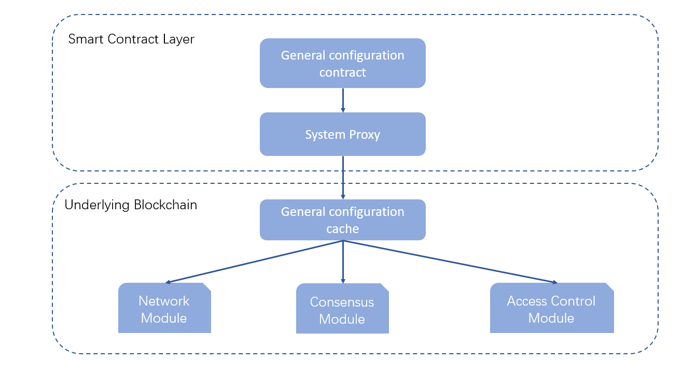

# System Configuration
**Author: fisco-dev**   
## Design Overview ##

There are many distributed nodes in a block chain. To ensure the configuration is in sync on all nodes, a mechanism has been built in FISCO BCOS using smart contract to sync up the configuration across all nodes:

## System Properties ##
### maxBlockTranscations ###
Description: configure the max transaction in a block

Value: (0,2000]

Default: 1000

### intervalBlockTime ###
Description: an interval btw block generation(ms)

Value: >= 1,000

Default: 1,000

### maxTranscationGas ###
Description: Gas spend limitation for each transaction

Value: >= 30,000,000

Default: 30,000,000

### maxNonceCheckBlock ###
Description: Trace back max previous block number to avoid nonce duplication.

Value: >= 1000

Default: 1000

### maxBlockLimit ###
Description: max delay for transaction commit

Value: >= 1000

Default: 1000

### CAVerify ###
Description: enable CA verification

Value: true/false

Default: false

### omitEmptyBlock ###
Description: skip empty blocks (will not store the block when there is no transaction)

Value: true/false

Default: true

## update configuration ##

> Configuration can be updated by calling system contract on any node but using genesis node is recommended.

Command to update configuration:

    babel-node tool.js ConfigAction set [parameter] [value]

Command to get configuration:

    babel-node tool.js ConfigAction get [parameter]

An example to change block generation interval

    cd tools/systemcontract;
    babel-node tool.js ConfigAction set  intervalBlockTime 1000

allow to commit empty block

    cd tools/systemcontract;
    babel-node tool.js ConfigAction set  omitEmptyBlock false
