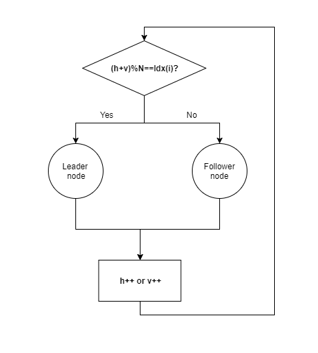
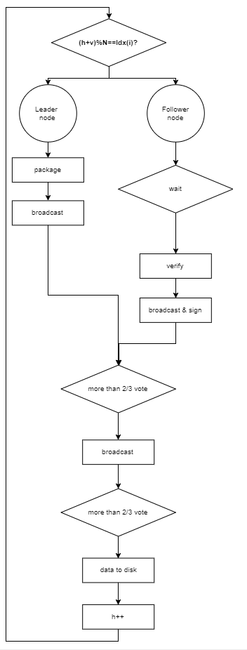
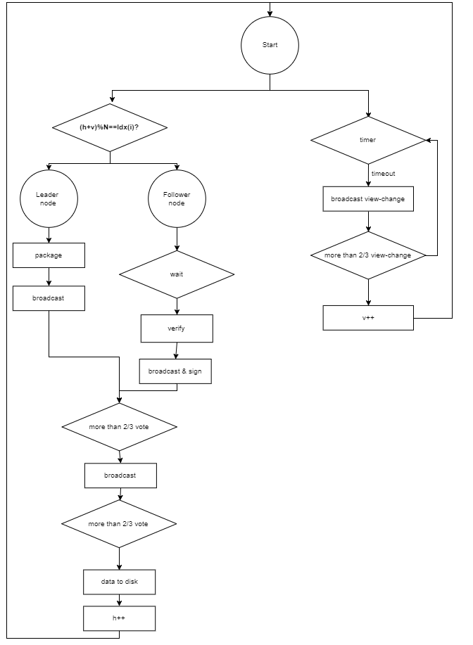
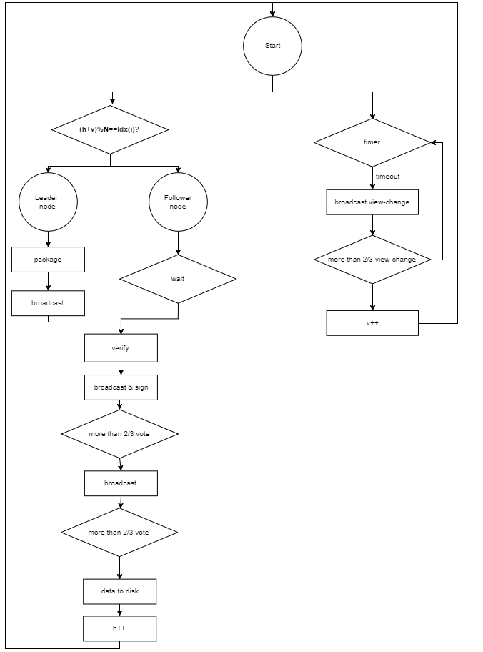

# Parallel PBFT
**Author: fisco-dev**  

## 1. Glossary
### Blockchain:   
Blockchain is a growing list of records, called blocks, which are linked using cryptography. Each block contains current block data and a cryptographic hash of the previous block. There are two key concepts in blockchain: cryptography and decentralization. These two key concepts are used to ensure that the block data cannot be tampered with.
A block consists of block head and block body. The block head contains the block height(h), previous block hash(prevHash) etc., and the block body mainly contains transaction data.
 
  
### P2P(peer-to-peer) network:
Unlike traditional centralized networks, P2P networks is that participants make up a network through P2P protocols, and participants are peers. P2P network has the following advantages:
1. **Decentralization**: No need of centralized server, resources and servers are separated on nodes and all the data transfers and services happen between nodes.
2. **Robustness**: Nodes joining or quitting the blockchain does not impact network services.
3. **Extensibility**: Supports extensibility of the system by increasing the number of nodes. For example, based on the P2P file download protocol, as more users join, speed for download becomes faster.
4. **Cost-effectiveness**: In the P2P network, the nodes are generally ordinary machines. Industry level service provisioning is achieved through use of network system built upon ordinary machines with brings considerable cost advantage.
### Node:
In a P2P network, every participant is a node and the nodes constitute the blockchain. In a blockchain P2P network, a node is a uniquely-identified participant with a complete ledger copy, and participates in consensus and account maintenance.
### Consensus algorithm:
Every node in the blockchain P2P network confirms a batch of transactions by an algorithm and ensures that all nodes have consistent confirmation results for the batch of transactions. This algorithm is called blockchain consensus algorithm.
### Byzantine Fault Tolerance(BFT):
Byzantine fault tolerance comes from the Byzantine general problem. In a P2P network system, where nodes may run in any form without restrictions and may unite to perform malicious actions. As long as the number of such malicious nodes is within a certain range, the system still continues functioning properly, and the system is called Byzantine fault tolerant system.

## 2. Brief to existing consensus algorithm
### 2.1 Existing consensus
The existing consensus algorithms of blockchain mainly include Proof of Work(POW), Proof of Stake(POS), Delegated Proof of Stake(DPOS) and Practical Byzantine Fault Tolerance(PBFT). Among consensus algorithms, POW, POS, DPOS are mainly used for public chains like bitcoin, but PBFT is used for traditional distributed systems, which accomplishes the consensus algorithm through three rounds of broadcast communication.
 
 
### 2.2 Insufficient calculation of existing consensus algorithm
- POW builds consensus through computation, so it causes a lot of energy consumption and also inconsistent block generation time.
- POS and DPOS build consensus by using tokens, which might easily cause the tokens to be centralized, so the consensus is controlled by a few, and they can unite to perform malicious actions to destroy the network;
- PBFT algorithm consists of three phases which are serially executed so consensus efficiency is low.

## 3. Parallel Practical Byzantine Fault Tolerance Consensus Algorithm
### 3.1 Node Roles
- Leader node: Leader packages and broadcasts the block to other nodes. Transactions in the block are verified by consensus algorithm and after verification the block height will increase.
- Follower node: Followers receive block from the leader node and confirm whether the transaction is valid, followers will sign the signature to the block when the nodes agree on a block, then the consensus process is done.
### 3.2 Node's role transition
In PBFT, node's role is changed as time goes by.
As we know that blockchain is built up by nodes, assume that there are N nodes totally, and each node has a unique index: Idx(i), and node's role is decided by a formula: (h+v)%N, where h is the current block height, and v is the current view(more information about view in section  [3.4 Exception handling](#exception-handling)).
 
 
### 3.3 Consensus decision-making

Consensus decision-making is the process of blockchain network confirming a batch of transactions and achieving network-wide consensus. Consensus decision-making has following steps:
1. Leader election: The algorithm mentioned in section 3.2 is used to elect a leader. In case of FISCO BCOS, a patented algorithm is used to elect leader through consensus process, which is much more efficient compared to the traditional algorithms.
2. Package transaction: Leader packages and creates a new block, then broadcasts the block to other nodes.
3. Sign: Followers receive block from the leader node and confirm whether the transaction is valid, followers will sign the signature to the block when the nodes agree on a block.
4. Vote: If more than 2/3 of all nodes sign the transaction, then the transaction is broadcasted.
5. Data to disk: If more than 2/3 of all nodes vote, then the data is stored to disk.
  

###  3.4 Exception handling
In the several stages of the consensus decision-making process described in section 3.3, each stage may not be able to work smoothly due to reasons such as error, timeout or deliberate malicious activities and may fail the consensus decision-making process. FISCO BCOS uses a patented algorithm which solves this problem through introduction of an exception handling process.
The whole process of a consensus is defined as a view, and all stages need to be completed in the same view.

When a node completes storing block h to disk, it needs to start the consensus process of block h+1. At this time, a timer will be set for consensus process of block h+1. If the consensus process is not completed before timeout, it will execute the view-change process.
First, view-change process will execute v++, and then broadcast v to all the nodes. If more than 2/3 nodes receive the same view v change request, then it will switch to the next view.
 
   
### 3.5 Parallel computing
In the consensus process (introduced in section 3.3), the processes of leader node package transaction and follower node verify transaction are the most time-consuming parts of the entire consensus process, and these two processes are executed serially. Assumed that the transaction confirmation time is T, and the total process consumption time is T', so the time spent on the whole consensus is 2*T+T'. FISCO BCOS patent consensus algorithm proposes an improved design for the parallelization of the transaction confirmation mechanism, and the overall consensus time is reduced to T+T', which greatly improves the consensus efficiency.
 

