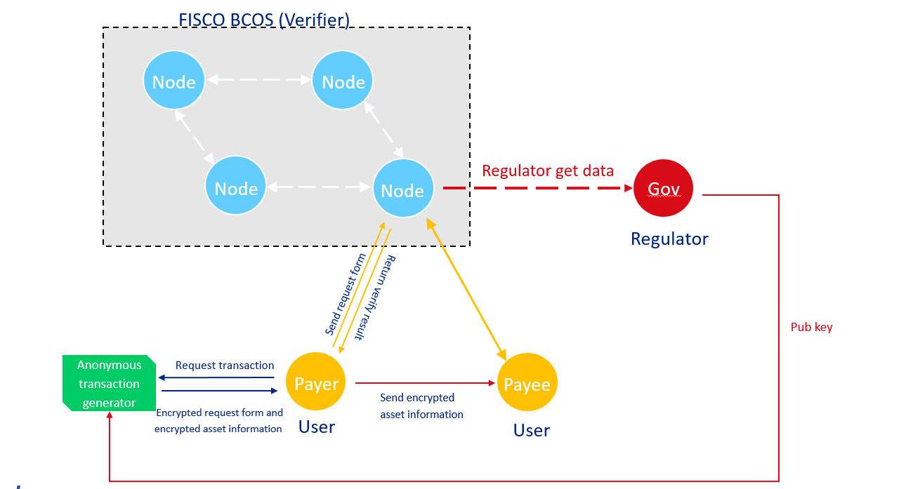

# Regulated Zero-knowledge proof
**Author: fisco-dev**  

To meet the regulatory requirements, FISCO BCOS provides a framework to perform anonymous transactions by zero-knowledge proof, it also satisfies the regulatory requirement that regulators can regulate every transaction.

## 1. Glossary

**[Zero-knowledge proof](#https://en.wikipedia.org/wiki/Zero-knowledge_proof)**: Let you validate the truth of something without revealing how you know that truth or sharing the content of this truth with the verifier.

**Zero-knowledge proof on blockchain**: A proof, derived from the user data, to be verified by the blockchain nodes to prove that the user knows the secret information, and the proof itself cannot be reverted back to the original data. It helps the node to verify the user data's correctness without having knowledge of any part of the original data. So zero-knowledge proof provides a way to perform secret transactions using blockchain, although there exists a regulatory risk.

**FISCO-BCOS regulated Zero-knowledge proof**: FISCO BCOS node works as verifier for all secret transactions (implemented by zero-knowledge proof) on the chain. While all transactions can be ONLY decrypted/overseen by  authorized regulator.

## 2. Underlying library

[libzkg：Regulated Zero-knowledge proof library](https://github.com/FISCO-BCOS/libzkg)

## 3. Case study

**(1) Regulated one-to-one anonymous transfer**

In FISCO BCOS, one-to-one anonymous transfer can be verified by the blockchain nodes without knowing receiver's and sender's identities and amount. In the meantime, regulator can decrypt the anonymous transfer. More details：[zkg-tx1to1](https://github.com/FISCO-BCOS/zkg-tx1to1)

**(2) Coming soon...**